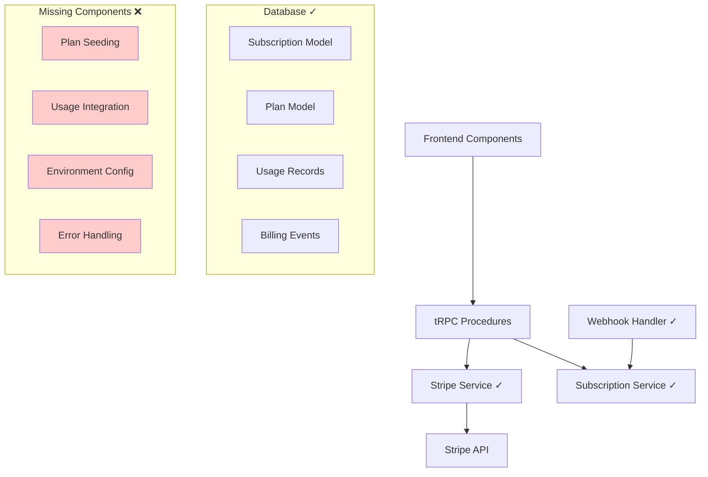

# Design Document - Lacunas na Integração de Pagamento

## Overview

Este documento detalha o design para completar a integração de pagamento Stripe que está parcialmente implementada. Baseado na análise do código existente, identificamos que a infraestrutura básica está presente, mas faltam componentes críticos para funcionamento completo.

## Architecture

### Current State Analysis



### Gap Analysis

#### ✅ Already Implemented

- Database schema with all required models
- Stripe service layer with core methods
- Subscription service with CRUD operations
- Webhook handler for Stripe events
- Frontend components (PricingTable, SubscriptionDashboard)
- tRPC procedures for billing operations

#### ❌ Missing Critical Components

1. **Environment Configuration**: Chaves Stripe não configuradas
2. **Plan Seeding**: Nenhum plano existe no banco de dados
3. **Usage Integration**: Middleware não integrado nas funcionalidades principais
4. **Error Handling**: Tratamento robusto de falhas
5. **Setup Scripts**: Automação de configuração inicial

## Components and Interfaces

### 1. Environment Configuration

```typescript
// .env configuration needed
interface StripeConfig {
  STRIPE_SECRET_KEY: string; // sk_test_... or sk_live_...
  NEXT_PUBLIC_STRIPE_PUBLISHABLE_KEY: string; // pk_test_... or pk_live_...
  STRIPE_WEBHOOK_SECRET: string; // whsec_...
}

// Validation service
class ConfigValidator {
  static validateStripeConfig(): void {
    const required = [
      'STRIPE_SECRET_KEY',
      'NEXT_PUBLIC_STRIPE_PUBLISHABLE_KEY',
      'STRIPE_WEBHOOK_SECRET',
    ];

    for (const key of required) {
      if (!process.env[key]) {
        throw new Error(`Missing required environment variable: ${key}`);
      }
    }
  }
}
```

### 2. Plan Seeding System

```typescript
interface PlanSeedData {
  name: string;
  stripeProductId: string;
  stripePriceId: string;
  price: number;
  currency: string;
  interval: 'month' | 'year';
  features: {
    projects: number;
    apiCalls: number;
    storage: number;
  };
}

class PlanSeeder {
  static async seedInitialPlans(): Promise<void> {
    const plans: PlanSeedData[] = [
      {
        name: 'Free',
        stripeProductId: 'prod_free',
        stripePriceId: 'price_free',
        price: 0,
        currency: 'usd',
        interval: 'month',
        features: { projects: 1, apiCalls: 100, storage: 50 },
      },
      {
        name: 'Pro',
        stripeProductId: 'prod_pro',
        stripePriceId: 'price_pro_monthly',
        price: 1999, // $19.99
        currency: 'usd',
        interval: 'month',
        features: { projects: 10, apiCalls: 10000, storage: 1000 },
      },
    ];

    for (const planData of plans) {
      await this.createOrUpdatePlan(planData);
    }
  }

  static async syncWithStripe(): Promise<void> {
    // Sync products and prices from Stripe
    await stripeService.syncProducts();
  }
}
```

### 3. Usage Integration Middleware

```typescript
// Integration points for usage tracking
interface UsageIntegrationPoints {
  // Project creation
  beforeProjectCreate: (userId: string) => Promise<void>;
  afterProjectCreate: (userId: string, projectId: string) => Promise<void>;

  // API calls
  beforeApiCall: (userId: string, endpoint: string) => Promise<void>;
  afterApiCall: (userId: string, endpoint: string, success: boolean) => Promise<void>;

  // File operations
  beforeFileUpload: (userId: string, fileSize: number) => Promise<void>;
  afterFileUpload: (userId: string, fileSize: number) => Promise<void>;
}

class UsageIntegrator {
  static async integrateWithProjectCreation(): Promise<void> {
    // Modify project creation flow to check and record usage
  }

  static async integrateWithApiCalls(): Promise<void> {
    // Add middleware to API routes for usage tracking
  }

  static async integrateWithFileOperations(): Promise<void> {
    // Add hooks to file upload/storage operations
  }
}
```

### 4. Enhanced Error Handling

```typescript
interface BillingError extends Error {
  code: 'STRIPE_API_ERROR' | 'WEBHOOK_ERROR' | 'USAGE_LIMIT_ERROR' | 'CONFIG_ERROR';
  retryable: boolean;
  context?: Record<string, any>;
}

class BillingErrorHandler {
  static async handleStripeError(error: any, context: Record<string, any>): Promise<void> {
    // Log error with context
    // Determine if retryable
    // Send alerts if critical
    // Implement exponential backoff for retries
  }

  static async handleWebhookError(event: Stripe.Event, error: any): Promise<void> {
    // Log webhook failure
    // Schedule retry for critical events
    // Alert on repeated failures
  }
}
```

### 5. Setup and Migration Scripts

```typescript
class SetupManager {
  static async runInitialSetup(): Promise<void> {
    // 1. Validate environment configuration
    ConfigValidator.validateStripeConfig();

    // 2. Run database migrations
    await this.runMigrations();

    // 3. Seed initial plans
    await PlanSeeder.seedInitialPlans();

    // 4. Sync with Stripe
    await PlanSeeder.syncWithStripe();

    // 5. Validate setup
    await this.validateSetup();
  }

  static async validateSetup(): Promise<boolean> {
    // Check database connectivity
    // Verify Stripe API connectivity
    // Confirm plans exist
    // Test webhook endpoint
    return true;
  }
}
```

## Data Models

### Enhanced Plan Model with Validation

```typescript
// Extend existing Plan model with validation
interface PlanWithValidation extends Plan {
  validate(): boolean;
  isActive(): boolean;
  hasFeature(feature: string): boolean;
  getLimit(resource: string): number;
}
```

## Error Handling Strategy

### 1. Stripe API Errors

- Rate limiting with exponential backoff
- Automatic retry for transient errors
- Graceful degradation for non-critical operations
- User-friendly error messages

### 2. Webhook Processing Errors

- Idempotency handling for duplicate events
- Dead letter queue for failed events
- Monitoring and alerting for webhook failures
- Manual retry mechanisms

### 3. Usage Limit Errors

- Clear messaging about limits exceeded
- Upgrade suggestions with direct links
- Temporary grace periods for edge cases
- Analytics on limit hit patterns

## Integration Points

### 1. Project Creation Flow

```typescript
// Before: Direct project creation
async function createProject(data: ProjectData) {
  return await prisma.project.create({ data });
}

// After: With usage integration
async function createProject(userId: string, data: ProjectData) {
  // Check usage limit
  await usageMiddleware.checkAndRecordUsage(userId, 'projects', 1);

  // Create project
  const project = await prisma.project.create({ data });

  return project;
}
```

### 2. API Call Tracking

```typescript
// Middleware for tRPC procedures
const withUsageTracking = (resourceType: string) => {
  return middleware(async ({ ctx, next }) => {
    // Pre-flight check
    await usageMiddleware.preflightCheck(ctx.auth.userId, resourceType);

    const result = await next();

    // Record usage on success
    await usageMiddleware.checkAndRecordUsage(ctx.auth.userId, resourceType, 1);

    return result;
  });
};
```

## Testing Strategy

### 1. Configuration Testing

- Environment variable validation
- Stripe API connectivity tests
- Webhook endpoint verification

### 2. Integration Testing

- End-to-end checkout flow
- Webhook event processing
- Usage limit enforcement
- Plan synchronization

### 3. Error Scenario Testing

- API failure handling
- Webhook retry logic
- Usage limit edge cases
- Configuration errors

## Deployment Considerations

### 1. Environment Setup

- Separate Stripe keys for dev/staging/prod
- Webhook endpoint configuration
- Database migration execution
- Initial plan seeding

### 2. Monitoring

- Stripe API call monitoring
- Webhook processing metrics
- Usage pattern analytics
- Error rate tracking

### 3. Rollback Strategy

- Database migration rollbacks
- Feature flag controls
- Graceful degradation modes
- Emergency disable switches
