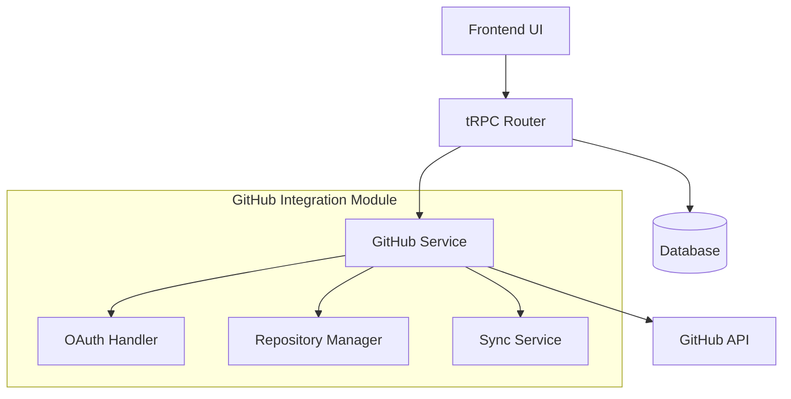
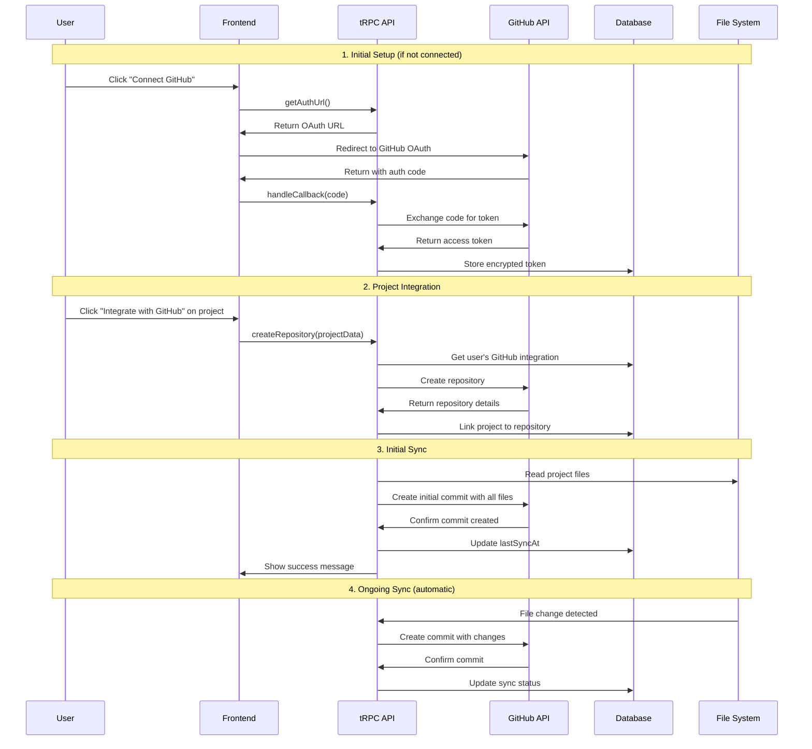

# Design Document

## Overview

A integração GitHub permitirá que usuários conectem seus projetos da plataforma diretamente ao GitHub através de OAuth, criem repositórios e sincronizem automaticamente as alterações. O design segue a arquitetura modular existente do projeto, utilizando tRPC para APIs, Prisma para persistência e Clerk para autenticação.

## Architecture

### High-Level Architecture



### Integration Points

- **Frontend**: Componentes React para UI de integração GitHub
- **Backend**: Módulo GitHub com procedures tRPC
- **Database**: Extensão do schema Prisma para armazenar dados GitHub
- **External API**: GitHub REST API v4 para operações de repositório

### Project Integration Flow



## Detailed Integration Flow for Existing Projects

### Step 1: GitHub Connection (One-time setup)

1. **User clicks "Connect GitHub"** in project settings or integration page
2. **System generates OAuth URL** with required scopes (repo, user:email)
3. **User redirects to GitHub** for authorization
4. **GitHub returns authorization code** to callback URL
5. **System exchanges code for access token** and stores encrypted in database
6. **User sees "Connected" status** with GitHub username displayed

### Step 2: Project Repository Creation

1. **User clicks "Integrate with GitHub"** button on specific project
2. **System shows repository creation form**:
   - Repository name (pre-filled with project name)
   - Description (optional)
   - Visibility (public/private)
3. **User submits form**
4. **System validates GitHub connection** and token validity
5. **System calls GitHub API** to create repository
6. **System stores repository link** in database (project ↔ GitHub repo)

### Step 3: Initial File Synchronization

1. **System reads all project files** from current project structure
2. **System creates .gitignore** with common patterns (node_modules, .env, etc.)
3. **System prepares initial commit** with all project files
4. **System pushes to GitHub** using GitHub API (not git commands)
5. **System updates sync status** in database
6. **User sees confirmation** with link to GitHub repository

### Step 4: Ongoing Synchronization

1. **File changes detected** through project file system monitoring
2. **System batches changes** (debounced to avoid too many commits)
3. **System creates meaningful commit message** based on changed files
4. **System pushes changes** to GitHub repository
5. **System updates last sync timestamp**

### UI Integration Points

#### Project Header Component

```typescript
// Add GitHub integration button to existing project header
<ProjectHeader>
  <GitHubIntegrationButton
    projectId={project.id}
    isConnected={!!project.githubRepository}
  />
</ProjectHeader>
```

#### Integration Modal

```typescript
<GitHubIntegrationModal>
  {!hasGitHubConnection ? (
    <ConnectGitHubStep />
  ) : (
    <CreateRepositoryStep projectName={project.name} />
  )}
</GitHubIntegrationModal>
```

#### Sync Status Indicator

```typescript
<SyncStatusBadge>
  {syncStatus.isInProgress ? "Syncing..." :
   syncStatus.lastSyncAt ? `Last sync: ${formatDate(syncStatus.lastSyncAt)}` :
   "Not synced"}
</SyncStatusBadge>
```

## Components and Interfaces

### 1. Database Schema Extensions

```prisma
model GitHubIntegration {
  id              String   @id @default(uuid())
  userId          String   @unique
  accessToken     String   // Encrypted
  refreshToken    String?  // Encrypted
  githubUserId    String
  githubUsername  String
  createdAt       DateTime @default(now())
  updatedAt       DateTime @updatedAt

  repositories    GitHubRepository[]
}

model GitHubRepository {
  id                    String   @id @default(uuid())
  projectId             String   @unique
  githubRepoId          String
  name                  String
  fullName              String   // owner/repo
  htmlUrl               String
  defaultBranch         String   @default("main")
  lastSyncAt            DateTime?
  syncEnabled           Boolean  @default(true)

  project               Project  @relation(fields: [projectId], references: [id], onDelete: Cascade)
  githubIntegration     GitHubIntegration @relation(fields: [githubIntegrationId], references: [id])
  githubIntegrationId   String

  @@unique([githubIntegrationId, githubRepoId])
}
```

### 2. GitHub Service Layer

```typescript
interface GitHubService {
  // OAuth
  getAuthUrl(state: string): string;
  exchangeCodeForToken(code: string): Promise<GitHubTokens>;
  refreshAccessToken(refreshToken: string): Promise<GitHubTokens>;

  // Repository Management
  createRepository(token: string, options: CreateRepoOptions): Promise<GitHubRepo>;
  getRepositories(token: string): Promise<GitHubRepo[]>;

  // File Operations
  createOrUpdateFile(
    token: string,
    repo: string,
    path: string,
    content: string,
    message: string,
  ): Promise<void>;
  createCommit(token: string, repo: string, files: FileChange[], message: string): Promise<string>;
}
```

### 3. tRPC Procedures

```typescript
export const githubRouter = createTRPCRouter({
  // OAuth flow
  getAuthUrl: publicProcedure.query(),
  handleCallback: publicProcedure.input(callbackSchema).mutation(),

  // Integration management
  getIntegration: protectedProcedure.query(),
  disconnect: protectedProcedure.mutation(),

  // Repository operations
  createRepository: protectedProcedure.input(createRepoSchema).mutation(),
  syncProject: protectedProcedure.input(syncProjectSchema).mutation(),
  getSyncStatus: protectedProcedure.input(projectIdSchema).query(),
});
```

### 4. File Synchronization Service

```typescript
interface FileSyncService {
  // Monitor project files for changes
  watchProjectFiles(projectId: string): void;

  // Sync specific files to GitHub
  syncFiles(projectId: string, files: ProjectFile[]): Promise<SyncResult>;

  // Create initial repository with all project files
  initialSync(projectId: string, repoDetails: GitHubRepo): Promise<void>;

  // Generate commit message based on file changes
  generateCommitMessage(changes: FileChange[]): string;
}

interface ProjectFile {
  path: string;
  content: string;
  type: 'file' | 'directory';
  lastModified: Date;
}

interface SyncResult {
  success: boolean;
  commitSha?: string;
  error?: string;
  filesChanged: number;
}
```

### 5. Frontend Components

```typescript
// Main integration component
<GitHubIntegration />
  ├── <ConnectionStatus />
  ├── <ConnectButton />
  └── <RepositoryManager />
      ├── <CreateRepositoryForm />
      ├── <SyncControls />
      └── <SyncStatus />

// Project-specific integration
<ProjectGitHubIntegration projectId={string} />
  ├── <IntegrationButton />
  ├── <RepositoryLink />
  └── <SyncStatusIndicator />
```

## Data Models

### GitHubTokens

```typescript
interface GitHubTokens {
  accessToken: string;
  refreshToken?: string;
  expiresIn?: number;
  scope: string;
}
```

### CreateRepoOptions

```typescript
interface CreateRepoOptions {
  name: string;
  description?: string;
  private: boolean;
  autoInit?: boolean;
}
```

### FileChange

```typescript
interface FileChange {
  path: string;
  content: string;
  encoding: 'utf-8' | 'base64';
}
```

### SyncStatus

```typescript
interface SyncStatus {
  isEnabled: boolean;
  lastSyncAt?: Date;
  isInProgress: boolean;
  error?: string;
}
```

## Error Handling

### Error Types

- **AuthenticationError**: Token inválido ou expirado
- **PermissionError**: Sem permissão para acessar repositório
- **RateLimitError**: Limite de API do GitHub excedido
- **NetworkError**: Falha de conectividade
- **ValidationError**: Dados inválidos fornecidos

### Error Recovery

- **Token Refresh**: Tentativa automática de renovar tokens expirados
- **Retry Logic**: Retry exponencial para falhas temporárias
- **User Notification**: Alertas claros sobre erros que requerem ação do usuário
- **Graceful Degradation**: Funcionalidade local continua mesmo com falhas de sync

## Testing Strategy

### Unit Tests

- **GitHub Service**: Mocks da API GitHub para testar todas as operações
- **tRPC Procedures**: Testes isolados de cada endpoint
- **Database Operations**: Testes de CRUD com banco em memória
- **Encryption/Decryption**: Validação de segurança dos tokens

### Integration Tests

- **OAuth Flow**: Teste completo do fluxo de autenticação
- **Repository Creation**: Criação e vinculação de repositórios
- **File Synchronization**: Upload e sincronização de arquivos
- **Error Scenarios**: Comportamento em cenários de falha

### E2E Tests

- **Complete User Journey**: Da conexão à sincronização
- **Multi-Project Scenarios**: Múltiplos projetos com diferentes repositórios
- **Disconnect/Reconnect**: Fluxos de desconexão e reconexão

## Security Considerations

### Token Management

- **Encryption**: Tokens armazenados com criptografia AES-256
- **Rotation**: Refresh automático de tokens antes da expiração
- **Scope Limitation**: Apenas permissões mínimas necessárias (repo)

### Data Protection

- **Input Validation**: Sanitização de todos os inputs do usuário
- **Rate Limiting**: Proteção contra abuso da API
- **Audit Logging**: Log de todas as operações sensíveis

### Access Control

- **User Isolation**: Usuários só acessam suas próprias integrações
- **Project Ownership**: Validação de propriedade antes de operações
- **Permission Checks**: Verificação de permissões GitHub antes de operações
