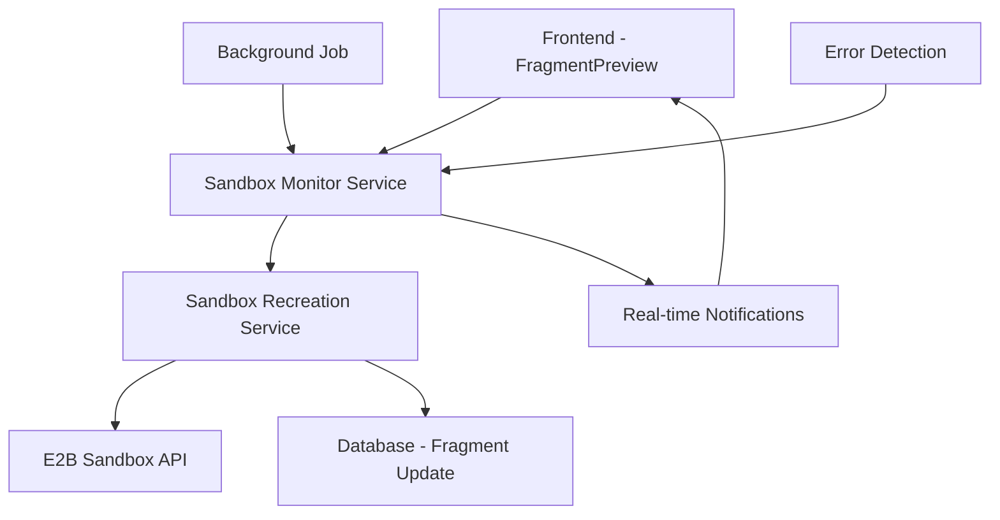
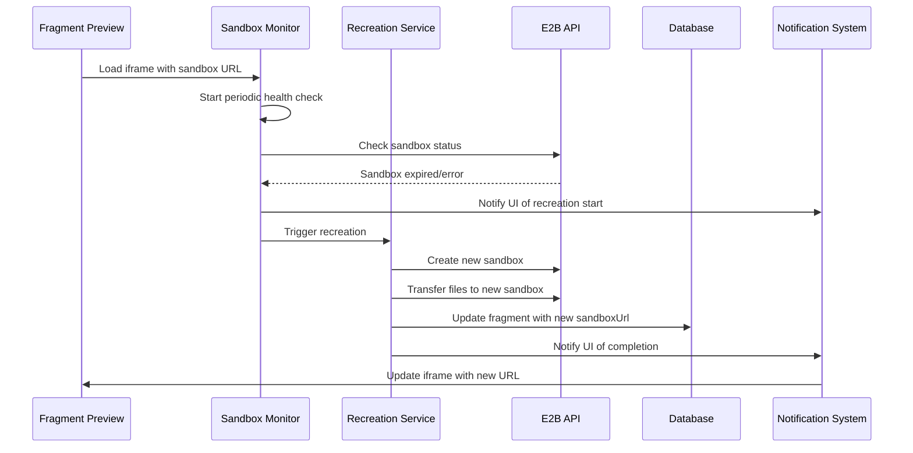
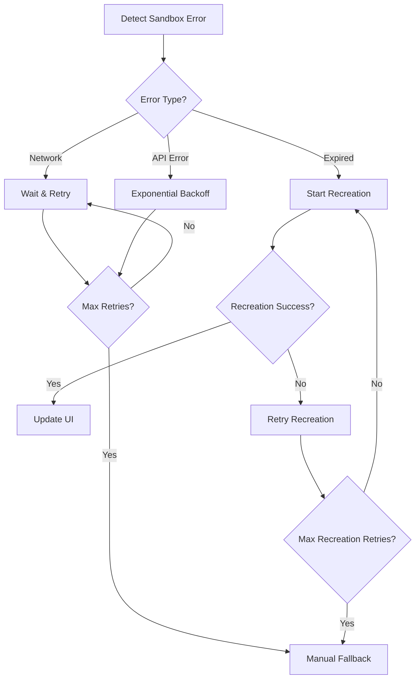

# Design Document

## Overview

O sistema de recriação automática de sandbox implementa um mecanismo robusto para detectar quando um sandbox expira e automaticamente criar um novo, preservando o estado do projeto e atualizando a interface do usuário sem interrupção. A solução integra-se com a arquitetura existente de sandboxes E2B e utiliza o sistema de notificações em tempo real já implementado.

## Architecture

### High-Level Architecture



### Component Interaction Flow



## Components and Interfaces

### 1. Sandbox Monitor Service

**Location:** `src/lib/services/sandbox-monitor.ts`

```typescript
interface SandboxMonitorService {
  startMonitoring(fragmentId: string): void;
  stopMonitoring(fragmentId: string): void;
  checkSandboxHealth(sandboxUrl: string): Promise<SandboxHealthStatus>;
  handleSandboxExpiration(fragmentId: string): Promise<void>;
}

enum SandboxHealthStatus {
  HEALTHY = 'healthy',
  EXPIRED = 'expired',
  ERROR = 'error',
  UNREACHABLE = 'unreachable',
}
```

**Responsibilities:**

- Monitorar periodicamente o status dos sandboxes ativos
- Detectar expiração através de requisições HTTP e códigos de erro específicos
- Iniciar processo de recriação quando necessário
- Gerenciar múltiplos sandboxes simultaneamente

### 2. Sandbox Recreation Service

**Location:** `src/lib/services/sandbox-recreation.ts`

```typescript
interface SandboxRecreationService {
  recreateSandbox(fragmentId: string): Promise<RecreationResult>;
  transferFiles(oldSandboxId: string, newSandbox: Sandbox): Promise<void>;
  updateFragmentUrl(fragmentId: string, newUrl: string): Promise<void>;
}

interface RecreationResult {
  success: boolean;
  newSandboxUrl?: string;
  error?: string;
  retryCount: number;
}
```

**Responsibilities:**

- Criar novo sandbox usando a API E2B existente
- Transferir arquivos do projeto para o novo sandbox
- Atualizar registro no banco de dados
- Implementar retry logic para falhas

### 3. Enhanced Fragment Preview Component

**Location:** `src/modules/projects/ui/components/fragment-preview.tsx` (modificado)

```typescript
interface EnhancedFragmentPreviewProps {
  fragment: Fragment;
  onRefresh?: () => void;
  enableAutoRecreation?: boolean;
}

interface FragmentPreviewState {
  iframeKey: number;
  isRecreating: boolean;
  recreationError?: string;
  lastRecreationTime?: Date;
}
```

**New Features:**

- Integração com sistema de monitoramento
- Indicadores visuais de status de recriação
- Tratamento de erros de recriação
- Auto-refresh quando nova URL é disponibilizada

### 4. Real-time Notification System

**Location:** `src/lib/services/sandbox-notifications.ts`

```typescript
interface SandboxNotificationService {
  notifyRecreationStart(fragmentId: string): void;
  notifyRecreationProgress(fragmentId: string, progress: RecreationProgress): void;
  notifyRecreationComplete(fragmentId: string, newUrl: string): void;
  notifyRecreationError(fragmentId: string, error: string): void;
}

interface RecreationProgress {
  step: 'creating' | 'transferring' | 'updating' | 'complete';
  message: string;
  percentage: number;
}
```

## Data Models

### Enhanced Fragment Model

```typescript
// Extensão do modelo Fragment existente no Prisma
interface FragmentWithRecreation extends Fragment {
  recreationHistory?: SandboxRecreation[];
  lastRecreationAt?: Date;
  recreationCount?: number;
}

// Nova tabela para histórico de recriações
model SandboxRecreation {
  id          String   @id @default(cuid())
  fragmentId  String
  fragment    Fragment @relation(fields: [fragmentId], references: [id])
  oldSandboxUrl String
  newSandboxUrl String
  reason      String   // 'expired', 'error', 'manual'
  success     Boolean
  error       String?
  createdAt   DateTime @default(now())

  @@map("sandbox_recreations")
}
```

### Monitoring Configuration

```typescript
interface MonitoringConfig {
  checkInterval: number; // milliseconds
  maxRetries: number;
  retryDelay: number;
  healthCheckTimeout: number;
  enabledForFragmentIds: string[];
}
```

## Error Handling

### Error Detection Strategy

1. **HTTP Status Monitoring**
   - 404/502/503 errors indicam sandbox expirado
   - Timeout de requisições indica problemas de conectividade
   - Múltiplas falhas consecutivas confirmam expiração

2. **E2B API Error Handling**
   - Capturar erros específicos da API E2B
   - Distinguir entre erros temporários e permanentes
   - Implementar backoff exponencial para retries

3. **Graceful Degradation**
   - Mostrar interface de fallback durante recriação
   - Preservar estado da UI durante o processo
   - Permitir operação manual se automática falhar

### Error Recovery Flow



## Testing Strategy

### Unit Tests

1. **Sandbox Monitor Service**
   - Test health check logic
   - Mock E2B API responses
   - Verify error detection accuracy
   - Test monitoring lifecycle

2. **Recreation Service**
   - Test sandbox creation flow
   - Mock file transfer operations
   - Verify database updates
   - Test retry mechanisms

3. **UI Components**
   - Test loading states
   - Verify notification handling
   - Test iframe refresh logic
   - Mock recreation events

### Integration Tests

1. **End-to-End Recreation Flow**
   - Simulate sandbox expiration
   - Verify complete recreation process
   - Test UI updates and notifications
   - Validate data persistence

2. **Error Scenarios**
   - Test network failures
   - Test API rate limiting
   - Test partial failures
   - Verify fallback mechanisms

### Performance Tests

1. **Monitoring Overhead**
   - Measure CPU/memory usage
   - Test with multiple concurrent sandboxes
   - Verify scalability limits

2. **Recreation Speed**
   - Measure recreation time
   - Test with different project sizes
   - Optimize file transfer performance

## Implementation Phases

### Phase 1: Core Infrastructure

- Implement Sandbox Monitor Service
- Create basic health check mechanism
- Add database schema for recreation history

### Phase 2: Recreation Logic

- Implement Sandbox Recreation Service
- Add file transfer capabilities
- Create retry and error handling

### Phase 3: UI Integration

- Enhance Fragment Preview component
- Add real-time notifications
- Implement loading states and error UI

### Phase 4: Optimization & Testing

- Add comprehensive test coverage
- Optimize performance
- Add monitoring and analytics

## Security Considerations

1. **Sandbox Isolation**
   - Ensure new sandboxes maintain same security boundaries
   - Validate file transfers don't expose sensitive data
   - Implement proper cleanup of old sandbox resources

2. **Rate Limiting**
   - Prevent abuse of recreation mechanism
   - Implement cooldown periods between recreations
   - Monitor for suspicious recreation patterns

3. **Data Integrity**
   - Verify file integrity during transfers
   - Implement checksums for critical files
   - Ensure atomic database updates
