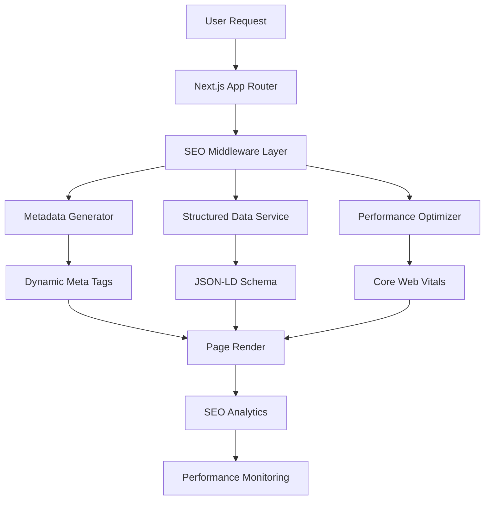
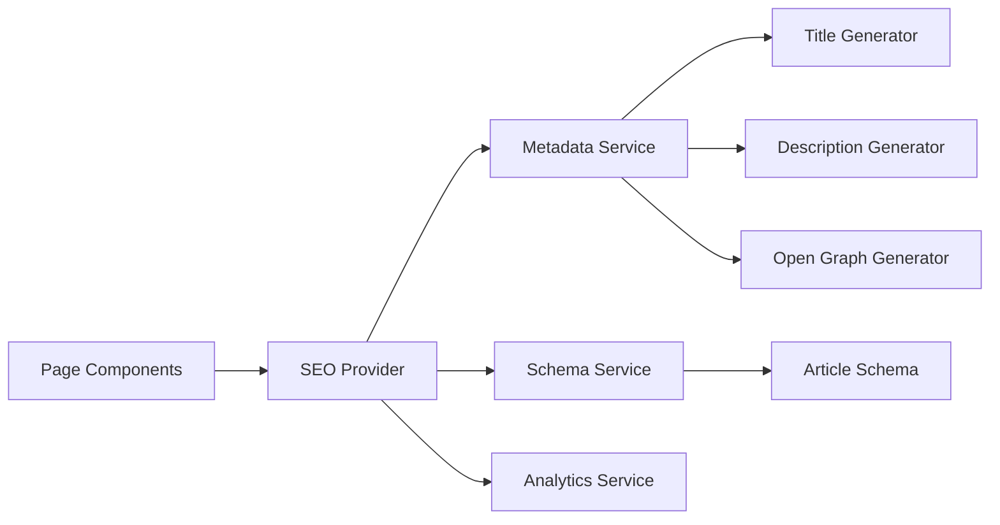

# Design Document

## Overview

O sistema de otimização SEO será implementado como uma camada abrangente que integra com o Next.js App Router existente, fornecendo metadados dinâmicos, estrutura de dados otimizada, e ferramentas de monitoramento. A arquitetura seguirá as melhores práticas do Next.js 15 para SEO, incluindo geração automática de sitemaps, otimização de Core Web Vitals, e implementação de dados estruturados.

## Architecture

### High-Level SEO Architecture



### SEO Service Layer Architecture



## Next.js 15 Metadata Implementation

### Metadata API Integration

O sistema utilizará a Metadata API nativa do Next.js 15 para máxima compatibilidade e performance:

```typescript
// app/layout.tsx - Root metadata
export const metadata: Metadata = {
  metadataBase: new URL('https://crazynator.com'),
  title: {
    template: '%s | CrazyNator - AI Code Generator',
    default: 'CrazyNator - AI Code Generator',
  },
  description:
    'Generate high-quality code with AI. The most advanced AI-powered code generation platform.',
  keywords: [
    'AI code generator',
    'gerador de código IA',
    'artificial intelligence',
    'development tools',
  ],
  authors: [{ name: 'CrazyNator Team' }],
  creator: 'CrazyNator',
  publisher: 'CrazyNator',
  robots: {
    index: true,
    follow: true,
    googleBot: {
      index: true,
      follow: true,
      'max-image-preview': 'large',
      'max-video-preview': -1,
      'max-snippet': -1,
    },
  },
  openGraph: {
    type: 'website',
    locale: 'pt_BR',
    url: 'https://crazynator.com',
    siteName: 'CrazyNator',
    title: 'CrazyNator - AI Code Generator',
    description:
      'Generate high-quality code with AI. The most advanced AI-powered code generation platform.',
    images: [
      {
        url: '/og-image.png',
        width: 1200,
        height: 630,
        alt: 'CrazyNator - AI Code Generator',
      },
    ],
  },
  twitter: {
    card: 'summary_large_image',
    title: 'CrazyNator - AI Code Generator',
    description:
      'Generate high-quality code with AI. The most advanced AI-powered code generation platform.',
    creator: '@crazynator',
    images: {
      url: '/twitter-image.png',
      alt: 'CrazyNator - AI Code Generator',
    },
  },
  verification: {
    google: 'google-site-verification-code',
  },
};

// Dynamic metadata generation
export async function generateMetadata(
  {
    params,
    searchParams,
  }: {
    params: { slug: string };
    searchParams: { [key: string]: string | string[] | undefined };
  },
  parent: ResolvingMetadata,
): Promise<Metadata> {
  const parentMetadata = await parent;

  // Fetch page-specific data
  const pageData = await fetchPageData(params.slug);

  return {
    title: pageData.title,
    description: pageData.description,
    keywords: [...parentMetadata.keywords, ...pageData.keywords],
    openGraph: {
      ...parentMetadata.openGraph,
      title: pageData.title,
      description: pageData.description,
      url: `https://crazynator.com/${params.slug}`,
      images: pageData.featuredImage
        ? [
            {
              url: pageData.featuredImage,
              width: 1200,
              height: 630,
              alt: pageData.title,
            },
          ]
        : parentMetadata.openGraph?.images,
    },
    alternates: {
      canonical: `https://crazynator.com/${params.slug}`,
    },
  };
}
```

### Streaming Metadata Support

Para otimizar performance, o sistema implementará streaming de metadados:

```typescript
// Configuração para bots que suportam JavaScript
export const dynamic = 'force-dynamic';

// Metadados serão streamados para bots modernos como Googlebot
// e renderizados no <head> para bots limitados como Twitterbot
```

## Components and Interfaces

### 1. SEO Metadata Service

**Interface:**

```typescript
import type { Metadata } from 'next';

interface ISEOService {
  generateMetadata(page: PageType, data?: any): Promise<Metadata>;
  generateStructuredData(type: SchemaType, data: any): JsonLd;
  optimizeImages(images: ImageData[]): Promise<OptimizedImage[]>;
  generateSitemap(): Promise<SitemapEntry[]>;
}

interface PageMetadata extends Metadata {
  title:
    | string
    | {
        default: string;
        template?: string;
        absolute?: string;
      };
  description: string;
  keywords: string[];
  openGraph: {
    title: string;
    description: string;
    url: string;
    siteName: string;
    images: Array<{
      url: string;
      width: number;
      height: number;
      alt?: string;
    }>;
    locale: string;
    type: 'website' | 'article';
  };
  twitter: {
    card: 'summary' | 'summary_large_image' | 'app' | 'player';
    title: string;
    description: string;
    creator?: string;
    images: {
      url: string;
      alt: string;
    };
  };
  robots: {
    index: boolean;
    follow: boolean;
    nocache?: boolean;
    googleBot?: {
      index: boolean;
      follow: boolean;
      noimageindex?: boolean;
      'max-video-preview'?: number;
      'max-image-preview'?: 'none' | 'standard' | 'large';
      'max-snippet'?: number;
    };
  };
  alternates?: {
    canonical: string;
    languages?: Record<string, string>;
  };
  verification?: {
    google?: string;
    yandex?: string;
    yahoo?: string;
    other?: Record<string, string | string[]>;
  };
}
```

**Responsibilities:**

- Gerar metadados únicos para cada página usando Next.js 15 Metadata API
- Criar Open Graph e Twitter Card tags otimizados
- Implementar title templates para consistência de marca
- Gerenciar canonical URLs e robots directives
- Configurar metadataBase para URLs absolutas
- Implementar verificação de motores de busca
- Suportar streaming de metadados para melhor performance

### 2. Structured Data Generator

**Interface:**

```typescript
interface IStructuredDataService {
  generateOrganizationSchema(): JsonLd;
  generateProductSchema(product: ProductData): JsonLd;
  generateArticleSchema(article: ArticleData): JsonLd;
  generateBreadcrumbSchema(breadcrumbs: BreadcrumbItem[]): JsonLd;
}

interface JsonLd {
  '@context': string;
  '@type': string;
  [key: string]: any;
}
```

**Responsibilities:**

- Criar dados estruturados JSON-LD
- Implementar schemas para diferentes tipos de conteúdo
- Validar estrutura de dados conforme schema.org
- Otimizar para rich snippets nos resultados de busca

### 3. Sitemap and Robots Generator

**Interface:**

```typescript
interface ISitemapService {
  generateSitemap(): Promise<SitemapEntry[]>;
  generateRobotsTxt(): string;
  updateSitemap(newPages: PageData[]): Promise<void>;
  validateSitemap(): Promise<ValidationResult>;
}

interface SitemapEntry {
  url: string;
  lastModified: Date;
  changeFrequency: 'always' | 'hourly' | 'daily' | 'weekly' | 'monthly' | 'yearly' | 'never';
  priority: number;
}
```

**Responsibilities:**

- Gerar sitemap.xml automaticamente
- Criar robots.txt otimizado
- Atualizar sitemap quando conteúdo muda
- Validar estrutura do sitemap

### 4. SEO Analytics and Monitoring

**Interface:**

```typescript
interface ISEOAnalytics {
  trackPageView(page: string, metadata: PageMetadata): void;
  trackSearchRanking(keyword: string, position: number): void;
  monitorCoreWebVitals(metrics: WebVitalsMetrics): void;
  generateSEOReport(): Promise<SEOReport>;
}

interface SEOReport {
  pageMetrics: PageMetric[];
  keywordRankings: KeywordRanking[];
  technicalIssues: TechnicalIssue[];
  recommendations: SEORecommendation[];
}
```

**Responsibilities:**

- Integrar com Google Analytics 4
- Monitorar Search Console data
- Rastrear Core Web Vitals
- Gerar relatórios de performance SEO

## Data Models

### SEO Configuration

```typescript
interface SEOConfig {
  siteName: string;
  siteUrl: string;
  defaultTitle: string;
  titleTemplate: string; // e.g., "%s | CrazyNator"
  defaultDescription: string;
  defaultKeywords: string[];
  metadataBase: URL; // Base URL for metadata fields
  socialMedia: {
    twitter: string;
    facebook: string;
    linkedin: string;
  };
  analytics: {
    googleAnalyticsId: string;
    googleSearchConsoleId: string;
  };
  verification: {
    google?: string;
    bing?: string;
    yandex?: string;
  };
  robots: {
    index: boolean;
    follow: boolean;
    googleBot: {
      index: boolean;
      follow: boolean;
      'max-image-preview': 'large';
      'max-video-preview': -1;
      'max-snippet': -1;
    };
  };
}
```

### Page SEO Data

```typescript
interface PageSEOData {
  slug: string;
  title: string;
  description: string;
  keywords: string[];
  content: string;
  publishedAt: Date;
  updatedAt: Date;
  author?: string;
  category?: string;
  tags?: string[];
  featuredImage?: string;
}
```

### Schema Types

```typescript
enum SchemaType {
  ORGANIZATION = 'Organization',
  PRODUCT = 'Product',
  ARTICLE = 'Article',
  BREADCRUMB = 'BreadcrumbList',
  FAQ = 'FAQPage',
  REVIEW = 'Review',
}
```

## Error Handling

### SEO Error Types

```typescript
class SEOError extends Error {
  code: 'METADATA_GENERATION_FAILED' | 'SITEMAP_UPDATE_FAILED' | 'ANALYTICS_TRACKING_FAILED';
  page?: string;
  details?: Record<string, any>;
}
```

### Error Handling Strategy

1. **Graceful Degradation**: Se metadados falham, usar defaults
2. **Fallback Content**: Sempre ter conteúdo de backup para SEO
3. **Silent Failures**: Não quebrar página por falhas de SEO
4. **Detailed Logging**: Registrar todos os problemas para análise

## Testing Strategy

### Unit Tests

- **Metadata Generation**: Testar geração de meta tags para diferentes páginas
- **Structured Data**: Validar JSON-LD schemas
- **Image Optimization**: Testar otimizações de imagem e alt text
- **Sitemap Generation**: Testar criação e atualização de sitemaps

### Integration Tests

- **Next.js Integration**: Testar metadados em páginas renderizadas
- **Analytics Integration**: Testar envio de dados para GA4
- **Search Console**: Testar submissão de sitemaps
- **Analytics Integration**: Testar integração com Google Analytics

### SEO Auditing Tests

- **Lighthouse Audits**: Automatizar auditorias de SEO
- **Schema Validation**: Validar dados estruturados
- **Meta Tag Validation**: Verificar completude de metadados
- **SEO Benchmarks**: Testar métricas de SEO

### A/B Testing

- **Title Optimization**: Testar diferentes formatos de título
- **Description Testing**: Otimizar meta descriptions
- **Schema Impact**: Medir impacto de dados estruturados
- **SEO Impact**: Testar impacto das otimizações de SEO

## Content Structure and Hierarchy

### Heading Structure Optimization

Para atender ao requisito 2.2 sobre estrutura hierárquica de headings:

```typescript
interface HeadingStructure {
  h1: string; // Único por página
  h2: string[]; // Seções principais
  h3: string[]; // Subseções
  h4?: string[]; // Detalhes específicos
}

// Validador de estrutura de headings
class HeadingValidator {
  validateStructure(headings: HeadingStructure): ValidationResult {
    const issues: string[] = [];

    // H1 deve ser único
    if (!headings.h1) {
      issues.push('Página deve ter exatamente um H1');
    }

    // H2 deve existir se há H3
    if (headings.h3.length > 0 && headings.h2.length === 0) {
      issues.push('H3 encontrado sem H2 correspondente');
    }

    // Verificar hierarquia lógica
    if (headings.h4 && headings.h4.length > 0 && headings.h3.length === 0) {
      issues.push('H4 encontrado sem H3 correspondente');
    }

    return {
      isValid: issues.length === 0,
      issues,
    };
  }
}

// Componente para estrutura semântica
interface SEOHeadingProps {
  level: 1 | 2 | 3 | 4 | 5 | 6;
  children: React.ReactNode;
  id?: string; // Para anchor links
  className?: string;
}

function SEOHeading({ level, children, id, className }: SEOHeadingProps) {
  const Tag = `h${level}` as keyof JSX.IntrinsicElements;
  const headingId = id || slugify(children?.toString() || '');

  return (
    <Tag
      id={headingId}
      className={className}
      // Adicionar structured data para headings importantes
      {...(level <= 2 && { 'data-heading-level': level })}
    >
      {children}
    </Tag>
  );
}
```

### Content Optimization Guidelines

```typescript
interface ContentOptimizationRules {
  // Densidade de palavras-chave (1-3%)
  keywordDensity: {
    min: 0.01;
    max: 0.03;
    target: 0.015;
  };

  // Comprimento de conteúdo
  contentLength: {
    minWords: 300;
    optimalWords: 1500;
    maxWords: 3000;
  };

  // Estrutura de parágrafos
  paragraphStructure: {
    maxSentences: 4;
    maxWords: 150;
    minWords: 20;
  };

  // Links internos
  internalLinks: {
    minPerPage: 3;
    maxPerPage: 10;
    anchorTextVariation: true;
  };
}
```

## Security Considerations

### Content Security

- Sanitizar dados dinâmicos em metadados
- Validar URLs em canonical tags
- Proteger contra XSS em structured data
- Implementar rate limiting para APIs de SEO

### Analytics Privacy

- Implementar GDPR compliance para tracking
- Anonimizar dados pessoais em analytics
- Fornecer opt-out para usuários
- Usar cookies de primeira parte quando possível

### Search Engine Guidelines

- Seguir diretrizes do Google Webmaster
- Evitar técnicas de black hat SEO
- Implementar apenas white hat practices
- Manter transparência em otimizações

## Technical SEO Implementation

### Next.js Optimization Strategies

- **Server-Side Rendering**: Usar SSR para conteúdo crítico de SEO
- **Static Generation**: Gerar páginas estáticas quando possível para melhor indexação
- **Image Optimization**: Usar Next.js Image component com alt text obrigatório
- **Font Optimization**: Implementar font display strategies para evitar layout shifts

### Image Optimization Strategy

Para atender ao requisito 2.4 sobre otimização de imagens e alt text:

```typescript
interface ImageOptimizationConfig {
  formats: ['webp', 'avif', 'jpeg'];
  sizes: {
    thumbnail: { width: 150, height: 150 };
    small: { width: 400, height: 300 };
    medium: { width: 800, height: 600 };
    large: { width: 1200, height: 900 };
    hero: { width: 1920, height: 1080 };
  };
  quality: {
    thumbnail: 75;
    default: 85;
    hero: 90;
  };
}

interface OptimizedImageProps {
  src: string;
  alt: string; // Obrigatório para SEO
  width: number;
  height: number;
  priority?: boolean;
  sizes?: string;
  placeholder?: 'blur' | 'empty';
  blurDataURL?: string;
}

// Componente de imagem otimizada
function SEOImage({ src, alt, width, height, ...props }: OptimizedImageProps) {
  return (
    <Image
      src={src}
      alt={alt}
      width={width}
      height={height}
      loading={props.priority ? 'eager' : 'lazy'}
      sizes="(max-width: 768px) 100vw, (max-width: 1200px) 50vw, 33vw"
      {...props}
    />
  );
}

// Geração automática de alt text para imagens
function generateAltText(imagePath: string, context?: string): string {
  // Implementar IA para gerar alt text descritivo
  // Fallback para nome do arquivo processado
  const filename = imagePath.split('/').pop()?.replace(/\.[^/.]+$/, '');
  return context
    ? `${context} - ${filename?.replace(/-/g, ' ')}`
    : filename?.replace(/-/g, ' ') || 'Imagem';
}
```

### SEO Caching Strategy

- **Metadata Caching**: Cache metadados gerados para melhor performance
- **Sitemap Caching**: Cache sitemap com TTL apropriado
- **Structured Data Caching**: Cache dados estruturados JSON-LD
- **SEO Analytics Caching**: Batch analytics requests para reduzir overhead

## Implementation Phases

### Phase 1: Foundation

- Implementar serviços base de SEO
- Configurar metadados dinâmicos
- Criar sitemap e robots.txt
- Integrar Google Analytics

### Phase 2: Advanced Features

- Implementar dados estruturados
- Implementar dados estruturados avançados
- Adicionar monitoramento de SEO
- Criar dashboard de SEO

### Phase 3: Content Optimization

- Implementar otimizações de blog
- Adicionar sugestões de SEO em tempo real
- Criar ferramentas de análise de conteúdo
- Implementar A/B testing para SEO

### Phase 4: Advanced Analytics

- Integrar Search Console API
- Implementar keyword tracking
- Criar relatórios automatizados
- Adicionar alertas de SEO

## URL Structure and Semantic Routing

### URL Optimization Strategy

Para atender ao requisito 2.3 sobre URLs semânticas e amigáveis:

```typescript
interface URLStructure {
  // Páginas principais
  home: '/';
  about: '/sobre';
  pricing: '/precos';
  blog: '/blog';

  // Páginas de produto
  features: '/funcionalidades';
  codeGenerator: '/gerador-de-codigo';
  aiTools: '/ferramentas-ia';

  // Páginas dinâmicas
  blogPost: '/blog/[slug]';
  documentation: '/docs/[...slug]';
  userProfile: '/usuario/[username]';

  // Páginas de categoria
  tutorials: '/tutoriais';
  examples: '/exemplos';
  templates: '/templates';
}

// Implementação de redirects para URLs antigas
const redirects = [
  {
    source: '/old-page',
    destination: '/nova-pagina',
    permanent: true, // 301 redirect
  },
  {
    source: '/code-gen',
    destination: '/gerador-de-codigo',
    permanent: true,
  },
];
```

### Breadcrumb Implementation

```typescript
interface BreadcrumbItem {
  name: string;
  url: string;
  position: number;
}

function generateBreadcrumbSchema(breadcrumbs: BreadcrumbItem[]): JsonLd {
  return {
    '@context': 'https://schema.org',
    '@type': 'BreadcrumbList',
    itemListElement: breadcrumbs.map((item) => ({
      '@type': 'ListItem',
      position: item.position,
      name: item.name,
      item: `https://crazynator.com${item.url}`,
    })),
  };
}
```

## SEO Strategy

### Target Keywords

- **Primary**: "gerador de código IA", "AI code generator"
- **Secondary**: "ferramenta desenvolvimento IA", "código automático"
- **Long-tail**: "como gerar código com inteligência artificial"
- **Branded**: "CrazyNator", "CrazyNator AI"

### Content Strategy

- **Landing Pages**: Otimizar para conversão e SEO

### Link Building Strategy

- **Internal Linking**: Estrutura de links internos otimizada
