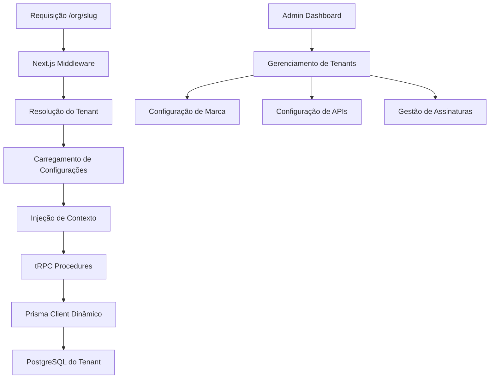

# Documento de Design - Sistema Whitelabel

## Visão Geral

O sistema whitelabel transformará a aplicação atual em uma plataforma SaaS multi-tenant, permitindo que múltiplas organizações operem suas próprias instâncias com identidade visual personalizada, isolamento completo de dados e configurações próprias. A arquitetura utilizará slugs para roteamento, bancos de dados separados por inquilino e um sistema de assinatura simples com dois planos.

## Arquitetura

### Estratégia Multi-Tenant

**Isolamento por Banco de Dados**: Cada inquilino terá seu próprio banco de dados PostgreSQL, garantindo isolamento completo de dados e permitindo configurações específicas por cliente.

**Roteamento por Slug**: Utilização de rotas dinâmicas do Next.js no formato `/org/[slug]` para identificar e rotear requisições para o contexto correto do inquilino.

**Configuração Dinâmica**: Sistema de variáveis de ambiente por inquilino, permitindo que cada organização use suas próprias integrações e APIs.

### Fluxo Arquitetural



## Componentes e Interfaces

### 1. Sistema de Gerenciamento de Inquilinos

**Modelo de Inquilino**

```typescript
interface Tenant {
  id: string;
  slug: string; // Identificador único para URL
  name: string;
  ownerId: string; // Clerk User ID do proprietário
  status: 'active' | 'suspended' | 'cancelled';
  plan: 'self-service' | 'managed';
  branding: TenantBranding;
  envVars: TenantEnvironmentVars;
  subscription: TenantSubscription;
  createdAt: Date;
  updatedAt: Date;
}
```

**Provedor de Contexto do Inquilino**

- Middleware que resolve o inquilino baseado no slug da URL
- Carrega configurações específicas do inquilino
- Injeta contexto em todas as requisições downstream
- Gerencia fallbacks para slugs inválidos

**Integração com Clerk**

- Utiliza Clerk userId existente para identificar proprietários
- Mantém autenticação atual sem mudanças
- Associa usuários logados ao contexto do inquilino via slug
- Controle de acesso baseado em proprietário do inquilino

### 2. Sistema de Marca Personalizada

**Configuração de Marca**

```typescript
interface TenantBranding {
  logo: string; // URL do logo
  favicon: string; // URL do favicon
  primaryColor: string; // Cor primária em hex
  secondaryColor: string; // Cor secundária em hex
  companyName: string;
}
```

**Sistema de Assets Simples**

- Upload de logo e favicon com validação básica
- Armazenamento de cores primária e secundária
- Aplicação via CSS variables no frontend
- Nome da empresa exibido na interface

### 3. Sistema de Roteamento por Slug

**Estrutura de Rotas**

```
/org/[slug] - Página principal do inquilino
/org/[slug]/dashboard - Dashboard do inquilino
/org/[slug]/projects/[projectId] - Projetos específicos
/admin - Dashboard administrativo da plataforma
```

**Resolução de Slug**

- Validação de slug único no cadastro
- Cache de mapeamento slug → tenant para performance
- Redirecionamento automático para slugs inválidos
- Sugestões de slugs alternativos

### 4. Sistema de Configuração de Ambiente

**Variáveis por Inquilino**

```typescript
interface TenantEnvironmentVars {
  DATABASE_URL: string; // Obrigatória
  OPENAI_API_KEY: string; // Obrigatória
  ANTHROPIC_API_KEY: string; // Obrigatória
  E2B_API_KEY: string; // Obrigatória
  STRIPE_SECRET_KEY?: string; // Opcional
  STRIPE_PRICE_ID_BASIC?: string; // Opcional
  STRIPE_PRICE_ID_PRO?: string; // Opcional
}
```

**Validação e Gestão**

- Interface de configuração com validação em tempo real
- Testes automáticos de conectividade para APIs
- Criptografia de chaves sensíveis
- Versionamento de configurações

### 5. Sistema de Assinatura SaaS

**Planos de Assinatura**

```typescript
interface TenantSubscription {
  plan: 'self-service' | 'managed';
  status: 'active' | 'past_due' | 'cancelled';
  currentPeriodStart: Date;
  currentPeriodEnd: Date;
  stripeSubscriptionId?: string;
  cancelAtPeriodEnd: boolean;
}

const PLANS = {
  'self-service': {
    name: 'Self-Service',
    price: 19700, // R$ 197,00 em centavos
    features: ['Recursos ilimitados', 'Configuração própria', 'Suporte por documentação'],
  },
  managed: {
    name: 'Managed',
    price: 49700, // R$ 497,00 em centavos
    features: ['Recursos ilimitados', 'Configuração assistida', 'Suporte dedicado'],
  },
};
```

## Modelos de Dados

### Schema Prisma Atualizado

```prisma
// Banco principal da plataforma
model PlatformTenant {
  id          String   @id @default(uuid())
  slug        String   @unique
  name        String
  ownerId     String   // Clerk User ID do proprietário
  status      TenantStatus @default(ACTIVE)
  plan        TenantPlan @default(SELF_SERVICE)
  branding    Json     // TenantBranding
  envVars     Json     // TenantEnvironmentVars (criptografado)
  subscription Json    // TenantSubscription
  createdAt   DateTime @default(now())
  updatedAt   DateTime @updatedAt

  @@map("platform_tenants")
}

enum TenantStatus {
  ACTIVE
  SUSPENDED
  CANCELLED
}

enum TenantPlan {
  SELF_SERVICE
  MANAGED
}

// Schema para cada banco do inquilino (mantém estrutura atual)
model Project {
  id        String   @id @default(uuid())
  name      String
  userId    String
  createdAt DateTime @default(now())
  updatedAt DateTime @updatedAt

  messages Message[]
}

// ... demais modelos permanecem iguais
```

### Estratégia de Banco de Dados

**Banco Principal da Plataforma**

- Armazena informações dos inquilinos
- Configurações de marca e ambiente (criptografadas)
- Dados de assinatura e cobrança
- Logs de auditoria

**Bancos dos Inquilinos**

- Cada inquilino tem seu próprio PostgreSQL
- Schema idêntico ao atual (Project, Message, Fragment, etc.)
- Migrações automáticas no setup do inquilino
- Backup e restore independentes

## Tratamento de Erros

### Erros Específicos de Inquilino

**Slug Inválido ou Inexistente**

- Página 404 personalizada com branding da plataforma
- Sugestões de slugs similares
- Opção de contato para suporte

**Inquilino Suspenso**

- Página de manutenção com branding do inquilino
- Informações sobre status da assinatura
- Link para atualização de pagamento

**Falha de Configuração**

- Alertas para administradores do inquilino
- Fallback para configurações padrão quando possível
- Logs detalhados para diagnóstico

### Formato de Resposta de Erro

```typescript
interface TenantError {
  code: string;
  message: string;
  tenantSlug?: string;
  context?: Record<string, any>;
  timestamp: Date;
}
```

## Estratégia de Testes

### Testes Unitários

- Resolução de slug e contexto de inquilino
- Validação de configurações de ambiente
- Aplicação de branding dinâmico
- Lógica de planos e assinaturas

### Testes de Integração

- Fluxo completo de criação de inquilino
- Isolamento de dados entre inquilinos
- Integração com APIs externas por inquilino
- Processamento de pagamentos

### Testes End-to-End

- Jornada completa de onboarding
- Personalização de marca e configuração
- Fluxo de upgrade/downgrade de planos
- Cancelamento e reativação de assinatura

### Testes de Segurança

- Isolamento entre inquilinos
- Criptografia de variáveis sensíveis
- Validação de entrada em configurações
- Prevenção de ataques de enumeração

## Considerações de Implementação

### Estratégia de Migração

1. **Fase 1**: Implementar modelos e middleware básico
2. **Fase 2**: Sistema de branding e roteamento por slug
3. **Fase 3**: Configuração de variáveis de ambiente
4. **Fase 4**: Sistema de assinatura e cobrança
5. **Fase 5**: Dashboard administrativo

## Detalhamento de Telas e Fluxos

### 1. Dashboard Administrativo da Plataforma (`/admin`)

**Tela de Lista de Inquilinos**

```typescript
interface AdminTenantsView {
  tenants: {
    id: string;
    slug: string;
    name: string;
    ownerId: string;
    ownerEmail: string; // Obtido via Clerk
    status: TenantStatus;
    plan: TenantPlan;
    createdAt: Date;
    lastActivity: Date;
    monthlyRevenue: number;
  }[];
  filters: {
    status: TenantStatus[];
    plan: TenantPlan[];
    dateRange: [Date, Date];
  };
  pagination: PaginationInfo;
}
```

**Funcionalidades:**

- Listagem paginada de todos os inquilinos
- Filtros por status, plano e data de criação
- Busca por nome, slug ou email do proprietário
- Ações rápidas: suspender, reativar, ver detalhes
- Métricas resumidas: total de inquilinos, receita mensal, churn rate

**Tela de Detalhes do Inquilino**

```typescript
interface AdminTenantDetailView {
  tenant: Tenant;
  owner: {
    id: string;
    email: string;
    name: string;
    createdAt: Date;
  };
  usage: {
    messagesThisMonth: number;
    projectsCount: number;
    storageUsed: number;
    lastActivity: Date;
  };
  billing: {
    subscription: TenantSubscription;
    invoices: Invoice[];
    paymentMethods: PaymentMethod[];
  };
  logs: AuditLog[];
}
```

**Funcionalidades:**

- Visualização completa dos dados do inquilino
- Histórico de atividades e logs de auditoria
- Gestão de cobrança e faturas
- Configurações técnicas (variáveis de ambiente mascaradas)
- Ações administrativas: suspender, alterar plano, resetar configurações

### 2. Fluxo de Onboarding de Inquilino

**Tela de Criação de Inquilino (`/create-tenant`)**

```typescript
interface CreateTenantForm {
  step: 'basic' | 'branding' | 'config' | 'payment';
  data: {
    // Step 1: Informações Básicas
    name: string;
    slug: string; // Validação em tempo real

    // Step 2: Branding
    logo?: File;
    favicon?: File;
    primaryColor: string;
    secondaryColor: string;

    // Step 3: Configurações
    envVars: {
      DATABASE_URL: string;
      OPENAI_API_KEY: string;
      ANTHROPIC_API_KEY: string;
      E2B_API_KEY: string;
      STRIPE_SECRET_KEY?: string;
      STRIPE_PRICE_ID_BASIC?: string;
      STRIPE_PRICE_ID_PRO?: string;
    };

    // Step 4: Plano e Pagamento
    selectedPlan: TenantPlan;
    paymentMethod?: PaymentMethodInfo;
  };
}
```

**Fluxo Backend de Criação:**

```typescript
async function createTenant(data: CreateTenantForm['data'], ownerId: string) {
  // 1. Validar dados e disponibilidade do slug
  await validateTenantData(data);

  // 2. Criar banco de dados dedicado
  const databaseUrl = await createTenantDatabase(data.slug);

  // 3. Executar migrações no novo banco
  await runMigrationsForTenant(databaseUrl);

  // 4. Upload e processamento de assets
  const processedBranding = await processBrandingAssets(data);

  // 5. Criptografar variáveis de ambiente
  const encryptedEnvVars = await encryptEnvironmentVars(data.envVars);

  // 6. Criar registro do inquilino
  const tenant = await createTenantRecord({
    ...data,
    ownerId,
    branding: processedBranding,
    envVars: encryptedEnvVars,
    databaseUrl,
  });

  // 7. Configurar assinatura no Stripe
  if (data.selectedPlan && data.paymentMethod) {
    await createStripeSubscription(tenant.id, data.selectedPlan, data.paymentMethod);
  }

  // 8. Enviar email de boas-vindas
  await sendWelcomeEmail(ownerId, tenant);

  return tenant;
}
```

### 3. Dashboard do Inquilino (`/org/[slug]`)

**Layout Principal**

```typescript
interface TenantLayout {
  tenant: Tenant;
  user: ClerkUser;
  navigation: {
    logo: string;
    companyName: string;
    primaryColor: string;
    menuItems: MenuItem[];
  };
  subscription: {
    plan: TenantPlan;
    status: SubscriptionStatus;
    usage?: UsageMetrics;
  };
}
```

**Tela de Configurações (`/org/[slug]/settings`)**

_Aba Geral:_

- Nome da organização
- Slug (com aviso sobre impacto em URLs)
- Status da conta

_Aba Branding:_

- Upload de logo (com preview)
- Upload de favicon
- Seletor de cores primária e secundária
- Preview em tempo real das mudanças

_Aba Integrações:_

- Configuração de APIs (com teste de conectividade)
- Status de cada integração (conectado/erro)
- Logs de teste das APIs

_Aba Cobrança:_

- Plano atual e próxima cobrança
- Histórico de faturas
- Opções de upgrade/downgrade
- Métodos de pagamento

### 4. Sistema de Middleware e Roteamento

**Middleware de Resolução de Tenant**

```typescript
// middleware.ts
export async function middleware(request: NextRequest) {
  const url = request.nextUrl.clone();

  // Verificar se é rota de inquilino
  const orgMatch = url.pathname.match(/^\/org\/([^\/]+)/);

  if (orgMatch) {
    const slug = orgMatch[1];

    // Resolver inquilino pelo slug
    const tenant = await resolveTenantBySlug(slug);

    if (!tenant) {
      return NextResponse.redirect(new URL('/tenant-not-found', request.url));
    }

    if (tenant.status !== 'active') {
      return NextResponse.redirect(new URL(`/tenant-suspended?slug=${slug}`, request.url));
    }

    // Injetar headers com contexto do inquilino
    const requestHeaders = new Headers(request.headers);
    requestHeaders.set('x-tenant-id', tenant.id);
    requestHeaders.set('x-tenant-slug', tenant.slug);
    requestHeaders.set('x-tenant-database-url', tenant.envVars.DATABASE_URL);

    return NextResponse.next({
      request: {
        headers: requestHeaders,
      },
    });
  }

  return NextResponse.next();
}
```

**Sistema de Contexto tRPC**

```typescript
// trpc/context.ts
export async function createTRPCContext(opts: CreateNextContextOptions) {
  const { req } = opts;

  // Extrair contexto do inquilino dos headers
  const tenantId = req.headers['x-tenant-id'] as string;
  const tenantSlug = req.headers['x-tenant-slug'] as string;
  const tenantDatabaseUrl = req.headers['x-tenant-database-url'] as string;

  // Criar cliente Prisma específico do inquilino
  let tenantPrisma: PrismaClient | null = null;
  if (tenantDatabaseUrl) {
    tenantPrisma = new PrismaClient({
      datasources: {
        db: {
          url: tenantDatabaseUrl,
        },
      },
    });
  }

  return {
    tenant: tenantId
      ? {
          id: tenantId,
          slug: tenantSlug,
          prisma: tenantPrisma,
        }
      : null,
    platformPrisma: new PrismaClient(), // Para dados da plataforma
    auth: getAuth(req),
  };
}
```

### 5. Sistema de Gestão de Configurações

**Serviço de Configuração Dinâmica**

```typescript
class TenantConfigService {
  private configCache = new Map<string, TenantConfig>();

  async getConfig(tenantId: string): Promise<TenantConfig> {
    // Verificar cache primeiro
    if (this.configCache.has(tenantId)) {
      return this.configCache.get(tenantId)!;
    }

    // Buscar do banco e descriptografar
    const tenant = await this.platformPrisma.platformTenant.findUnique({
      where: { id: tenantId },
    });

    if (!tenant) throw new Error('Tenant not found');

    const decryptedEnvVars = await this.decryptEnvironmentVars(tenant.envVars);

    const config: TenantConfig = {
      id: tenant.id,
      slug: tenant.slug,
      branding: tenant.branding as TenantBranding,
      envVars: decryptedEnvVars,
      databaseUrl: decryptedEnvVars.DATABASE_URL,
    };

    // Cache por 5 minutos
    this.configCache.set(tenantId, config);
    setTimeout(() => this.configCache.delete(tenantId), 5 * 60 * 1000);

    return config;
  }

  async updateConfig(tenantId: string, updates: Partial<TenantConfig>) {
    // Invalidar cache
    this.configCache.delete(tenantId);

    // Atualizar no banco
    const encryptedEnvVars = updates.envVars
      ? await this.encryptEnvironmentVars(updates.envVars)
      : undefined;

    await this.platformPrisma.platformTenant.update({
      where: { id: tenantId },
      data: {
        branding: updates.branding,
        envVars: encryptedEnvVars,
      },
    });

    // Notificar outros serviços da mudança
    await this.notifyConfigChange(tenantId, updates);
  }
}
```

### 6. Sistema de Cobrança e Assinaturas

**Webhook Handler do Stripe**

```typescript
// api/webhooks/stripe/route.ts
export async function POST(request: Request) {
  const body = await request.text();
  const signature = request.headers.get('stripe-signature')!;

  const event = stripe.webhooks.constructEvent(body, signature, process.env.STRIPE_WEBHOOK_SECRET!);

  switch (event.type) {
    case 'invoice.payment_succeeded':
      await handlePaymentSucceeded(event.data.object);
      break;

    case 'invoice.payment_failed':
      await handlePaymentFailed(event.data.object);
      break;

    case 'customer.subscription.deleted':
      await handleSubscriptionCancelled(event.data.object);
      break;
  }

  return new Response('OK');
}

async function handlePaymentFailed(invoice: Stripe.Invoice) {
  const tenant = await findTenantByStripeCustomerId(invoice.customer as string);

  if (tenant) {
    // Suspender inquilino após 3 tentativas falhadas
    const failedAttempts = await countFailedPayments(tenant.id);

    if (failedAttempts >= 3) {
      await suspendTenant(tenant.id, 'payment_failed');
      await notifyTenantSuspension(tenant);
    }
  }
}
```

**Serviço de Gestão de Planos**

```typescript
class SubscriptionService {
  async upgradePlan(tenantId: string, newPlan: TenantPlan) {
    const tenant = await this.getTenant(tenantId);
    const currentSubscription = tenant.subscription;

    // Calcular valor proporcional
    const prorationAmount = this.calculateProration(
      currentSubscription.plan,
      newPlan,
      currentSubscription.currentPeriodEnd,
    );

    // Atualizar no Stripe
    await stripe.subscriptions.update(currentSubscription.stripeSubscriptionId, {
      items: [
        {
          id: currentSubscription.stripeItemId,
          price: this.getPriceIdForPlan(newPlan),
        },
      ],
      proration_behavior: 'create_prorations',
    });

    // Atualizar no banco
    await this.updateTenantPlan(tenantId, newPlan);

    // Notificar inquilino
    await this.notifyPlanChange(tenantId, newPlan);
  }
}
```

### 7. Sistema de Monitoramento e Logs

**Middleware de Auditoria**

### Considerações de Segurança

- Criptografia de variáveis de ambiente sensíveis usando AES-256
- Validação rigorosa de uploads de assets (tipo, tamanho, conteúdo)
- Rate limiting por inquilino e por usuário
- Auditoria completa de mudanças de configuração
- Backup automático de dados críticos
- Isolamento completo entre inquilinos (banco, cache, sessões)

## Mapeamento de Refatoração da Estrutura Existente

### 1. Estrutura de Rotas - Mudanças Necessárias

**Estrutura Atual:**

```
src/app/
├── (home)/
│   ├── dashboard/
│   ├── pricing/
│   └── page.tsx
├── projects/[projectId]/
└── api/
```

**Nova Estrutura Multi-Tenant:**

```
src/app/
├── (platform)/                    # Rotas da plataforma
│   ├── admin/                     # Dashboard administrativo
│   ├── create-tenant/             # Onboarding de inquilinos
│   └── page.tsx                   # Landing page da plataforma
├── org/[slug]/                    # Rotas dos inquilinos
│   ├── dashboard/
│   ├── projects/[projectId]/
│   ├── settings/
│   └── layout.tsx                 # Layout com branding do inquilino
├── tenant-not-found/              # Página de erro para slug inválido
├── tenant-suspended/              # Página para inquilinos suspensos
└── api/
    ├── platform/                  # APIs da plataforma
    └── tenant/                    # APIs dos inquilinos
```

### 2. Sistema de Autenticação - Refatorações

**Arquivo Atual: `src/middleware.ts`**

```typescript
// ANTES - Middleware simples do Clerk
import { clerkMiddleware } from '@clerk/nextjs/server';

export default clerkMiddleware();

export const config = {
  matcher: [
    '/((?!_next|[^?]*\\.(?:html?|css|js(?!on)|jpe?g|webp|png|gif|svg|ttf|woff2?|ico|csv|docx?|xlsx?|zip|webmanifest)).*)',
    '/(api|trpc)(.*)',
  ],
};
```

**DEPOIS - Middleware Multi-Tenant:**

```typescript
import { clerkMiddleware } from '@clerk/nextjs/server';
import { NextRequest, NextResponse } from 'next/server';

export default clerkMiddleware(async (auth, request: NextRequest) => {
  const url = request.nextUrl.clone();

  // 1. Verificar se é rota de inquilino
  const orgMatch = url.pathname.match(/^\/org\/([^\/]+)/);

  if (orgMatch) {
    const slug = orgMatch[1];

    // 2. Resolver inquilino
    const tenant = await resolveTenantBySlug(slug);

    if (!tenant) {
      return NextResponse.redirect(new URL('/tenant-not-found', request.url));
    }

    if (tenant.status !== 'active') {
      return NextResponse.redirect(new URL(`/tenant-suspended?slug=${slug}`, request.url));
    }

    // 3. Verificar se usuário tem acesso ao inquilino
    const { userId } = auth();
    if (userId && tenant.ownerId !== userId) {
      return NextResponse.redirect(new URL('/unauthorized', request.url));
    }

    // 4. Injetar contexto do inquilino
    const requestHeaders = new Headers(request.headers);
    requestHeaders.set('x-tenant-id', tenant.id);
    requestHeaders.set('x-tenant-slug', tenant.slug);
    requestHeaders.set('x-tenant-config', JSON.stringify(tenant));

    return NextResponse.next({
      request: { headers: requestHeaders },
    });
  }

  // 5. Rotas administrativas - apenas para super admins
  if (url.pathname.startsWith('/admin')) {
    const { userId } = auth();
    if (!userId || !(await isSuperAdmin(userId))) {
      return NextResponse.redirect(new URL('/unauthorized', request.url));
    }
  }

  return NextResponse.next();
});
```

### 3. Sistema tRPC - Refatorações Necessárias

**Arquivo Atual: `src/trpc/init.ts`**

```typescript
// ANTES - Contexto simples
export const createTRPCContext = async (opts: CreateNextContextOptions) => {
  return {
    db: prisma,
    auth: getAuth(opts.req),
  };
};
```

**DEPOIS - Contexto Multi-Tenant:**

```typescript
export const createTRPCContext = async (opts: CreateNextContextOptions) => {
  const { req } = opts;

  // Extrair contexto do inquilino
  const tenantConfig = req.headers['x-tenant-config'];
  let tenant: TenantContext | null = null;

  if (tenantConfig) {
    const tenantData = JSON.parse(tenantConfig as string);

    // Criar cliente Prisma específico do inquilino
    const tenantPrisma = new PrismaClient({
      datasources: {
        db: { url: tenantData.envVars.DATABASE_URL },
      },
    });

    tenant = {
      id: tenantData.id,
      slug: tenantData.slug,
      config: tenantData,
      db: tenantPrisma,
      // APIs específicas do inquilino
      openai: new OpenAI({ apiKey: tenantData.envVars.OPENAI_API_KEY }),
      anthropic: new Anthropic({ apiKey: tenantData.envVars.ANTHROPIC_API_KEY }),
      e2b: new E2B({ apiKey: tenantData.envVars.E2B_API_KEY }),
    };
  }

  return {
    // Banco da plataforma (para dados de inquilinos)
    platformDb: prisma,
    // Contexto do inquilino atual
    tenant,
    // Autenticação
    auth: getAuth(req),
  };
};
```

### 4. Procedures tRPC - Refatorações

**Arquivo Atual: `src/modules/projects/server/procedures.ts`**

```typescript
// ANTES - Acesso direto ao banco global
export const createProject = protectedProcedure
  .input(z.object({ name: z.string() }))
  .mutation(async ({ ctx, input }) => {
    return ctx.db.project.create({
      data: {
        name: input.name,
        userId: ctx.auth.userId!,
      },
    });
  });
```

**DEPOIS - Com contexto de inquilino:**

```typescript
// Novo middleware para validar contexto de inquilino
const tenantProcedure = protectedProcedure.use(async ({ ctx, next }) => {
  if (!ctx.tenant) {
    throw new TRPCError({
      code: 'UNAUTHORIZED',
      message: 'Tenant context required',
    });
  }

  return next({
    ctx: {
      ...ctx,
      // Garantir que temos contexto de inquilino
      tenant: ctx.tenant,
    },
  });
});

export const createProject = tenantProcedure
  .input(z.object({ name: z.string() }))
  .mutation(async ({ ctx, input }) => {
    // Usar banco específico do inquilino
    return ctx.tenant.db.project.create({
      data: {
        name: input.name,
        userId: ctx.auth.userId!,
      },
    });
  });
```

### 5. Componentes de UI - Refatorações

**Arquivo Atual: `src/modules/home/ui/navbar.tsx`**

```typescript
// ANTES - Navbar estática
export function Navbar() {
  return (
    <nav className="border-b">
      <div className="flex items-center justify-between px-4 py-2">
        <div className="flex items-center space-x-2">
          <Image src="/logo.svg" alt="Logo" width={32} height={32} />
          <span className="font-semibold">Minha Plataforma</span>
        </div>
        <UserButton />
      </div>
    </nav>
  );
}
```

**DEPOIS - Navbar com branding dinâmico:**

```typescript
interface TenantNavbarProps {
  tenant?: {
    branding: TenantBranding;
    slug: string;
  };
}

export function TenantNavbar({ tenant }: TenantNavbarProps) {
  const branding = tenant?.branding || DEFAULT_BRANDING;

  return (
    <nav
      className="border-b"
      style={{
        '--primary-color': branding.primaryColor,
        '--secondary-color': branding.secondaryColor,
      } as CSSProperties}
    >
      <div className="flex items-center justify-between px-4 py-2">
        <div className="flex items-center space-x-2">
          <Image
            src={branding.logo || '/default-logo.svg'}
            alt="Logo"
            width={32}
            height={32}
          />
          <span className="font-semibold">
            {branding.companyName || 'Minha Plataforma'}
          </span>
        </div>
        <UserButton />
      </div>
    </nav>
  );
}
```

### 6. Layout Principal - Refatorações

**Arquivo Atual: `src/app/layout.tsx`**

```typescript
// ANTES - Layout global estático
export default function RootLayout({ children }: { children: React.ReactNode }) {
  return (
    <ClerkProvider>
      <TRPCReactProvider>
        <html lang="pt-BR">
          <body>
            <ThemeProvider>
              <Toaster />
              {children}
            </ThemeProvider>
          </body>
        </html>
      </TRPCReactProvider>
    </ClerkProvider>
  );
}
```

**DEPOIS - Layout com contexto de inquilino:**

```typescript
// Novo: src/app/org/[slug]/layout.tsx
interface TenantLayoutProps {
  children: React.ReactNode;
  params: { slug: string };
}

export default async function TenantLayout({ children, params }: TenantLayoutProps) {
  // Buscar dados do inquilino
  const tenant = await getTenantBySlug(params.slug);

  if (!tenant) {
    notFound();
  }

  return (
    <TenantProvider tenant={tenant}>
      <div
        className="min-h-screen"
        style={{
          '--primary-color': tenant.branding.primaryColor,
          '--secondary-color': tenant.branding.secondaryColor,
        } as CSSProperties}
      >
        <TenantNavbar tenant={tenant} />
        <main>{children}</main>
      </div>
    </TenantProvider>
  );
}

// Context Provider para inquilino
const TenantContext = createContext<Tenant | null>(null);

export function TenantProvider({ tenant, children }: { tenant: Tenant; children: React.ReactNode }) {
  return (
    <TenantContext.Provider value={tenant}>
      {children}
    </TenantContext.Provider>
  );
}

export function useTenant() {
  const tenant = useContext(TenantContext);
  if (!tenant) {
    throw new Error('useTenant must be used within TenantProvider');
  }
  return tenant;
}
```

### 7. Schema Prisma - Refatorações

**Schema Atual: `prisma/schema.prisma`**

```prisma
// ANTES - Schema single-tenant
model Project {
  id        String   @id @default(uuid())
  name      String
  userId    String
  createdAt DateTime @default(now())
  updatedAt DateTime @updatedAt

  messages Message[]
}

model Subscription {
  id                    String   @id @default(cuid())
  clerkUserId           String   @unique
  stripeCustomerId      String   @unique
  stripeSubscriptionId  String   @unique
  status                String
  priceId               String
  cancelAtPeriodEnd     Boolean  @default(false)
  createdAt             DateTime @default(now())
  updatedAt             DateTime @updatedAt
}
```

**DEPOIS - Schema multi-tenant:**

```prisma
// Novo arquivo: prisma/platform.prisma (banco da plataforma)
model PlatformTenant {
  id           String      @id @default(uuid())
  slug         String      @unique
  name         String
  ownerId      String      // Clerk User ID
  status       TenantStatus @default(ACTIVE)
  plan         TenantPlan   @default(SELF_SERVICE)
  branding     Json        // TenantBranding
  envVars      Json        // Encrypted environment variables
  subscription Json        // TenantSubscription
  createdAt    DateTime    @default(now())
  updatedAt    DateTime    @updatedAt

  @@map("platform_tenants")
}

// Arquivo existente: prisma/schema.prisma (template para bancos de inquilinos)
// Mantém estrutura atual - será replicado para cada inquilino
model Project {
  id        String   @id @default(uuid())
  name      String
  userId    String   // Clerk User ID
  createdAt DateTime @default(now())
  updatedAt DateTime @updatedAt

  messages Message[]
}

// Subscription movido para o banco da plataforma
// Cada inquilino não precisa mais de subscription própria
```

### 8. Variáveis de Ambiente - Refatorações

**Arquivo Atual: `.env`**

```env
# ANTES - Configuração global
DATABASE_URL='postgresql://...'
OPENAI_API_KEY='sk-...'
ANTHROPIC_API_KEY='sk-ant-...'
E2B_API_KEY='e2b_...'
STRIPE_SECRET_KEY='sk_test_...'
```

**DEPOIS - Configuração da plataforma + inquilinos:**

```env
# Banco da plataforma (para dados de inquilinos)
PLATFORM_DATABASE_URL='postgresql://platform...'

# Configurações da plataforma
PLATFORM_STRIPE_SECRET_KEY='sk_test_...'
PLATFORM_STRIPE_WEBHOOK_SECRET='whsec_...'

# Chaves para criptografia
ENCRYPTION_KEY='...'
JWT_SECRET='...'

# Configurações do Clerk (mantém)
NEXT_PUBLIC_CLERK_PUBLISHABLE_KEY='pk_test_...'
CLERK_SECRET_KEY='sk_test_...'

# Configurações padrão (fallback)
DEFAULT_OPENAI_API_KEY='sk-...'
DEFAULT_ANTHROPIC_API_KEY='sk-ant-...'
DEFAULT_E2B_API_KEY='e2b_...'
```

### 9. Serviços de Integração - Refatorações

**Arquivo Atual: `src/inngest/claude-functions.ts`**

```typescript
// ANTES - Cliente global
const anthropic = new Anthropic({
  apiKey: process.env.ANTHROPIC_API_KEY!,
});
```

**DEPOIS - Cliente por inquilino:**

```typescript
// Novo serviço de factory
class TenantServiceFactory {
  static createAnthropicClient(tenantConfig: TenantConfig): Anthropic {
    return new Anthropic({
      apiKey: tenantConfig.envVars.ANTHROPIC_API_KEY,
    });
  }

  static createOpenAIClient(tenantConfig: TenantConfig): OpenAI {
    return new OpenAI({
      apiKey: tenantConfig.envVars.OPENAI_API_KEY,
    });
  }

  static createE2BClient(tenantConfig: TenantConfig): E2B {
    return new E2B({
      apiKey: tenantConfig.envVars.E2B_API_KEY,
    });
  }
}

// Uso nas functions
export const claudeFunction = inngest.createFunction(
  { id: 'claude-function' },
  { event: 'claude.request' },
  async ({ event, step }) => {
    const { tenantId, ...data } = event.data;

    // Buscar configuração do inquilino
    const tenantConfig = await getTenantConfig(tenantId);

    // Criar cliente específico do inquilino
    const anthropic = TenantServiceFactory.createAnthropicClient(tenantConfig);

    // Usar cliente específico
    const response = await anthropic.messages.create({
      // ...
    });

    return response;
  },
);
```

### 10. Resumo das Mudanças Críticas

**Arquivos que DEVEM ser refatorados:**

1. `src/middleware.ts` - Adicionar resolução de tenant
2. `src/trpc/init.ts` - Contexto multi-tenant
3. `src/app/layout.tsx` - Mover para layout da plataforma
4. `prisma/schema.prisma` - Adicionar schema da plataforma
5. Todos os procedures tRPC - Usar contexto de tenant
6. Todos os componentes de UI - Suporte a branding dinâmico
7. Serviços de integração - Factory pattern por tenant

**Arquivos que DEVEM ser criados:**

1. `src/app/org/[slug]/layout.tsx` - Layout dos inquilinos
2. `src/app/admin/` - Dashboard administrativo
3. `src/lib/tenant-config.ts` - Serviço de configuração
4. `src/lib/tenant-factory.ts` - Factory de serviços
5. `prisma/platform.prisma` - Schema da plataforma
6. `src/components/tenant/` - Componentes específicos

**Migrações necessárias:**

1. Criar banco da plataforma
2. Migrar dados existentes para estrutura multi-tenant
3. Configurar criptografia de variáveis sensíveis
4. Setup de inquilino padrão para dados existentes

### Escalabilidade

- Arquitetura preparada para múltiplos bancos PostgreSQL
- Cache Redis para configurações de inquilino
- CDN para assets de marca
- Connection pooling otimizado por inquilino
- Monitoramento de recursos e alertas automáticos
- Estratégia de sharding horizontal se necessário
