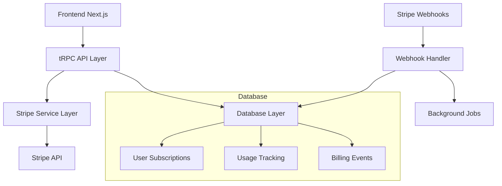

# Design Document - Migração Stripe Billing

## Overview

A migração do Clerk Billing para a API direta da Stripe envolve a implementação de um sistema completo de gerenciamento de assinaturas, incluindo checkout, webhooks, controle de acesso baseado em planos e portal do cliente. O design prioriza segurança, escalabilidade e experiência do usuário.

## Architecture

### High-Level Architecture



### Data Flow

1. **Checkout Flow**: Frontend → tRPC → Stripe Service → Stripe Checkout
2. **Webhook Flow**: Stripe → Webhook Handler → Database Update → Background Jobs
3. **Usage Validation**: User Action → Usage Service → Subscription Check → Allow/Deny

## Components and Interfaces

### 1. Database Schema Extensions

```typescript
// Novos modelos Prisma
model Subscription {
  id                String            @id @default(uuid())
  userId            String            @unique
  stripeCustomerId  String            @unique
  stripeSubscriptionId String?        @unique
  status            SubscriptionStatus
  planId            String
  currentPeriodStart DateTime?
  currentPeriodEnd   DateTime?
  cancelAtPeriodEnd  Boolean          @default(false)
  createdAt         DateTime          @default(now())
  updatedAt         DateTime          @updatedAt

  plan              Plan              @relation(fields: [planId], references: [id])
  usageRecords      UsageRecord[]
  billingEvents     BillingEvent[]
}

model Plan {
  id              String    @id @default(uuid())
  name            String
  stripePriceId   String    @unique
  stripeProductId String
  price           Int       // em centavos
  currency        String    @default("usd")
  interval        String    // month, year
  features        Json      // limites e recursos
  active          Boolean   @default(true)
  createdAt       DateTime  @default(now())

  subscriptions   Subscription[]
}

model UsageRecord {
  id             String       @id @default(uuid())
  subscriptionId String
  resourceType   String       // "api_calls", "storage", etc
  amount         Int
  timestamp      DateTime     @default(now())
  metadata       Json?

  subscription   Subscription @relation(fields: [subscriptionId], references: [id])
}

model BillingEvent {
  id             String       @id @default(uuid())
  subscriptionId String
  eventType      String       // "payment_succeeded", "subscription_canceled", etc
  stripeEventId  String       @unique
  data           Json
  processedAt    DateTime     @default(now())

  subscription   Subscription @relation(fields: [subscriptionId], references: [id])
}

enum SubscriptionStatus {
  ACTIVE
  CANCELED
  PAST_DUE
  UNPAID
  INCOMPLETE
  TRIALING
}
```

### 2. Stripe Service Layer

```typescript
interface StripeService {
  // Checkout
  createCheckoutSession(userId: string, priceId: string): Promise<string>;

  // Customer Management
  createCustomer(userId: string, email: string): Promise<string>;
  getCustomer(customerId: string): Promise<Stripe.Customer>;

  // Subscription Management
  getSubscription(subscriptionId: string): Promise<Stripe.Subscription>;
  cancelSubscription(subscriptionId: string): Promise<void>;
  updateSubscription(subscriptionId: string, priceId: string): Promise<void>;

  // Portal
  createPortalSession(customerId: string): Promise<string>;

  // Webhooks
  constructEvent(payload: string, signature: string): Stripe.Event;
}
```

### 3. Subscription Service Layer

```typescript
interface SubscriptionService {
  // User Subscription Management
  getUserSubscription(userId: string): Promise<Subscription | null>;
  createSubscription(data: CreateSubscriptionData): Promise<Subscription>;
  updateSubscriptionStatus(subscriptionId: string, status: SubscriptionStatus): Promise<void>;

  // Usage Tracking
  recordUsage(userId: string, resourceType: string, amount: number): Promise<void>;
  checkUsageLimit(userId: string, resourceType: string): Promise<boolean>;
  resetUsage(subscriptionId: string): Promise<void>;

  // Plan Management
  getAvailablePlans(): Promise<Plan[]>;
  getPlanLimits(planId: string): Promise<PlanLimits>;
}
```

### 4. Frontend Components

```typescript
// Componentes principais
interface PricingPageProps {
  plans: Plan[];
  currentSubscription?: Subscription;
}

interface SubscriptionManagerProps {
  subscription: Subscription;
  onUpgrade: (planId: string) => void;
  onCancel: () => void;
}

interface UsageDisplayProps {
  usage: UsageRecord[];
  limits: PlanLimits;
}
```

## Data Models

### Subscription Model

- Armazena informações da assinatura do usuário
- Vincula com customer e subscription IDs da Stripe
- Controla status e períodos de cobrança

### Plan Model

- Define planos disponíveis
- Mapeia para produtos/preços da Stripe
- Armazena limites e recursos em JSON

### Usage Tracking

- Registra uso de recursos por usuário
- Permite análise de padrões de uso
- Base para aplicação de limites

## Error Handling

### Webhook Error Handling

```typescript
class WebhookHandler {
  async handleEvent(event: Stripe.Event) {
    try {
      await this.processEvent(event);
    } catch (error) {
      // Log error
      await this.logBillingEvent(event.id, 'error', error);

      // Retry logic for critical events
      if (this.isCriticalEvent(event.type)) {
        await this.scheduleRetry(event);
      }
    }
  }
}
```

### Payment Failure Handling

- Notificação automática ao usuário
- Período de graça configurável
- Downgrade automático após período limite

### API Error Handling

- Rate limiting para APIs da Stripe
- Fallback para operações críticas
- Logging detalhado para debugging

## Testing Strategy

### Unit Tests

- Testes para todos os services
- Mock da API da Stripe
- Validação de regras de negócio

### Integration Tests

- Testes de webhook handling
- Fluxo completo de checkout
- Sincronização de dados

### E2E Tests

- Fluxo de assinatura completo
- Cancelamento e reativação
- Portal do cliente

### Webhook Testing

```typescript
describe('Webhook Handler', () => {
  it('should handle subscription created event', async () => {
    const event = createMockStripeEvent('customer.subscription.created');
    await webhookHandler.handle(event);

    const subscription = await db.subscription.findFirst({
      where: { stripeSubscriptionId: event.data.object.id },
    });

    expect(subscription).toBeDefined();
    expect(subscription.status).toBe('ACTIVE');
  });
});
```

## Security Considerations

### Webhook Security

- Verificação de assinatura Stripe
- Rate limiting para endpoints de webhook
- Validação de origem das requisições

### Data Protection

- Criptografia de dados sensíveis
- Não armazenamento de dados de cartão
- Logs seguros sem informações sensíveis

### Access Control

- Middleware de verificação de assinatura
- Rate limiting baseado em plano
- Validação de permissões por recurso

## Migration Strategy

### Phase 1: Infrastructure Setup

- Configuração da Stripe
- Criação de modelos de dados
- Setup de webhooks

### Phase 2: Core Implementation

- Implementação dos services
- Criação de APIs tRPC
- Desenvolvimento de componentes

### Phase 3: Migration Script

- Mapeamento de users Clerk → Stripe

### Phase 4: Frontend Updates

- Substituição do PricingTable do Clerk
- Implementação do portal de assinatura
- Testes de integração
