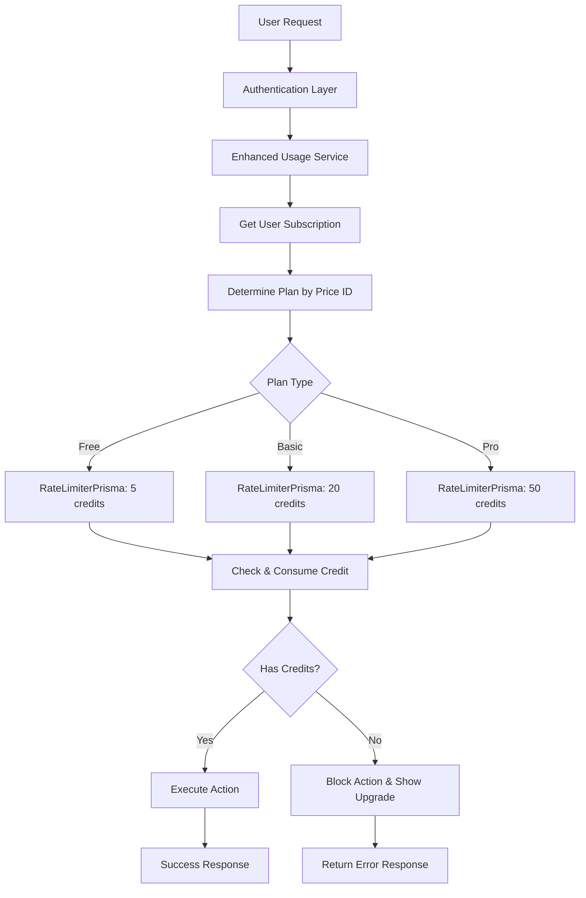
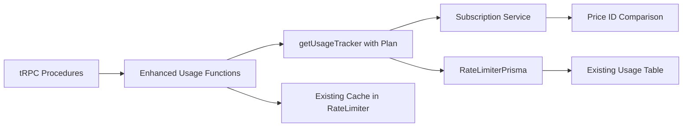

# Design Document

## Overview

O sistema de controle de créditos será implementado estendendo a infraestrutura existente de `rate-limiter-flexible` já presente no projeto. A implementação atual em `src/lib/usage.ts` já gerencia créditos para usuários gratuitos (5 créditos por 30 dias).

Vamos estender este sistema para suportar planos Basic (20 créditos) e Pro (50 créditos) baseados no `priceId` da assinatura, reutilizando o `RateLimiterPrisma` existente e a tabela `Usage` do banco. O sistema determinará o plano através da comparação do `priceId` da assinatura com as variáveis de ambiente `STRIPE_PRICE_ID_BASIC` e `STRIPE_PRICE_ID_PRO` já configuradas.

## Architecture

### High-Level Architecture



### Extended Usage Service Architecture



## Components and Interfaces

### 1. Enhanced Usage Service (Extension of existing `src/lib/usage.ts`)

**Extended Interface:**

```typescript
// Extending existing functions
export async function getUsageTrackerForPlan(userId: string): Promise<RateLimiterPrisma>;
export async function consumeCreditsWithPlan(): Promise<RateLimiterRes>;
export async function getUsageStatusWithPlan(): Promise<RateLimiterRes | null>;

// New functions for plan detection
export async function getUserPlan(userId: string): Promise<UserPlan>;
export async function getPlanLimits(userId: string): Promise<PlanLimits>;

interface UserPlan {
  type: 'free' | 'basic' | 'pro';
  creditsLimit: number;
  priceId?: string;
}

interface PlanLimits {
  points: number;
  duration: number; // 30 days in seconds
}

enum PlanType {
  FREE = 'free',
  BASIC = 'basic',
  PRO = 'pro',
}

const PLAN_CONFIGS = {
  [PlanType.FREE]: { points: 5, duration: 30 * 24 * 60 * 60 },
  [PlanType.BASIC]: { points: 20, duration: 30 * 24 * 60 * 60 },
  [PlanType.PRO]: { points: 50, duration: 30 * 24 * 60 * 60 },
} as const;
```

**Responsibilities:**

- Estender funções existentes para suportar diferentes planos
- Reutilizar `RateLimiterPrisma` com configurações dinâmicas baseadas no plano
- Integrar com serviço de assinatura existente
- Manter compatibilidade com código existente

### 2. Plan Detection (New utility functions)

**Interface:**

```typescript
// New utility functions to add to usage.ts
async function detectPlanType(userId: string): Promise<PlanType>;
function getPlanConfigByPriceId(priceId: string | null): PlanLimits;

interface PriceIdMapping {
  [key: string]: PlanType;
}

const PRICE_ID_TO_PLAN: PriceIdMapping = {
  [process.env.STRIPE_PRICE_ID_BASIC!]: PlanType.BASIC,
  [process.env.STRIPE_PRICE_ID_PRO!]: PlanType.PRO,
};
```

**Responsibilities:**

- Usar serviço de assinatura existente (`getSubscriptionByClerkId`)
- Comparar `priceId` com variáveis de ambiente já configuradas
- Retornar configuração apropriada para `RateLimiterPrisma`
- Aplicar fallback para plano gratuito

### 3. Integration with Existing tRPC Procedures

**Enhanced Usage Router:**

```typescript
// Extending existing src/modules/usage/server/procedures.ts
export const usagesRouter = createTRPCRouter({
  // Existing procedure enhanced
  status: protectedProcedure.query(async () => {
    try {
      const result = await getUsageStatusWithPlan(); // Enhanced function
      return result;
    } catch (err) {
      console.error('Get usage status failed', err);
      return null;
    }
  }),

  // New procedure for plan info
  planInfo: protectedProcedure.query(async ({ ctx }) => {
    const userPlan = await getUserPlan(ctx.auth.userId!);
    return userPlan;
  }),
});
```

**Responsibilities:**

- Manter compatibilidade com procedures existentes
- Adicionar novos endpoints para informações de plano
- Reutilizar estrutura tRPC existente
- Integrar com middleware de autenticação existente

## Data Models

### Reuse Existing Models

**Existing Subscription Model (Prisma):**

```typescript
// Already exists in prisma/schema.prisma
model Subscription {
  id                    String   @id @default(cuid())
  clerkUserId           String   @unique
  stripeCustomerId      String   @unique
  stripeSubscriptionId  String   @unique
  status                String   // active, canceled, past_due, etc.
  priceId               String   // This is what we'll use for plan detection
  cancelAtPeriodEnd     Boolean  @default(false)
  createdAt             DateTime @default(now())
  updatedAt             DateTime @updatedAt
}
```

**Existing Usage Model (Prisma):**

```typescript
// Already exists in prisma/schema.prisma
model Usage {
  key    String    @id
  points Int
  expire DateTime?
}
```

### Plan Configuration for RateLimiterPrisma

```typescript
// Configuration for different plans to use with existing RateLimiterPrisma
interface RateLimiterConfig {
  points: number;
  duration: number; // seconds
}

const PLAN_RATE_LIMITS: Record<PlanType, RateLimiterConfig> = {
  [PlanType.FREE]: {
    points: 5,
    duration: 30 * 24 * 60 * 60, // 30 days
  },
  [PlanType.BASIC]: {
    points: 20,
    duration: 30 * 24 * 60 * 60, // 30 days
  },
  [PlanType.PRO]: {
    points: 50,
    duration: 30 * 24 * 60 * 60, // 30 days
  },
} as const;
```

### Action Types (Reuse existing pattern)

```typescript
enum ActionType {
  CREATE_PROJECT = 'create_project',
  SEND_MESSAGE = 'send_message',
}
```

## Error Handling

### Error Types (Extend existing error handling)

```typescript
// Extend existing error handling from usage.ts
interface CreditError {
  code: 'INSUFFICIENT_CREDITS' | 'PLAN_DETECTION_FAILED';
  planType: PlanType;
  creditsRemaining: number;
  resetDate: Date;
  upgradeOptions?: {
    targetPlan: PlanType;
    newCreditLimit: number;
  };
}

// Reuse RateLimiterRes error structure from rate-limiter-flexible
interface RateLimiterError {
  msBeforeNext: number;
  remainingPoints: number;
  totalHits: number;
}
```

### Error Handling Strategy

1. **Graceful Degradation**: Em caso de falha na verificação, aplicar plano gratuito como fallback
2. **Reuse Existing Patterns**: Aproveitar tratamento de erro já implementado em `usage.ts`
3. **User-Friendly Messages**: Converter erros técnicos em mensagens específicas por plano
4. **Configuration Validation**: Validar variáveis de ambiente na inicialização (já existem no .env)
5. **Leverage RateLimiter Errors**: Usar estrutura de erro nativa do `rate-limiter-flexible`

## Testing Strategy

### Unit Tests

- **Enhanced Usage Functions**: Testar novas funções que estendem `usage.ts`
- **Plan Detection**: Testar detecção de plano via price_id com diferentes cenários
- **RateLimiterPrisma Integration**: Testar configurações dinâmicas baseadas no plano
- **Error Handling**: Testar cenários de erro e fallbacks
- **Environment Configuration**: Testar uso das variáveis de ambiente existentes

### Integration Tests

- **tRPC Integration**: Testar procedures existentes com novas funcionalidades
- **Database Integration**: Testar uso da tabela `Usage` existente
- **Subscription Service Integration**: Testar integração com `getSubscriptionByClerkId`
- **Existing Rate Limiting**: Garantir compatibilidade com implementação atual

### End-to-End Tests

- **User Flows**: Testar fluxos completos para usuários Free, Basic e Pro
- **Plan Transitions**: Testar mudanças entre planos via Stripe webhooks
- **Credit Exhaustion**: Testar comportamento quando créditos acabam em cada plano
- **Backward Compatibility**: Garantir que funcionalidade existente continue funcionando

### Performance Tests

- **RateLimiterPrisma Performance**: Medir impacto das configurações dinâmicas
- **Database Load**: Testar performance com tabela `Usage` existente
- **Memory Usage**: Monitorar uso de memória sem adicionar cache extra
- **Response Times**: Garantir que verificações não impactem UX

## Security Considerations (Reuse existing patterns)

### Authentication & Authorization

- Reutilizar autenticação Clerk existente em `protectedProcedure`
- Usar `auth().userId` como chave primária (já implementado em `usage.ts`)
- Aproveitar rate limiting já implementado no `RateLimiterPrisma`

### Data Protection

- Reutilizar TTL automático do `RateLimiterPrisma` (baseado na duração do plano)
- Logs não devem conter informações de pagamento (já implementado)
- Usar sanitização existente do tRPC

### Audit Trail

- Aproveitar tabela `Usage` existente para histórico de consumo
- Usar logs existentes do sistema de assinatura
- Implementar alertas baseados nos dados já coletados

## Performance Optimizations (Leverage existing infrastructure)

### Caching Strategy

- **RateLimiterPrisma Cache**: Usar cache interno já otimizado da biblioteca
- **Subscription Cache**: Aproveitar cache de sessão do Clerk
- **Environment Variables**: Carregar price_ids uma vez na inicialização

### Database Optimizations

- **Existing Usage Table**: Reutilizar índices e otimizações já implementadas
- **Subscription Queries**: Usar queries existentes em `subscription.ts`
- **Connection Pooling**: Aproveitar pool do Prisma já configurado

### API Optimizations

- **tRPC Batching**: Usar batching nativo do tRPC já implementado
- **Async Processing**: Reutilizar padrões async existentes
- **Error Handling**: Aproveitar tratamento de erro já implementado

## Implementation Flow (Extend existing usage.ts)

### Enhanced Usage Service Logic

```typescript
// Extend existing src/lib/usage.ts
import { getSubscriptionByClerkId } from '@/lib/services/subscription';

enum PlanType {
  FREE = 'free',
  BASIC = 'basic',
  PRO = 'pro',
}

const PLAN_CONFIGS = {
  [PlanType.FREE]: { points: 5, duration: 30 * 24 * 60 * 60 },
  [PlanType.BASIC]: { points: 20, duration: 30 * 24 * 60 * 60 },
  [PlanType.PRO]: { points: 50, duration: 30 * 24 * 60 * 60 },
} as const;

async function detectPlanType(userId: string): Promise<PlanType> {
  const subscription = await getSubscriptionByClerkId(userId);

  if (!subscription || subscription.status !== 'active') {
    return PlanType.FREE;
  }

  if (subscription.priceId === process.env.STRIPE_PRICE_ID_PRO) {
    return PlanType.PRO;
  }

  if (subscription.priceId === process.env.STRIPE_PRICE_ID_BASIC) {
    return PlanType.BASIC;
  }

  return PlanType.FREE;
}

export async function getUsageTrackerForPlan(userId: string) {
  const planType = await detectPlanType(userId);
  const config = PLAN_CONFIGS[planType];

  return new RateLimiterPrisma({
    storeClient: prisma,
    tableName: 'Usage',
    points: config.points,
    duration: config.duration,
  });
}
```

### Migration Strategy

### Phase 1: Extend Existing System

- Adicionar funções de detecção de plano ao `usage.ts` existente
- Usar variáveis de ambiente já configuradas (`STRIPE_PRICE_ID_BASIC`, `STRIPE_PRICE_ID_PRO`)
- Estender procedures tRPC existentes em `usagesRouter`
- Manter compatibilidade total com código existente

### Phase 2: Enhanced Features

- Adicionar procedure `planInfo` ao `usagesRouter` existente
- Implementar feedback específico por plano no frontend
- Adicionar logs detalhados usando estrutura existente

### Phase 3: Integration Points

- Integrar com procedures de criação de projeto (quando implementadas)
- Integrar com procedures de envio de mensagem (quando implementadas)
- Usar middleware tRPC existente para interceptar ações

### Rollback Plan

- Manter funções originais (`getUsageTracker`, `consumeCredits`, `getUsageStatus`) inalteradas
- Feature flag para usar funções originais vs. enhanced
- Zero impacto no sistema existente durante rollback
