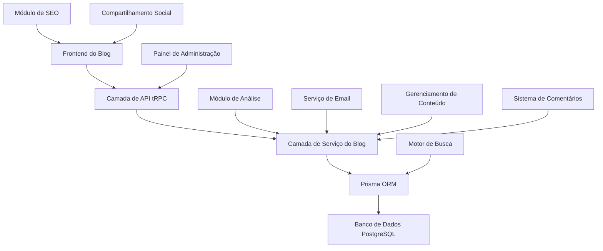
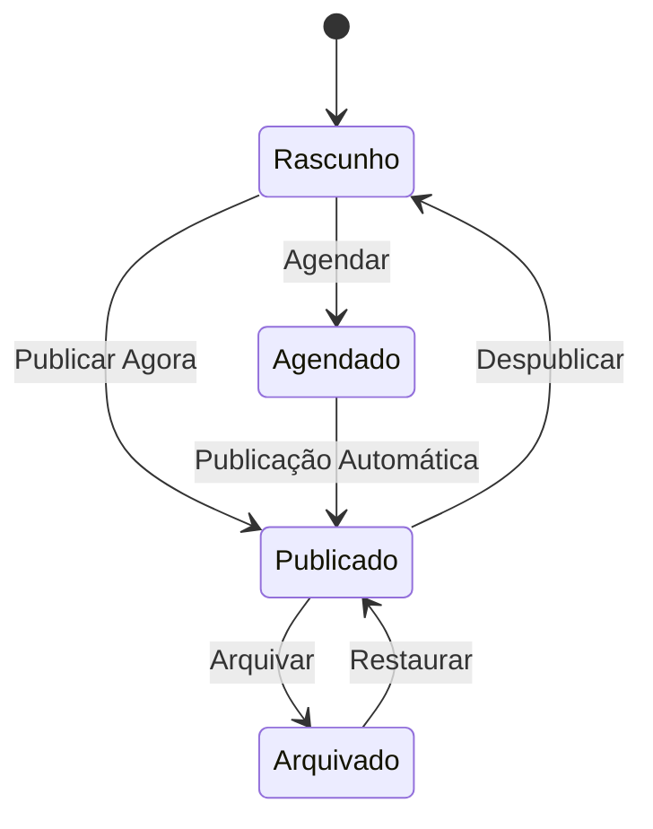

# Documento de Design

## Visão Geral

O sistema de Blog de Código de IA será construído como um módulo integrado dentro da aplicação Next.js existente, aproveitando a pilha de tecnologia atual, incluindo Next.js 15, Prisma ORM, tRPC, autenticação Clerk e Tailwind CSS. O blog servirá como uma plataforma de marketing de conteúdo focada em geradores de código de IA, apresentando um design moderno e responsivo com ricas capacidades de gerenciamento de conteúdo.

O sistema seguirá os padrões de aplicação existentes com arquitetura modular, usando a estrutura de pastas e o sistema de design estabelecidos. Ele se integrará perfeitamente com o sistema de autenticação e assinatura de usuário atual para fornecer recursos de conteúdo premium.

## Arquitetura

### Arquitetura de Alto Nível



### Integração da Pilha de Tecnologia

- **Frontend**: Next.js 15 com App Router, React 19, Tailwind CSS
- **Backend**: Procedimentos tRPC seguindo os padrões existentes
- **Banco de Dados**: PostgreSQL com Prisma ORM
- **Autenticação**: Clerk (integração existente)
- **Estilização**: Tailwind CSS com sistema de design existente
- **Editor de Texto Rico**: Integrar com a configuração existente do CodeMirror para destaque de código
- **SEO**: Recursos de SEO integrados do Next.js com dados estruturados
- **Análise**: Análise personalizada usando os padrões de rastreamento de uso existentes

## Componentes e Interfaces

### Modelos de Banco de Dados

```prisma
model BlogPost {
  id          String   @id @default(uuid())
  title       String
  slug        String   @unique
  content     String   // Conteúdo de texto rico
  excerpt     String?  // Descrição curta
  coverImage  String?  // URL da imagem de capa

  // Campos de SEO
  metaTitle       String?
  metaDescription String?
  keywords        String[]

  // Publicação
  status          PostStatus @default(DRAFT)
  publishedAt     DateTime?
  scheduledAt     DateTime?

  // Organização
  categoryId      String?
  category        BlogCategory? @relation(fields: [categoryId], references: [id])
  tags            BlogTag[]

  // Análise
  viewCount       Int @default(0)
  readingTime     Int? // Tempo de leitura estimado em minutos

  // Autoria
  authorId        String
  createdAt       DateTime @default(now())
  updatedAt       DateTime @updatedAt

  comments        BlogComment[]

  @@index([status, publishedAt])
  @@index([slug])
  @@index([categoryId])
}

model BlogCategory {
  id          String     @id @default(uuid())
  name        String     @unique
  slug        String     @unique
  description String?
  color       String?    // Cor hexadecimal para a UI
  posts       BlogPost[]
  createdAt   DateTime   @default(now())
}

model BlogTag {
  id    String     @id @default(uuid())
  name  String     @unique
  slug  String     @unique
  posts BlogPost[]
}

model BlogComment {
  id        String   @id @default(uuid())
  content   String
  author    String   // Nome ou email
  email     String
  website   String?

  status    CommentStatus @default(PENDING)

  postId    String
  post      BlogPost @relation(fields: [postId], references: [id], onDelete: Cascade)

  parentId  String?
  parent    BlogComment? @relation("CommentReplies", fields: [parentId], references: [id])
  replies   BlogComment[] @relation("CommentReplies")

  createdAt DateTime @default(now())
  updatedAt DateTime @updatedAt

  @@index([postId, status])
}

model BlogSubscriber {
  id            String   @id @default(uuid())
  email         String   @unique
  name          String?
  subscriptions String[] // Array de tipos de assinatura
  isActive      Boolean  @default(true)
  confirmedAt   DateTime?
  createdAt     DateTime @default(now())
  updatedAt     DateTime @updatedAt
}

enum PostStatus {
  DRAFT
  PUBLISHED
  SCHEDULED
  ARCHIVED
}

enum CommentStatus {
  PENDING
  APPROVED
  REJECTED
  SPAM
}
```

### Interfaces de API (Procedimentos tRPC)

```typescript
// Roteador do Blog
export const blogRouter = router({
  // Procedimentos públicos
  getPosts: publicProcedure
    .input(
      z.object({
        page: z.number().default(1),
        limit: z.number().default(10),
        category: z.string().optional(),
        tag: z.string().optional(),
        search: z.string().optional(),
      }),
    )
    .query(async ({ input }) => {
      /* Implementação */
    }),

  getPost: publicProcedure.input(z.object({ slug: z.string() })).query(async ({ input }) => {
    /* Implementação */
  }),

  getCategories: publicProcedure.query(async () => {
    /* Implementação */
  }),

  // Procedimentos de administração (protegidos)
  createPost: protectedProcedure.input(createPostSchema).mutation(async ({ input, ctx }) => {
    /* Implementação */
  }),

  updatePost: protectedProcedure.input(updatePostSchema).mutation(async ({ input, ctx }) => {
    /* Implementação */
  }),

  deletePost: protectedProcedure
    .input(z.object({ id: z.string() }))
    .mutation(async ({ input, ctx }) => {
      /* Implementação */
    }),

  // Comentários
  addComment: publicProcedure.input(addCommentSchema).mutation(async ({ input }) => {
    /* Implementação */
  }),

  moderateComment: protectedProcedure
    .input(moderateCommentSchema)
    .mutation(async ({ input, ctx }) => {
      /* Implementação */
    }),

  // Análise
  incrementViewCount: publicProcedure
    .input(z.object({ postId: z.string() }))
    .mutation(async ({ input }) => {
      /* Implementação */
    }),

  getAnalytics: protectedProcedure.query(async ({ ctx }) => {
    /* Implementação */
  }),
});
```

### Componentes de Frontend

```typescript
// Estrutura de componentes seguindo os padrões existentes
src/modules/blog/
├── ui/
│   ├── components/
│   │   ├── blog-post-card.tsx
│   │   ├── blog-post-content.tsx
│   │   ├── blog-category-filter.tsx
│   │   ├── blog-search.tsx
│   │   ├── blog-comments.tsx
│   │   ├── blog-newsletter-signup.tsx
│   │   ├── blog-social-share.tsx
│   │   └── admin/
│   │       ├── post-editor.tsx
│   │       ├── post-list.tsx
│   │       ├── category-manager.tsx
│   │       └── analytics-dashboard.tsx
│   └── views/
│       ├── blog-home-view.tsx
│       ├── blog-post-view.tsx
│       ├── blog-category-view.tsx
│       └── admin/
│           └── blog-admin-view.tsx
└── server/
    └── procedures.ts
```

## Modelos de Dados

### Estrutura de Conteúdo

**Modelo BlogPost**

- Suporta conteúdo de texto rico com trechos de código embutidos
- Campos de otimização de SEO (título meta, descrição, palavras-chave)
- Fluxo de trabalho de publicação (rascunho → publicado/agendado)
- Sistema de categorização e etiquetagem
- Rastreamento de análise (visualizações, tempo de leitura)

**Sistema de Categorias**

- Organização hierárquica de conteúdo
- Codificado por cores para distinção visual
- URLs amigáveis para SEO

**Sistema de Etiquetagem**

- Rotulagem de conteúdo flexível
- Relação muitos-para-muitos com postagens
- Sugestão automática com base em tags existentes

**Sistema de Comentários**

- Comentários aninhados (respostas)
- Fluxo de trabalho de moderação
- Medidas anti-spam
- Notificações por email

### Fluxo de Trabalho de Gerenciamento de Conteúdo



## Tratamento de Erros

### Validação de Conteúdo

- Sanitização de conteúdo de texto rico
- Validação e otimização de upload de imagem
- Validação de campos de SEO (limites de caracteres, verificações de formato)
- Validação de exclusividade de slug

### Erros de Publicação

- Lidar com falhas de publicação agendada
- Mecanismos de reversão para publicações com falha
- Notificações por email para erros de publicação

### Moderação de Comentários

- Detecção e filtragem de spam
- Limitação de taxa para envio de comentários
- Tratamento gracioso de estouro da fila de moderação

### SEO e Desempenho

- Tratamento de erros de geração automática de sitemap
- Fallbacks para falha na otimização de imagem
- Recuperação de erros de indexação de pesquisa

## Estratégia de Testes

### Testes Unitários

- Funções da camada de serviço do blog
- Utilitários de validação de conteúdo
- Funções auxiliares de SEO
- Lógica de moderação de comentários

### Testes de Integração

- Teste de procedimentos tRPC
- Operações de banco de dados
- Integração de serviço de email
- Funcionalidade de pesquisa

### Testes de Ponta a Ponta

- Fluxo de trabalho completo de criação de postagem de blog
- Experiência de navegação pública no blog
- Envio e moderação de comentários
- Fluxo de assinatura de newsletter

### Testes de Desempenho

- Tempos de carregamento de página para postagens de blog
- Desempenho de consulta de pesquisa
- Otimização de carregamento de imagem
- Otimização de consulta de banco de dados

### Testes de SEO

- Geração de meta tags
- Validação de dados estruturados
- Geração de sitemap
- Teste de visualização em mídias sociais

### Testes de Conteúdo

- Funcionalidade do editor de texto rico
- Destaque de sintaxe de código
- Design responsivo em todos os dispositivos
- Conformidade de acessibilidade (WCAG 2.1)

## Fases de Implementação

### Fase 1: Infraestrutura Principal do Blog

- Modelos de banco de dados e migrações
- Procedimentos tRPC básicos
- Operações CRUD simples de postagem de blog

### Fase 2: Gerenciamento de Conteúdo

- Integração do editor de texto rico
- Gerenciamento de categorias e tags
- Fluxo de trabalho de publicação

### Fase 3: Interface Pública do Blog

- Página inicial do blog e páginas de postagem
- Pesquisa e filtragem
- Implementação de design responsivo

### Fase 4: Recursos Avançados

- Sistema de comentários
- Assinatura de newsletter
- Compartilhamento social
- Otimização de SEO

### Fase 5: Análise e Administração

- Painel de análise
- Rastreamento de desempenho de conteúdo
- Recursos avançados de administração