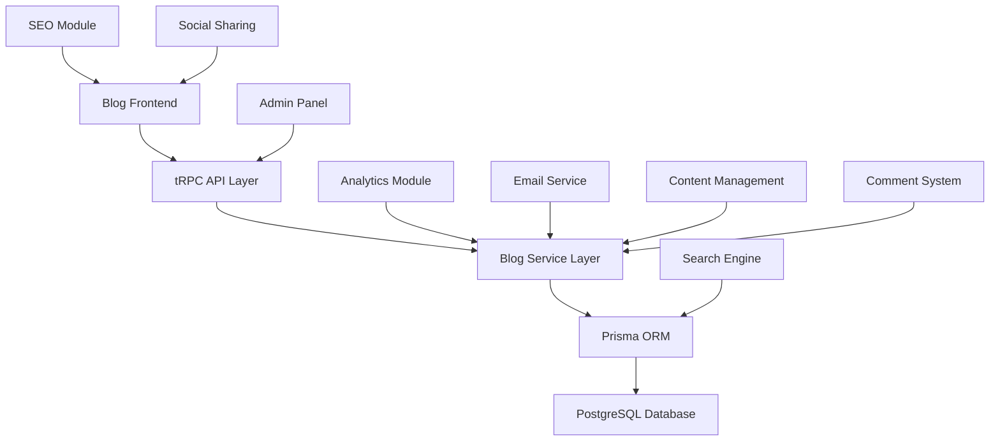
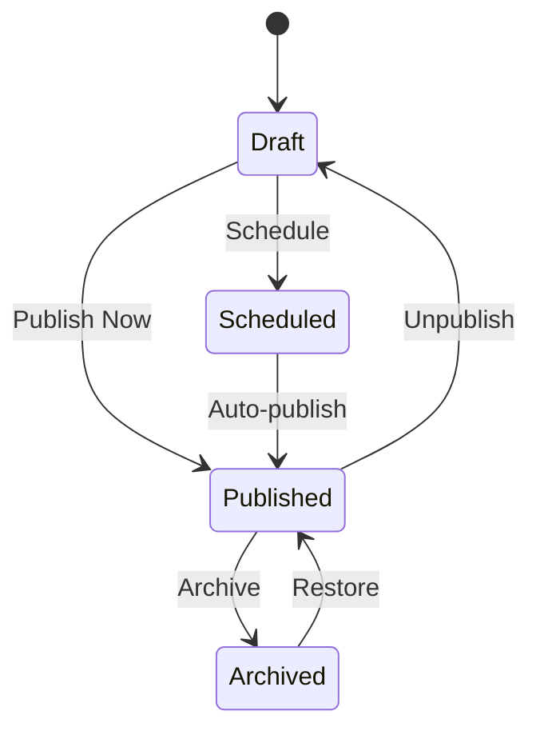

# Design Document

## Overview

The AI Code Blog system will be built as an integrated module within the existing Next.js application, leveraging the current tech stack including Next.js 15, Prisma ORM, tRPC, Clerk authentication, and Tailwind CSS. The blog will serve as a content marketing platform focused on AI code generators, featuring a modern, responsive design with rich content management capabilities.

The system will follow the existing application patterns with modular architecture, using the established folder structure and design system. It will integrate seamlessly with the current user authentication and subscription system to provide premium content features.

## Architecture

### High-Level Architecture



### Technology Stack Integration

- **Frontend**: Next.js 15 with App Router, React 19, Tailwind CSS
- **Backend**: tRPC procedures following existing patterns
- **Database**: PostgreSQL with Prisma ORM
- **Authentication**: Clerk (existing integration)
- **Styling**: Tailwind CSS with existing design system
- **Rich Text Editor**: Integrate with existing CodeMirror setup for code highlighting
- **SEO**: Next.js built-in SEO features with structured data
- **Analytics**: Custom analytics using existing usage tracking patterns

## Components and Interfaces

### Database Models

```prisma
model BlogPost {
  id          String   @id @default(uuid())
  title       String
  slug        String   @unique
  content     String   // Rich text content
  excerpt     String?  // Short description
  coverImage  String?  // Cover image URL

  // SEO fields
  metaTitle       String?
  metaDescription String?
  keywords        String[]

  // Publishing
  status          PostStatus @default(DRAFT)
  publishedAt     DateTime?
  scheduledAt     DateTime?

  // Organization
  categoryId      String?
  category        BlogCategory? @relation(fields: [categoryId], references: [id])
  tags            BlogTag[]

  // Analytics
  viewCount       Int @default(0)
  readingTime     Int? // Estimated reading time in minutes

  // Authoring
  authorId        String
  createdAt       DateTime @default(now())
  updatedAt       DateTime @updatedAt

  comments        BlogComment[]

  @@index([status, publishedAt])
  @@index([slug])
  @@index([categoryId])
}

model BlogCategory {
  id          String     @id @default(uuid())
  name        String     @unique
  slug        String     @unique
  description String?
  color       String?    // Hex color for UI
  posts       BlogPost[]
  createdAt   DateTime   @default(now())
}

model BlogTag {
  id    String     @id @default(uuid())
  name  String     @unique
  slug  String     @unique
  posts BlogPost[]
}

model BlogComment {
  id        String   @id @default(uuid())
  content   String
  author    String   // Name or email
  email     String
  website   String?

  status    CommentStatus @default(PENDING)

  postId    String
  post      BlogPost @relation(fields: [postId], references: [id], onDelete: Cascade)

  parentId  String?
  parent    BlogComment? @relation("CommentReplies", fields: [parentId], references: [id])
  replies   BlogComment[] @relation("CommentReplies")

  createdAt DateTime @default(now())
  updatedAt DateTime @updatedAt

  @@index([postId, status])
}

model BlogSubscriber {
  id            String   @id @default(uuid())
  email         String   @unique
  name          String?
  subscriptions String[] // Array of subscription types
  isActive      Boolean  @default(true)
  confirmedAt   DateTime?
  createdAt     DateTime @default(now())
  updatedAt     DateTime @updatedAt
}

enum PostStatus {
  DRAFT
  PUBLISHED
  SCHEDULED
  ARCHIVED
}

enum CommentStatus {
  PENDING
  APPROVED
  REJECTED
  SPAM
}
```

### API Interfaces (tRPC Procedures)

```typescript
// Blog Router
export const blogRouter = router({
  // Public procedures
  getPosts: publicProcedure
    .input(
      z.object({
        page: z.number().default(1),
        limit: z.number().default(10),
        category: z.string().optional(),
        tag: z.string().optional(),
        search: z.string().optional(),
      }),
    )
    .query(async ({ input }) => {
      /* Implementation */
    }),

  getPost: publicProcedure.input(z.object({ slug: z.string() })).query(async ({ input }) => {
    /* Implementation */
  }),

  getCategories: publicProcedure.query(async () => {
    /* Implementation */
  }),

  // Admin procedures (protected)
  createPost: protectedProcedure.input(createPostSchema).mutation(async ({ input, ctx }) => {
    /* Implementation */
  }),

  updatePost: protectedProcedure.input(updatePostSchema).mutation(async ({ input, ctx }) => {
    /* Implementation */
  }),

  deletePost: protectedProcedure
    .input(z.object({ id: z.string() }))
    .mutation(async ({ input, ctx }) => {
      /* Implementation */
    }),

  // Comments
  addComment: publicProcedure.input(addCommentSchema).mutation(async ({ input }) => {
    /* Implementation */
  }),

  moderateComment: protectedProcedure
    .input(moderateCommentSchema)
    .mutation(async ({ input, ctx }) => {
      /* Implementation */
    }),

  // Analytics
  incrementViewCount: publicProcedure
    .input(z.object({ postId: z.string() }))
    .mutation(async ({ input }) => {
      /* Implementation */
    }),

  getAnalytics: protectedProcedure.query(async ({ ctx }) => {
    /* Implementation */
  }),
});
```

### Frontend Components

```typescript
// Component structure following existing patterns
src/modules/blog/
├── ui/
│   ├── components/
│   │   ├── blog-post-card.tsx
│   │   ├── blog-post-content.tsx
│   │   ├── blog-category-filter.tsx
│   │   ├── blog-search.tsx
│   │   ├── blog-comments.tsx
│   │   ├── blog-newsletter-signup.tsx
│   │   ├── blog-social-share.tsx
│   │   └── admin/
│   │       ├── post-editor.tsx
│   │       ├── post-list.tsx
│   │       ├── category-manager.tsx
│   │       └── analytics-dashboard.tsx
│   └── views/
│       ├── blog-home-view.tsx
│       ├── blog-post-view.tsx
│       ├── blog-category-view.tsx
│       └── admin/
│           └── blog-admin-view.tsx
└── server/
    └── procedures.ts
```

## Data Models

### Content Structure

**BlogPost Model**

- Supports rich text content with embedded code snippets
- SEO optimization fields (meta title, description, keywords)
- Publishing workflow (draft → published/scheduled)
- Categorization and tagging system
- Analytics tracking (views, reading time)

**Category System**

- Hierarchical organization of content
- Color-coded for visual distinction
- SEO-friendly URLs

**Tagging System**

- Flexible content labeling
- Many-to-many relationship with posts
- Auto-suggestion based on existing tags

**Comment System**

- Nested comments (replies)
- Moderation workflow
- Anti-spam measures
- Email notifications

### Content Management Workflow



## Error Handling

### Content Validation

- Rich text content sanitization
- Image upload validation and optimization
- SEO field validation (character limits, format checks)
- Slug uniqueness validation

### Publishing Errors

- Handle scheduled publishing failures
- Rollback mechanisms for failed publications
- Email notifications for publishing errors

### Comment Moderation

- Spam detection and filtering
- Rate limiting for comment submissions
- Graceful handling of moderation queue overflow

### SEO and Performance

- Automatic sitemap generation error handling
- Image optimization failure fallbacks
- Search indexing error recovery

## Testing Strategy

### Unit Testing

- Blog service layer functions
- Content validation utilities
- SEO helper functions
- Comment moderation logic

### Integration Testing

- tRPC procedure testing
- Database operations
- Email service integration
- Search functionality

### End-to-End Testing

- Complete blog post creation workflow
- Public blog browsing experience
- Comment submission and moderation
- Newsletter subscription flow

### Performance Testing

- Page load times for blog posts
- Search query performance
- Image loading optimization
- Database query optimization

### SEO Testing

- Meta tag generation
- Structured data validation
- Sitemap generation
- Social media preview testing

### Content Testing

- Rich text editor functionality
- Code syntax highlighting
- Responsive design across devices
- Accessibility compliance (WCAG 2.1)

## Implementation Phases

### Phase 1: Core Blog Infrastructure

- Database models and migrations
- Basic tRPC procedures
- Simple blog post CRUD operations

### Phase 2: Content Management

- Rich text editor integration
- Category and tag management
- Publishing workflow

### Phase 3: Public Blog Interface

- Blog homepage and post pages
- Search and filtering
- Responsive design implementation

### Phase 4: Advanced Features

- Comment system
- Newsletter subscription
- Social sharing
- SEO optimization

### Phase 5: Analytics and Admin

- Analytics dashboard
- Content performance tracking
- Advanced admin features
