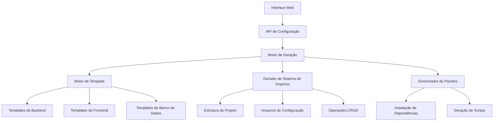

# Documento de Design

## Visão Geral

O Gerador de Projetos Bun.js é um gerador de aplicações full-stack abrangente que cria projetos de backend prontos para produção com interfaces CRUD de frontend integradas. Semelhante ao Spring Initializr, ele fornece uma interface baseada na web para configurar e gerar aplicações completas com recursos personalizáveis, integrações de banco de dados e geração de código automatizada.

O sistema consiste em três componentes principais:

1.  **Interface de Configuração**: Formulário baseado na web para personalização do projeto
2.  **Motor de Geração de Código**: Serviço de backend que gera arquivos e estruturas de projeto
3.  **Sistema de Templates**: Templates modulares para diferentes configurações de projeto

## Arquitetura

### Arquitetura de Alto Nível



### Componentes do Sistema

#### 1. Interface de Configuração Web

-   Construída com Next.js e React
-   Configuração baseada em formulário com validação em tempo real
-   Capacidades de visualização para a estrutura do projeto gerado
-   Integração com componentes de UI existentes (shadcn/ui)

#### 2. Motor de Geração

-   Serviço de backend Bun.js com API tRPC
-   Processamento de templates e geração de arquivos
-   Resolução e validação de dependências
-   Empacotamento e download do projeto

#### 3. Sistema de Templates

-   Arquitetura de template modular
-   Suporte para múltiplos frameworks e bancos de dados
-   Padrões de geração de código personalizáveis
-   Gerenciamento de versão para templates

## Componentes e Interfaces

### Componentes da Interface de Configuração

#### Formulário de Configuração do Projeto

```typescript
interface ProjectConfiguration {
  metadata: {
    name: string;
    description: string;
    version: string;
    author: string;
  };
  backend: {
    framework: 'bun' | 'express' | 'fastify';
    database: 'postgresql' | 'mysql' | 'sqlite' | 'mongodb';
    orm: 'prisma' | 'drizzle' | 'typeorm';
    authentication: 'jwt' | 'oauth2' | 'session' | 'none';
  };
  frontend: {
    enabled: boolean;
    framework: 'nextjs' | 'react' | 'vue' | 'none';
    styling: 'tailwind' | 'styled-components' | 'css-modules';
    components: 'shadcn' | 'mui' | 'chakra' | 'none';
  };
  features: {
    crud: boolean;
    fileUpload: boolean;
    realtime: boolean;
    caching: boolean;
    rateLimit: boolean;
    logging: boolean;
    monitoring: boolean;
    testing: boolean;
    docker: boolean;
  };
  models: ModelDefinition[];
}

interface ModelDefinition {
  name: string;
  fields: FieldDefinition[];
  relations: RelationDefinition[];
}

interface FieldDefinition {
  name: string;
  type: 'string' | 'number' | 'boolean' | 'date' | 'json';
  required: boolean;
  unique: boolean;
  defaultValue?: any;
  validation?: ValidationRule[];
}
```

#### Visualização da Geração

-   Visualização da árvore de arquivos
-   Visualização de código com destaque de sintaxe
-   Lista de dependências com informações de versão
-   Visualização da documentação da API gerada

### Interfaces da API de Backend

#### Serviço de Geração

```typescript
interface GenerationService {
  generateProject(config: ProjectConfiguration): Promise<GenerationResult>;
  validateConfiguration(config: ProjectConfiguration): Promise<ValidationResult>;
  getTemplateVersions(): Promise<TemplateVersion[]>;
  downloadProject(projectId: string): Promise<Buffer>;
}

interface GenerationResult {
  projectId: string;
  files: GeneratedFile[];
  dependencies: Dependency[];
  scripts: Script[];
  documentation: Documentation;
}
```

#### Motor de Template

```typescript
interface TemplateEngine {
  processTemplate(template: Template, context: TemplateContext): Promise<string>;
  resolveTemplates(config: ProjectConfiguration): Promise<Template[]>;
  validateTemplate(template: Template): Promise<boolean>;
}

interface Template {
  id: string;
  name: string;
  version: string;
  type: 'file' | 'directory' | 'partial';
  content: string;
  dependencies: string[];
  conditions: TemplateCondition[];
}
```

## Modelos de Dados

### Modelos de Geração de Projeto

#### Estrutura do Projeto Gerado

```
generated-project/
├── backend/
│   ├── src/
│   │   ├── controllers/
│   │   ├── models/
│   │   ├── services/
│   │   ├── middleware/
│   │   ├── routes/
│   │   └── utils/
│   ├── tests/
│   ├── prisma/
│   ├── package.json
│   ├── tsconfig.json
│   ├── .env.example
│   └── README.md
├── frontend/ (se habilitado)
│   ├── src/
│   │   ├── components/
│   │   ├── pages/
│   │   ├── hooks/
│   │   ├── services/
│   │   └── types/
│   ├── public/
│   ├── package.json
│   └── next.config.js
├── docker-compose.yml (se Docker habilitado)
└── README.md
```

#### Geração de Esquema de Banco de Dados

-   Geração de esquema Prisma com base nas definições do modelo
-   Arquivos de migração para configuração do banco de dados
-   Geração de dados de semente para teste
-   Configuração de conexão com variáveis de ambiente

#### Geração de Operação CRUD

-   Endpoints de API RESTful para cada modelo
-   Validação de requisição/resposta com Zod
-   Tratamento de erros e códigos de status
-   Paginação, filtragem e ordenação
-   Tipos TypeScript para contratos de API

## Tratamento de Erros

### Erros de Validação

-   Validação de configuração com mensagens de erro detalhadas
-   Verificação de compatibilidade de template
-   Resolução de conflitos de dependência
-   Validação de relacionamento de modelo

### Erros de Geração

-   Recuperação de erro de processamento de template
-   Tratamento de erro de operação do sistema de arquivos
-   Tratamento de falha de instalação de pacote
-   Mecanismos de reversão para gerações com falha

### Tratamento de Erros em Tempo de Execução

```typescript
class GenerationError extends Error {
  constructor(
    message: string,
    public code: string,
    public details?: any,
  ) {
    super(message);
  }
}

enum ErrorCodes {
  INVALID_CONFIGURATION = 'INVALID_CONFIGURATION',
  TEMPLATE_NOT_FOUND = 'TEMPLATE_NOT_FOUND',
  DEPENDENCY_CONFLICT = 'DEPENDENCY_CONFLICT',
  FILE_GENERATION_FAILED = 'FILE_GENERATION_FAILED',
  PACKAGE_INSTALLATION_FAILED = 'PACKAGE_INSTALLATION_FAILED',
}
```

## Estratégia de Teste

### Teste Unitário

-   Teste do motor de template com várias configurações
-   Teste de validação de configuração
-   Teste de geração de arquivos com sistemas de arquivos mock
-   Teste de endpoint de API com diferentes cenários

### Teste de Integração

-   Teste de geração de projeto de ponta a ponta
-   Teste de compilação e execução de projeto gerado
-   Teste de integração de banco de dados com diferentes provedores
-   Teste de integração frontend-backend

### Teste de Código Gerado

-   Geração automática de testes para operações CRUD
-   Teste de endpoint de API com suítes de teste geradas
-   Teste de modelo de banco de dados com dados de amostra
-   Teste de componente de frontend com componentes gerados

### Estrutura de Teste

```typescript
// Exemplo de teste gerado
describe('UserController', () => {
  it('should create a new user', async () => {
    const userData = { name: 'Test User', email: 'test@example.com' };
    const response = await request(app).post('/api/users').send(userData).expect(201);

    expect(response.body).toMatchObject(userData);
  });

  it('should get all users with pagination', async () => {
    const response = await request(app).get('/api/users?page=1&limit=10').expect(200);

    expect(response.body).toHaveProperty('data');
    expect(response.body).toHaveProperty('pagination');
  });
});
```

## Considerações de Implementação

### Otimização de Desempenho

-   Cache de template para geração mais rápida
-   Geração de arquivos paralela sempre que possível
-   Streaming para downloads de projetos grandes
-   Processamento em segundo plano para gerações complexas

### Considerações de Segurança

-   Sanitização de entrada para todos os campos de configuração
-   Prevenção de injeção de template
-   Proteção contra travessia de caminho de arquivo
-   Limitação de taxa para solicitações de geração

### Escalabilidade

-   Suporte à escalabilidade horizontal para trabalhadores de geração
-   Versionamento e cache de template
-   Pool de conexões de banco de dados
-   Integração de CDN para distribuição de template

### Extensibilidade

-   Sistema de plugins para templates personalizados
-   Sistema de hooks para etapas de geração personalizadas
-   API para integrações de terceiros
-   Suporte a marketplace de templates