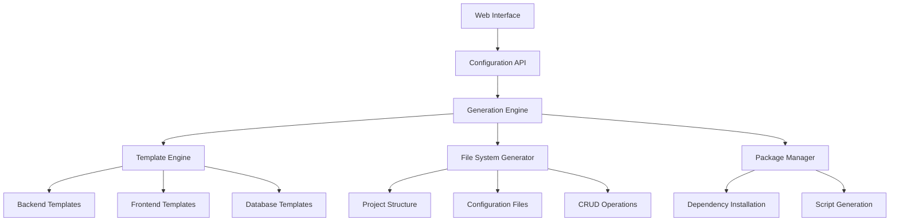

# Design Document

## Overview

The Bun.js Project Generator is a comprehensive full-stack application generator that creates production-ready backend projects with integrated frontend CRUD interfaces. Similar to Spring Initializr, it provides a web-based interface for configuring and generating complete applications with customizable features, database integrations, and automated code generation.

The system consists of three main components:

1. **Configuration Interface**: Web-based form for project customization
2. **Code Generation Engine**: Backend service that generates project files and structures
3. **Template System**: Modular templates for different project configurations

## Architecture

### High-Level Architecture



### System Components

#### 1. Web Configuration Interface

- Built with Next.js and React
- Form-based configuration with real-time validation
- Preview capabilities for generated project structure
- Integration with existing UI components (shadcn/ui)

#### 2. Generation Engine

- Bun.js backend service with tRPC API
- Template processing and file generation
- Dependency resolution and validation
- Project packaging and download

#### 3. Template System

- Modular template architecture
- Support for multiple frameworks and databases
- Customizable code generation patterns
- Version management for templates

## Components and Interfaces

### Configuration Interface Components

#### ProjectConfigurationForm

```typescript
interface ProjectConfiguration {
  metadata: {
    name: string;
    description: string;
    version: string;
    author: string;
  };
  backend: {
    framework: 'bun' | 'express' | 'fastify';
    database: 'postgresql' | 'mysql' | 'sqlite' | 'mongodb';
    orm: 'prisma' | 'drizzle' | 'typeorm';
    authentication: 'jwt' | 'oauth2' | 'session' | 'none';
  };
  frontend: {
    enabled: boolean;
    framework: 'nextjs' | 'react' | 'vue' | 'none';
    styling: 'tailwind' | 'styled-components' | 'css-modules';
    components: 'shadcn' | 'mui' | 'chakra' | 'none';
  };
  features: {
    crud: boolean;
    fileUpload: boolean;
    realtime: boolean;
    caching: boolean;
    rateLimit: boolean;
    logging: boolean;
    monitoring: boolean;
    testing: boolean;
    docker: boolean;
  };
  models: ModelDefinition[];
}

interface ModelDefinition {
  name: string;
  fields: FieldDefinition[];
  relations: RelationDefinition[];
}

interface FieldDefinition {
  name: string;
  type: 'string' | 'number' | 'boolean' | 'date' | 'json';
  required: boolean;
  unique: boolean;
  defaultValue?: any;
  validation?: ValidationRule[];
}
```

#### GenerationPreview

- File tree visualization
- Code preview with syntax highlighting
- Dependency list with version information
- Generated API documentation preview

### Backend API Interfaces

#### Generation Service

```typescript
interface GenerationService {
  generateProject(config: ProjectConfiguration): Promise<GenerationResult>;
  validateConfiguration(config: ProjectConfiguration): Promise<ValidationResult>;
  getTemplateVersions(): Promise<TemplateVersion[]>;
  downloadProject(projectId: string): Promise<Buffer>;
}

interface GenerationResult {
  projectId: string;
  files: GeneratedFile[];
  dependencies: Dependency[];
  scripts: Script[];
  documentation: Documentation;
}
```

#### Template Engine

```typescript
interface TemplateEngine {
  processTemplate(template: Template, context: TemplateContext): Promise<string>;
  resolveTemplates(config: ProjectConfiguration): Promise<Template[]>;
  validateTemplate(template: Template): Promise<boolean>;
}

interface Template {
  id: string;
  name: string;
  version: string;
  type: 'file' | 'directory' | 'partial';
  content: string;
  dependencies: string[];
  conditions: TemplateCondition[];
}
```

## Data Models

### Project Generation Models

#### Generated Project Structure

```
generated-project/
├── backend/
│   ├── src/
│   │   ├── controllers/
│   │   ├── models/
│   │   ├── services/
│   │   ├── middleware/
│   │   ├── routes/
│   │   └── utils/
│   ├── tests/
│   ├── prisma/
│   ├── package.json
│   ├── tsconfig.json
│   ├── .env.example
│   └── README.md
├── frontend/ (if enabled)
│   ├── src/
│   │   ├── components/
│   │   ├── pages/
│   │   ├── hooks/
│   │   ├── services/
│   │   └── types/
│   ├── public/
│   ├── package.json
│   └── next.config.js
├── docker-compose.yml (if Docker enabled)
└── README.md
```

#### Database Schema Generation

- Prisma schema generation based on model definitions
- Migration files for database setup
- Seed data generation for testing
- Connection configuration with environment variables

#### CRUD Operation Generation

- RESTful API endpoints for each model
- Request/response validation with Zod
- Error handling and status codes
- Pagination, filtering, and sorting
- TypeScript types for API contracts

## Error Handling

### Validation Errors

- Configuration validation with detailed error messages
- Template compatibility checking
- Dependency conflict resolution
- Model relationship validation

### Generation Errors

- Template processing error recovery
- File system operation error handling
- Package installation failure handling
- Rollback mechanisms for failed generations

### Runtime Error Handling

```typescript
class GenerationError extends Error {
  constructor(
    message: string,
    public code: string,
    public details?: any,
  ) {
    super(message);
  }
}

enum ErrorCodes {
  INVALID_CONFIGURATION = 'INVALID_CONFIGURATION',
  TEMPLATE_NOT_FOUND = 'TEMPLATE_NOT_FOUND',
  DEPENDENCY_CONFLICT = 'DEPENDENCY_CONFLICT',
  FILE_GENERATION_FAILED = 'FILE_GENERATION_FAILED',
  PACKAGE_INSTALLATION_FAILED = 'PACKAGE_INSTALLATION_FAILED',
}
```

## Testing Strategy

### Unit Testing

- Template engine testing with various configurations
- Configuration validation testing
- File generation testing with mock file systems
- API endpoint testing with different scenarios

### Integration Testing

- End-to-end project generation testing
- Generated project compilation and execution testing
- Database integration testing with different providers
- Frontend-backend integration testing

### Generated Code Testing

- Automatic test generation for CRUD operations
- API endpoint testing with generated test suites
- Database model testing with sample data
- Frontend component testing with generated components

### Test Structure

```typescript
// Generated test example
describe('UserController', () => {
  it('should create a new user', async () => {
    const userData = { name: 'Test User', email: 'test@example.com' };
    const response = await request(app).post('/api/users').send(userData).expect(201);

    expect(response.body).toMatchObject(userData);
  });

  it('should get all users with pagination', async () => {
    const response = await request(app).get('/api/users?page=1&limit=10').expect(200);

    expect(response.body).toHaveProperty('data');
    expect(response.body).toHaveProperty('pagination');
  });
});
```

## Implementation Considerations

### Performance Optimization

- Template caching for faster generation
- Parallel file generation where possible
- Streaming for large project downloads
- Background processing for complex generations

### Security Considerations

- Input sanitization for all configuration fields
- Template injection prevention
- File path traversal protection
- Rate limiting for generation requests

### Scalability

- Horizontal scaling support for generation workers
- Template versioning and caching
- Database connection pooling
- CDN integration for template distribution

### Extensibility

- Plugin system for custom templates
- Hook system for custom generation steps
- API for third-party integrations
- Template marketplace support
