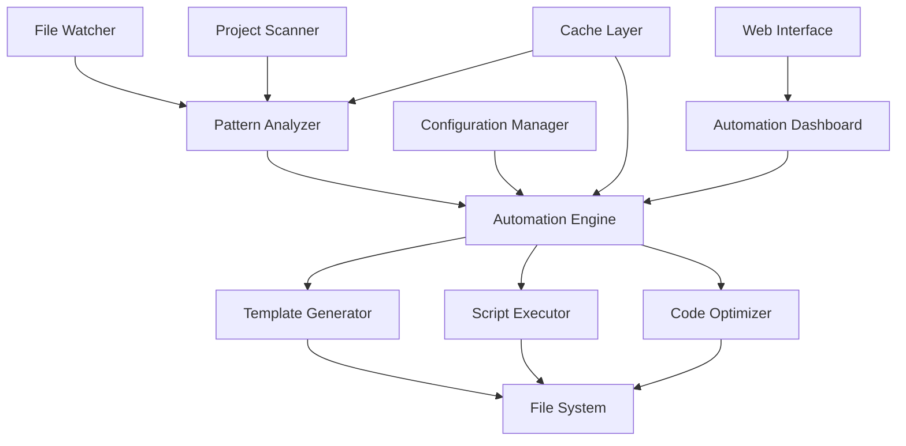

# Design Document

## Overview

O Code Automation Engine é um sistema avançado de automação de código que opera com uso mínimo de LLMs, focando em análise estática, templates inteligentes e scripts de automação. O sistema analisa padrões no código existente e aplica automações baseadas em regras pré-definidas, oferecendo funcionalidades inovadoras que não existem no Lovable/v0.

O sistema é projetado para ser executado como um serviço background que monitora mudanças no código e aplica automações em tempo real, mantendo a consistência e qualidade do código sem intervenção manual.

## Architecture

### Core Components



### System Architecture

O sistema é composto por três camadas principais:

1. **Detection Layer**: Monitora mudanças no sistema de arquivos e analisa padrões
2. **Processing Layer**: Processa padrões detectados e determina automações aplicáveis
3. **Execution Layer**: Executa automações através de templates e scripts

### Technology Stack

- **Backend**: Node.js com TypeScript
- **Database**: PostgreSQL (usando Prisma existente)
- **File System Monitoring**: Chokidar
- **Code Analysis**: TypeScript Compiler API, Babel Parser
- **Template Engine**: Handlebars com helpers customizados
- **Script Execution**: Node.js child_process com sandboxing
- **Caching**: Redis para cache de análises
- **Web Interface**: Next.js (integrado ao projeto existente)

## Components and Interfaces

### 1. Pattern Analyzer

Responsável por analisar código e detectar padrões automatizáveis.

```typescript
interface PatternAnalyzer {
  analyzeProject(projectPath: string): Promise<DetectedPattern[]>;
  analyzeFile(filePath: string): Promise<FilePattern[]>;
  detectFramework(projectPath: string): Promise<FrameworkInfo>;
  extractConventions(files: string[]): Promise<CodeConventions>;
}

interface DetectedPattern {
  type: PatternType;
  confidence: number;
  location: string;
  metadata: Record<string, any>;
  suggestedAutomations: AutomationType[];
}

enum PatternType {
  COMPONENT_STRUCTURE = 'component_structure',
  NAMING_CONVENTION = 'naming_convention',
  IMPORT_PATTERN = 'import_pattern',
  TEST_PATTERN = 'test_pattern',
  API_PATTERN = 'api_pattern',
  DATABASE_SCHEMA = 'database_schema',
}
```

### 2. Automation Engine

Motor principal que coordena a execução de automações.

```typescript
interface AutomationEngine {
  executeAutomation(automation: Automation): Promise<AutomationResult>;
  scheduleAutomation(automation: Automation, trigger: Trigger): Promise<void>;
  validateAutomation(automation: Automation): Promise<ValidationResult>;
  rollbackAutomation(automationId: string): Promise<void>;
}

interface Automation {
  id: string;
  type: AutomationType;
  pattern: DetectedPattern;
  template: Template;
  config: AutomationConfig;
  dryRun: boolean;
}

enum AutomationType {
  GENERATE_COMPONENT = 'generate_component',
  GENERATE_TEST = 'generate_test',
  OPTIMIZE_IMPORTS = 'optimize_imports',
  GENERATE_DOCS = 'generate_docs',
  CREATE_MIGRATION = 'create_migration',
  SETUP_TOOLING = 'setup_tooling',
  OPTIMIZE_PERFORMANCE = 'optimize_performance',
  SYNC_TYPES = 'sync_types',
  GENERATE_STORIES = 'generate_stories',
}
```

### 3. Template Generator

Sistema de templates inteligente que gera código baseado em padrões detectados.

```typescript
interface TemplateGenerator {
  generateFromTemplate(template: Template, context: TemplateContext): Promise<GeneratedCode>;
  createCustomTemplate(pattern: DetectedPattern): Promise<Template>;
  validateTemplate(template: Template): Promise<TemplateValidation>;
}

interface Template {
  id: string;
  name: string;
  type: AutomationType;
  framework: string[];
  content: string;
  helpers: TemplateHelper[];
  conditions: TemplateCondition[];
}

interface TemplateContext {
  projectInfo: ProjectInfo;
  fileInfo: FileInfo;
  patterns: DetectedPattern[];
  conventions: CodeConventions;
  variables: Record<string, any>;
}
```

### 4. Script Executor

Executa scripts de automação com sandboxing para segurança.

```typescript
interface ScriptExecutor {
  executeScript(script: AutomationScript): Promise<ScriptResult>;
  validateScript(script: AutomationScript): Promise<ScriptValidation>;
  createSandbox(): Promise<ScriptSandbox>;
}

interface AutomationScript {
  id: string;
  type: ScriptType;
  content: string;
  permissions: ScriptPermissions;
  timeout: number;
}

enum ScriptType {
  FILE_MANIPULATION = 'file_manipulation',
  DEPENDENCY_MANAGEMENT = 'dependency_management',
  BUILD_OPTIMIZATION = 'build_optimization',
  CODE_TRANSFORMATION = 'code_transformation',
}
```

### 5. Code Optimizer

Otimiza código automaticamente baseado em análise estática.

```typescript
interface CodeOptimizer {
  optimizeImports(filePath: string): Promise<OptimizationResult>;
  optimizePerformance(filePath: string): Promise<OptimizationResult>;
  optimizeBundle(projectPath: string): Promise<BundleOptimization>;
  detectOptimizations(code: string): Promise<OptimizationSuggestion[]>;
}

interface OptimizationResult {
  originalSize: number;
  optimizedSize: number;
  changes: CodeChange[];
  performance: PerformanceMetrics;
}
```

## Data Models

### Database Schema Extensions

```sql
-- Automations table
CREATE TABLE automations (
  id UUID PRIMARY KEY DEFAULT gen_random_uuid(),
  project_id UUID REFERENCES projects(id) ON DELETE CASCADE,
  type VARCHAR(50) NOT NULL,
  status VARCHAR(20) NOT NULL DEFAULT 'pending',
  pattern_data JSONB NOT NULL,
  template_id UUID,
  config JSONB DEFAULT '{}',
  result JSONB,
  created_at TIMESTAMP DEFAULT NOW(),
  updated_at TIMESTAMP DEFAULT NOW(),
  executed_at TIMESTAMP
);

-- Templates table
CREATE TABLE templates (
  id UUID PRIMARY KEY DEFAULT gen_random_uuid(),
  name VARCHAR(255) NOT NULL,
  type VARCHAR(50) NOT NULL,
  framework VARCHAR(50),
  content TEXT NOT NULL,
  helpers JSONB DEFAULT '[]',
  conditions JSONB DEFAULT '[]',
  is_custom BOOLEAN DEFAULT false,
  created_by UUID,
  created_at TIMESTAMP DEFAULT NOW(),
  updated_at TIMESTAMP DEFAULT NOW()
);

-- Pattern cache table
CREATE TABLE pattern_cache (
  id UUID PRIMARY KEY DEFAULT gen_random_uuid(),
  project_id UUID REFERENCES projects(id) ON DELETE CASCADE,
  file_path VARCHAR(500) NOT NULL,
  file_hash VARCHAR(64) NOT NULL,
  patterns JSONB NOT NULL,
  created_at TIMESTAMP DEFAULT NOW(),
  expires_at TIMESTAMP NOT NULL
);

-- Automation logs table
CREATE TABLE automation_logs (
  id UUID PRIMARY KEY DEFAULT gen_random_uuid(),
  automation_id UUID REFERENCES automations(id) ON DELETE CASCADE,
  level VARCHAR(10) NOT NULL,
  message TEXT NOT NULL,
  metadata JSONB DEFAULT '{}',
  created_at TIMESTAMP DEFAULT NOW()
);
```

### Prisma Schema Extensions

```prisma
model Automation {
  id          String   @id @default(uuid())
  projectId   String
  project     Project  @relation(fields: [projectId], references: [id], onDelete: Cascade)
  type        String
  status      String   @default("pending")
  patternData Json
  templateId  String?
  template    Template? @relation(fields: [templateId], references: [id])
  config      Json     @default("{}")
  result      Json?
  createdAt   DateTime @default(now())
  updatedAt   DateTime @updatedAt
  executedAt  DateTime?

  logs AutomationLog[]

  @@index([projectId])
  @@index([type])
  @@index([status])
}

model Template {
  id         String   @id @default(uuid())
  name       String
  type       String
  framework  String?
  content    String
  helpers    Json     @default("[]")
  conditions Json     @default("[]")
  isCustom   Boolean  @default(false)
  createdBy  String?
  createdAt  DateTime @default(now())
  updatedAt  DateTime @updatedAt

  automations Automation[]

  @@index([type])
  @@index([framework])
}

model PatternCache {
  id        String   @id @default(uuid())
  projectId String
  project   Project  @relation(fields: [projectId], references: [id], onDelete: Cascade)
  filePath  String
  fileHash  String
  patterns  Json
  createdAt DateTime @default(now())
  expiresAt DateTime

  @@index([projectId])
  @@index([filePath])
  @@index([expiresAt])
}

model AutomationLog {
  id           String     @id @default(uuid())
  automationId String
  automation   Automation @relation(fields: [automationId], references: [id], onDelete: Cascade)
  level        String
  message      String
  metadata     Json       @default("{}")
  createdAt    DateTime   @default(now())

  @@index([automationId])
  @@index([level])
}
```

## Error Handling

### Error Categories

1. **Pattern Detection Errors**: Falhas na análise de código
2. **Template Errors**: Problemas na geração de templates
3. **Script Execution Errors**: Falhas na execução de scripts
4. **File System Errors**: Problemas de acesso a arquivos
5. **Validation Errors**: Erros de validação de entrada

### Error Recovery Strategies

```typescript
interface ErrorHandler {
  handlePatternError(error: PatternError): Promise<ErrorRecovery>;
  handleTemplateError(error: TemplateError): Promise<ErrorRecovery>;
  handleScriptError(error: ScriptError): Promise<ErrorRecovery>;
  rollbackChanges(automationId: string): Promise<void>;
}

interface ErrorRecovery {
  strategy: RecoveryStrategy;
  fallbackAction?: () => Promise<void>;
  retryConfig?: RetryConfig;
  userNotification?: string;
}

enum RecoveryStrategy {
  RETRY = 'retry',
  FALLBACK = 'fallback',
  SKIP = 'skip',
  ROLLBACK = 'rollback',
  USER_INTERVENTION = 'user_intervention',
}
```

### Rollback System

O sistema implementa um mecanismo de rollback completo:

- **File Snapshots**: Backup automático antes de modificações
- **Change Tracking**: Registro detalhado de todas as mudanças
- **Atomic Operations**: Operações que podem ser revertidas completamente
- **Dependency Tracking**: Rastreamento de dependências entre automações

## Testing Strategy

### Unit Testing

- **Pattern Analyzer**: Testes para detecção de padrões específicos
- **Template Generator**: Validação de geração de código
- **Script Executor**: Testes de execução em sandbox
- **Code Optimizer**: Verificação de otimizações

### Integration Testing

- **End-to-End Automation**: Testes completos de automação
- **File System Integration**: Testes de monitoramento e modificação
- **Database Integration**: Testes de persistência de dados
- **API Integration**: Testes de endpoints da web interface

### Performance Testing

- **Pattern Analysis Performance**: Benchmarks de análise de código
- **Template Generation Speed**: Medição de velocidade de geração
- **Memory Usage**: Monitoramento de uso de memória
- **Concurrent Operations**: Testes de operações simultâneas

### Security Testing

- **Script Sandboxing**: Validação de isolamento de scripts
- **File Access Control**: Testes de permissões de arquivo
- **Input Validation**: Validação de entrada maliciosa
- **Template Injection**: Testes de injeção em templates

### Test Data Management

```typescript
interface TestDataManager {
  createTestProject(config: TestProjectConfig): Promise<string>;
  generateTestCode(pattern: PatternType): Promise<string>;
  cleanupTestData(): Promise<void>;
  mockFileSystem(structure: FileStructure): Promise<void>;
}

interface TestProjectConfig {
  framework: string;
  language: 'typescript' | 'javascript';
  structure: FileStructure;
  dependencies: string[];
  conventions: CodeConventions;
}
```

### Automated Testing Pipeline

- **Pre-commit Hooks**: Execução de testes unitários
- **CI/CD Integration**: Testes completos em pipeline
- **Performance Regression**: Detecção de regressões de performance
- **Security Scanning**: Análise automática de vulnerabilidades

O sistema de testes garante que todas as automações funcionem corretamente e não introduzam bugs ou problemas de segurança no código do usuário.
