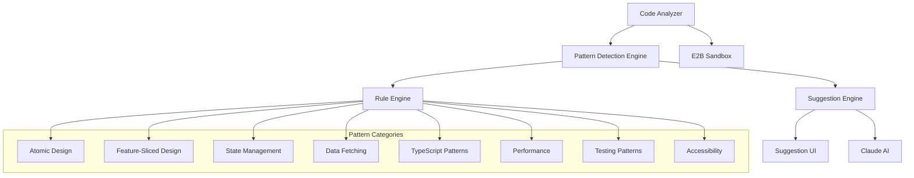

# Design Document

## Overview

The Code Patterns Suggestions system provides intelligent, contextual recommendations to help users write better code following modern development patterns and best practices. The system analyzes user code in real-time and suggests improvements based on established patterns like Atomic Design, Feature-Sliced Design, and proper usage of libraries like React Query and Zustand.

The system integrates with the existing Next.js/tRPC architecture and leverages the current AI integration (Claude) and E2B sandbox environment to analyze code and provide contextual suggestions. It extends the current message-based interaction model to include proactive pattern suggestions.

## Architecture

### High-Level Architecture



### Data Flow

1. **Code Analysis**: User writes code → System analyzes in real-time → Patterns detected
2. **Suggestion Generation**: Patterns analyzed → Rules applied → AI generates contextual suggestions
3. **Suggestion Delivery**: Suggestions formatted → Delivered via UI → User can accept/dismiss
4. **Learning**: User feedback collected → Pattern preferences updated → Suggestions improved

## Components and Interfaces

### Database Schema Extensions

```typescript
// Extend existing schema
model CodeSuggestion {
  id          String            @id @default(uuid())
  projectId   String
  project     Project           @relation(fields: [projectId], references: [id], onDelete: Cascade)
  type        SuggestionType
  category    SuggestionCategory
  title       String
  description String
  codeExample String?
  filePath    String?
  lineNumber  Int?
  severity    SuggestionSeverity @default(INFO)
  status      SuggestionStatus   @default(PENDING)
  metadata    Json?             // Additional context data
  createdAt   DateTime          @default(now())
  updatedAt   DateTime          @updatedAt
  dismissedAt DateTime?
  appliedAt   DateTime?

  @@index([projectId, status])
  @@index([type, category])
}

enum SuggestionType {
  ARCHITECTURE
  COMPONENT_STRUCTURE
  STATE_MANAGEMENT
  DATA_FETCHING
  PERFORMANCE
  ACCESSIBILITY
  TESTING
  TYPESCRIPT
}

enum SuggestionCategory {
  ATOMIC_DESIGN
  FEATURE_SLICED_DESIGN
  REACT_QUERY
  ZUSTAND
  REACT_PATTERNS
  TYPESCRIPT_PATTERNS
  PERFORMANCE_OPTIMIZATION
  ACCESSIBILITY_IMPROVEMENT
  TESTING_STRATEGY
}

enum SuggestionSeverity {
  INFO
  WARNING
  ERROR
}

enum SuggestionStatus {
  PENDING
  DISMISSED
  APPLIED
  EXPIRED
}

model PatternRule {
  id          String   @id @default(uuid())
  name        String   @unique
  category    SuggestionCategory
  type        SuggestionType
  description String
  pattern     String   // Regex or AST pattern to match
  suggestion  String   // Template for suggestion text
  codeExample String?  // Example code to show
  severity    SuggestionSeverity @default(INFO)
  enabled     Boolean  @default(true)
  priority    Int      @default(0)
  createdAt   DateTime @default(now())
  updatedAt   DateTime @updatedAt

  @@index([category, enabled])
  @@index([type, enabled])
}

model UserPreference {
  id         String             @id @default(uuid())
  userId     String
  category   SuggestionCategory
  enabled    Boolean            @default(true)
  frequency  PreferenceFrequency @default(NORMAL)
  createdAt  DateTime           @default(now())
  updatedAt  DateTime           @updatedAt

  @@unique([userId, category])
}

enum PreferenceFrequency {
  MINIMAL
  NORMAL
  AGGRESSIVE
}
```

### Service Layer

#### Code Analysis Service

```typescript
interface CodeAnalysisService {
  analyzeProject(projectId: string): Promise<AnalysisResult>;
  analyzeFile(projectId: string, filePath: string, content: string): Promise<FileAnalysis>;
  detectPatterns(code: string, language: string): Promise<DetectedPattern[]>;
  getCodeMetrics(projectId: string): Promise<CodeMetrics>;
}

interface AnalysisResult {
  projectId: string;
  files: FileAnalysis[];
  overallMetrics: CodeMetrics;
  detectedPatterns: DetectedPattern[];
  suggestions: GeneratedSuggestion[];
}

interface FileAnalysis {
  filePath: string;
  language: string;
  metrics: FileMetrics;
  patterns: DetectedPattern[];
  issues: CodeIssue[];
}

interface DetectedPattern {
  type: string;
  category: SuggestionCategory;
  location: CodeLocation;
  confidence: number;
  metadata: Record<string, any>;
}
```

#### Pattern Detection Service

```typescript
interface PatternDetectionService {
  detectAtomicDesignViolations(code: string): Promise<AtomicDesignIssue[]>;
  detectFeatureSlicedDesignIssues(projectStructure: ProjectStructure): Promise<FSDIssue[]>;
  detectStateManagementPatterns(code: string): Promise<StatePattern[]>;
  detectDataFetchingPatterns(code: string): Promise<DataFetchingPattern[]>;
  detectPerformanceIssues(code: string): Promise<PerformanceIssue[]>;
  detectAccessibilityIssues(code: string): Promise<A11yIssue[]>;
  detectTypeScriptIssues(code: string): Promise<TypeScriptIssue[]>;
  detectTestingGaps(projectStructure: ProjectStructure): Promise<TestingGap[]>;
}
```

#### Suggestion Engine Service

```typescript
interface SuggestionEngineService {
  generateSuggestions(
    analysis: AnalysisResult,
    userPreferences: UserPreference[],
  ): Promise<CodeSuggestion[]>;
  applySuggestion(suggestionId: string, projectId: string): Promise<ApplyResult>;
  dismissSuggestion(suggestionId: string): Promise<void>;
  getSuggestions(projectId: string, filters?: SuggestionFilters): Promise<CodeSuggestion[]>;
  updateSuggestionStatus(suggestionId: string, status: SuggestionStatus): Promise<void>;
}

interface ApplyResult {
  success: boolean;
  changes: FileChange[];
  errors?: string[];
}

interface FileChange {
  filePath: string;
  oldContent: string;
  newContent: string;
  changeType: 'CREATE' | 'UPDATE' | 'DELETE';
}
```

### Pattern Rule Definitions

#### Atomic Design Rules

```typescript
const atomicDesignRules: PatternRule[] = [
  {
    name: 'component-too-complex',
    category: 'ATOMIC_DESIGN',
    type: 'COMPONENT_STRUCTURE',
    pattern: 'function\\s+\\w+.*{[\\s\\S]{500,}}', // Components over 500 chars
    suggestion:
      'This component is quite large. Consider breaking it down into smaller components following Atomic Design principles.',
    codeExample: `
// Instead of one large component:
function LargeComponent() {
  // 500+ lines of code
}

// Break it down:
function OrganismComponent() {
  return (
    <div>
      <MoleculeHeader />
      <MoleculeContent />
      <MoleculeFooter />
    </div>
  )
}
    `,
    severity: 'WARNING',
  },
  {
    name: 'missing-atomic-structure',
    category: 'ATOMIC_DESIGN',
    type: 'ARCHITECTURE',
    pattern: 'components/(?!atoms|molecules|organisms|templates|pages)',
    suggestion:
      'Consider organizing components using Atomic Design structure: atoms, molecules, organisms, templates, pages.',
    severity: 'INFO',
  },
];
```

#### Feature-Sliced Design Rules

```typescript
const fsdRules: PatternRule[] = [
  {
    name: 'missing-fsd-structure',
    category: 'FEATURE_SLICED_DESIGN',
    type: 'ARCHITECTURE',
    pattern: 'src/(?!shared|entities|features|widgets|pages|app)',
    suggestion:
      'Consider organizing your code using Feature-Sliced Design: shared, entities, features, widgets, pages, app.',
    severity: 'INFO',
  },
  {
    name: 'cross-layer-import',
    category: 'FEATURE_SLICED_DESIGN',
    type: 'ARCHITECTURE',
    pattern: 'import.*from.*\\.\\./\\.\\./(?:features|widgets|pages)',
    suggestion:
      'Avoid importing from higher layers. Consider moving shared logic to the shared layer.',
    severity: 'WARNING',
  },
];
```

#### State Management Rules

```typescript
const zustandRules: PatternRule[] = [
  {
    name: 'local-state-should-be-global',
    category: 'ZUSTAND',
    type: 'STATE_MANAGEMENT',
    pattern: 'useState.*\\[.*,.*\\].*=.*useState\\(.*\\)',
    suggestion:
      'This state seems to be used across multiple components. Consider using Zustand for global state management.',
    codeExample: `
// Instead of prop drilling:
const [user, setUser] = useState(null)

// Use Zustand:
const useUserStore = create((set) => ({
  user: null,
  setUser: (user) => set({ user })
}))
    `,
    severity: 'INFO',
  },
];
```

### API Layer (tRPC Procedures)

```typescript
export const suggestionsRouter = router({
  getAll: protectedProcedure
    .input(
      z.object({
        projectId: z.string(),
        filters: z
          .object({
            category: z.nativeEnum(SuggestionCategory).optional(),
            type: z.nativeEnum(SuggestionType).optional(),
            severity: z.nativeEnum(SuggestionSeverity).optional(),
            status: z.nativeEnum(SuggestionStatus).optional(),
          })
          .optional(),
      }),
    )
    .query(({ input }) => suggestionService.getSuggestions(input.projectId, input.filters)),

  analyze: protectedProcedure
    .input(z.object({ projectId: z.string() }))
    .mutation(({ input }) => codeAnalysisService.analyzeProject(input.projectId)),

  apply: protectedProcedure
    .input(z.object({ suggestionId: z.string(), projectId: z.string() }))
    .mutation(({ input }) =>
      suggestionService.applySuggestion(input.suggestionId, input.projectId),
    ),

  dismiss: protectedProcedure
    .input(z.object({ suggestionId: z.string() }))
    .mutation(({ input }) => suggestionService.dismissSuggestion(input.suggestionId)),

  updatePreferences: protectedProcedure
    .input(
      z.object({
        preferences: z.array(
          z.object({
            category: z.nativeEnum(SuggestionCategory),
            enabled: z.boolean(),
            frequency: z.nativeEnum(PreferenceFrequency),
          }),
        ),
      }),
    )
    .mutation(({ input, ctx }) =>
      preferencesService.updatePreferences(ctx.userId, input.preferences),
    ),
});
```

### UI Components

#### Suggestions Panel Component

```typescript
interface SuggestionsPanelProps {
  projectId: string;
  isOpen: boolean;
  onClose: () => void;
}

// Features:
// - List all active suggestions
// - Filter by category/type/severity
// - Apply/dismiss suggestions
// - Show code examples
// - Real-time updates
```

#### Suggestion Card Component

```typescript
interface SuggestionCardProps {
  suggestion: CodeSuggestion;
  onApply: (id: string) => void;
  onDismiss: (id: string) => void;
  onViewCode: (id: string) => void;
}

// Features:
// - Display suggestion details
// - Show code examples
// - Apply/dismiss actions
// - Severity indicators
// - Category badges
```

#### Pattern Analyzer Component

```typescript
interface PatternAnalyzerProps {
  projectId: string;
  onAnalysisComplete: (results: AnalysisResult) => void;
}

// Features:
// - Trigger code analysis
// - Show analysis progress
// - Display analysis results
// - Pattern detection summary
```

#### Preferences Panel Component

```typescript
interface PreferencesPanelProps {
  userId: string;
  onSave: (preferences: UserPreference[]) => void;
}

// Features:
// - Configure suggestion categories
// - Set frequency preferences
// - Enable/disable specific patterns
// - Import/export preferences
```

## Data Models

### Code Analysis Models

```typescript
interface CodeMetrics {
  linesOfCode: number;
  complexity: number;
  maintainabilityIndex: number;
  technicalDebt: number;
  testCoverage?: number;
}

interface CodeLocation {
  filePath: string;
  startLine: number;
  endLine: number;
  startColumn: number;
  endColumn: number;
}

interface CodeIssue {
  type: string;
  severity: SuggestionSeverity;
  message: string;
  location: CodeLocation;
  fixable: boolean;
}
```

### Pattern Models

```typescript
interface AtomicDesignIssue {
  componentName: string;
  currentLevel: 'unknown' | 'atom' | 'molecule' | 'organism' | 'template' | 'page';
  suggestedLevel: 'atom' | 'molecule' | 'organism' | 'template' | 'page';
  reason: string;
  location: CodeLocation;
}

interface StatePattern {
  type: 'local' | 'global' | 'server';
  complexity: 'simple' | 'medium' | 'complex';
  recommendation: string;
  location: CodeLocation;
}

interface PerformanceIssue {
  type: 'unnecessary-rerender' | 'large-bundle' | 'unoptimized-image' | 'blocking-operation';
  impact: 'low' | 'medium' | 'high';
  suggestion: string;
  location: CodeLocation;
}
```

## Error Handling

### Analysis Errors

- Code parsing failures
- Sandbox connection issues
- Pattern detection timeouts
- AI service unavailability

### Suggestion Errors

- Invalid suggestion application
- File modification conflicts
- Permission issues
- Rollback failures

### User Experience Errors

- Preference save failures
- UI state inconsistencies
- Real-time update failures

### Error Response Format

```typescript
interface SuggestionError {
  code: 'ANALYSIS_FAILED' | 'SUGGESTION_APPLY_FAILED' | 'PREFERENCES_SAVE_FAILED';
  message: string;
  details?: {
    filePath?: string;
    lineNumber?: number;
    originalError?: string;
  };
  recoverable: boolean;
  retryAfter?: number;
}
```

## Testing Strategy

### Unit Tests

- Pattern detection algorithms
- Suggestion generation logic
- Rule engine functionality
- Code analysis utilities

### Integration Tests

- tRPC procedure calls
- Database operations
- AI service integration
- Sandbox interactions

### End-to-End Tests

- Complete suggestion workflow
- Pattern detection accuracy
- User preference management
- Real-time suggestion updates

### Performance Tests

- Large codebase analysis
- Real-time pattern detection
- Concurrent user suggestions
- Memory usage optimization

### Pattern Accuracy Tests

- Known pattern detection
- False positive rates
- Suggestion relevance
- User acceptance rates
