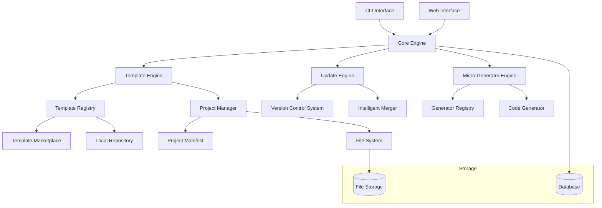

# Design Document

## Overview

The Advanced Scaffolding Platform is a next-generation project generation system that combines traditional scaffolding capabilities with dynamic template updates and micro-generators. The platform creates a closed-loop system where templates not only generate initial project structures but also maintain architectural consistency throughout the project lifecycle.

The system consists of three core components:

1. **Template Engine**: Handles project generation from templates with parameterization
2. **Update Engine**: Manages dynamic template updates with intelligent merging (inspired by Copier)
3. **Micro-Generator Engine**: Provides ongoing code generation within existing projects (inspired by Plop.js/Hygen)

## Architecture

### High-Level Architecture



### System Components

#### 1. Core Engine

- **Purpose**: Central orchestrator for all platform operations
- **Responsibilities**: Request routing, authentication, logging, error handling
- **Technology**: Node.js with TypeScript, built on existing tRPC infrastructure

#### 2. Template Engine

- **Purpose**: Handles project generation from templates
- **Key Features**:
  - Template parsing and validation
  - Parameter substitution using template literals
  - File generation with directory structure creation
  - Manifest file creation (.gen-spec.yml)
- **Template Format**: YAML-based configuration with Handlebars templating

#### 3. Update Engine

- **Purpose**: Manages dynamic updates from template changes
- **Key Features**:
  - Version comparison and change detection
  - Three-way merge algorithm (original, current, new)
  - Conflict resolution with user interaction
  - Rollback capabilities
- **Algorithm**: Git-style merge with custom conflict resolution

#### 4. Micro-Generator Engine

- **Purpose**: Provides ongoing code generation within projects
- **Key Features**:
  - Generator discovery from project manifest
  - Parameter collection through interactive prompts
  - Code generation following project conventions
  - Integration with existing project structure

## Components and Interfaces

### Template Structure

```yaml
# template.yml
name: 'Next.js SaaS Starter'
version: '1.2.0'
description: 'Full-stack SaaS application with authentication and billing'
author: 'Platform Team'

parameters:
  - name: projectName
    type: string
    prompt: 'Project name'
    required: true
  - name: database
    type: select
    prompt: 'Database type'
    options: ['postgresql', 'mysql', 'sqlite']
    default: 'postgresql'
  - name: authentication
    type: select
    prompt: 'Authentication provider'
    options: ['clerk', 'auth0', 'supabase']
    default: 'clerk'

files:
  - source: '**/*'
    destination: '.'
    ignore: ['node_modules', '.git']

generators:
  - name: 'component'
    description: 'Generate React component'
    template: 'generators/component'
    prompts:
      - name: 'componentName'
        type: 'string'
        message: 'Component name'

hooks:
  post_generate:
    - 'npm install'
    - 'npx prisma generate'
```

### Project Manifest (.gen-spec.yml)

```yaml
# .gen-spec.yml
template:
  name: 'nextjs-saas-starter'
  version: '1.2.0'
  source: 'https://templates.platform.com/nextjs-saas-starter'

generated_at: '2025-01-15T10:30:00Z'
parameters:
  projectName: 'my-saas-app'
  database: 'postgresql'
  authentication: 'clerk'

generators:
  - name: 'component'
    path: '.generators/component'
  - name: 'api-route'
    path: '.generators/api-route'
  - name: 'database-model'
    path: '.generators/database-model'

customizations:
  - file: 'src/app/layout.tsx'
    hash: 'abc123def456'
  - file: 'package.json'
    hash: 'def456ghi789'
```

### API Interfaces

#### Template Registry API

```typescript
interface TemplateRegistry {
  // Template management
  listTemplates(filters?: TemplateFilters): Promise<Template[]>;
  getTemplate(id: string): Promise<Template>;
  publishTemplate(template: Template): Promise<void>;
  updateTemplate(id: string, template: Template): Promise<void>;

  // Version management
  getTemplateVersions(id: string): Promise<TemplateVersion[]>;
  getTemplateVersion(id: string, version: string): Promise<TemplateVersion>;
}

interface Template {
  id: string;
  name: string;
  description: string;
  version: string;
  author: string;
  tags: string[];
  parameters: TemplateParameter[];
  files: FileMapping[];
  generators: GeneratorDefinition[];
  hooks: HookDefinition[];
}
```

#### Project Manager API

```typescript
interface ProjectManager {
  // Project generation
  generateProject(templateId: string, parameters: Record<string, any>): Promise<GenerationResult>;

  // Project management
  getProjectInfo(projectPath: string): Promise<ProjectInfo>;
  updateProject(projectPath: string, targetVersion: string): Promise<UpdateResult>;

  // Micro-generators
  listGenerators(projectPath: string): Promise<GeneratorInfo[]>;
  runGenerator(
    projectPath: string,
    generatorName: string,
    parameters: Record<string, any>,
  ): Promise<GenerationResult>;
}

interface GenerationResult {
  success: boolean;
  files: GeneratedFile[];
  errors: GenerationError[];
  manifest: ProjectManifest;
}
```

## Data Models

### Database Schema

```sql
-- Templates
CREATE TABLE templates (
  id UUID PRIMARY KEY DEFAULT gen_random_uuid(),
  name VARCHAR(255) NOT NULL,
  description TEXT,
  version VARCHAR(50) NOT NULL,
  author_id UUID REFERENCES users(id),
  is_public BOOLEAN DEFAULT false,
  is_official BOOLEAN DEFAULT false,
  download_count INTEGER DEFAULT 0,
  rating DECIMAL(3,2),
  created_at TIMESTAMP DEFAULT NOW(),
  updated_at TIMESTAMP DEFAULT NOW(),
  UNIQUE(name, version)
);

-- Template versions for tracking updates
CREATE TABLE template_versions (
  id UUID PRIMARY KEY DEFAULT gen_random_uuid(),
  template_id UUID REFERENCES templates(id),
  version VARCHAR(50) NOT NULL,
  changelog TEXT,
  breaking_changes BOOLEAN DEFAULT false,
  created_at TIMESTAMP DEFAULT NOW(),
  UNIQUE(template_id, version)
);

-- Generated projects tracking
CREATE TABLE generated_projects (
  id UUID PRIMARY KEY DEFAULT gen_random_uuid(),
  user_id UUID REFERENCES users(id),
  template_id UUID REFERENCES templates(id),
  template_version VARCHAR(50),
  project_name VARCHAR(255),
  project_path TEXT,
  parameters JSONB,
  created_at TIMESTAMP DEFAULT NOW(),
  last_updated TIMESTAMP DEFAULT NOW()
);

-- Update history for projects
CREATE TABLE project_updates (
  id UUID PRIMARY KEY DEFAULT gen_random_uuid(),
  project_id UUID REFERENCES generated_projects(id),
  from_version VARCHAR(50),
  to_version VARCHAR(50),
  status VARCHAR(50), -- 'pending', 'completed', 'failed', 'skipped'
  conflicts JSONB,
  applied_at TIMESTAMP DEFAULT NOW()
);
```

### File System Structure

```
templates/
├── official/
│   ├── nextjs-saas/
│   │   ├── template.yml
│   │   ├── files/
│   │   └── generators/
│   └── fastapi-microservice/
└── community/
    └── [user-id]/
        └── [template-name]/

projects/
├── [project-id]/
│   ├── .gen-spec.yml
│   ├── .generators/
│   └── [project-files]

cache/
├── templates/
└── updates/
```

## Error Handling

### Error Categories

1. **Template Errors**
   - Invalid template format
   - Missing required files
   - Parameter validation failures
   - Dependency conflicts

2. **Generation Errors**
   - File system permissions
   - Disk space limitations
   - Network connectivity issues
   - Template download failures

3. **Update Errors**
   - Merge conflicts
   - Version incompatibilities
   - Customization preservation failures
   - Rollback failures

4. **Micro-Generator Errors**
   - Generator not found
   - Parameter validation failures
   - Code generation conflicts
   - Integration failures

### Error Handling Strategy

```typescript
class PlatformError extends Error {
  constructor(
    public code: string,
    public message: string,
    public category: ErrorCategory,
    public recoverable: boolean = false,
    public context?: Record<string, any>,
  ) {
    super(message);
  }
}

interface ErrorHandler {
  handle(error: PlatformError): Promise<ErrorResolution>;
  canRecover(error: PlatformError): boolean;
  suggestFix(error: PlatformError): string[];
}
```

## Testing Strategy

### Unit Testing

- **Template Engine**: Template parsing, parameter validation, file generation
- **Update Engine**: Version comparison, merge algorithms, conflict resolution
- **Micro-Generator Engine**: Generator discovery, code generation, integration
- **API Layer**: Request handling, validation, response formatting

### Integration Testing

- **End-to-End Workflows**: Complete project generation and update cycles
- **Template Marketplace**: Template publishing, discovery, and download
- **Multi-User Scenarios**: Concurrent operations, permission handling
- **File System Operations**: Cross-platform compatibility, permission handling

### Performance Testing

- **Template Processing**: Large template handling, parallel processing
- **Update Operations**: Large project updates, merge performance
- **Concurrent Users**: Multi-user load testing, resource contention
- **Storage Operations**: Database performance, file system throughput

### Test Data Management

```typescript
interface TestScenario {
  name: string;
  templates: TestTemplate[];
  projects: TestProject[];
  expectedOutcome: TestOutcome;
}

interface TestTemplate {
  id: string;
  version: string;
  files: TestFile[];
  parameters: Record<string, any>;
}
```

## Security Considerations

### Template Security

- **Code Injection Prevention**: Sandboxed template execution
- **File System Access Control**: Restricted file operations
- **Dependency Validation**: Malicious package detection
- **Template Signing**: Cryptographic verification for official templates

### User Data Protection

- **Parameter Encryption**: Sensitive configuration data
- **Access Control**: Role-based template access
- **Audit Logging**: Template usage and modifications
- **Data Retention**: Configurable cleanup policies

### Network Security

- **Template Downloads**: HTTPS enforcement, integrity checks
- **API Security**: Rate limiting, authentication, authorization
- **Marketplace Security**: Content moderation, vulnerability scanning

## Performance Optimization

### Caching Strategy

- **Template Caching**: Local template storage with TTL
- **Generation Caching**: Reusable generation artifacts
- **Update Caching**: Incremental update calculations
- **Metadata Caching**: Template registry information

### Scalability Considerations

- **Horizontal Scaling**: Stateless service design
- **Database Optimization**: Indexing strategy, query optimization
- **File Storage**: Distributed storage for templates and projects
- **Background Processing**: Async operations for long-running tasks

### Resource Management

```typescript
interface ResourceManager {
  allocateWorker(): Promise<Worker>;
  releaseWorker(worker: Worker): void;
  monitorUsage(): ResourceMetrics;
  enforceQuotas(userId: string): Promise<boolean>;
}

interface ResourceMetrics {
  cpuUsage: number;
  memoryUsage: number;
  diskUsage: number;
  activeOperations: number;
}
```
