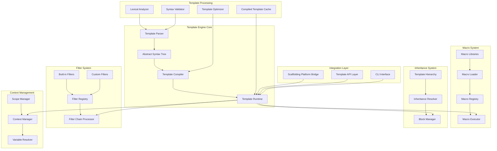

# Design Document

## Overview

O Sistema de Templating Avançado e Consciente da Lógica é a Camada 2 da plataforma de scaffolding, fornecendo um motor de templating sofisticado baseado nos conceitos do Jinja2 e Handlebars.js, mas otimizado para construção de software. O sistema permite que desenvolvedores codifiquem padrões arquiteturais inteiros em templates e macros reutilizáveis, transformando a geração de código em instanciação de soluções arquiteturais comprovadas.

O motor suporta herança de templates, macros parametrizadas, estruturas de controle avançadas, filtros customizáveis e padrões avançados como blocos call. Isso permite criar bibliotecas de padrões arquiteturais (Repository Pattern, CQRS, Hexagonal Architecture) que podem ser aplicados consistentemente em diferentes projetos.

## Architecture

### High-Level Architecture



### Core Components

#### 1. Template Parser

- **Purpose**: Analisa templates e constrói AST (Abstract Syntax Tree)
- **Responsibilities**:
  - Análise lexical e sintática
  - Validação de sintaxe Jinja2
  - Construção de AST otimizada
  - Detecção e reporte de erros

#### 2. Template Compiler

- **Purpose**: Compila AST em código executável otimizado
- **Responsibilities**:
  - Otimização de templates
  - Geração de código JavaScript/TypeScript
  - Cache de templates compilados
  - Análise de dependências

#### 3. Template Runtime

- **Purpose**: Executa templates compilados com contexto dinâmico
- **Responsibilities**:
  - Execução de templates
  - Gerenciamento de contexto
  - Resolução de variáveis
  - Controle de fluxo

#### 4. Macro System

- **Purpose**: Gerencia definição, importação e execução de macros
- **Responsibilities**:
  - Registro e descoberta de macros
  - Carregamento de bibliotecas de macros
  - Execução parametrizada
  - Validação de tipos

## Components and Interfaces

### Template Syntax Specification

```jinja2
{# Comentários #}
{# Este é um comentário que não aparece na saída #}

{# Interpolação de variáveis #}
{{ variable_name }}
{{ object.property }}
{{ array[index] }}

{# Estruturas de controle #}

    conteúdo condicional

    outro conteúdo

    conteúdo padrão



    {{ loop.index }}: {{ item.name }}


{# Herança de templates #}



    Conteúdo específico do template filho


{# Macros #}

    
        {{ field_name }}: string{{ "?" if not required }}
    
        {{ field_name }}: number{{ "?" if not required }}
    


{# Chamada de macro #}
{{ render_field("username", "string", true) }}

{# Importação de macros #}



{# Filtros #}
{{ variable_name | snake_case }}
{{ text | capitalize | trim }}
{{ items | length }}

{# Blocos call #}

    <p>Conteúdo interno</p>


{# Inclusões #}


```

### Macro Library Structure

```typescript
// repository.macros.jinja
interface RepositoryMacros {
  create_repository(entity: string, fields: Field[]): string;
  create_interface(entity: string, operations: string[]): string;
  create_implementation(entity: string, database: string): string;
}

// api.macros.jinja
interface APIMacros {
  create_endpoint(method: string, path: string, handler: string): string;
  create_controller(entity: string, operations: string[]): string;
  create_dto(entity: string, fields: Field[]): string;
}

// architecture.macros.jinja
interface ArchitectureMacros {
  create_crud_module(entity: string, config: CRUDConfig): string;
  apply_repository_pattern(entities: Entity[]): string;
  apply_cqrs_pattern(commands: Command[], queries: Query[]): string;
}
```

### Template Context Interface

```typescript
interface TemplateContext {
  // Variáveis globais
  globals: Record<string, any>;

  // Variáveis locais do escopo atual
  locals: Record<string, any>;

  // Metadados do template
  template: {
    name: string;
    path: string;
    parent?: string;
    blocks: string[];
  };

  // Informações do loop (quando dentro de for)
  loop?: {
    index: number;
    index0: number;
    first: boolean;
    last: boolean;
    length: number;
  };

  // Funções utilitárias
  utils: {
    range(start: number, end: number): number[];
    now(): Date;
    uuid(): string;
  };
}
```

### Architectural Pattern Templates

```jinja2
{# generate_crud_module.jinja #}






import { {{ entity_name }} } from './entities/{{ entity_name | snake_case }}'
import { {{ entity_name }}Repository } from './repositories/{{ entity_name | snake_case }}.repository'
import { {{ entity_name }}Service } from './services/{{ entity_name | snake_case }}.service'
import { {{ entity_name }}Controller } from './controllers/{{ entity_name | snake_case }}.controller'



{{ create_repository(entity_name, fields, database_type) }}



{{ create_service(entity_name, business_rules) }}



{{ create_controller(entity_name, endpoints) }}




{{ create_dto(entity_name + operation.name + "DTO", operation.fields) }}


```

## Data Models

### Template Metadata Schema

```typescript
interface TemplateMetadata {
  id: string;
  name: string;
  version: string;
  description: string;
  author: string;

  // Dependências
  extends?: string;
  imports: string[];
  macros: string[];

  // Parâmetros esperados
  parameters: TemplateParameter[];

  // Blocos definidos
  blocks: TemplateBlock[];

  // Arquivos gerados
  outputs: OutputFile[];

  // Padrões arquiteturais aplicados
  patterns: ArchitecturalPattern[];
}

interface TemplateParameter {
  name: string;
  type: 'string' | 'number' | 'boolean' | 'array' | 'object';
  required: boolean;
  default?: any;
  description: string;
  validation?: ValidationRule[];
}

interface TemplateBlock {
  name: string;
  description: string;
  required: boolean;
  parent?: string;
}

interface ArchitecturalPattern {
  name: string;
  type: 'repository' | 'cqrs' | 'hexagonal' | 'mvc' | 'clean';
  components: string[];
  relationships: PatternRelationship[];
}
```

### Macro Definition Schema

```typescript
interface MacroDefinition {
  name: string;
  description: string;
  parameters: MacroParameter[];
  returnType: string;
  body: string;
  examples: MacroExample[];

  // Metadados para documentação
  category: string;
  tags: string[];
  complexity: 'simple' | 'intermediate' | 'advanced';

  // Dependências
  requires: string[];
  provides: string[];
}

interface MacroParameter {
  name: string;
  type: string;
  required: boolean;
  default?: any;
  description: string;
}

interface MacroLibrary {
  name: string;
  version: string;
  description: string;
  author: string;
  macros: MacroDefinition[];
  dependencies: string[];
}
```

## Error Handling

### Error Categories

1. **Syntax Errors**
   - Invalid template syntax
   - Malformed control structures
   - Unclosed blocks or tags
   - Invalid variable references

2. **Runtime Errors**
   - Undefined variables or macros
   - Type mismatches in filters
   - Infinite recursion in macros
   - Context resolution failures

3. **Inheritance Errors**
   - Circular inheritance
   - Missing parent templates
   - Block override conflicts
   - Invalid block definitions

4. **Macro Errors**
   - Macro not found
   - Parameter validation failures
   - Import resolution failures
   - Macro execution errors

### Error Handling Strategy

```typescript
class TemplateError extends Error {
  constructor(
    public code: string,
    public message: string,
    public location: TemplateLocation,
    public context?: TemplateContext,
    public suggestions?: string[],
  ) {
    super(message);
  }
}

interface TemplateLocation {
  template: string;
  line: number;
  column: number;
  snippet: string;
}

interface ErrorHandler {
  handleSyntaxError(error: SyntaxError): TemplateError;
  handleRuntimeError(error: RuntimeError): TemplateError;
  suggestFix(error: TemplateError): string[];
  formatError(error: TemplateError): string;
}
```

## Testing Strategy

### Unit Testing

- **Parser Testing**: Syntax validation, AST generation, error detection
- **Compiler Testing**: Code generation, optimization, caching
- **Runtime Testing**: Template execution, context management, variable resolution
- **Macro Testing**: Macro definition, execution, parameter validation
- **Filter Testing**: Built-in and custom filter functionality

### Integration Testing

- **Template Inheritance**: Complex inheritance hierarchies, block resolution
- **Macro Libraries**: Cross-library dependencies, import resolution
- **Architectural Patterns**: Complete pattern generation, consistency validation
- **Performance Testing**: Large template processing, memory usage, compilation speed

### Template Testing Framework

```typescript
interface TemplateTestCase {
  name: string;
  template: string;
  context: TemplateContext;
  expected: string;
  shouldFail?: boolean;
  expectedError?: string;
}

interface MacroTestCase {
  name: string;
  macro: string;
  parameters: Record<string, any>;
  expected: string;
  context?: TemplateContext;
}

class TemplateTestRunner {
  runTest(testCase: TemplateTestCase): TestResult;
  runMacroTest(testCase: MacroTestCase): TestResult;
  runSuite(testSuite: TemplateTestSuite): TestSuiteResult;
}
```

## Performance Optimization

### Compilation Optimization

- **Template Caching**: Compiled template caching with invalidation
- **AST Optimization**: Dead code elimination, constant folding
- **Dependency Analysis**: Minimal recompilation on changes
- **Parallel Processing**: Concurrent template compilation

### Runtime Optimization

- **Context Caching**: Variable resolution caching
- **Macro Memoization**: Result caching for pure macros
- **Filter Optimization**: Optimized filter chains
- **Memory Management**: Efficient context and scope management

### Caching Strategy

```typescript
interface TemplateCache {
  // Compiled template cache
  getCompiledTemplate(templateId: string): CompiledTemplate | null;
  setCompiledTemplate(templateId: string, template: CompiledTemplate): void;

  // Macro cache
  getMacroResult(macroId: string, parameters: any[]): string | null;
  setMacroResult(macroId: string, parameters: any[], result: string): void;

  // Context cache
  getContextValue(path: string): any;
  setContextValue(path: string, value: any): void;

  // Invalidation
  invalidateTemplate(templateId: string): void;
  invalidateAll(): void;
}
```

## Security Considerations

### Template Security

- **Sandboxed Execution**: Restricted access to system resources
- **Input Validation**: Parameter and context validation
- **Code Injection Prevention**: Safe variable interpolation
- **Resource Limits**: Memory and execution time limits

### Macro Security

- **Macro Validation**: Static analysis of macro code
- **Permission System**: Controlled macro execution permissions
- **Audit Logging**: Macro execution tracking
- **Signature Verification**: Signed macro libraries

### Security Implementation

```typescript
interface SecurityPolicy {
  allowedFunctions: string[];
  allowedModules: string[];
  maxExecutionTime: number;
  maxMemoryUsage: number;
  allowFileAccess: boolean;
  allowNetworkAccess: boolean;
}

interface TemplateSecurityManager {
  validateTemplate(template: string): SecurityValidationResult;
  validateMacro(macro: MacroDefinition): SecurityValidationResult;
  enforcePolicy(policy: SecurityPolicy): void;
  auditExecution(context: ExecutionContext): void;
}
```

## Integration with Scaffolding Platform

### Bridge Interface

```typescript
interface ScaffoldingBridge {
  // Template resolution
  resolveTemplate(templateId: string): Promise<Template>;
  resolveInheritance(templateId: string): Promise<Template[]>;
  resolveMacros(templateId: string): Promise<MacroLibrary[]>;

  // Context integration
  buildContext(projectConfig: ProjectConfig): Promise<TemplateContext>;
  validateOutput(generatedCode: GeneratedFile[]): Promise<ValidationResult>;

  // Update integration
  detectChanges(oldTemplate: Template, newTemplate: Template): TemplateChanges;
  mergeChanges(changes: TemplateChanges, userCode: string): MergeResult;
}
```

### API Integration

```typescript
// tRPC endpoints for template engine
export const templateEngineRouter = router({
  // Template operations
  compileTemplate: procedure
    .input(z.object({ template: z.string(), context: z.record(z.any()) }))
    .mutation(async ({ input }) => {
      return await templateEngine.compile(input.template, input.context)
    }),

  // Macro operations
  listMacros: procedure
    .input(z.object({ library?: z.string() }))
    .query(async ({ input }) => {
      return await macroRegistry.list(input.library)
    }),

  // Pattern operations
  generatePattern: procedure
    .input(z.object({
      pattern: z.string(),
      entity: z.string(),
      config: z.record(z.any())
    }))
    .mutation(async ({ input }) => {
      return await patternGenerator.generate(input.pattern, input.entity, input.config)
    })
})
```
