# Design Document

## Overview

O Núcleo de Transformação de Código baseado em AST é a Camada 3 da plataforma de scaffolding, representando a inovação mais significativa do sistema. Esta camada vai além da geração de código para realizar modificação inteligente e segura de código existente através de operações em Abstract Syntax Trees (ASTs). Ao operar na representação estrutural do código em vez de texto bruto, o sistema pode realizar refatorações complexas, instrumentação de código e validação arquitetural com garantias de segurança que LLMs não conseguem fornecer.

O núcleo resolve o conflito fundamental entre código gerado e código manual, criando um modelo de desenvolvimento híbrido onde ambos coexistem harmoniosamente. Desenvolvedores podem gerar código inicial, customizá-lo livremente, e depois usar ferramentas de transformação para evoluir toda a codebase de forma segura e consistente.

## Architecture

### High-Level Architecture

```mermaid
graph TB
    subgraph "AST Core Engine"
        Parser[Multi-Language Parser]
        ASTBuilder[AST Builder]
        ASTValidator[AST Validator]
        ASTSerializer[AST Serializer]
    end

    subgraph "Language Support"
        TreeSitter[Tree-sitter Integration]
        JSParser[JavaScript/TypeScript Parser]
        PyParser[Python Parser]
        JavaParser[Java Parser]
        GoParser[Go Parser]
        RustParser[Rust Parser]
    end

    subgraph "Transformation Engine"
        TransformationManager[Transformation Manager]
        NodeTransformer[Node Transformer]
        RefactoringEngine[Refactoring Engine]
        AspectWeaver[Aspect Weaver]
    end

    subgraph "Analysis Engine"
        StaticAnalyzer[Static Analyzer]
        DependencyAnalyzer[Dependency Analyzer]
        ArchitectureValidator[Architecture Validator]
        MetricsCalculator[Metrics Calculator]
    end

    subgraph "Hybrid Development"
        CodeMerger[Intelligent Code Merger]
        ConflictResolver[Conflict Resolver]
        ChangeDetector[Change Detector]
        PreservationEngine[Manual Code Preservation]
    end

    subgraph "Operation Management"
        TransactionManager[Transaction Manager]
        SnapshotManager[Snapshot Manager]
        RollbackEngine[Rollback Engine]
        AuditLogger[Audit Logger]
    end

    subgraph "Integration Layer"
        TemplateIntegration[Template Engine Bridge]
        ScaffoldingBridge[Scaffolding Platform Bridge]
        APILayer[Transformation API]
        CLIInterface[CLI Interface]
    end

    subgraph "Storage & Cache"
        ASTCache[AST Cache]
        SnapshotStorage[Snapshot Storage]
        MetadataDB[Metadata Database]
        IndexStorage[Index Storage]
    end

    Parser --> ASTBuilder
    ASTBuilder --> ASTValidator
    ASTValidator --> ASTSerializer

    TreeSitter --> Parser
    JSParser --> TreeSitter
    PyParser --> TreeSitter
    JavaParser --> TreeSitter
    GoParser --> TreeSitter
    RustParser --> TreeSitter

    TransformationManager --> NodeTransformer
    TransformationManager --> RefactoringEngine
    TransformationManager --> AspectWeaver

    StaticAnalyzer --> DependencyAnalyzer
    StaticAnalyzer --> ArchitectureValidator
    StaticAnalyzer --> MetricsCalculator

    CodeMerger --> ConflictResolver
    ChangeDetector --> PreservationEngine

    TransactionManager --> SnapshotManager
    SnapshotManager --> RollbackEngine
    AuditLogger --> TransactionManager

    TemplateIntegration --> TransformationManager
    ScaffoldingBridge --> TransformationManager
    APILayer --> TransformationManager
    CLIInterface --> TransformationManager

    ASTBuilder --> ASTCache
    SnapshotManager --> SnapshotStorage
    StaticAnalyzer --> MetadataDB
    DependencyAnalyzer --> IndexStorage
```



### Core Components

#### 1. Multi-Language Parser

- **Purpose**: Parse código fonte em múltiplas linguagens para ASTs
- **Technology**: Tree-sitter com grammars específicas por linguagem
- **Responsibilities**:
  - Parsing incremental e eficiente
  - Preservação de informações de localização
  - Tratamento de erros de sintaxe
  - Construção de ASTs parciais

#### 2. Transformation Engine

- **Purpose**: Executa transformações estruturais seguras em ASTs
- **Key Features**:
  - Padrão NodeTransformer para traversal de AST
  - Operações de refatoração atômicas
  - Instrumentação não destrutiva de código
  - Validação de integridade pós-transformação

#### 3. Analysis Engine

- **Purpose**: Realiza análise estática e validação arquitetural
- **Capabilities**:
  - Análise de dependências e imports
  - Validação de regras arquiteturais
  - Cálculo de métricas de código
  - Detecção de code smells e anti-patterns

#### 4. Hybrid Development Manager

- **Purpose**: Gerencia coexistência de código gerado e manual
- **Features**:
  - Detecção inteligente de mudanças manuais
  - Merge baseado em estrutura AST
  - Preservação de customizações
  - Resolução de conflitos estruturais

## Components and Interfaces

### AST Node Structure

```typescript
interface ASTNode {
  type: string;
  start: Position;
  end: Position;
  parent?: ASTNode;
  children: ASTNode[];
  metadata: NodeMetadata;
}

interface Position {
  line: number;
  column: number;
  offset: number;
}

interface NodeMetadata {
  generated: boolean;
  lastModified: Date;
  transformationHistory: TransformationRecord[];
  preserveOnRegeneration: boolean;
  customizations: Customization[];
}

interface TransformationRecord {
  id: string;
  type: TransformationType;
  timestamp: Date;
  parameters: Record<string, any>;
  reversible: boolean;
}
```

### Transformation Operations

```typescript
interface RefactoringOperations {
  // Variable and identifier operations
  renameVariable(oldName: string, newName: string, scope?: ASTNode): Promise<TransformationResult>;
  renameFunction(oldName: string, newName: string): Promise<TransformationResult>;
  renameClass(oldName: string, newName: string): Promise<TransformationResult>;

  // Function operations
  extractMethod(selection: ASTNode[], newMethodName: string): Promise<TransformationResult>;
  inlineMethod(methodNode: ASTNode): Promise<TransformationResult>;
  changeMethodSignature(
    method: ASTNode,
    newSignature: MethodSignature,
  ): Promise<TransformationResult>;

  // Class operations
  extractClass(members: ASTNode[], newClassName: string): Promise<TransformationResult>;
  moveMethod(method: ASTNode, targetClass: ASTNode): Promise<TransformationResult>;
  addInterface(className: string, interfaceName: string): Promise<TransformationResult>;

  // Import and dependency operations
  addImport(importStatement: ImportStatement): Promise<TransformationResult>;
  removeUnusedImports(): Promise<TransformationResult>;
  organizeImports(): Promise<TransformationResult>;
  updateImportPaths(oldPath: string, newPath: string): Promise<TransformationResult>;
}

interface AspectOperations {
  // Cross-cutting concerns
  addLogging(functions: ASTNode[], logLevel: LogLevel): Promise<TransformationResult>;
  addErrorHandling(
    functions: ASTNode[],
    errorStrategy: ErrorStrategy,
  ): Promise<TransformationResult>;
  addValidation(
    methods: ASTNode[],
    validationRules: ValidationRule[],
  ): Promise<TransformationResult>;
  addCaching(methods: ASTNode[], cacheStrategy: CacheStrategy): Promise<TransformationResult>;

  // Architectural aspects
  applyRepositoryPattern(entities: ASTNode[]): Promise<TransformationResult>;
  applyCQRSPattern(commands: ASTNode[], queries: ASTNode[]): Promise<TransformationResult>;
  addDependencyInjection(classes: ASTNode[]): Promise<TransformationResult>;
}
```

### Analysis and Validation

```typescript
interface ArchitecturalRules {
  // Layer dependency rules
  validateLayerDependencies(rules: LayerRule[]): Promise<ValidationResult>;
  checkCircularDependencies(): Promise<ValidationResult>;
  validateImportRestrictions(restrictions: ImportRestriction[]): Promise<ValidationResult>;

  // Pattern compliance
  validateRepositoryPattern(repositories: ASTNode[]): Promise<ValidationResult>;
  validateCQRSPattern(commands: ASTNode[], queries: ASTNode[]): Promise<ValidationResult>;
  validateHexagonalArchitecture(ports: ASTNode[], adapters: ASTNode[]): Promise<ValidationResult>;

  // Code quality rules
  checkComplexity(maxComplexity: number): Promise<ValidationResult>;
  checkNestingDepth(maxDepth: number): Promise<ValidationResult>;
  detectCodeSmells(): Promise<CodeSmell[]>;
}

interface LayerRule {
  layer: string;
  allowedDependencies: string[];
  forbiddenDependencies: string[];
  description: string;
}

interface ValidationResult {
  valid: boolean;
  violations: Violation[];
  warnings: Warning[];
  suggestions: Suggestion[];
}

interface Violation {
  rule: string;
  location: Position;
  message: string;
  severity: 'error' | 'warning' | 'info';
  fixable: boolean;
  suggestedFix?: TransformationOperation;
}
```

### Hybrid Development Support

```typescript
interface HybridDevelopmentManager {
  // Change detection
  detectManualChanges(originalAST: ASTNode, currentAST: ASTNode): Promise<ChangeSet>;
  identifyGeneratedCode(ast: ASTNode): Promise<GeneratedCodeMap>;
  markAsManuallyModified(nodes: ASTNode[]): Promise<void>;

  // Intelligent merging
  mergeChanges(baseAST: ASTNode, generatedAST: ASTNode, manualAST: ASTNode): Promise<MergeResult>;
  resolveConflicts(conflicts: Conflict[]): Promise<ConflictResolution>;
  preserveCustomizations(customizations: Customization[]): Promise<void>;

  // Regeneration support
  safeRegeneration(template: Template, preserveNodes: ASTNode[]): Promise<RegenerationResult>;
  updateFromTemplate(templateChanges: TemplateChange[]): Promise<UpdateResult>;
}

interface ChangeSet {
  additions: ASTNode[];
  deletions: ASTNode[];
  modifications: NodeModification[];
  metadata: ChangeMetadata;
}

interface MergeResult {
  mergedAST: ASTNode;
  conflicts: Conflict[];
  preservedCustomizations: Customization[];
  appliedChanges: ChangeSet;
}

interface Conflict {
  type: ConflictType;
  location: Position;
  generatedVersion: ASTNode;
  manualVersion: ASTNode;
  suggestedResolution: ConflictResolution;
}
```

## Data Models

### AST Storage Schema

```sql
-- AST snapshots for versioning and rollback
CREATE TABLE ast_snapshots (
  id UUID PRIMARY KEY DEFAULT gen_random_uuid(),
  project_id UUID REFERENCES projects(id),
  file_path TEXT NOT NULL,
  ast_data JSONB NOT NULL,
  metadata JSONB,
  created_at TIMESTAMP DEFAULT NOW(),
  snapshot_type VARCHAR(50) -- 'manual', 'pre_transformation', 'post_transformation'
);

-- Transformation history
CREATE TABLE transformations (
  id UUID PRIMARY KEY DEFAULT gen_random_uuid(),
  project_id UUID REFERENCES projects(id),
  transformation_type VARCHAR(100) NOT NULL,
  parameters JSONB,
  affected_files TEXT[],
  before_snapshot_id UUID REFERENCES ast_snapshots(id),
  after_snapshot_id UUID REFERENCES ast_snapshots(id),
  reversible BOOLEAN DEFAULT true,
  applied_at TIMESTAMP DEFAULT NOW(),
  applied_by UUID REFERENCES users(id)
);

-- Code customizations tracking
CREATE TABLE code_customizations (
  id UUID PRIMARY KEY DEFAULT gen_random_uuid(),
  project_id UUID REFERENCES projects(id),
  file_path TEXT NOT NULL,
  node_path TEXT NOT NULL, -- JSONPath to the AST node
  customization_type VARCHAR(50), -- 'manual_addition', 'manual_modification', 'manual_deletion'
  original_content JSONB,
  customized_content JSONB,
  preserve_on_regeneration BOOLEAN DEFAULT true,
  created_at TIMESTAMP DEFAULT NOW()
);

-- Architectural validation rules
CREATE TABLE architecture_rules (
  id UUID PRIMARY KEY DEFAULT gen_random_uuid(),
  project_id UUID REFERENCES projects(id),
  rule_type VARCHAR(100) NOT NULL,
  rule_definition JSONB NOT NULL,
  enabled BOOLEAN DEFAULT true,
  severity VARCHAR(20) DEFAULT 'error', -- 'error', 'warning', 'info'
  created_at TIMESTAMP DEFAULT NOW()
);

-- Code analysis results
CREATE TABLE analysis_results (
  id UUID PRIMARY KEY DEFAULT gen_random_uuid(),
  project_id UUID REFERENCES projects(id),
  analysis_type VARCHAR(100) NOT NULL,
  file_path TEXT,
  results JSONB NOT NULL,
  violations_count INTEGER DEFAULT 0,
  warnings_count INTEGER DEFAULT 0,
  analyzed_at TIMESTAMP DEFAULT NOW()
);
```

### File System Structure

```
ast-workspace/
├── snapshots/
│   ├── [project-id]/
│   │   ├── [timestamp]/
│   │   │   ├── file1.ast.json
│   │   │   ├── file2.ast.json
│   │   │   └── metadata.json
│   │   └── current/
│   │       ├── file1.ast.json
│   │       └── file2.ast.json
├── transformations/
│   ├── [transformation-id]/
│   │   ├── before/
│   │   ├── after/
│   │   └── diff.json
├── cache/
│   ├── parsed/
│   │   ├── [file-hash].ast.json
│   └── analyzed/
│       ├── [file-hash].analysis.json
└── indexes/
    ├── dependencies.idx
    ├── symbols.idx
    └── patterns.idx
```

## Error Handling

### Error Categories

1. **Parsing Errors**
   - Syntax errors in source code
   - Unsupported language constructs
   - File encoding issues
   - Tree-sitter grammar limitations

2. **Transformation Errors**
   - Invalid transformation parameters
   - Structural integrity violations
   - Circular dependency creation
   - Type system violations

3. **Analysis Errors**
   - Incomplete dependency resolution
   - Rule validation failures
   - Performance timeout errors
   - Memory exhaustion

4. **Merge Conflicts**
   - Irreconcilable structural changes
   - Semantic conflicts
   - Type incompatibilities
   - Architectural violations

### Error Handling Strategy

```typescript
class ASTTransformationError extends Error {
  constructor(
    public code: string,
    public message: string,
    public location?: Position,
    public affectedNodes?: ASTNode[],
    public suggestedFix?: TransformationOperation,
    public recoverable: boolean = false,
  ) {
    super(message);
  }
}

interface ErrorRecoveryStrategy {
  canRecover(error: ASTTransformationError): boolean;
  recover(error: ASTTransformationError): Promise<RecoveryResult>;
  rollback(transformationId: string): Promise<RollbackResult>;
  createSafepoint(): Promise<SafepointId>;
}

interface RecoveryResult {
  success: boolean;
  recoveredAST?: ASTNode;
  partialResults?: TransformationResult[];
  remainingErrors?: ASTTransformationError[];
}
```

## Testing Strategy

### Unit Testing

- **Parser Testing**: Multi-language parsing accuracy, error handling
- **Transformation Testing**: Individual refactoring operations, edge cases
- **Analysis Testing**: Rule validation, metrics calculation, dependency analysis
- **Merge Testing**: Conflict detection and resolution, customization preservation

### Integration Testing

- **End-to-End Workflows**: Complete transformation pipelines
- **Multi-File Operations**: Cross-file refactoring, dependency updates
- **Hybrid Development**: Generated + manual code scenarios
- **Performance Testing**: Large codebase handling, memory usage

### AST Testing Framework

```typescript
interface ASTTestCase {
  name: string;
  sourceCode: string;
  language: string;
  transformation: TransformationOperation;
  expectedAST: ASTNode;
  expectedCode: string;
  shouldFail?: boolean;
  expectedError?: string;
}

interface TransformationTestSuite {
  name: string;
  setup: () => Promise<void>;
  teardown: () => Promise<void>;
  testCases: ASTTestCase[];
}

class ASTTestRunner {
  runTransformationTest(testCase: ASTTestCase): Promise<TestResult>;
  runTestSuite(suite: TransformationTestSuite): Promise<TestSuiteResult>;
  validateASTIntegrity(ast: ASTNode): Promise<ValidationResult>;
  compareASTs(expected: ASTNode, actual: ASTNode): Promise<ComparisonResult>;
}
```

## Performance Optimization

### Parsing Optimization

- **Incremental Parsing**: Only reparse changed sections
- **Parallel Processing**: Multi-threaded parsing for large codebases
- **Smart Caching**: AST caching with dependency invalidation
- **Memory Management**: Efficient AST representation and garbage collection

### Transformation Optimization

- **Batch Operations**: Group related transformations
- **Lazy Evaluation**: Defer expensive operations until needed
- **Index-Based Lookups**: Fast symbol and dependency resolution
- **Transaction Batching**: Minimize I/O operations

### Caching Strategy

```typescript
interface ASTCacheManager {
  // AST caching
  getCachedAST(filePath: string, contentHash: string): Promise<ASTNode | null>;
  setCachedAST(filePath: string, contentHash: string, ast: ASTNode): Promise<void>;

  // Analysis caching
  getCachedAnalysis(filePath: string, analysisType: string): Promise<AnalysisResult | null>;
  setCachedAnalysis(filePath: string, analysisType: string, result: AnalysisResult): Promise<void>;

  // Dependency caching
  getCachedDependencies(projectId: string): Promise<DependencyGraph | null>;
  setCachedDependencies(projectId: string, graph: DependencyGraph): Promise<void>;

  // Cache invalidation
  invalidateFile(filePath: string): Promise<void>;
  invalidateProject(projectId: string): Promise<void>;
  invalidateAll(): Promise<void>;
}
```

## Security Considerations

### Code Transformation Security

- **Sandboxed Execution**: Isolated transformation execution environment
- **Input Validation**: Strict validation of transformation parameters
- **Access Control**: Permission-based transformation operations
- **Audit Trail**: Complete logging of all transformations

### AST Integrity

- **Validation Checks**: Structural integrity validation after transformations
- **Rollback Protection**: Secure snapshot and rollback mechanisms
- **Code Injection Prevention**: Safe AST manipulation without code injection risks
- **Resource Limits**: Memory and CPU limits for transformation operations

## Integration with Previous Layers

### Template Engine Integration (Layer 2)

```typescript
interface TemplateASTBridge {
  // Template-driven transformations
  applyTemplateTransformations(
    template: Template,
    targetAST: ASTNode,
  ): Promise<TransformationResult>;
  generateWithTransformations(
    template: Template,
    context: TemplateContext,
  ): Promise<GenerationResult>;

  // Macro-to-transformation mapping
  convertMacroToTransformation(macro: MacroDefinition): Promise<TransformationOperation>;
  executeTemplateWithAST(template: Template, existingAST: ASTNode): Promise<MergeResult>;
}
```

### Scaffolding Platform Integration (Layer 1)

```typescript
interface ScaffoldingASTBridge {
  // Project generation with AST awareness
  generateProjectWithAST(
    template: Template,
    parameters: ProjectParameters,
  ): Promise<ProjectGenerationResult>;
  updateProjectWithAST(projectId: string, templateChanges: TemplateChange[]): Promise<UpdateResult>;

  // Micro-generator integration
  executeMicroGeneratorWithAST(
    generator: MicroGenerator,
    targetCode: ASTNode,
  ): Promise<GenerationResult>;
  preserveCustomizationsDuringUpdate(customizations: Customization[]): Promise<PreservationResult>;
}
```

### API Integration

```typescript
// tRPC endpoints for AST operations
export const astTransformationRouter = router({
  // Parsing operations
  parseFile: procedure
    .input(z.object({ filePath: z.string(), language: z.string() }))
    .query(async ({ input }) => {
      return await astParser.parseFile(input.filePath, input.language);
    }),

  // Transformation operations
  applyRefactoring: procedure
    .input(
      z.object({
        operation: z.string(),
        parameters: z.record(z.any()),
        files: z.array(z.string()),
      }),
    )
    .mutation(async ({ input }) => {
      return await transformationEngine.applyRefactoring(
        input.operation,
        input.parameters,
        input.files,
      );
    }),

  // Analysis operations
  analyzeArchitecture: procedure
    .input(z.object({ projectId: z.string(), rules: z.array(z.any()) }))
    .query(async ({ input }) => {
      return await analysisEngine.validateArchitecture(input.projectId, input.rules);
    }),

  // Hybrid development operations
  detectCustomizations: procedure
    .input(z.object({ projectId: z.string(), filePaths: z.array(z.string()) }))
    .query(async ({ input }) => {
      return await hybridManager.detectCustomizations(input.projectId, input.filePaths);
    }),
});
```
