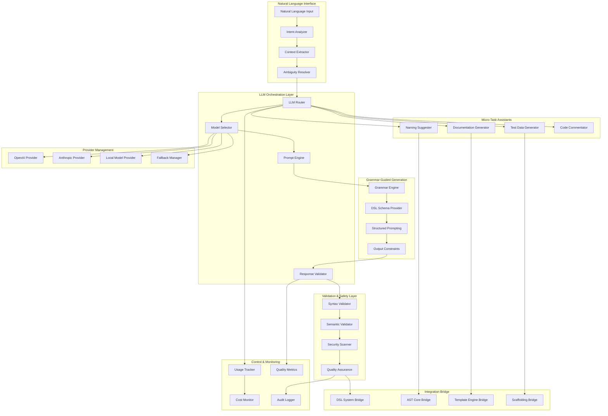

# Design Document

## Overview

A Interface de Integração Estratégica e Restrita de LLMs representa uma abordagem híbrida inovadora onde LLMs servem como interface inteligente para um motor determinístico, não como gerador principal de código. O sistema implementa o conceito de LLM como "compilador" que traduz linguagem natural ambígua para DSLs estruturadas (Natural Language → DSL), enquanto o motor determinístico realiza a transformação final (DSL → Código). Esta arquitetura maximiza os pontos fortes dos LLMs (compreensão de linguagem) enquanto mitiga suas fraquezas (geração de código imprevisível).

O design enfatiza uso mínimo e controlado de LLMs, restringindo sua saída a formatos válidos e previsíveis através de grammar prompting e validação rigorosa. LLMs são também utilizados para micro-tarefas específicas onde criatividade é vantajosa e imprevisibilidade representa baixo risco.

## Architecture

### High-Level Architecture



### Core Components

#### 1. Intent-to-DSL Translator

- **Purpose**: Traduz linguagem natural para DSLs estruturadas
- **Key Features**:
  - Grammar prompting com esquemas DSL
  - Análise de intenção contextual
  - Validação rigorosa de saída
  - Confirmação do usuário antes da execução

#### 2. Grammar-Guided Generation Engine

- **Purpose**: Garante que LLMs produzam saída estruturada e válida
- **Capabilities**:
  - Schema-aware prompting
  - Constraint-based generation
  - Format validation
  - Syntax enforcement

#### 3. Micro-Task Assistant System

- **Purpose**: Fornece assistência IA para tarefas específicas de baixo risco
- **Services**:
  - Sugestões de nomenclatura contextual
  - Geração de documentação
  - Criação de dados de teste
  - Comentários de código

#### 4. Multi-Provider LLM Management

- **Purpose**: Gerencia múltiplos provedores de LLM com fallback
- **Features**:
  - Load balancing inteligente
  - Fallback automático
  - Cost optimization
  - Performance monitoring

## Components and Interfaces

### Intent-to-DSL Translation System

```typescript
interface IntentTranslator {
  // Main translation interface
  translateToSchemaDSL(
    naturalLanguage: string,
    context?: TranslationContext,
  ): Promise<DSLTranslationResult>;
  translateToAPIDSL(
    naturalLanguage: string,
    context?: TranslationContext,
  ): Promise<DSLTranslationResult>;
  translateToWorkflowDSL(
    naturalLanguage: string,
    context?: TranslationContext,
  ): Promise<DSLTranslationResult>;

  // Context-aware translation
  translateWithExistingModel(
    naturalLanguage: string,
    existingModel: Model,
  ): Promise<DSLTranslationResult>;
  translateIncremental(naturalLanguage: string, partialDSL: string): Promise<DSLTranslationResult>;
}

interface DSLTranslationResult {
  success: boolean;
  generatedDSL: string;
  confidence: number;
  ambiguities: Ambiguity[];
  suggestions: string[];
  validationResult: ValidationResult;
  requiresConfirmation: boolean;
}

interface TranslationContext {
  projectContext: ProjectContext;
  existingModels: Model[];
  userPreferences: UserPreferences;
  domainKnowledge: DomainKnowledge;
}

// Example usage
const translator = new IntentTranslator();

const result = await translator.translateToAPIDSL(
  "Create a new endpoint to get a user by their ID. It should return the user's name and email.",
  {
    projectContext: { framework: 'fastapi', database: 'postgresql' },
    existingModels: [userModel],
    userPreferences: { authStrategy: 'jwt' },
  },
);

// Generated DSL would be:
/*
endpoints:
  user_detail:
    path: "/users/{user_id}"
    parameters:
      - name: user_id
        type: uuid
        location: path
        required: true
    get:
      summary: "Get user by ID"
      response:
        type: object
        properties:
          name: string
          email: string
      permissions:
        - authenticated
*/
```

### Grammar-Guided Prompting System

```typescript
interface GrammarEngine {
  // Schema-based prompting
  createSchemaPrompt(dslType: DSLType, schema: DSLSchema): Promise<StructuredPrompt>;
  validateAgainstSchema(output: string, schema: DSLSchema): Promise<ValidationResult>;

  // Constraint enforcement
  enforceOutputConstraints(prompt: string, constraints: OutputConstraints): Promise<string>;
  validateStructuredOutput(output: string, expectedStructure: OutputStructure): Promise<boolean>;
}

interface StructuredPrompt {
  systemPrompt: string;
  userPrompt: string;
  schema: DSLSchema;
  constraints: OutputConstraints;
  examples: PromptExample[];
}

interface OutputConstraints {
  maxLength: number;
  requiredFields: string[];
  forbiddenPatterns: string[];
  formatValidation: RegExp[];
  semanticRules: SemanticRule[];
}

// Example schema-guided prompt for API DSL
const apiPrompt = await grammarEngine.createSchemaPrompt('api', {
  type: 'object',
  properties: {
    endpoints: {
      type: 'object',
      patternProperties: {
        '^[a-z_]+$': {
          type: 'object',
          properties: {
            path: { type: 'string', pattern: '^/.*' },
            methods: {
              type: 'object',
              properties: {
                get: { $ref: '#/definitions/method' },
                post: { $ref: '#/definitions/method' },
                put: { $ref: '#/definitions/method' },
                delete: { $ref: '#/definitions/method' },
              },
            },
          },
        },
      },
    },
  },
  definitions: {
    method: {
      type: 'object',
      properties: {
        summary: { type: 'string' },
        parameters: { type: 'array', items: { $ref: '#/definitions/parameter' } },
        response: { $ref: '#/definitions/response' },
        permissions: { type: 'array', items: { type: 'string' } },
      },
    },
  },
});
```

### Micro-Task Assistant System

```typescript
interface MicroTaskAssistant {
  // Naming suggestions
  suggestVariableNames(context: ASTContext, currentName: string): Promise<NamingSuggestion[]>;
  suggestFunctionNames(functionAST: ASTNode, context: CodeContext): Promise<NamingSuggestion[]>;
  suggestClassNames(classAST: ASTNode, domain: string): Promise<NamingSuggestion[]>;

  // Documentation generation
  generateDocstring(functionAST: ASTNode, context: CodeContext): Promise<DocumentationResult>;
  generateClassDocumentation(classAST: ASTNode, context: CodeContext): Promise<DocumentationResult>;
  generateAPIDocumentation(apiSpec: APISpec): Promise<DocumentationResult>;

  // Test data generation
  generateTestData(schema: Schema, options: TestDataOptions): Promise<TestDataResult>;
  generateRealisticSampleData(model: Model, count: number): Promise<SampleDataResult>;
}

interface NamingSuggestion {
  name: string;
  confidence: number;
  reasoning: string;
  conventions: string[];
  context: string;
}

interface DocumentationResult {
  documentation: string;
  format: DocumentationFormat; // 'docstring', 'jsdoc', 'markdown'
  examples: CodeExample[];
  seeAlso: string[];
}

interface TestDataOptions {
  realistic: boolean;
  includeEdgeCases: boolean;
  respectConstraints: boolean;
  format: 'json' | 'sql' | 'csv' | 'yaml';
  count: number;
}

// Example usage
const assistant = new MicroTaskAssistant();

// Naming suggestions
const suggestions = await assistant.suggestVariableNames(
  {
    astNode: variableNode,
    scope: functionScope,
    type: 'string',
    usage: ['parameter', 'validation'],
  },
  'usr_nm',
);
// Returns: [
//   { name: 'username', confidence: 0.95, reasoning: 'Clear, descriptive name following camelCase convention' },
//   { name: 'userName', confidence: 0.90, reasoning: 'Alternative camelCase format' },
//   { name: 'userIdentifier', confidence: 0.75, reasoning: 'More verbose but explicit' }
// ]

// Documentation generation
const docResult = await assistant.generateDocstring(functionAST, {
  language: 'python',
  style: 'google',
  includeExamples: true,
});
// Returns:
/*
"""
Validates user credentials and returns authentication token.

Args:
    username (str): The user's unique identifier
    password (str): The user's password in plain text
    remember_me (bool, optional): Whether to extend token expiration. Defaults to False.

Returns:
    AuthToken: Authentication token object containing access token and expiration

Raises:
    InvalidCredentialsError: When username/password combination is invalid
    AccountLockedError: When user account is temporarily locked

Example:
    >>> token = authenticate_user("john_doe", "secure_password")
    >>> print(token.access_token)
    'eyJ0eXAiOiJKV1QiLCJhbGciOiJIUzI1NiJ9...'
"""
*/
```

### Multi-Provider LLM Management

```typescript
interface LLMProviderManager {
  // Provider management
  registerProvider(provider: LLMProvider): Promise<void>;
  selectProvider(task: LLMTask, requirements: ProviderRequirements): Promise<LLMProvider>;

  // Load balancing and fallback
  executeWithFallback(task: LLMTask, providers: LLMProvider[]): Promise<LLMResponse>;
  balanceLoad(tasks: LLMTask[]): Promise<LLMResponse[]>;

  // Cost and performance optimization
  optimizeForCost(task: LLMTask): Promise<LLMProvider>;
  optimizeForSpeed(task: LLMTask): Promise<LLMProvider>;
  optimizeForQuality(task: LLMTask): Promise<LLMProvider>;
}

interface LLMProvider {
  name: string;
  type: 'openai' | 'anthropic' | 'local' | 'custom';
  capabilities: LLMCapabilities;
  pricing: PricingModel;
  performance: PerformanceMetrics;

  // Core methods
  generateText(prompt: string, options: GenerationOptions): Promise<LLMResponse>;
  validateAvailability(): Promise<boolean>;
  estimateCost(prompt: string, options: GenerationOptions): Promise<number>;
}

interface LLMCapabilities {
  maxTokens: number;
  supportedLanguages: string[];
  specializations: string[]; // ['code', 'documentation', 'naming', 'data-generation']
  responseTime: number; // average ms
  reliability: number; // 0-1 score
}

// Example provider configuration
const providers = [
  {
    name: 'gpt-4-turbo',
    type: 'openai',
    capabilities: {
      maxTokens: 128000,
      supportedLanguages: ['en', 'pt', 'es', 'fr'],
      specializations: ['code', 'documentation', 'reasoning'],
      responseTime: 2000,
      reliability: 0.95,
    },
    pricing: { inputTokens: 0.01, outputTokens: 0.03 },
  },
  {
    name: 'claude-3-sonnet',
    type: 'anthropic',
    capabilities: {
      maxTokens: 200000,
      supportedLanguages: ['en', 'pt', 'es', 'fr'],
      specializations: ['documentation', 'analysis', 'safety'],
      responseTime: 1500,
      reliability: 0.97,
    },
    pricing: { inputTokens: 0.003, outputTokens: 0.015 },
  },
  {
    name: 'local-codellama',
    type: 'local',
    capabilities: {
      maxTokens: 16384,
      supportedLanguages: ['en'],
      specializations: ['code', 'naming'],
      responseTime: 500,
      reliability: 0.85,
    },
    pricing: { inputTokens: 0, outputTokens: 0 }, // No cost for local
  },
];
```

### Validation and Safety System

```typescript
interface ValidationSystem {
  // Syntax validation
  validateDSLSyntax(dsl: string, dslType: DSLType): Promise<SyntaxValidationResult>;
  validateCodeSyntax(code: string, language: string): Promise<SyntaxValidationResult>;

  // Semantic validation
  validateSemantics(dsl: string, context: ValidationContext): Promise<SemanticValidationResult>;
  validateConsistency(models: Model[]): Promise<ConsistencyValidationResult>;

  // Security validation
  scanForSecurityIssues(content: string, contentType: ContentType): Promise<SecurityScanResult>;
  validatePermissions(operation: Operation, user: User): Promise<PermissionValidationResult>;
}

interface ValidationResult {
  valid: boolean;
  errors: ValidationError[];
  warnings: ValidationWarning[];
  suggestions: ValidationSuggestion[];
  confidence: number;
}

interface SecurityScanResult {
  safe: boolean;
  threats: SecurityThreat[];
  recommendations: SecurityRecommendation[];
  riskLevel: 'low' | 'medium' | 'high' | 'critical';
}

interface SecurityThreat {
  type: 'injection' | 'privilege_escalation' | 'data_exposure' | 'malicious_code';
  severity: number;
  description: string;
  location: string;
  mitigation: string;
}
```

## Data Models

### Database Schema

```sql
-- LLM usage tracking
CREATE TABLE llm_interactions (
  id UUID PRIMARY KEY DEFAULT gen_random_uuid(),
  user_id UUID REFERENCES users(id),
  task_type VARCHAR(50) NOT NULL, -- 'intent_translation', 'naming', 'documentation', 'test_data'
  provider VARCHAR(50) NOT NULL,
  model VARCHAR(100) NOT NULL,
  input_tokens INTEGER,
  output_tokens INTEGER,
  cost DECIMAL(10,6),
  response_time INTEGER, -- milliseconds
  quality_score DECIMAL(3,2),
  success BOOLEAN,
  created_at TIMESTAMP DEFAULT NOW()
);

-- LLM responses cache
CREATE TABLE llm_response_cache (
  id UUID PRIMARY KEY DEFAULT gen_random_uuid(),
  input_hash VARCHAR(64) NOT NULL, -- SHA-256 of input + context
  task_type VARCHAR(50) NOT NULL,
  provider VARCHAR(50) NOT NULL,
  model VARCHAR(100) NOT NULL,
  response TEXT NOT NULL,
  metadata JSONB,
  created_at TIMESTAMP DEFAULT NOW(),
  expires_at TIMESTAMP,
  UNIQUE(input_hash, task_type, provider, model)
);

-- Translation results
CREATE TABLE translation_results (
  id UUID PRIMARY KEY DEFAULT gen_random_uuid(),
  user_id UUID REFERENCES users(id),
  natural_language_input TEXT NOT NULL,
  dsl_type VARCHAR(50) NOT NULL,
  generated_dsl TEXT NOT NULL,
  confidence DECIMAL(3,2),
  validation_passed BOOLEAN,
  user_confirmed BOOLEAN,
  feedback_score INTEGER, -- 1-5 rating from user
  created_at TIMESTAMP DEFAULT NOW()
);

-- Quality metrics
CREATE TABLE llm_quality_metrics (
  id UUID PRIMARY KEY DEFAULT gen_random_uuid(),
  provider VARCHAR(50) NOT NULL,
  model VARCHAR(100) NOT NULL,
  task_type VARCHAR(50) NOT NULL,
  success_rate DECIMAL(5,4),
  average_confidence DECIMAL(3,2),
  average_response_time INTEGER,
  user_satisfaction DECIMAL(3,2),
  measured_at TIMESTAMP DEFAULT NOW()
);

-- Provider configurations
CREATE TABLE llm_providers (
  id UUID PRIMARY KEY DEFAULT gen_random_uuid(),
  name VARCHAR(100) NOT NULL,
  type VARCHAR(50) NOT NULL,
  endpoint_url TEXT,
  api_key_encrypted TEXT,
  capabilities JSONB,
  pricing JSONB,
  enabled BOOLEAN DEFAULT true,
  created_at TIMESTAMP DEFAULT NOW(),
  updated_at TIMESTAMP DEFAULT NOW()
);
```

## Error Handling

### Error Categories

1. **LLM Provider Errors**
   - API rate limits and quotas
   - Network connectivity issues
   - Authentication failures
   - Model unavailability

2. **Translation Errors**
   - Ambiguous natural language input
   - Invalid DSL generation
   - Context resolution failures
   - Validation failures

3. **Validation Errors**
   - Syntax validation failures
   - Semantic inconsistencies
   - Security policy violations
   - Schema compliance failures

4. **Quality Assurance Errors**
   - Low confidence responses
   - Inconsistent outputs
   - Performance degradation
   - User feedback conflicts

### Error Handling Strategy

```typescript
class LLMIntegrationError extends Error {
  constructor(
    public code: string,
    public message: string,
    public provider?: string,
    public taskType?: string,
    public recoverable: boolean = true,
    public fallbackAvailable: boolean = false,
  ) {
    super(message);
  }
}

interface ErrorRecoveryManager {
  // Provider fallback
  handleProviderFailure(error: LLMIntegrationError, task: LLMTask): Promise<LLMResponse>;

  // Quality recovery
  handleLowQualityResponse(response: LLMResponse, task: LLMTask): Promise<LLMResponse>;

  // Validation recovery
  handleValidationFailure(
    validationResult: ValidationResult,
    originalInput: string,
  ): Promise<string>;

  // User interaction
  requestUserClarification(ambiguity: Ambiguity): Promise<string>;
}
```

## Testing Strategy

### Unit Testing

- **Translation Accuracy**: Natural language to DSL conversion accuracy
- **Validation Systems**: Syntax, semantic, and security validation
- **Provider Management**: Fallback, load balancing, cost optimization
- **Micro-Tasks**: Naming, documentation, test data generation quality

### Integration Testing

- **End-to-End Workflows**: Complete natural language to code generation
- **Multi-Provider Scenarios**: Fallback and load balancing behavior
- **Cross-Layer Integration**: LLM → DSL → Template → AST workflows
- **Performance Testing**: Response times, cost optimization, concurrent usage

### Quality Assurance Testing

```typescript
interface LLMQualityTest {
  name: string;
  naturalLanguageInput: string;
  expectedDSLStructure: DSLStructure;
  minimumConfidence: number;
  maxResponseTime: number;

  // Quality metrics
  validateAccuracy(result: DSLTranslationResult): boolean;
  validateConsistency(results: DSLTranslationResult[]): boolean;
  validateSafety(result: DSLTranslationResult): boolean;
}

class LLMTestSuite {
  runTranslationTests(tests: LLMQualityTest[]): Promise<TestSuiteResult>;
  runProviderComparison(providers: LLMProvider[], tasks: LLMTask[]): Promise<ComparisonResult>;
  runPerformanceBenchmark(provider: LLMProvider, workload: Workload): Promise<BenchmarkResult>;
}
```

## Security Considerations

### LLM Security

- **Input Sanitization**: Strict validation of natural language inputs
- **Output Validation**: Comprehensive validation of LLM-generated content
- **Prompt Injection Prevention**: Protection against malicious prompt manipulation
- **Data Privacy**: Secure handling of sensitive information in prompts

### Provider Security

- **API Key Management**: Secure storage and rotation of provider credentials
- **Network Security**: Encrypted communication with LLM providers
- **Access Control**: Role-based access to LLM functionalities
- **Audit Logging**: Complete tracking of all LLM interactions

## Performance Optimization

### Response Time Optimization

- **Intelligent Caching**: Multi-level caching of LLM responses
- **Provider Selection**: Optimal provider selection based on task requirements
- **Parallel Processing**: Concurrent LLM calls where appropriate
- **Streaming Responses**: Real-time response streaming for better UX

### Cost Optimization

- **Smart Caching**: Aggressive caching to minimize redundant API calls
- **Provider Arbitrage**: Cost-aware provider selection
- **Token Optimization**: Prompt engineering for minimal token usage
- **Usage Quotas**: Per-user and per-organization usage limits

### Quality Optimization

```typescript
interface QualityOptimizer {
  // Response quality improvement
  improvePromptQuality(prompt: string, feedback: UserFeedback[]): Promise<string>;
  selectOptimalProvider(
    task: LLMTask,
    qualityRequirements: QualityRequirements,
  ): Promise<LLMProvider>;

  // Continuous learning
  learnFromFeedback(feedback: UserFeedback): Promise<void>;
  adaptToUserPreferences(userId: string, interactions: LLMInteraction[]): Promise<UserProfile>;

  // Quality monitoring
  monitorResponseQuality(responses: LLMResponse[]): Promise<QualityReport>;
  detectQualityDegradation(provider: LLMProvider): Promise<DegradationReport>;
}
```

## Integration with Platform Layers

### DSL System Integration

```typescript
interface DSLIntegrationBridge {
  // Translation to DSL
  translateAndValidate(naturalLanguage: string, dslType: DSLType): Promise<DSLValidationResult>;

  // DSL enhancement
  enhanceDSLWithAI(partialDSL: string, context: EnhancementContext): Promise<EnhancedDSL>;

  // Validation assistance
  explainValidationErrors(errors: ValidationError[]): Promise<ErrorExplanation[]>;
}
```

### AST Core Integration

```typescript
interface ASTIntegrationBridge {
  // Naming assistance
  suggestNamesForASTNodes(nodes: ASTNode[], context: ASTContext): Promise<NamingSuggestion[]>;

  // Documentation generation
  generateDocumentationForAST(ast: ASTNode, context: DocumentationContext): Promise<Documentation>;

  // Code explanation
  explainCodePurpose(ast: ASTNode, context: ExplanationContext): Promise<CodeExplanation>;
}
```

### Template Engine Integration

```typescript
interface TemplateIntegrationBridge {
  // Template enhancement
  enhanceTemplateWithAI(template: Template, context: TemplateContext): Promise<EnhancedTemplate>;

  // Documentation generation
  generateTemplateDocumentation(template: Template): Promise<TemplateDocumentation>;

  // Example generation
  generateTemplateExamples(template: Template, count: number): Promise<TemplateExample[]>;
}
```
