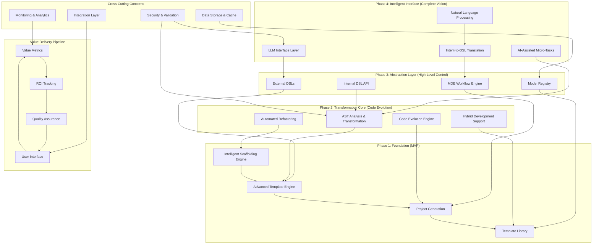
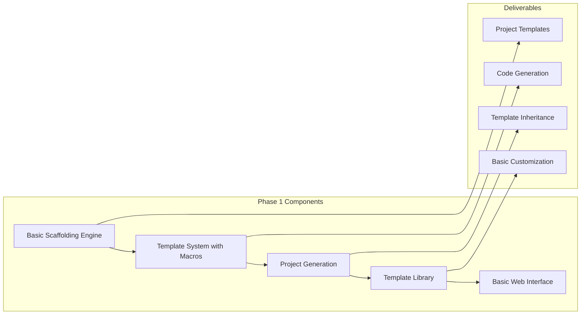
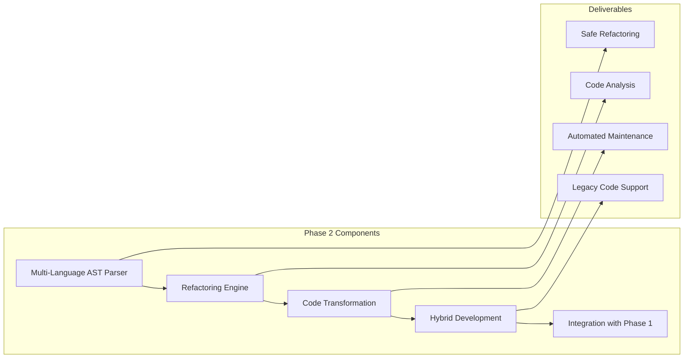
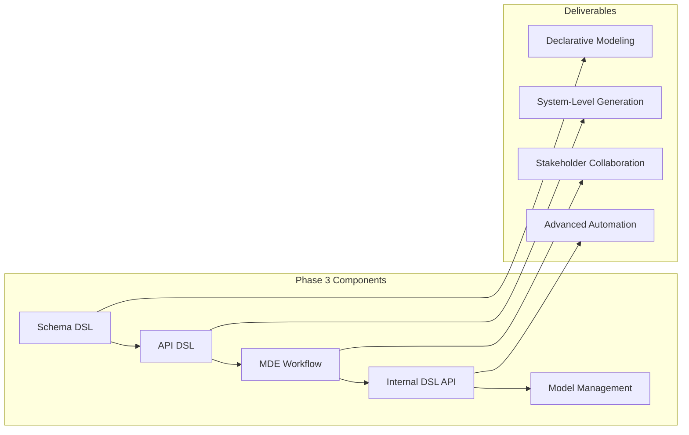
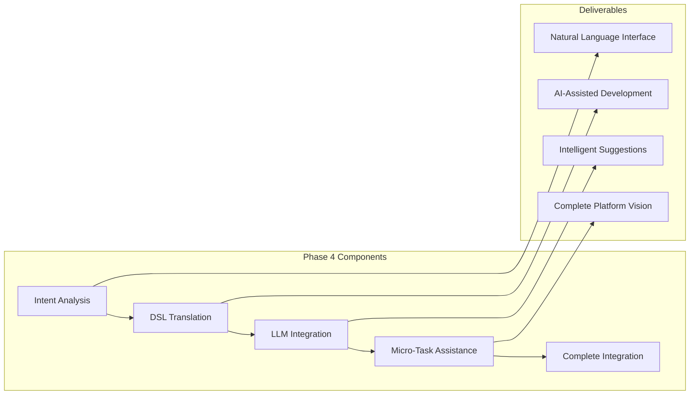

# Design Document

## Overview

O Roteiro de Implementação Estratégica representa a síntese de todas as cinco camadas da plataforma em uma visão coesa e executável. O design alcança o "melhor dos dois mundos": a velocidade e facilidade de uso das interfaces de IA modernas combinadas com a confiabilidade, controle e manutenibilidade das ferramentas clássicas de engenharia de software determinísticas.

A plataforma não substitui desenvolvedores, mas atua como um poderoso multiplicador de força que automatiza trabalho repetitivo e permite foco em arquitetura de alto nível e lógica de negócios. O design implementa um roteiro faseado que entrega valor incremental, começando com um MVP funcional e evoluindo para uma plataforma completa de desenvolvimento assistido por IA.

## Architecture

### Integrated Platform Architecture



### Phased Implementation Strategy

#### Phase 1: Foundation (MVP) - 3-6 months

**Core Value**: Automated project setup and boilerplate generation



#### Phase 2: Transformation Core - 4-8 months

**Core Value**: Code maintenance and evolution capabilities



#### Phase 3: Abstraction Layer - 6-10 months

**Core Value**: High-level system definition through models



#### Phase 4: Intelligent Interface - 3-6 months

**Core Value**: Natural language interface over deterministic engine



## Components and Interfaces

### Integrated Platform Interface

```typescript
interface IntegratedPlatform {
  // Phase 1: Foundation capabilities
  scaffolding: ScaffoldingEngine;
  templating: AdvancedTemplateEngine;

  // Phase 2: Transformation capabilities
  ast: ASTTransformationCore;
  refactoring: RefactoringEngine;

  // Phase 3: Abstraction capabilities
  dsl: DSLSystem;
  mde: MDEWorkflowEngine;

  // Phase 4: Intelligence capabilities
  llm: LLMInterface;
  assistance: AIAssistanceEngine;

  // Cross-cutting capabilities
  security: SecurityManager;
  monitoring: MonitoringSystem;
  integration: IntegrationLayer;
}

// Unified workflow interface
interface PlatformWorkflow {
  // Natural language to production code
  fromNaturalLanguage(description: string): Promise<ProjectGenerationResult>;

  // DSL-driven development
  fromDSL(models: DSLModel[]): Promise<SystemGenerationResult>;

  // Code evolution and maintenance
  evolveCode(codebase: Codebase, requirements: EvolutionRequirements): Promise<EvolutionResult>;

  // Hybrid development support
  enhanceExistingCode(code: ExistingCode, enhancements: Enhancement[]): Promise<EnhancementResult>;
}
```

### Phase-Specific Value Delivery

```typescript
// Phase 1: MVP Value Delivery
interface MVPCapabilities {
  // Core scaffolding
  generateProject(template: Template, parameters: ProjectParameters): Promise<Project>;

  // Template management
  createTemplate(specification: TemplateSpec): Promise<Template>;
  updateTemplate(template: Template, changes: TemplateChanges): Promise<Template>;

  // Basic customization
  customizeGeneration(project: Project, customizations: Customization[]): Promise<Project>;

  // Value metrics
  measureProductivityGains(): Promise<ProductivityMetrics>;
}

// Phase 2: Transformation Value Delivery
interface TransformationCapabilities {
  // Code analysis
  analyzeCodebase(codebase: Codebase): Promise<CodebaseAnalysis>;

  // Safe refactoring
  refactorCode(code: Code, refactoring: RefactoringOperation): Promise<RefactoringResult>;

  // Code evolution
  evolveArchitecture(
    codebase: Codebase,
    targetArchitecture: Architecture,
  ): Promise<EvolutionResult>;

  // Hybrid development
  mergeGeneratedAndManual(generated: Code, manual: Code): Promise<MergeResult>;
}

// Phase 3: Abstraction Value Delivery
interface AbstractionCapabilities {
  // Model-driven development
  generateFromModels(models: DSLModel[]): Promise<SystemGenerationResult>;

  // Stakeholder collaboration
  enableStakeholderReview(models: DSLModel[]): Promise<CollaborationSession>;

  // System-level automation
  automateSystemEvolution(system: System, changes: SystemChanges): Promise<SystemEvolutionResult>;

  // Advanced scripting
  executeAutomationScript(script: AutomationScript): Promise<AutomationResult>;
}

// Phase 4: Intelligence Value Delivery
interface IntelligenceCapabilities {
  // Natural language interface
  translateIntent(naturalLanguage: string): Promise<DSLTranslationResult>;

  // AI assistance
  assistWithNaming(context: NamingContext): Promise<NamingSuggestion[]>;
  assistWithDocumentation(code: Code): Promise<DocumentationResult>;
  assistWithTestData(schema: Schema): Promise<TestDataResult>;

  // Intelligent automation
  suggestOptimizations(codebase: Codebase): Promise<OptimizationSuggestion[]>;
}
```

### Value Measurement and ROI Tracking

```typescript
interface ValueMeasurementSystem {
  // Productivity metrics
  measureDevelopmentSpeed(before: Baseline, after: WithPlatform): Promise<SpeedMetrics>;
  measureCodeQuality(codebase: Codebase): Promise<QualityMetrics>;
  measureMaintenanceEffort(codebase: Codebase, timeframe: TimeFrame): Promise<MaintenanceMetrics>;

  // Business impact
  calculateROI(investment: Investment, benefits: Benefits): Promise<ROICalculation>;
  measureTimeToMarket(projects: Project[]): Promise<TimeToMarketMetrics>;
  measureDeveloperSatisfaction(team: DevelopmentTeam): Promise<SatisfactionMetrics>;

  // Platform optimization
  identifyUsagePatterns(usage: PlatformUsage): Promise<UsageAnalysis>;
  suggestWorkflowImprovements(workflows: Workflow[]): Promise<ImprovementSuggestion[]>;
  optimizeResourceAllocation(resources: Resources): Promise<OptimizationPlan>;
}

interface ProductivityMetrics {
  codeGenerationSpeed: number; // lines per hour
  setupTimeReduction: number; // percentage
  boilerplateElimination: number; // percentage
  refactoringEfficiency: number; // time saved
  bugReductionRate: number; // percentage
}

interface QualityMetrics {
  codeConsistency: number; // 0-1 score
  architecturalCompliance: number; // percentage
  testCoverage: number; // percentage
  documentationCompleteness: number; // percentage
  maintainabilityIndex: number; // 0-100 score
}

interface ROICalculation {
  totalInvestment: number;
  annualBenefits: number;
  paybackPeriod: number; // months
  netPresentValue: number;
  returnOnInvestment: number; // percentage
  riskAdjustedROI: number; // percentage
}
```

## Data Models

### Integrated Platform Schema

```sql
-- Platform-wide project tracking
CREATE TABLE platform_projects (
  id UUID PRIMARY KEY DEFAULT gen_random_uuid(),
  name VARCHAR(255) NOT NULL,
  type VARCHAR(50), -- 'scaffolded', 'transformed', 'model_driven', 'ai_assisted'
  phase_created VARCHAR(20), -- 'phase_1', 'phase_2', 'phase_3', 'phase_4'
  technologies JSONB,
  metrics JSONB,
  created_by UUID REFERENCES users(id),
  created_at TIMESTAMP DEFAULT NOW(),
  updated_at TIMESTAMP DEFAULT NOW()
);

-- Cross-phase workflow tracking
CREATE TABLE workflow_executions (
  id UUID PRIMARY KEY DEFAULT gen_random_uuid(),
  project_id UUID REFERENCES platform_projects(id),
  workflow_type VARCHAR(100), -- 'natural_to_code', 'dsl_to_code', 'code_evolution'
  phases_involved VARCHAR(50)[], -- ['phase_1', 'phase_2']
  input_data JSONB,
  output_data JSONB,
  execution_time INTEGER, -- milliseconds
  success BOOLEAN,
  error_message TEXT,
  executed_by UUID REFERENCES users(id),
  executed_at TIMESTAMP DEFAULT NOW()
);

-- Value metrics tracking
CREATE TABLE value_metrics (
  id UUID PRIMARY KEY DEFAULT gen_random_uuid(),
  project_id UUID REFERENCES platform_projects(id),
  metric_type VARCHAR(50), -- 'productivity', 'quality', 'roi', 'satisfaction'
  metric_name VARCHAR(100),
  metric_value DECIMAL(10,4),
  measurement_unit VARCHAR(50),
  baseline_value DECIMAL(10,4),
  improvement_percentage DECIMAL(5,2),
  measured_at TIMESTAMP DEFAULT NOW(),
  measured_by UUID REFERENCES users(id)
);

-- Phase implementation tracking
CREATE TABLE phase_implementations (
  id UUID PRIMARY KEY DEFAULT gen_random_uuid(),
  phase_number INTEGER NOT NULL, -- 1, 2, 3, 4
  phase_name VARCHAR(100) NOT NULL,
  implementation_status VARCHAR(20), -- 'planned', 'in_progress', 'completed', 'deployed'
  start_date DATE,
  target_completion_date DATE,
  actual_completion_date DATE,
  key_features JSONB,
  success_criteria JSONB,
  completion_percentage INTEGER DEFAULT 0,
  created_at TIMESTAMP DEFAULT NOW(),
  updated_at TIMESTAMP DEFAULT NOW()
);

-- Integration health monitoring
CREATE TABLE integration_health (
  id UUID PRIMARY KEY DEFAULT gen_random_uuid(),
  layer_from VARCHAR(50), -- 'scaffolding', 'template', 'ast', 'dsl', 'llm'
  layer_to VARCHAR(50),
  integration_type VARCHAR(50), -- 'data_flow', 'api_call', 'event_trigger'
  health_status VARCHAR(20), -- 'healthy', 'degraded', 'failed'
  response_time INTEGER, -- milliseconds
  error_rate DECIMAL(5,4), -- percentage
  last_successful_call TIMESTAMP,
  last_failed_call TIMESTAMP,
  monitored_at TIMESTAMP DEFAULT NOW()
);

-- User adoption and satisfaction
CREATE TABLE user_adoption (
  id UUID PRIMARY KEY DEFAULT gen_random_uuid(),
  user_id UUID REFERENCES users(id),
  phase_adopted VARCHAR(20),
  adoption_date DATE,
  usage_frequency VARCHAR(20), -- 'daily', 'weekly', 'monthly', 'rarely'
  satisfaction_score INTEGER, -- 1-10
  feedback TEXT,
  would_recommend BOOLEAN,
  recorded_at TIMESTAMP DEFAULT NOW()
);
```

## Implementation Strategy

### Phase 1: Foundation (MVP) Implementation

```typescript
interface Phase1Implementation {
  duration: '3-6 months';
  team_size: '4-6 developers';
  key_deliverables: [
    'Basic scaffolding engine with 5-10 project templates',
    'Template system with macros and inheritance',
    'Web interface for project generation',
    'CLI tools for developers',
    'Basic metrics and monitoring',
  ];

  success_criteria: {
    project_generation_time: '< 5 minutes for typical project';
    template_customization: '80% of common use cases covered';
    user_satisfaction: '> 7/10 rating';
    productivity_gain: '> 50% reduction in setup time';
  };

  risk_mitigation: {
    template_quality: 'Extensive testing with real-world scenarios';
    user_adoption: 'Early user feedback and iteration';
    technical_debt: 'Clean architecture from day one';
  };
}
```

### Phase 2: Transformation Core Implementation

```typescript
interface Phase2Implementation {
  duration: '4-8 months';
  team_size: '6-8 developers';
  prerequisites: ['Phase 1 completed and stable'];

  key_deliverables: [
    'Multi-language AST parser (JS/TS, Python, Java)',
    'Core refactoring operations (rename, extract, move)',
    'Code analysis and validation engine',
    'Integration with Phase 1 scaffolding',
    'Hybrid development support',
  ];

  success_criteria: {
    refactoring_safety: '99.9% success rate without breaking code';
    language_support: '3+ languages with full AST support';
    integration_seamless: 'Zero-friction integration with existing projects';
    maintenance_efficiency: '> 70% reduction in refactoring time';
  };

  technical_challenges: {
    ast_complexity: 'Use proven libraries like tree-sitter';
    multi_language: 'Incremental rollout per language';
    safety_guarantees: 'Extensive testing and validation';
  };
}
```

### Phase 3: Abstraction Layer Implementation

```typescript
interface Phase3Implementation {
  duration: '6-10 months';
  team_size: '8-10 developers';
  prerequisites: ['Phase 1 and 2 completed'];

  key_deliverables: [
    'Schema and API DSLs with parsers',
    'MDE workflow engine',
    'Internal DSL API for advanced scripting',
    'Model registry and versioning',
    'Stakeholder collaboration tools',
  ];

  success_criteria: {
    dsl_adoption: 'Non-technical stakeholders can use DSLs';
    system_generation: 'Complete systems generated from models';
    collaboration_efficiency: '> 60% reduction in specification time';
    model_consistency: '100% consistency between models and code';
  };

  user_experience_focus: {
    visual_editors: 'Drag-and-drop model creation';
    validation_feedback: 'Real-time validation and suggestions';
    documentation: 'Auto-generated stakeholder documentation';
  };
}
```

### Phase 4: Intelligent Interface Implementation

```typescript
interface Phase4Implementation {
  duration: '3-6 months';
  team_size: '6-8 developers';
  prerequisites: ['Phases 1-3 completed and integrated'];

  key_deliverables: [
    'Natural language to DSL translation',
    'AI-assisted naming and documentation',
    'Test data generation',
    'Multi-provider LLM integration',
    'Complete platform integration',
  ];

  success_criteria: {
    translation_accuracy: '> 85% correct DSL generation';
    user_experience: 'Natural language interface preferred by users';
    ai_assistance_value: '> 40% time savings on routine tasks';
    platform_completeness: 'All layers working seamlessly together';
  };

  ai_integration_principles: {
    minimal_usage: 'LLMs only where they add clear value';
    deterministic_core: 'All execution remains deterministic';
    user_control: 'Users can disable AI features completely';
    cost_optimization: 'Intelligent caching and provider selection';
  };
}
```

## Testing Strategy

### Cross-Phase Integration Testing

```typescript
interface IntegrationTestStrategy {
  // End-to-end workflow testing
  testNaturalLanguageToCode(description: string): Promise<E2ETestResult>;
  testDSLToProductionSystem(models: DSLModel[]): Promise<SystemTestResult>;
  testCodeEvolutionWorkflow(codebase: Codebase): Promise<EvolutionTestResult>;

  // Performance testing across phases
  testScalabilityAcrossLayers(workload: Workload): Promise<ScalabilityTestResult>;
  testResourceUtilization(operations: Operation[]): Promise<ResourceTestResult>;

  // Quality assurance
  testOutputQuality(inputs: TestInput[]): Promise<QualityTestResult>;
  testConsistencyAcrossPhases(scenarios: TestScenario[]): Promise<ConsistencyTestResult>;

  // User experience testing
  testUserWorkflows(userJourneys: UserJourney[]): Promise<UXTestResult>;
  testStakeholderCollaboration(
    collaborationScenarios: CollaborationScenario[],
  ): Promise<CollaborationTestResult>;
}
```

### Value Validation Testing

```typescript
interface ValueValidationStrategy {
  // Productivity measurement
  measureProductivityGains(
    baseline: ProductivityBaseline,
    withPlatform: ProductivityWithPlatform,
  ): Promise<ProductivityComparison>;

  // Quality measurement
  measureCodeQuality(generatedCode: Code[], manualCode: Code[]): Promise<QualityComparison>;

  // ROI validation
  validateROIProjections(
    actualUsage: UsageData,
    projectedBenefits: ProjectedBenefits,
  ): Promise<ROIValidation>;

  // User satisfaction
  measureUserSatisfaction(users: User[], usagePeriod: TimeFrame): Promise<SatisfactionMetrics>;
}
```

## Risk Management and Mitigation

### Technical Risks

```typescript
interface TechnicalRiskManagement {
  risks: {
    integration_complexity: {
      probability: 'Medium';
      impact: 'High';
      mitigation: 'Incremental integration with extensive testing';
    };

    performance_degradation: {
      probability: 'Medium';
      impact: 'Medium';
      mitigation: 'Performance testing at each phase, optimization focus';
    };

    ai_reliability: {
      probability: 'Medium';
      impact: 'Low';
      mitigation: 'Fallback to deterministic methods, user control';
    };

    scalability_limits: {
      probability: 'Low';
      impact: 'High';
      mitigation: 'Architecture designed for scale, load testing';
    };
  };
}
```

### Business Risks

```typescript
interface BusinessRiskManagement {
  risks: {
    user_adoption: {
      probability: 'Medium';
      impact: 'High';
      mitigation: 'Early user feedback, incremental value delivery';
    };

    competitive_pressure: {
      probability: 'High';
      impact: 'Medium';
      mitigation: 'Unique value proposition, rapid iteration';
    };

    technology_obsolescence: {
      probability: 'Low';
      impact: 'High';
      mitigation: 'Modular architecture, technology abstraction';
    };

    resource_constraints: {
      probability: 'Medium';
      impact: 'Medium';
      mitigation: 'Phased approach, MVP focus, external partnerships';
    };
  };
}
```

## Success Metrics and KPIs

### Platform Success Metrics

```typescript
interface PlatformSuccessMetrics {
  // Adoption metrics
  user_adoption_rate: number; // percentage of target users
  feature_utilization: Record<string, number>; // usage per feature
  user_retention_rate: number; // monthly active users retention

  // Productivity metrics
  development_speed_improvement: number; // percentage increase
  code_quality_improvement: number; // defect reduction percentage
  time_to_market_reduction: number; // percentage reduction

  // Business metrics
  cost_savings: number; // annual savings in development costs
  revenue_impact: number; // revenue attributed to faster development
  customer_satisfaction: number; // NPS score

  // Technical metrics
  platform_reliability: number; // uptime percentage
  performance_benchmarks: Record<string, number>; // response times
  integration_success_rate: number; // successful integrations percentage
}
```

### Phase-Specific Success Criteria

```typescript
interface PhaseSuccessCriteria {
  phase_1: {
    project_generation_success_rate: '> 95%';
    average_setup_time: '< 5 minutes';
    template_coverage: '> 80% of use cases';
    user_satisfaction: '> 7/10';
  };

  phase_2: {
    refactoring_safety_rate: '> 99.9%';
    code_analysis_accuracy: '> 95%';
    maintenance_time_reduction: '> 70%';
    integration_seamlessness: 'Zero breaking changes';
  };

  phase_3: {
    dsl_adoption_by_non_technical: '> 60%';
    model_to_code_consistency: '100%';
    stakeholder_collaboration_efficiency: '> 60% improvement';
    system_generation_success: '> 90%';
  };

  phase_4: {
    natural_language_translation_accuracy: '> 85%';
    ai_assistance_adoption: '> 70% of users';
    overall_productivity_gain: '> 200%';
    platform_completeness_score: '> 9/10';
  };
}
```

## Deployment and Operations

### Production Deployment Strategy

```typescript
interface DeploymentStrategy {
  // Phased rollout
  rollout_phases: [
    {
      phase: 'Alpha';
      duration: '2 weeks';
      users: 'Internal team (10-20 users)';
      features: 'Core functionality only';
    },
    {
      phase: 'Beta';
      duration: '1 month';
      users: 'Selected customers (100-200 users)';
      features: 'Most features, limited AI';
    },
    {
      phase: 'General Availability';
      duration: 'Ongoing';
      users: 'All customers';
      features: 'Full platform capabilities';
    },
  ];

  // Infrastructure requirements
  infrastructure: {
    compute: 'Auto-scaling container orchestration';
    storage: 'Distributed database with backup';
    networking: 'CDN for global performance';
    monitoring: 'Comprehensive observability stack';
  };

  // Operational procedures
  operations: {
    deployment: 'Blue-green deployment with rollback';
    monitoring: 'Real-time alerting and dashboards';
    backup: 'Automated backup and disaster recovery';
    scaling: 'Auto-scaling based on demand';
  };
}
```

## Future Evolution and Extensibility

### Platform Evolution Strategy

```typescript
interface EvolutionStrategy {
  // Technology evolution
  technology_roadmap: {
    ai_advancement: 'Integration of newer, more capable models';
    language_support: 'Additional programming languages and frameworks';
    cloud_native: 'Enhanced cloud-native development support';
    edge_computing: 'Support for edge and IoT development';
  };

  // Feature evolution
  feature_roadmap: {
    advanced_analytics: 'Predictive analytics for development patterns';
    team_collaboration: 'Enhanced multi-team development support';
    enterprise_features: 'Advanced governance and compliance';
    marketplace: 'Third-party template and tool marketplace';
  };

  // Architectural evolution
  architecture_roadmap: {
    microservices: 'Full microservices architecture';
    api_first: 'API-first design for all components';
    plugin_system: 'Extensible plugin architecture';
    federation: 'Multi-instance federation support';
  };
}
```
