# Design Document

## Overview

A extensão "Platform Engine" para VS Code representa a materialização completa da plataforma de desenvolvimento assistido por IA em uma ferramenta integrada ao fluxo de trabalho diário do desenvolvedor. A extensão não é apenas um conjunto de comandos, mas um ambiente de desenvolvimento transformado que encapsula todas as cinco camadas da plataforma diretamente no VS Code.

O design mantém a experiência familiar do VS Code enquanto adiciona capacidades revolucionárias de automação de código, transformação AST, modelagem DSL e assistência IA. A extensão serve como ponte entre a especificação teórica da plataforma e uma ferramenta prática que desenvolvedores podem usar imediatamente.

## Architecture

### VS Code Extension Architecture

```mermaid
graph TB
    subgraph "VS Code Extension Host"
        ExtensionMain[Extension Main Process]
        LanguageServer[DSL Language Server]
        WebviewProvider[Webview Provider]
        CommandRegistry[Command Registry]
    end

    subgraph "UI Components"
        ActivityBar[Activity Bar Icon]
        TreeView[Platform Tree View]
        ChatView[AI Chat Interface]
        GraphicalEditor[Graphical DSL Editor]
        CodeActions[Code Actions Provider]
    end

    subgraph "Language Integration"
        DSLLanguages[DSL Language Definitions]
        SyntaxHighlighting[Syntax Highlighting]
        IntelliSense[IntelliSense Provider]
        Diagnostics[Diagnostics Provider]
        Formatter[Code Formatter]
    end

    subgraph "Core Platform Integration"
        ScaffoldingBridge[Scaffolding Engine Bridge]
        TemplateBridge[Template Engine Bridge]
        ASTBridge[AST Core Bridge]
        DSLBridge[DSL System Bridge]
        LLMBridge[LLM Interface Bridge]
    end

    subgraph "VS Code Native Integration"
        FileSystemWatcher[File System Watcher]
        WorkspaceAPI[Workspace API]
        ConfigurationAPI[Configuration API]
        NotificationAPI[Notification API]
        ProgressAPI[Progress API]
    end

    subgraph "Backend Services"
        PlatformAPI[Platform API Server]
        DatabaseLayer[Database Layer]
        CacheLayer[Cache Layer]
        SecurityLayer[Security Layer]
    end

    ExtensionMain --> ActivityBar
    ExtensionMain --> TreeView
    ExtensionMain --> ChatView
    ExtensionMain --> CommandRegistry

    TreeView --> ScaffoldingBridge
    ChatView --> LLMBridge
    GraphicalEditor --> DSLBridge
    CodeActions --> ASTBridge

    LanguageServer --> DSLLanguages
    LanguageServer --> IntelliSense
    LanguageServer --> Diagnostics
    LanguageServer --> Formatter

    ScaffoldingBridge --> PlatformAPI
    TemplateBridge --> PlatformAPI
    ASTBridge --> PlatformAPI
    DSLBridge --> PlatformAPI
    LLMBridge --> PlatformAPI

    ExtensionMain --> FileSystemWatcher
    ExtensionMain --> WorkspaceAPI
    ExtensionMain --> ConfigurationAPI
    ExtensionMain --> NotificationAPI
    ExtensionMain --> ProgressAPI

    PlatformAPI --> DatabaseLayer
    PlatformAPI --> CacheLayer
    PlatformAPI --> SecurityLayer
```



### Extension Components

#### 1. Activity Bar Integration

- **Purpose**: Ponto de entrada principal para todas as funcionalidades da plataforma
- **Implementation**: Custom TreeDataProvider com seções hierárquicas
- **Features**:
  - Ícone personalizado na Activity Bar
  - Tree view com seções expansíveis
  - Context menus para ações rápidas
  - Refresh automático baseado em file watchers

#### 2. DSL Language Server

- **Purpose**: Fornece experiência rica de edição para DSLs
- **Implementation**: Language Server Protocol (LSP) dedicado
- **Capabilities**:
  - Syntax highlighting com TextMate grammars
  - IntelliSense com completion, hover, signature help
  - Real-time diagnostics e error reporting
  - Code formatting e auto-indentation

#### 3. Graphical DSL Editor

- **Purpose**: Interface visual para criação de modelos DSL
- **Implementation**: Webview com React/Vue.js
- **Features**:
  - Drag-and-drop model creation
  - Bidirectional sync com arquivo textual
  - Real-time validation visual
  - Export/import capabilities

#### 4. AI Chat Interface

- **Purpose**: Natural language to DSL translation
- **Implementation**: Webview chat interface integrada
- **Workflow**:
  - Natural language input processing
  - LLM-powered DSL generation
  - Diff preview antes da aplicação
  - One-click approval/rejection

## Components and Interfaces

### Extension Main Module

```typescript
// extension.ts - Main extension entry point
export function activate(context: vscode.ExtensionContext) {
  // Initialize core services
  const platformService = new PlatformService(context);
  const dslLanguageServer = new DSLLanguageServer(context);
  const treeViewProvider = new PlatformTreeViewProvider(platformService);
  const chatProvider = new AIChatProvider(platformService);

  // Register UI components
  const treeView = vscode.window.createTreeView('platformEngine', {
    treeDataProvider: treeViewProvider,
    showCollapseAll: true,
    canSelectMany: true,
  });

  // Register commands
  registerCommands(context, platformService);

  // Register language features
  registerDSLLanguages(context, dslLanguageServer);

  // Register webview providers
  context.subscriptions.push(
    vscode.window.registerWebviewViewProvider('platformChat', chatProvider),
  );

  // Setup file watchers
  setupFileWatchers(context, treeViewProvider);
}

interface PlatformService {
  // Scaffolding operations
  generateProject(template: Template, params: ProjectParams): Promise<GenerationResult>;
  listTemplates(): Promise<Template[]>;

  // DSL operations
  parseDSL(content: string, type: DSLType): Promise<DSLParseResult>;
  validateDSL(content: string, type: DSLType): Promise<ValidationResult>;

  // AST operations
  refactorCode(operation: RefactoringOperation): Promise<RefactoringResult>;
  analyzeCode(filePath: string): Promise<CodeAnalysis>;

  // AI operations
  translateIntent(naturalLanguage: string): Promise<DSLTranslationResult>;
  suggestNames(context: NamingContext): Promise<NamingSuggestion[]>;

  // Template operations
  syncWithTemplate(projectPath: string): Promise<SyncResult>;
  checkTemplateUpdates(projectPath: string): Promise<UpdateInfo[]>;
}
```

### Tree View Provider

```typescript
class PlatformTreeViewProvider implements vscode.TreeDataProvider<TreeItem> {
  private _onDidChangeTreeData = new vscode.EventEmitter<TreeItem | undefined>();
  readonly onDidChangeTreeData = this._onDidChangeTreeData.event;

  constructor(private platformService: PlatformService) {}

  getTreeItem(element: TreeItem): vscode.TreeItem {
    return element;
  }

  getChildren(element?: TreeItem): Promise<TreeItem[]> {
    if (!element) {
      return Promise.resolve([
        new CategoryItem('DSL Models', 'dsl-models'),
        new CategoryItem('Available Generators', 'generators'),
        new CategoryItem('Template Marketplace', 'marketplace'),
        new CategoryItem('Project Status', 'status'),
      ]);
    }

    switch (element.contextValue) {
      case 'dsl-models':
        return this.getDSLModels();
      case 'generators':
        return this.getAvailableGenerators();
      case 'marketplace':
        return this.getMarketplaceTemplates();
      case 'status':
        return this.getProjectStatus();
      default:
        return Promise.resolve([]);
    }
  }

  private async getDSLModels(): Promise<TreeItem[]> {
    const workspace = vscode.workspace.workspaceFolders?.[0];
    if (!workspace) return [];

    const dslFiles = await vscode.workspace.findFiles('**/*.{schema.dsl,api.dsl,workflow.dsl}');
    return dslFiles.map((file) => new DSLFileItem(file));
  }

  private async getAvailableGenerators(): Promise<TreeItem[]> {
    const generators = await this.platformService.listGenerators();
    return generators.map((gen) => new GeneratorItem(gen));
  }

  refresh(): void {
    this._onDidChangeTreeData.fire(undefined);
  }
}

class DSLFileItem extends vscode.TreeItem {
  constructor(public readonly uri: vscode.Uri) {
    super(path.basename(uri.fsPath), vscode.TreeItemCollapsibleState.None);

    this.contextValue = 'dsl-file';
    this.command = {
      command: 'vscode.open',
      title: 'Open',
      arguments: [uri],
    };

    this.iconPath = new vscode.ThemeIcon('symbol-class');
    this.tooltip = `DSL Model: ${path.basename(uri.fsPath)}`;
  }
}

class GeneratorItem extends vscode.TreeItem {
  constructor(public readonly generator: Generator) {
    super(generator.name, vscode.TreeItemCollapsibleState.None);

    this.contextValue = 'generator';
    this.command = {
      command: 'platformEngine.runGenerator',
      title: 'Run Generator',
      arguments: [generator],
    };

    this.iconPath = new vscode.ThemeIcon('gear');
    this.tooltip = generator.description;
  }
}
```

### DSL Language Server

```typescript
class DSLLanguageServer {
  private server: LanguageServer;

  constructor(private context: vscode.ExtensionContext) {
    this.server = new LanguageServer({
      name: 'DSL Language Server',
      languages: ['schema-dsl', 'api-dsl', 'workflow-dsl'],
    });
  }

  async initialize() {
    // Register language configurations
    this.context.subscriptions.push(
      vscode.languages.registerCompletionItemProvider(
        'schema-dsl',
        new DSLCompletionProvider('schema'),
        '.',
      ),
    );

    this.context.subscriptions.push(
      vscode.languages.registerHoverProvider('schema-dsl', new DSLHoverProvider('schema')),
    );

    this.context.subscriptions.push(
      vscode.languages.registerDiagnosticsProvider(
        'schema-dsl',
        new DSLDiagnosticsProvider('schema'),
      ),
    );
  }
}

class DSLCompletionProvider implements vscode.CompletionItemProvider {
  constructor(private dslType: string) {}

  async provideCompletionItems(
    document: vscode.TextDocument,
    position: vscode.Position,
    token: vscode.CancellationToken,
    context: vscode.CompletionContext,
  ): Promise<vscode.CompletionItem[]> {
    const line = document.lineAt(position).text;
    const linePrefix = line.substring(0, position.character);

    if (this.dslType === 'schema') {
      if (linePrefix.includes('type:')) {
        return this.getTypeCompletions();
      } else if (linePrefix.includes('relationship:')) {
        return this.getRelationshipCompletions();
      }
    }

    return this.getGeneralCompletions();
  }

  private getTypeCompletions(): vscode.CompletionItem[] {
    const types = ['string', 'number', 'boolean', 'date', 'uuid', 'email', 'password'];
    return types.map((type) => {
      const item = new vscode.CompletionItem(type, vscode.CompletionItemKind.TypeParameter);
      item.documentation = new vscode.MarkdownString(`Data type: ${type}`);
      return item;
    });
  }

  private getRelationshipCompletions(): vscode.CompletionItem[] {
    const relationships = ['one_to_one', 'one_to_many', 'many_to_one', 'many_to_many'];
    return relationships.map((rel) => {
      const item = new vscode.CompletionItem(rel, vscode.CompletionItemKind.Reference);
      item.documentation = new vscode.MarkdownString(`Relationship type: ${rel}`);
      return item;
    });
  }
}

class DSLDiagnosticsProvider {
  private diagnosticCollection: vscode.DiagnosticCollection;

  constructor(private dslType: string) {
    this.diagnosticCollection = vscode.languages.createDiagnosticCollection(`${dslType}-dsl`);
  }

  async provideDiagnostics(document: vscode.TextDocument): Promise<void> {
    const diagnostics: vscode.Diagnostic[] = [];
    const content = document.getText();

    try {
      const parseResult = await this.parseDSL(content);
      if (!parseResult.success) {
        parseResult.errors.forEach((error) => {
          const range = new vscode.Range(
            error.line - 1,
            error.column,
            error.line - 1,
            error.column + error.length,
          );

          const diagnostic = new vscode.Diagnostic(
            range,
            error.message,
            vscode.DiagnosticSeverity.Error,
          );

          diagnostic.source = 'DSL Parser';
          diagnostics.push(diagnostic);
        });
      }
    } catch (error) {
      // Handle parsing errors
    }

    this.diagnosticCollection.set(document.uri, diagnostics);
  }

  private async parseDSL(content: string): Promise<DSLParseResult> {
    // Call platform service to parse DSL
    return await platformService.parseDSL(content, this.dslType as DSLType);
  }
}
```

### AI Chat Interface

```typescript
class AIChatProvider implements vscode.WebviewViewProvider {
  private _view?: vscode.WebviewView;

  constructor(private platformService: PlatformService) {}

  resolveWebviewView(
    webviewView: vscode.WebviewView,
    context: vscode.WebviewViewResolveContext,
    token: vscode.CancellationToken,
  ): void {
    this._view = webviewView;

    webviewView.webview.options = {
      enableScripts: true,
      localResourceRoots: [this.context.extensionUri],
    };

    webviewView.webview.html = this.getWebviewContent();

    // Handle messages from webview
    webviewView.webview.onDidReceiveMessage(async (message) => {
      switch (message.type) {
        case 'translateIntent':
          await this.handleIntentTranslation(message.text);
          break;
        case 'applyChanges':
          await this.handleApplyChanges(message.changes);
          break;
        case 'rejectChanges':
          await this.handleRejectChanges();
          break;
      }
    });
  }

  private async handleIntentTranslation(naturalLanguage: string) {
    try {
      const result = await this.platformService.translateIntent(naturalLanguage);

      if (result.success) {
        // Show diff preview in webview
        this._view?.webview.postMessage({
          type: 'showDiff',
          changes: result.proposedChanges,
          confidence: result.confidence,
        });
      } else {
        // Show error message
        this._view?.webview.postMessage({
          type: 'showError',
          message: result.error,
        });
      }
    } catch (error) {
      vscode.window.showErrorMessage(`Translation failed: ${error.message}`);
    }
  }

  private async handleApplyChanges(changes: DSLChange[]) {
    try {
      // Apply changes to DSL files
      for (const change of changes) {
        const uri = vscode.Uri.file(change.filePath);
        const document = await vscode.workspace.openTextDocument(uri);
        const edit = new vscode.WorkspaceEdit();

        edit.replace(uri, change.range, change.newContent);
        await vscode.workspace.applyEdit(edit);
        await document.save();
      }

      // Trigger code generation
      await this.triggerCodeGeneration();

      vscode.window.showInformationMessage('Changes applied successfully!');
    } catch (error) {
      vscode.window.showErrorMessage(`Failed to apply changes: ${error.message}`);
    }
  }

  private getWebviewContent(): string {
    return `
      <!DOCTYPE html>
      <html>
      <head>
        <meta charset="UTF-8">
        <meta name="viewport" content="width=device-width, initial-scale=1.0">
        <title>Platform AI Chat</title>
        <style>
          body { 
            font-family: var(--vscode-font-family);
            color: var(--vscode-foreground);
            background-color: var(--vscode-editor-background);
            margin: 0;
            padding: 10px;
          }
          .chat-container {
            display: flex;
            flex-direction: column;
            height: 100vh;
          }
          .messages {
            flex: 1;
            overflow-y: auto;
            margin-bottom: 10px;
          }
          .message {
            margin-bottom: 10px;
            padding: 8px;
            border-radius: 4px;
          }
          .user-message {
            background-color: var(--vscode-input-background);
            border: 1px solid var(--vscode-input-border);
          }
          .ai-message {
            background-color: var(--vscode-editor-selectionBackground);
          }
          .diff-preview {
            background-color: var(--vscode-diffEditor-insertedTextBackground);
            border: 1px solid var(--vscode-diffEditor-border);
            padding: 10px;
            margin: 10px 0;
            font-family: var(--vscode-editor-font-family);
          }
          .input-container {
            display: flex;
            gap: 5px;
          }
          .input-field {
            flex: 1;
            padding: 8px;
            background-color: var(--vscode-input-background);
            color: var(--vscode-input-foreground);
            border: 1px solid var(--vscode-input-border);
            border-radius: 2px;
          }
          .send-button, .apply-button, .reject-button {
            padding: 8px 12px;
            background-color: var(--vscode-button-background);
            color: var(--vscode-button-foreground);
            border: none;
            border-radius: 2px;
            cursor: pointer;
          }
          .send-button:hover, .apply-button:hover {
            background-color: var(--vscode-button-hoverBackground);
          }
          .reject-button {
            background-color: var(--vscode-errorForeground);
          }
        </style>
      </head>
      <body>
        <div class="chat-container">
          <div class="messages" id="messages"></div>
          <div class="input-container">
            <input type="text" class="input-field" id="messageInput" 
                   placeholder="Describe what you want to create or modify...">
            <button class="send-button" onclick="sendMessage()">Send</button>
          </div>
        </div>
        
        <script>
          const vscode = acquireVsCodeApi();
          
          function sendMessage() {
            const input = document.getElementById('messageInput');
            const message = input.value.trim();
            if (!message) return;
            
            addMessage(message, 'user');
            input.value = '';
            
            vscode.postMessage({
              type: 'translateIntent',
              text: message
            });
          }
          
          function addMessage(text, sender) {
            const messages = document.getElementById('messages');
            const messageDiv = document.createElement('div');
            messageDiv.className = \`message \${sender}-message\`;
            messageDiv.textContent = text;
            messages.appendChild(messageDiv);
            messages.scrollTop = messages.scrollHeight;
          }
          
          function showDiff(changes, confidence) {
            const messages = document.getElementById('messages');
            const diffDiv = document.createElement('div');
            diffDiv.className = 'message ai-message';
            
            let diffContent = \`<div>Generated DSL changes (confidence: \${confidence}%):</div>\`;
            diffContent += '<div class="diff-preview">';
            
            changes.forEach(change => {
              diffContent += \`<strong>\${change.filePath}:</strong><br>\`;
              diffContent += \`<pre>\${change.newContent}</pre><br>\`;
            });
            
            diffContent += '</div>';
            diffContent += '<button class="apply-button" onclick="applyChanges()">Apply Changes</button> ';
            diffContent += '<button class="reject-button" onclick="rejectChanges()">Reject</button>';
            
            diffDiv.innerHTML = diffContent;
            messages.appendChild(diffDiv);
            messages.scrollTop = messages.scrollHeight;
            
            // Store changes for later use
            window.pendingChanges = changes;
          }
          
          function applyChanges() {
            vscode.postMessage({
              type: 'applyChanges',
              changes: window.pendingChanges
            });
          }
          
          function rejectChanges() {
            vscode.postMessage({
              type: 'rejectChanges'
            });
            addMessage('Changes rejected', 'ai');
          }
          
          // Handle messages from extension
          window.addEventListener('message', event => {
            const message = event.data;
            switch (message.type) {
              case 'showDiff':
                showDiff(message.changes, message.confidence);
                break;
              case 'showError':
                addMessage(\`Error: \${message.message}\`, 'ai');
                break;
            }
          });
          
          // Send message on Enter key
          document.getElementById('messageInput').addEventListener('keypress', function(e) {
            if (e.key === 'Enter') {
              sendMessage();
            }
          });
        </script>
      </body>
      </html>
    `;
  }
}
```

### Code Actions Provider

```typescript
class PlatformCodeActionsProvider implements vscode.CodeActionProvider {
  constructor(private platformService: PlatformService) {}

  async provideCodeActions(
    document: vscode.TextDocument,
    range: vscode.Range | vscode.Selection,
    context: vscode.CodeActionContext,
    token: vscode.CancellationToken,
  ): Promise<vscode.CodeAction[]> {
    const actions: vscode.CodeAction[] = [];

    // Get selected text or word at cursor
    const selectedText = document.getText(range);
    const wordRange = document.getWordRangeAtPosition(range.start);

    if (wordRange) {
      const word = document.getText(wordRange);

      // Add refactoring actions
      actions.push(
        this.createRefactorAction('Rename Symbol Safely', 'rename', wordRange, word),
        this.createRefactorAction('Extract Method', 'extract-method', range, selectedText),
        this.createRefactorAction('Add Logging', 'add-logging', range, selectedText),
      );
    }

    // Add generation actions based on context
    if (this.isInClassContext(document, range)) {
      actions.push(
        this.createGenerationAction('Generate Constructor', 'generate-constructor'),
        this.createGenerationAction('Generate Getters/Setters', 'generate-accessors'),
      );
    }

    return actions;
  }

  private createRefactorAction(
    title: string,
    operation: string,
    range: vscode.Range,
    text: string,
  ): vscode.CodeAction {
    const action = new vscode.CodeAction(title, vscode.CodeActionKind.Refactor);
    action.command = {
      command: 'platformEngine.refactor',
      title: title,
      arguments: [operation, range, text],
    };
    return action;
  }

  private createGenerationAction(title: string, operation: string): vscode.CodeAction {
    const action = new vscode.CodeAction(title, vscode.CodeActionKind.Source);
    action.command = {
      command: 'platformEngine.generate',
      title: title,
      arguments: [operation],
    };
    return action;
  }

  private isInClassContext(document: vscode.TextDocument, range: vscode.Range): boolean {
    // Simple heuristic to detect if we're inside a class
    const text = document.getText();
    const position = document.offsetAt(range.start);
    const beforeText = text.substring(0, position);

    return (
      /class\s+\w+/.test(beforeText) &&
      beforeText.lastIndexOf('class') > beforeText.lastIndexOf('}')
    );
  }
}
```

### Command Registration

```typescript
function registerCommands(context: vscode.ExtensionContext, platformService: PlatformService) {
  // Project generation commands
  context.subscriptions.push(
    vscode.commands.registerCommand('platformEngine.generateProject', async () => {
      const templates = await platformService.listTemplates();
      const selectedTemplate = await vscode.window.showQuickPick(
        templates.map((t) => ({ label: t.name, description: t.description, template: t })),
        { placeHolder: 'Select a project template' },
      );

      if (selectedTemplate) {
        await generateProjectWorkflow(selectedTemplate.template, platformService);
      }
    }),
  );

  // DSL commands
  context.subscriptions.push(
    vscode.commands.registerCommand(
      'platformEngine.openGraphicalEditor',
      async (uri: vscode.Uri) => {
        const panel = vscode.window.createWebviewPanel(
          'dslGraphicalEditor',
          'DSL Graphical Editor',
          vscode.ViewColumn.Beside,
          { enableScripts: true },
        );

        panel.webview.html = await getGraphicalEditorContent(uri);
        setupGraphicalEditorMessageHandling(panel, uri, platformService);
      },
    ),
  );

  // Refactoring commands
  context.subscriptions.push(
    vscode.commands.registerCommand(
      'platformEngine.refactor',
      async (operation: string, range: vscode.Range, text: string) => {
        const editor = vscode.window.activeTextEditor;
        if (!editor) return;

        try {
          const result = await platformService.refactorCode({
            operation,
            filePath: editor.document.uri.fsPath,
            range,
            text,
            language: editor.document.languageId,
          });

          if (result.success) {
            await applyRefactoringResult(result);
            vscode.window.showInformationMessage(`Refactoring completed: ${operation}`);
          } else {
            vscode.window.showErrorMessage(`Refactoring failed: ${result.error}`);
          }
        } catch (error) {
          vscode.window.showErrorMessage(`Refactoring error: ${error.message}`);
        }
      },
    ),
  );

  // Template sync commands
  context.subscriptions.push(
    vscode.commands.registerCommand('platformEngine.syncWithTemplate', async () => {
      const workspaceFolder = vscode.workspace.workspaceFolders?.[0];
      if (!workspaceFolder) {
        vscode.window.showErrorMessage('No workspace folder found');
        return;
      }

      try {
        const updates = await platformService.checkTemplateUpdates(workspaceFolder.uri.fsPath);

        if (updates.length === 0) {
          vscode.window.showInformationMessage('Project is up to date with template');
          return;
        }

        const choice = await vscode.window.showInformationMessage(
          `${updates.length} template updates available. Apply them?`,
          'Apply Updates',
          'View Changes',
          'Cancel',
        );

        if (choice === 'Apply Updates') {
          await applyTemplateUpdates(updates, platformService);
        } else if (choice === 'View Changes') {
          await showTemplateUpdateDiff(updates);
        }
      } catch (error) {
        vscode.window.showErrorMessage(`Template sync failed: ${error.message}`);
      }
    }),
  );
}

async function generateProjectWorkflow(template: Template, platformService: PlatformService) {
  // Collect parameters
  const params: Record<string, any> = {};

  for (const param of template.parameters) {
    const value = await vscode.window.showInputBox({
      prompt: param.description,
      placeHolder: param.default?.toString(),
      validateInput: (input) => {
        if (param.required && !input) {
          return 'This parameter is required';
        }
        return null;
      },
    });

    if (value === undefined) return; // User cancelled
    params[param.name] = value || param.default;
  }

  // Select target folder
  const folderUri = await vscode.window.showOpenDialog({
    canSelectFolders: true,
    canSelectFiles: false,
    canSelectMany: false,
    openLabel: 'Select Project Folder',
  });

  if (!folderUri) return;

  // Generate project with progress
  await vscode.window.withProgress(
    {
      location: vscode.ProgressLocation.Notification,
      title: 'Generating Project',
      cancellable: false,
    },
    async (progress) => {
      progress.report({ message: 'Initializing...' });

      const result = await platformService.generateProject(template, {
        ...params,
        targetPath: folderUri[0].fsPath,
      });

      if (result.success) {
        progress.report({ message: 'Opening project...' });

        // Open generated project in new window
        await vscode.commands.executeCommand('vscode.openFolder', folderUri[0], true);
      } else {
        vscode.window.showErrorMessage(`Project generation failed: ${result.error}`);
      }
    },
  );
}
```

## Data Models

### Extension Configuration

```typescript
interface ExtensionConfiguration {
  // Platform settings
  platform: {
    apiEndpoint: string;
    apiKey?: string;
    enableAI: boolean;
    aiProvider: 'openai' | 'anthropic' | 'local';
    cacheEnabled: boolean;
  };

  // DSL settings
  dsl: {
    autoValidation: boolean;
    formatOnSave: boolean;
    showInlineErrors: boolean;
    completionEnabled: boolean;
  };

  // Code generation settings
  codeGeneration: {
    autoGenerate: boolean;
    preserveManualChanges: boolean;
    backupBeforeGeneration: boolean;
    outputDirectory: string;
  };

  // Template settings
  templates: {
    autoSync: boolean;
    checkUpdatesOnStartup: boolean;
    marketplaceUrl: string;
    customTemplatesPath: string;
  };

  // UI settings
  ui: {
    showWelcomeMessage: boolean;
    treeViewCollapsed: boolean;
    chatPanelPosition: 'sidebar' | 'panel';
    enableGraphicalEditor: boolean;
  };
}
```

### Extension State Management

```typescript
interface ExtensionState {
  // Workspace state
  currentProject?: ProjectInfo;
  dslFiles: DSLFileInfo[];
  availableGenerators: Generator[];
  templateUpdates: TemplateUpdate[];

  // UI state
  treeViewExpanded: Record<string, boolean>;
  chatHistory: ChatMessage[];
  lastUsedTemplates: Template[];

  // Cache state
  parsedDSLs: Map<string, DSLParseResult>;
  codeAnalysis: Map<string, CodeAnalysis>;
  templateCache: Map<string, Template>;
}

interface ProjectInfo {
  name: string;
  path: string;
  templateId?: string;
  templateVersion?: string;
  dslFiles: string[];
  generatedFiles: string[];
  lastSync?: Date;
}

interface DSLFileInfo {
  path: string;
  type: DSLType;
  valid: boolean;
  lastModified: Date;
  dependencies: string[];
}
```

## Testing Strategy

### Unit Testing

- **Command handlers**: Test all registered commands with mock services
- **Language server**: Test DSL parsing, validation, and IntelliSense
- **Tree view provider**: Test data retrieval and UI state management
- **Code actions**: Test refactoring and generation action providers

### Integration Testing

- **End-to-end workflows**: Test complete project generation and DSL editing flows
- **Platform integration**: Test communication with backend platform services
- **VS Code API integration**: Test proper usage of VS Code extension APIs
- **File system operations**: Test file watching, creation, and modification

### Extension Testing Framework

```typescript
import * as vscode from 'vscode';
import * as assert from 'assert';
import { PlatformService } from '../src/services/platformService';

suite('Extension Test Suite', () => {
  let extension: vscode.Extension<any>;
  let platformService: PlatformService;

  suiteSetup(async () => {
    extension = vscode.extensions.getExtension('publisher.platform-engine')!;
    await extension.activate();
    platformService = new PlatformService(extension.extensionContext);
  });

  test('Extension should be present', () => {
    assert.ok(extension);
    assert.equal(extension.isActive, true);
  });

  test('Commands should be registered', async () => {
    const commands = await vscode.commands.getCommands(true);
    const platformCommands = commands.filter((cmd) => cmd.startsWith('platformEngine.'));

    assert.ok(platformCommands.length > 0);
    assert.ok(platformCommands.includes('platformEngine.generateProject'));
    assert.ok(platformCommands.includes('platformEngine.refactor'));
  });

  test('DSL language should be registered', () => {
    const languages = vscode.languages.getLanguages();
    assert.ok(languages.includes('schema-dsl'));
    assert.ok(languages.includes('api-dsl'));
  });

  test('Tree view should be created', () => {
    const treeView = vscode.window.createTreeView('platformEngine', {
      treeDataProvider: new MockTreeDataProvider(),
    });

    assert.ok(treeView);
    assert.equal(treeView.visible, false); // Initially not visible
  });
});

class MockTreeDataProvider implements vscode.TreeDataProvider<any> {
  getTreeItem(element: any): vscode.TreeItem {
    return new vscode.TreeItem('Mock Item');
  }

  getChildren(element?: any): any[] {
    return [];
  }
}
```

## Performance Optimization

### Extension Loading

- **Lazy activation**: Activate only when DSL files are opened or commands are used
- **Incremental loading**: Load components on-demand rather than at startup
- **Background initialization**: Initialize heavy services in background threads

### Language Server Performance

- **Incremental parsing**: Parse only changed portions of DSL files
- **Caching**: Cache parsed ASTs and validation results
- **Debouncing**: Debounce validation and IntelliSense requests

### Memory Management

- **Dispose resources**: Properly dispose of webviews, watchers, and subscriptions
- **Weak references**: Use weak references for cached data
- **Garbage collection**: Trigger GC for large operations

```typescript
class PerformanceOptimizedService {
  private cache = new Map<string, CacheEntry>();
  private disposables: vscode.Disposable[] = [];

  constructor() {
    // Clean cache periodically
    const cleanupTimer = setInterval(() => {
      this.cleanupCache();
    }, 60000); // Every minute

    this.disposables.push(
      new vscode.Disposable(() => {
        clearInterval(cleanupTimer);
      }),
    );
  }

  async parseDSLWithCache(filePath: string, content: string): Promise<DSLParseResult> {
    const cacheKey = `${filePath}:${this.hashContent(content)}`;
    const cached = this.cache.get(cacheKey);

    if (cached && Date.now() - cached.timestamp < 300000) {
      // 5 minutes
      return cached.result;
    }

    const result = await this.parseDSL(content);
    this.cache.set(cacheKey, {
      result,
      timestamp: Date.now(),
    });

    return result;
  }

  private cleanupCache(): void {
    const now = Date.now();
    const maxAge = 600000; // 10 minutes

    for (const [key, entry] of this.cache.entries()) {
      if (now - entry.timestamp > maxAge) {
        this.cache.delete(key);
      }
    }
  }

  dispose(): void {
    this.disposables.forEach((d) => d.dispose());
    this.cache.clear();
  }
}

interface CacheEntry {
  result: DSLParseResult;
  timestamp: number;
}
```

## Security Considerations

### Extension Security

- **Input validation**: Validate all user inputs and file contents
- **Sandboxed execution**: Run code generation in isolated processes
- **Permission management**: Request minimal required permissions
- **Secure communication**: Use HTTPS for all API communications

### Data Protection

- **Sensitive data**: Avoid storing sensitive data in extension state
- **Encryption**: Encrypt API keys and tokens in storage
- **Audit logging**: Log security-relevant operations
- **User consent**: Request explicit consent for AI features

## Deployment and Distribution

### Extension Packaging

```json
{
  "name": "platform-engine",
  "displayName": "Platform Engine",
  "description": "Next-generation code automation platform",
  "version": "1.0.0",
  "publisher": "platform-team",
  "engines": {
    "vscode": "^1.80.0"
  },
  "categories": ["Other", "Snippets", "Formatters"],
  "keywords": ["code-generation", "scaffolding", "ai", "automation"],
  "activationEvents": [
    "onLanguage:schema-dsl",
    "onLanguage:api-dsl",
    "onCommand:platformEngine.generateProject",
    "workspaceContains:**/*.dsl"
  ],
  "main": "./out/extension.js",
  "contributes": {
    "languages": [
      {
        "id": "schema-dsl",
        "aliases": ["Schema DSL", "schema-dsl"],
        "extensions": [".schema.dsl"],
        "configuration": "./language-configuration.json"
      }
    ],
    "grammars": [
      {
        "language": "schema-dsl",
        "scopeName": "source.schema-dsl",
        "path": "./syntaxes/schema-dsl.tmGrammar.json"
      }
    ],
    "commands": [
      {
        "command": "platformEngine.generateProject",
        "title": "Generate New Project",
        "category": "Platform"
      }
    ],
    "views": {
      "explorer": [
        {
          "id": "platformEngine",
          "name": "Platform Engine",
          "when": "workspaceHasDSLFiles"
        }
      ]
    },
    "viewsWelcome": [
      {
        "view": "platformEngine",
        "contents": "Welcome to Platform Engine!\n[Generate Project](command:platformEngine.generateProject)\n[Open Documentation](command:platformEngine.openDocs)"
      }
    ]
  }
}
```

### Marketplace Publication

- **Extension validation**: Comprehensive testing before publication
- **Documentation**: Complete README with screenshots and examples
- **Versioning**: Semantic versioning with changelog
- **User feedback**: Monitor reviews and respond to issues

This design provides a comprehensive blueprint for integrating the entire platform into a VS Code extension that feels native while providing revolutionary capabilities for code automation and development assistance.
