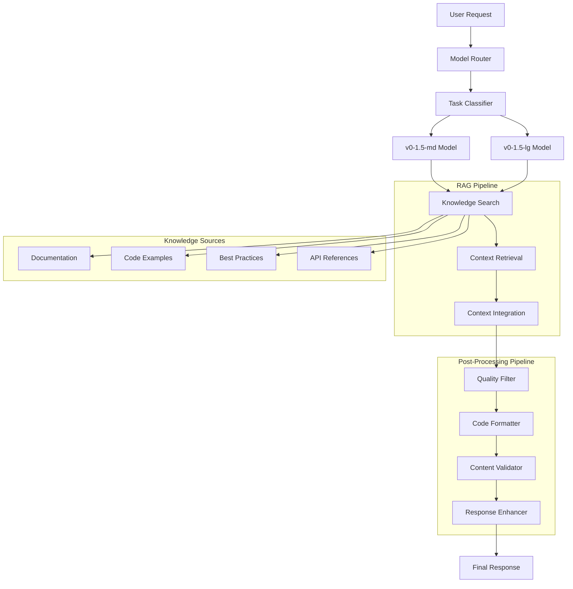

# Design Document

## Overview

Este documento descreve o design técnico para implementar uma família de modelos de LLM compostos que combina múltiplos modelos especializados (v0-1.5-md, v0-1.5-lg) com capacidades de RAG (Retrieval-Augmented Generation) e pós-processamento avançado. O sistema será integrado à arquitetura existente baseada em Inngest Agent Kit, mantendo compatibilidade com o fluxo atual de mensagens e fragmentos.

## Architecture

### High-Level Architecture



### Current vs New Flow

**Current Flow:**

1. User message → Single Claude model → Response generation → Fragment creation

**New Flow:**

1. User message → Task classification → Model selection (md/lg)
2. RAG knowledge retrieval → Context enrichment
3. Model execution with enhanced context
4. Post-processing pipeline → Quality enhancement
5. Fragment creation with metadata

## Components and Interfaces

### 1. Model Router and Classifier

```typescript
interface ModelRouter {
  selectModel(request: ModelRequest): Promise<ModelSelection>;
  getAvailableModels(): ModelInfo[];
  getModelMetrics(modelId: string): ModelMetrics;
}

interface TaskClassifier {
  classifyTask(prompt: string, context?: TaskContext): Promise<TaskClassification>;
  updateClassificationRules(rules: ClassificationRule[]): Promise<void>;
}

interface TaskClassification {
  complexity: 'simple' | 'medium' | 'complex';
  domain: 'frontend' | 'backend' | 'fullstack' | 'data' | 'devops';
  estimatedTokens: number;
  confidence: number;
  reasoning: string;
}

interface ModelSelection {
  modelId: string;
  modelType: 'v0-1.5-md' | 'v0-1.5-lg';
  confidence: number;
  fallbackModels: string[];
  parameters: ModelParameters;
}
```

### 2. RAG System

```typescript
interface RAGSystem {
  searchKnowledge(query: string, domain?: string): Promise<KnowledgeResult[]>;
  integrateContext(prompt: string, knowledge: KnowledgeResult[]): Promise<EnhancedPrompt>;
  updateKnowledgeBase(source: KnowledgeSource): Promise<void>;
}

interface KnowledgeResult {
  content: string;
  source: string;
  relevanceScore: number;
  type: 'documentation' | 'example' | 'best_practice' | 'api_reference';
  metadata: {
    language?: string;
    framework?: string;
    lastUpdated: Date;
  };
}

interface EnhancedPrompt {
  originalPrompt: string;
  enhancedPrompt: string;
  contextSources: KnowledgeResult[];
  contextWeight: number;
}
```

### 3. Post-Processing Pipeline

```typescript
interface PostProcessor {
  processResponse(response: string, context: ProcessingContext): Promise<ProcessedResponse>;
  addProcessor(processor: ResponseProcessor): void;
  removeProcessor(processorId: string): void;
}

interface ResponseProcessor {
  id: string;
  name: string;
  priority: number;
  process(content: string, context: ProcessingContext): Promise<ProcessingResult>;
}

interface ProcessedResponse {
  content: string;
  metadata: {
    originalLength: number;
    processedLength: number;
    appliedProcessors: string[];
    qualityScore: number;
    improvements: string[];
  };
  warnings: string[];
  suggestions: string[];
}
```

### 4. Model Management

```typescript
interface ModelManager {
  registerModel(model: CompositeModel): Promise<void>;
  getModel(modelId: string): Promise<CompositeModel>;
  updateModelConfig(modelId: string, config: ModelConfig): Promise<void>;
  getModelHealth(modelId: string): Promise<ModelHealth>;
}

interface CompositeModel {
  id: string;
  name: string;
  type: 'v0-1.5-md' | 'v0-1.5-lg';
  provider: 'anthropic' | 'openai' | 'custom';
  config: ModelConfig;
  capabilities: ModelCapabilities;
  metrics: ModelMetrics;
}

interface ModelConfig {
  temperature: number;
  maxTokens: number;
  topP?: number;
  frequencyPenalty?: number;
  presencePenalty?: number;
  systemPrompt?: string;
  customParameters?: Record<string, any>;
}
```

## Data Models

### Database Schema Extensions

```sql
-- New table for model configurations
CREATE TABLE ModelConfig (
  id VARCHAR(191) PRIMARY KEY,
  name VARCHAR(255) NOT NULL,
  type ENUM('v0-1.5-md', 'v0-1.5-lg') NOT NULL,
  provider VARCHAR(100) NOT NULL,
  config JSON NOT NULL,
  is_active BOOLEAN DEFAULT true,
  created_at DATETIME(3) DEFAULT CURRENT_TIMESTAMP(3),
  updated_at DATETIME(3) DEFAULT CURRENT_TIMESTAMP(3) ON UPDATE CURRENT_TIMESTAMP(3)
);

-- New table for knowledge base
CREATE TABLE KnowledgeBase (
  id VARCHAR(191) PRIMARY KEY,
  title VARCHAR(500) NOT NULL,
  content TEXT NOT NULL,
  source VARCHAR(255) NOT NULL,
  type ENUM('documentation', 'example', 'best_practice', 'api_reference') NOT NULL,
  domain VARCHAR(100),
  language VARCHAR(50),
  framework VARCHAR(100),
  embedding VECTOR(1536), -- For vector similarity search
  metadata JSON,
  created_at DATETIME(3) DEFAULT CURRENT_TIMESTAMP(3),
  updated_at DATETIME(3) DEFAULT CURRENT_TIMESTAMP(3) ON UPDATE CURRENT_TIMESTAMP(3),
  INDEX idx_type_domain (type, domain),
  INDEX idx_language_framework (language, framework)
);

-- New table for model usage analytics
CREATE TABLE ModelUsage (
  id VARCHAR(191) PRIMARY KEY,
  model_id VARCHAR(191) NOT NULL,
  message_id VARCHAR(191) NOT NULL,
  task_classification JSON,
  rag_sources JSON,
  processing_metadata JSON,
  response_time_ms INT,
  token_usage JSON,
  quality_score DECIMAL(3,2),
  user_feedback INT, -- 1-5 rating
  created_at DATETIME(3) DEFAULT CURRENT_TIMESTAMP(3),
  FOREIGN KEY (message_id) REFERENCES Message(id) ON DELETE CASCADE,
  INDEX idx_model_id (model_id),
  INDEX idx_created_at (created_at)
);

-- Extend Message table
ALTER TABLE Message ADD COLUMN model_metadata JSON;
ALTER TABLE Message ADD COLUMN rag_sources JSON;
ALTER TABLE Message ADD COLUMN processing_metadata JSON;
```

### TypeScript Types

```typescript
interface MessageWithComposite extends Message {
  modelMetadata?: {
    modelId: string;
    modelType: 'v0-1.5-md' | 'v0-1.5-lg';
    taskClassification: TaskClassification;
    selectionReasoning: string;
    responseTime: number;
    tokenUsage: {
      prompt: number;
      completion: number;
      total: number;
    };
  };
  ragSources?: KnowledgeResult[];
  processingMetadata?: {
    appliedProcessors: string[];
    qualityScore: number;
    improvements: string[];
    originalLength: number;
    processedLength: number;
  };
}

interface CompositeAgentState extends AgentState {
  modelSelection?: ModelSelection;
  ragContext?: KnowledgeResult[];
  processingSteps?: ProcessingStep[];
  qualityMetrics?: QualityMetrics;
}
```

## Implementation Strategy

### 1. Model Router Implementation

```typescript
class ModelRouterService implements ModelRouter {
  private classifier: TaskClassifier;
  private models: Map<string, CompositeModel>;
  private metrics: ModelMetricsCollector;

  async selectModel(request: ModelRequest): Promise<ModelSelection> {
    const classification = await this.classifier.classifyTask(request.prompt, request.context);

    const modelType = this.determineModelType(classification);
    const availableModels = this.getModelsByType(modelType);
    const selectedModel = await this.selectBestModel(availableModels, classification);

    return {
      modelId: selectedModel.id,
      modelType: selectedModel.type,
      confidence: classification.confidence,
      fallbackModels: this.getFallbackModels(selectedModel),
      parameters: this.optimizeParameters(selectedModel.config, classification),
    };
  }

  private determineModelType(classification: TaskClassification): 'v0-1.5-md' | 'v0-1.5-lg' {
    if (classification.complexity === 'complex' || classification.estimatedTokens > 4000) {
      return 'v0-1.5-lg';
    }
    return 'v0-1.5-md';
  }
}
```

### 2. RAG System Implementation

```typescript
class RAGService implements RAGSystem {
  private vectorStore: VectorStore;
  private embeddings: EmbeddingService;

  async searchKnowledge(query: string, domain?: string): Promise<KnowledgeResult[]> {
    const queryEmbedding = await this.embeddings.embed(query);

    const searchResults = await this.vectorStore.similaritySearch(queryEmbedding, {
      limit: 10,
      threshold: 0.7,
      filters: domain ? { domain } : undefined,
    });

    return searchResults.map((result) => ({
      content: result.content,
      source: result.metadata.source,
      relevanceScore: result.score,
      type: result.metadata.type,
      metadata: result.metadata,
    }));
  }

  async integrateContext(prompt: string, knowledge: KnowledgeResult[]): Promise<EnhancedPrompt> {
    const contextSections = knowledge
      .sort((a, b) => b.relevanceScore - a.relevanceScore)
      .slice(0, 5)
      .map((k) => `Source: ${k.source}\n${k.content}`)
      .join('\n\n---\n\n');

    const enhancedPrompt = `
Context Information:
${contextSections}

---

User Request:
${prompt}

Please use the context information above to provide a more accurate and comprehensive response.
`;

    return {
      originalPrompt: prompt,
      enhancedPrompt,
      contextSources: knowledge,
      contextWeight: this.calculateContextWeight(knowledge),
    };
  }
}
```

### 3. Post-Processing Pipeline

```typescript
class PostProcessingPipeline implements PostProcessor {
  private processors: ResponseProcessor[] = [];

  constructor() {
    this.initializeDefaultProcessors();
  }

  private initializeDefaultProcessors() {
    this.addProcessor(new CodeFormatterProcessor());
    this.addProcessor(new QualityValidatorProcessor());
    this.addProcessor(new SecurityScannerProcessor());
    this.addProcessor(new ConsistencyCheckerProcessor());
    this.addProcessor(new ResponseEnhancerProcessor());
  }

  async processResponse(response: string, context: ProcessingContext): Promise<ProcessedResponse> {
    let processedContent = response;
    const appliedProcessors: string[] = [];
    const improvements: string[] = [];
    const warnings: string[] = [];

    // Sort processors by priority
    const sortedProcessors = this.processors.sort((a, b) => a.priority - b.priority);

    for (const processor of sortedProcessors) {
      try {
        const result = await processor.process(processedContent, context);

        if (result.modified) {
          processedContent = result.content;
          appliedProcessors.push(processor.name);
          improvements.push(...result.improvements);
        }

        warnings.push(...result.warnings);
      } catch (error) {
        console.error(`Processor ${processor.name} failed:`, error);
        warnings.push(`Processing warning: ${processor.name} encountered an error`);
      }
    }

    return {
      content: processedContent,
      metadata: {
        originalLength: response.length,
        processedLength: processedContent.length,
        appliedProcessors,
        qualityScore: this.calculateQualityScore(processedContent, context),
        improvements,
      },
      warnings,
      suggestions: this.generateSuggestions(processedContent, context),
    };
  }
}
```

## Integration with Existing System

### 1. Inngest Function Modification

```typescript
export const compositeCodeAgentFunction = inngest.createFunction(
  { id: 'composite-code-agent' },
  { event: 'code-agent/run' },
  async ({ event, step }) => {
    // Model selection step
    const modelSelection = await step.run('select-model', async () => {
      const router = new ModelRouterService();
      return await router.selectModel({
        prompt: event.data.value,
        context: {
          projectId: event.data.projectId,
          previousMessages: await getPreviousMessages(event.data.projectId),
        },
      });
    });

    // RAG enhancement step
    const ragContext = await step.run('enhance-with-rag', async () => {
      const ragService = new RAGService();
      const knowledge = await ragService.searchKnowledge(event.data.value, modelSelection.domain);
      return await ragService.integrateContext(event.data.value, knowledge);
    });

    // Model execution with enhanced context
    const modelResponse = await step.run('execute-model', async () => {
      const selectedModel = await getCompositeModel(modelSelection.modelId);
      return await selectedModel.execute(ragContext.enhancedPrompt, {
        ...modelSelection.parameters,
        metadata: {
          originalPrompt: event.data.value,
          ragSources: ragContext.contextSources,
        },
      });
    });

    // Post-processing step
    const processedResponse = await step.run('post-process', async () => {
      const postProcessor = new PostProcessingPipeline();
      return await postProcessor.processResponse(modelResponse.content, {
        domain: modelSelection.domain,
        complexity: modelSelection.classification.complexity,
        originalPrompt: event.data.value,
      });
    });

    // Save with enhanced metadata
    const savedMessage = await step.run('save-enhanced-result', async () => {
      return await prisma.message.create({
        data: {
          projectId: event.data.projectId,
          content: processedResponse.content,
          role: 'ASSISTANT',
          type: 'RESULT',
          modelMetadata: {
            modelId: modelSelection.modelId,
            modelType: modelSelection.modelType,
            taskClassification: modelSelection.classification,
            selectionReasoning: modelSelection.reasoning,
            responseTime: modelResponse.responseTime,
            tokenUsage: modelResponse.tokenUsage,
          },
          ragSources: ragContext.contextSources,
          processingMetadata: processedResponse.metadata,
          fragment: {
            create: {
              sandboxUrl: modelResponse.sandboxUrl,
              title: processedResponse.title,
              files: modelResponse.files,
            },
          },
        },
        include: { fragment: true },
      });
    });

    return {
      message: savedMessage,
      modelMetadata: modelSelection,
      ragSources: ragContext.contextSources,
      processingMetadata: processedResponse.metadata,
    };
  },
);
```

## Performance Considerations

### 1. Model Selection Optimization

- Cache classification results for similar prompts
- Implement model warm-up strategies
- Use connection pooling for model APIs

### 2. RAG Performance

- Vector database optimization with proper indexing
- Embedding caching for frequently accessed content
- Parallel knowledge source querying

### 3. Post-Processing Efficiency

- Processor pipeline parallelization where possible
- Content caching for repeated processing patterns
- Incremental processing for large responses

## Monitoring and Analytics

### 1. Model Performance Metrics

- Response time per model type
- Token usage and cost tracking
- Quality scores and user feedback
- Model selection accuracy

### 2. RAG Effectiveness

- Knowledge retrieval relevance scores
- Context integration success rates
- Source utilization patterns

### 3. Post-Processing Impact

- Processing time per pipeline stage
- Quality improvement measurements
- Error and warning frequency

## Security and Compliance

### 1. Model Access Control

- API key rotation and management
- Rate limiting per model type
- Usage quota enforcement

### 2. Knowledge Base Security

- Content sanitization and validation
- Source verification and trust scoring
- Access control for sensitive information

### 3. Response Safety

- Content filtering and moderation
- Bias detection and mitigation
- Harmful content prevention
