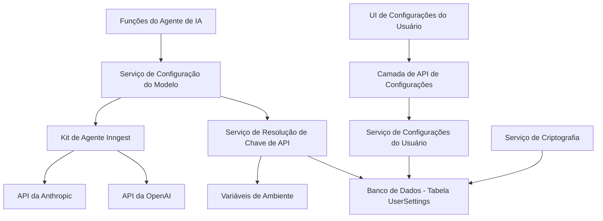

# Documento de Design

## Visão Geral

Esta funcionalidade estenderá o sistema de integração de IA existente para suportar chaves de API fornecidas pelo usuário para os serviços OpenAI e Anthropic. O design aproveita a arquitetura atual usando o kit de agente Inngest, adicionando uma camada de configurações do usuário que permite a configuração dinâmica do modelo com base nas preferências do usuário e na disponibilidade da chave de API.

O sistema manterá a compatibilidade com as chaves de API de nível de sistema existentes, ao mesmo tempo em que oferece aos usuários a flexibilidade de usar suas próprias credenciais e selecionar os modelos preferidos.

## Arquitetura

### Arquitetura de Alto Nível



### Integração de Componentes

O design se integra aos componentes existentes:

-   **Funções Inngest**: Os arquivos `claude-functions.ts` e `functions.ts` atuais serão modificados para usar a configuração dinâmica do modelo
-   **Banco de Dados**: Estende o esquema Prisma com o novo modelo `UserSettings`
-   **API tRPC**: Novos procedimentos para gerenciar as configurações do usuário
-   **Componentes de UI**: Nova página de configurações e componentes de seleção de modelo

## Componentes e Interfaces

### 1. Extensão do Esquema do Banco de Dados

```typescript
// Adição ao prisma/schema.prisma
model UserSettings {
  id                String   @id @default(uuid())
  userId            String   @unique // ID de usuário do Clerk
  openaiApiKey      String?  // Criptografado
  anthropicApiKey   String?  // Criptografado
  preferredProvider String?  // "openai" | "anthropic" | "system"
  openaiModel       String?  // ex: "gpt-4o", "gpt-4o-mini"
  anthropicModel    String?  // ex: "claude-opus-4-20250514", "claude-sonnet-3-5"
  createdAt         DateTime @default(now())
  updatedAt         DateTime @updatedAt
}
```

### 2. Interface do Serviço de Configurações

```typescript
interface UserSettingsService {
  getUserSettings(userId: string): Promise<UserSettings | null>;
  updateApiKey(userId: string, provider: 'openai' | 'anthropic', apiKey: string): Promise<void>;
  removeApiKey(userId: string, provider: 'openai' | 'anthropic'): Promise<void>;
  updateModelPreference(userId: string, provider: string, model: string): Promise<void>;
  validateApiKey(provider: 'openai' | 'anthropic', apiKey: string): Promise<boolean>;
}
```

### 3. Serviço de Configuração do Modelo

```typescript
interface ModelConfigService {
  getModelConfig(userId: string): Promise<ModelConfig>;
  getAvailableModels(userId: string): Promise<AvailableModels>;
}

interface ModelConfig {
  provider: 'openai' | 'anthropic' | 'system';
  model: string;
  apiKey?: string;
}

interface AvailableModels {
  openai: string[];
  anthropic: string[];
}
```

### 4. Serviço de Criptografia

```typescript
interface EncryptionService {
  encrypt(plaintext: string): string;
  decrypt(ciphertext: string): string;
}
```

## Modelos de Dados

### Modelo UserSettings

```typescript
type UserSettings = {
  id: string;
  userId: string;
  openaiApiKey?: string; // Criptografado no banco de dados
  anthropicApiKey?: string; // Criptografado no banco de dados
  preferredProvider?: 'openai' | 'anthropic' | 'system';
  openaiModel?: string;
  anthropicModel?: string;
  createdAt: Date;
  updatedAt: Date;
};
```

### Tipos de Configuração de Modelo

```typescript
type SupportedModels = {
  openai: {
    'gpt-4o': { name: 'GPT-4o'; description: 'Modelo mais capaz' };
    'gpt-4o-mini': { name: 'GPT-4o Mini'; description: 'Rápido e eficiente' };
    'gpt-4-turbo': { name: 'GPT-4 Turbo'; description: 'Geração anterior' };
  };
  anthropic: {
    'claude-opus-4-20250514': { name: 'Claude Opus'; description: 'Modelo mais capaz' };
    'claude-sonnet-3-5': { name: 'Claude Sonnet 3.5'; description: 'Desempenho equilibrado' };
    'claude-haiku-3': { name: 'Claude Haiku 3'; description: 'Rápido e eficiente' };
  };
};
```

## Tratamento de Erros

### Erros de Validação de Chave de API

```typescript
enum ApiKeyError {
  INVALID_FORMAT = 'INVALID_FORMAT',
  UNAUTHORIZED = 'UNAUTHORIZED',
  QUOTA_EXCEEDED = 'QUOTA_EXCEEDED',
  NETWORK_ERROR = 'NETWORK_ERROR',
}

class ApiKeyValidationError extends Error {
  constructor(
    public code: ApiKeyError,
    message: string,
    public provider: 'openai' | 'anthropic',
  ) {
    super(message);
  }
}
```

### Estratégia de Fallback

1.  **Falha na Chave de API do Usuário**: Recorrer à chave de API do sistema
2.  **Falha na Chave de API do Sistema**: Retornar erro ao usuário com mensagem clara
3.  **Modelo Não Disponível**: Recorrer ao modelo padrão do provedor
4.  **Provedor Não Disponível**: Recorrer a um provedor alternativo, se configurado

## Estratégia de Teste

### Testes Unitários

1.  **Testes do Serviço de Criptografia**
    -   Testar a ida e volta da criptografia/descriptografia
    -   Testar com vários comprimentos de entrada
    -   Testar o tratamento de erros para entradas inválidas

2.  **Testes do Serviço de Configurações**
    -   Testar operações CRUD para configurações do usuário
    -   Testar a lógica de validação da chave de API
    -   Testar as atualizações de preferência de modelo

3.  **Testes do Serviço de Configuração do Modelo**
    -   Testar a resolução de configuração de modelo para diferentes estados do usuário
    -   Testar a lógica de fallback
    -   Testar a filtragem de modelos disponíveis

### Testes de Integração

1.  **Testes de Validação de Chave de API**
    -   Testar chamadas de API reais com chaves válidas/inválidas
    -   Testar cenários de limitação de taxa
    -   Testar cenários de falha de rede

2.  **Testes de Fluxo de Configurações de Ponta a Ponta**
    -   Testar a jornada completa do usuário, desde as configurações até a interação com a IA
    -   Testar a troca de modelo durante a conversa
    -   Testar cenários de fallback

### Testes de Segurança

1.  **Testes de Criptografia**
    -   Verificar se as chaves de API nunca são armazenadas em texto simples
    -   Testar cenários de rotação de chaves
    -   Verificar a limpeza adequada da chave na exclusão

2.  **Testes de Controle de Acesso**
    -   Verificar se os usuários só podem acessar suas próprias configurações
    -   Testar tentativas de acesso não autorizado
    -   Verificar o mascaramento da chave de API nas respostas

## Considerações de Implementação

### Segurança

-   **Criptografia em Repouso**: Todas as chaves de API criptografadas usando AES-256-GCM
-   **Gerenciamento de Chave de Criptografia**: Usar variável de ambiente para a chave de criptografia
-   **Mascaramento de Chave de API**: Exibir apenas os últimos 4 caracteres na UI
-   **Transmissão Segura**: Apenas HTTPS para todas as operações de chave de API

### Desempenho

-   **Cache**: Armazenar em cache as chaves de API descriptografadas na memória apenas durante a requisição
-   **Pool de Conexões**: Reutilizar conexões HTTP para chamadas de API
-   **Carregamento Lento**: Carregar as configurações do usuário apenas quando necessário

### Escalabilidade

-   **Indexação de Banco de Dados**: Indexar por `userId` para buscas rápidas
-   **Limitação de Taxa de API**: Respeitar os limites de taxa do provedor
-   **Degradação Graciosa**: Recorrer às chaves do sistema quando as chaves do usuário falham

### Monitoramento

-   **Rastreamento de Uso de Chave de API**: Registrar o uso sem expor as chaves
-   **Monitoramento de Erros**: Rastrear falhas de validação e fallbacks
-   **Métricas de Desempenho**: Monitorar os tempos de resposta da API por provedor

## Estratégia de Migração

### Migração de Banco de Dados

1.  Adicionar a tabela `UserSettings` com os índices adequados
2.  Migrar os usuários existentes para terem as preferências padrão do sistema
3.  Adicionar restrições de chave estrangeira e regras de validação

### Migração de Código

1.  **Fase 1**: Adicionar a infraestrutura de configurações sem alterar as funções de IA
2.  **Fase 2**: Modificar as funções de IA para usar a configuração dinâmica
3.  **Fase 3**: Adicionar componentes de UI e recursos voltados para o usuário
4.  **Fase 4**: Adicionar recursos avançados como a troca de modelo no meio da conversa

### Compatibilidade com Versões Anteriores

-   As funções de IA existentes continuam a funcionar com as chaves do sistema
-   Novos usuários recebem os padrões do sistema até que configurem chaves personalizadas
-   Nenhuma alteração que quebre os contratos de API existentes