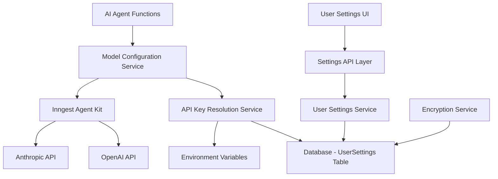

# Design Document

## Overview

This feature will extend the existing AI integration system to support user-provided API keys for OpenAI and Anthropic services. The design leverages the current architecture using Inngest agent-kit while adding a user settings layer that allows for dynamic model configuration based on user preferences and API key availability.

The system will maintain backward compatibility with existing system-level API keys while providing users the flexibility to use their own credentials and select preferred models.

## Architecture

### High-Level Architecture



### Component Integration

The design integrates with existing components:

- **Inngest Functions**: Current `claude-functions.ts` and `functions.ts` will be modified to use dynamic model configuration
- **Database**: Extends Prisma schema with new `UserSettings` model
- **tRPC API**: New procedures for managing user settings
- **UI Components**: New settings page and model selection components

## Components and Interfaces

### 1. Database Schema Extension

```typescript
// Addition to prisma/schema.prisma
model UserSettings {
  id                String   @id @default(uuid())
  userId            String   @unique // Clerk user ID
  openaiApiKey      String?  // Encrypted
  anthropicApiKey   String?  // Encrypted
  preferredProvider String?  // "openai" | "anthropic" | "system"
  openaiModel       String?  // e.g., "gpt-4o", "gpt-4o-mini"
  anthropicModel    String?  // e.g., "claude-opus-4-20250514", "claude-sonnet-3-5"
  createdAt         DateTime @default(now())
  updatedAt         DateTime @updatedAt
}
```

### 2. Settings Service Interface

```typescript
interface UserSettingsService {
  getUserSettings(userId: string): Promise<UserSettings | null>;
  updateApiKey(userId: string, provider: 'openai' | 'anthropic', apiKey: string): Promise<void>;
  removeApiKey(userId: string, provider: 'openai' | 'anthropic'): Promise<void>;
  updateModelPreference(userId: string, provider: string, model: string): Promise<void>;
  validateApiKey(provider: 'openai' | 'anthropic', apiKey: string): Promise<boolean>;
}
```

### 3. Model Configuration Service

```typescript
interface ModelConfigService {
  getModelConfig(userId: string): Promise<ModelConfig>;
  getAvailableModels(userId: string): Promise<AvailableModels>;
}

interface ModelConfig {
  provider: 'openai' | 'anthropic' | 'system';
  model: string;
  apiKey?: string;
}

interface AvailableModels {
  openai: string[];
  anthropic: string[];
}
```

### 4. Encryption Service

```typescript
interface EncryptionService {
  encrypt(plaintext: string): string;
  decrypt(ciphertext: string): string;
}
```

## Data Models

### UserSettings Model

```typescript
type UserSettings = {
  id: string;
  userId: string;
  openaiApiKey?: string; // Encrypted in database
  anthropicApiKey?: string; // Encrypted in database
  preferredProvider?: 'openai' | 'anthropic' | 'system';
  openaiModel?: string;
  anthropicModel?: string;
  createdAt: Date;
  updatedAt: Date;
};
```

### Model Configuration Types

```typescript
type SupportedModels = {
  openai: {
    'gpt-4o': { name: 'GPT-4o'; description: 'Most capable model' };
    'gpt-4o-mini': { name: 'GPT-4o Mini'; description: 'Fast and efficient' };
    'gpt-4-turbo': { name: 'GPT-4 Turbo'; description: 'Previous generation' };
  };
  anthropic: {
    'claude-opus-4-20250514': { name: 'Claude Opus'; description: 'Most capable model' };
    'claude-sonnet-3-5': { name: 'Claude Sonnet 3.5'; description: 'Balanced performance' };
    'claude-haiku-3': { name: 'Claude Haiku 3'; description: 'Fast and efficient' };
  };
};
```

## Error Handling

### API Key Validation Errors

```typescript
enum ApiKeyError {
  INVALID_FORMAT = 'INVALID_FORMAT',
  UNAUTHORIZED = 'UNAUTHORIZED',
  QUOTA_EXCEEDED = 'QUOTA_EXCEEDED',
  NETWORK_ERROR = 'NETWORK_ERROR',
}

class ApiKeyValidationError extends Error {
  constructor(
    public code: ApiKeyError,
    message: string,
    public provider: 'openai' | 'anthropic',
  ) {
    super(message);
  }
}
```

### Fallback Strategy

1. **User API Key Fails**: Fall back to system API key
2. **System API Key Fails**: Return error to user with clear message
3. **Model Not Available**: Fall back to default model for provider
4. **Provider Not Available**: Fall back to alternative provider if configured

## Testing Strategy

### Unit Tests

1. **Encryption Service Tests**
   - Test encryption/decryption roundtrip
   - Test with various input lengths
   - Test error handling for invalid inputs

2. **Settings Service Tests**
   - Test CRUD operations for user settings
   - Test API key validation logic
   - Test model preference updates

3. **Model Configuration Service Tests**
   - Test model config resolution for different user states
   - Test fallback logic
   - Test available models filtering

### Integration Tests

1. **API Key Validation Tests**
   - Test actual API calls with valid/invalid keys
   - Test rate limiting scenarios
   - Test network failure scenarios

2. **End-to-End Settings Flow**
   - Test complete user journey from settings to AI interaction
   - Test model switching during conversation
   - Test fallback scenarios

### Security Tests

1. **Encryption Tests**
   - Verify API keys are never stored in plaintext
   - Test key rotation scenarios
   - Verify proper key cleanup on deletion

2. **Access Control Tests**
   - Verify users can only access their own settings
   - Test unauthorized access attempts
   - Verify API key masking in responses

## Implementation Considerations

### Security

- **Encryption at Rest**: All API keys encrypted using AES-256-GCM
- **Encryption Key Management**: Use environment variable for encryption key
- **API Key Masking**: Display only last 4 characters in UI
- **Secure Transmission**: HTTPS only for all API key operations

### Performance

- **Caching**: Cache decrypted API keys in memory for request duration only
- **Connection Pooling**: Reuse HTTP connections for API calls
- **Lazy Loading**: Load user settings only when needed

### Scalability

- **Database Indexing**: Index on userId for fast lookups
- **API Rate Limiting**: Respect provider rate limits
- **Graceful Degradation**: Fall back to system keys when user keys fail

### Monitoring

- **API Key Usage Tracking**: Log usage without exposing keys
- **Error Monitoring**: Track validation failures and fallbacks
- **Performance Metrics**: Monitor API response times by provider

## Migration Strategy

### Database Migration

1. Add UserSettings table with proper indexes
2. Migrate existing users to have default system preferences
3. Add foreign key constraints and validation rules

### Code Migration

1. **Phase 1**: Add settings infrastructure without changing AI functions
2. **Phase 2**: Modify AI functions to use dynamic configuration
3. **Phase 3**: Add UI components and user-facing features
4. **Phase 4**: Add advanced features like model switching mid-conversation

### Backward Compatibility

- Existing AI functions continue to work with system keys
- New users get system defaults until they configure custom keys
- No breaking changes to existing API contracts
