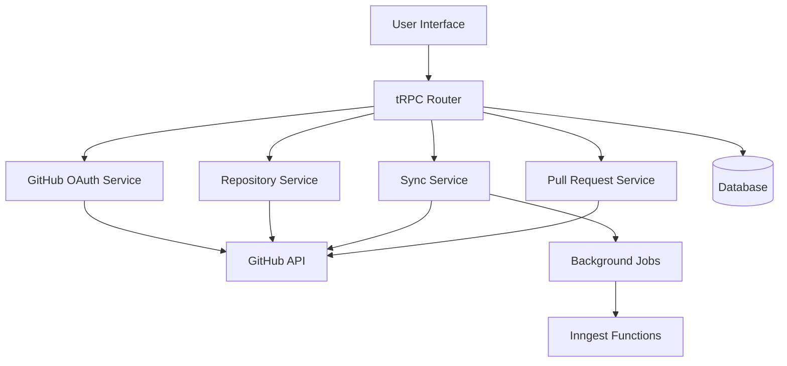

# GitHub Integration Design Document

## Overview

The GitHub Integration feature enables seamless connection between user projects and GitHub repositories. The system will provide OAuth-based authentication, repository creation, automatic synchronization, pull request management, and comprehensive status tracking. The integration leverages GitHub's REST and GraphQL APIs while maintaining the existing tRPC-based architecture.

## Architecture

### High-Level Architecture



### Component Interaction Flow

1. **Authentication Flow**: User initiates GitHub connection → OAuth redirect → Token exchange → Store credentials
2. **Repository Creation**: User requests repo creation → Validate settings → Create GitHub repo → Push initial files
3. **Sync Flow**: File changes detected → Create commit → Push to GitHub → Update status
4. **PR Flow**: User creates PR → Create branch → Push changes → Create GitHub PR

## Components and Interfaces

### Database Schema Extensions

```typescript
// Add to prisma/schema.prisma
model GitHubIntegration {
  id            String   @id @default(uuid())
  projectId     String   @unique
  project       Project  @relation(fields: [projectId], references: [id], onDelete: Cascade)

  // GitHub repository info
  repositoryId  String   // GitHub repository ID
  repositoryName String  // owner/repo format
  repositoryUrl String

  // Authentication
  accessToken   String   // Encrypted GitHub access token
  refreshToken  String?  // Encrypted refresh token if applicable
  tokenExpiry   DateTime?

  // Configuration
  autoSync      Boolean  @default(true)
  syncBranch    String   @default("main")
  commitTemplate String @default("Update from project: {{timestamp}}")
  excludePatterns String[] @default([])

  // Status tracking
  lastSyncAt    DateTime?
  syncStatus    SyncStatus @default(IDLE)
  lastError     String?

  createdAt     DateTime @default(now())
  updatedAt     DateTime @updatedAt

  syncHistory   SyncHistory[]

  @@index([projectId])
}

model SyncHistory {
  id              String   @id @default(uuid())
  integrationId   String
  integration     GitHubIntegration @relation(fields: [integrationId], references: [id], onDelete: Cascade)

  commitSha       String?
  commitMessage   String
  filesChanged    String[] // Array of file paths
  syncType        SyncType // COMMIT, PR, MANUAL
  status          SyncStatus
  errorMessage    String?

  createdAt       DateTime @default(now())

  @@index([integrationId])
  @@index([createdAt])
}

enum SyncStatus {
  IDLE
  SYNCING
  SUCCESS
  ERROR
  CONFLICT
}

enum SyncType {
  COMMIT
  PR
  MANUAL
  INITIAL
}
```

### GitHub Service Layer

```typescript
// src/lib/github.ts
export interface GitHubService {
  // Authentication
  getAuthUrl(state: string): string;
  exchangeCodeForToken(code: string): Promise<GitHubTokens>;
  refreshToken(refreshToken: string): Promise<GitHubTokens>;

  // Repository operations
  createRepository(token: string, options: CreateRepoOptions): Promise<GitHubRepository>;
  getRepository(token: string, owner: string, repo: string): Promise<GitHubRepository>;

  // File operations
  createOrUpdateFile(
    token: string,
    repo: string,
    path: string,
    content: string,
    message: string,
  ): Promise<void>;
  createCommit(token: string, repo: string, files: FileChange[], message: string): Promise<string>;

  // Branch and PR operations
  createBranch(token: string, repo: string, branchName: string, fromBranch: string): Promise<void>;
  createPullRequest(
    token: string,
    repo: string,
    options: CreatePROptions,
  ): Promise<GitHubPullRequest>;
}
```

### tRPC Router Structure

```typescript
// src/modules/github/server/procedures.ts
export const githubRouter = createTRPCRouter({
  // Authentication procedures
  getAuthUrl: protectedProcedure.query(),
  connectRepository: protectedProcedure.input(connectSchema).mutation(),
  disconnect: protectedProcedure.input(projectIdSchema).mutation(),

  // Repository procedures
  createRepository: protectedProcedure.input(createRepoSchema).mutation(),
  getIntegrationStatus: protectedProcedure.input(projectIdSchema).query(),

  // Sync procedures
  syncNow: protectedProcedure.input(projectIdSchema).mutation(),
  getSyncHistory: protectedProcedure.input(syncHistorySchema).query(),
  updateSyncSettings: protectedProcedure.input(syncSettingsSchema).mutation(),

  // Pull request procedures
  createPullRequest: protectedProcedure.input(createPRSchema).mutation(),
  getPullRequests: protectedProcedure.input(projectIdSchema).query(),
});
```

### UI Components

```typescript
// Component hierarchy
GitHubIntegrationPanel
├── ConnectionStatus
├── RepositorySettings
├── SyncControls
│   ├── AutoSyncToggle
│   ├── ManualSyncButton
│   └── SyncHistory
├── PullRequestManager
│   ├── CreatePRForm
│   └── PRList
└── SettingsPanel
    ├── CommitTemplateEditor
    ├── ExcludePatterns
    └── DisconnectButton
```

## Data Models

### Core Data Types

```typescript
interface GitHubTokens {
  accessToken: string;
  refreshToken?: string;
  expiresIn?: number;
  scope: string[];
}

interface GitHubRepository {
  id: number;
  name: string;
  fullName: string; // owner/repo
  htmlUrl: string;
  private: boolean;
  defaultBranch: string;
}

interface FileChange {
  path: string;
  content: string;
  encoding: 'utf-8' | 'base64';
  operation: 'create' | 'update' | 'delete';
}

interface SyncResult {
  success: boolean;
  commitSha?: string;
  filesChanged: string[];
  error?: string;
}

interface CreatePROptions {
  title: string;
  body: string;
  head: string; // branch name
  base: string; // target branch
  draft?: boolean;
}
```

### Configuration Models

```typescript
interface SyncSettings {
  autoSync: boolean;
  syncBranch: string;
  commitTemplate: string;
  excludePatterns: string[];
  syncOnSave: boolean;
  batchCommits: boolean;
  batchTimeout: number; // minutes
}

interface IntegrationStatus {
  connected: boolean;
  repository?: GitHubRepository;
  lastSync?: Date;
  syncStatus: SyncStatus;
  pendingChanges: number;
  error?: string;
}
```

## Error Handling

### Error Categories

1. **Authentication Errors**
   - Token expired/invalid
   - Insufficient permissions
   - OAuth flow interruption

2. **Repository Errors**
   - Repository not found
   - Access denied
   - Repository creation failures

3. **Sync Errors**
   - Merge conflicts
   - File size limits
   - Network timeouts
   - Rate limiting

4. **Validation Errors**
   - Invalid repository names
   - Malformed file content
   - Configuration validation

### Error Recovery Strategies

```typescript
interface ErrorHandler {
  handleAuthError(error: GitHubAuthError): Promise<void>;
  handleSyncError(error: SyncError): Promise<SyncResult>;
  handleRateLimitError(error: RateLimitError): Promise<void>;
  handleConflictError(error: ConflictError): Promise<ConflictResolution>;
}
```

### User-Facing Error Messages

- Clear, actionable error descriptions
- Suggested resolution steps
- Retry mechanisms where appropriate
- Fallback to manual operations

## Testing Strategy

### Unit Testing

1. **Service Layer Tests**
   - GitHub API client mocking
   - Token management validation
   - File operation testing
   - Error handling verification

2. **Database Layer Tests**
   - Integration model CRUD operations
   - Sync history tracking
   - Data consistency validation

3. **Business Logic Tests**
   - Sync algorithm testing
   - Conflict resolution logic
   - Configuration validation

### Integration Testing

1. **GitHub API Integration**
   - OAuth flow end-to-end
   - Repository operations
   - File synchronization
   - Pull request creation

2. **Database Integration**
   - Transaction handling
   - Concurrent access scenarios
   - Data migration testing

### End-to-End Testing

1. **User Workflows**
   - Complete integration setup
   - File sync scenarios
   - Pull request workflows
   - Error recovery flows

2. **Performance Testing**
   - Large file synchronization
   - Batch operation performance
   - Rate limit handling
   - Concurrent user scenarios

### Security Testing

1. **Token Security**
   - Encryption validation
   - Token rotation testing
   - Access scope verification

2. **Data Protection**
   - Sensitive data handling
   - Audit trail validation
   - Permission boundary testing

## Implementation Considerations

### Security

- Encrypt GitHub tokens at rest using industry-standard encryption
- Implement token rotation and refresh mechanisms
- Validate GitHub webhook signatures for security
- Audit all GitHub API interactions
- Implement proper access control for integration settings

### Performance

- Implement efficient file diffing algorithms
- Use batch operations for multiple file changes
- Implement intelligent sync scheduling to avoid rate limits
- Cache repository metadata to reduce API calls
- Optimize database queries with proper indexing

### Scalability

- Design for horizontal scaling of sync operations
- Implement queue-based processing for background sync
- Use connection pooling for GitHub API requests
- Implement circuit breakers for API resilience
- Plan for multi-tenant isolation

### Monitoring and Observability

- Track sync success/failure rates
- Monitor GitHub API rate limit usage
- Log all integration events for debugging
- Implement health checks for GitHub connectivity
- Create dashboards for integration metrics
