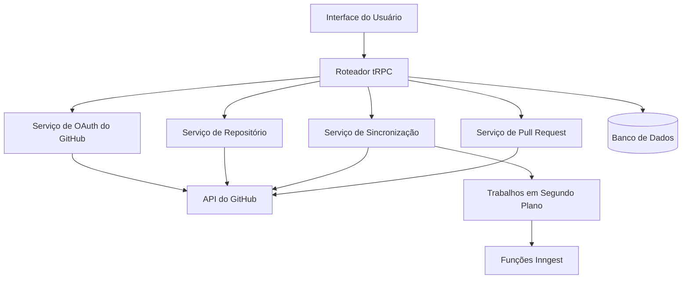

# Documento de Design de Integração com o GitHub

## Visão Geral

A funcionalidade de Integração com o GitHub permite uma conexão perfeita entre os projetos do usuário e os repositórios do GitHub. O sistema fornecerá autenticação baseada em OAuth, criação de repositórios, sincronização automática, gerenciamento de pull requests e rastreamento abrangente de status. A integração aproveita as APIs REST e GraphQL do GitHub, mantendo a arquitetura existente baseada em tRPC.

## Arquitetura

### Arquitetura de Alto Nível



### Fluxo de Interação dos Componentes

1.  **Fluxo de Autenticação**: O usuário inicia a conexão com o GitHub → Redirecionamento OAuth → Troca de token → Armazenar credenciais
2.  **Criação de Repositório**: O usuário solicita a criação do repositório → Validar configurações → Criar repositório no GitHub → Enviar arquivos iniciais
3.  **Fluxo de Sincronização**: Alterações de arquivo detectadas → Criar commit → Enviar para o GitHub → Atualizar status
4.  **Fluxo de PR**: O usuário cria PR → Criar branch → Enviar alterações → Criar PR no GitHub

## Componentes e Interfaces

### Extensões do Esquema do Banco de Dados

```typescript
// Adicionar ao prisma/schema.prisma
model GitHubIntegration {
  id            String   @id @default(uuid())
  projectId     String   @unique
  project       Project  @relation(fields: [projectId], references: [id], onDelete: Cascade)

  // Informações do repositório do GitHub
  repositoryId  String   // ID do repositório do GitHub
  repositoryName String  // formato proprietário/repositório
  repositoryUrl String

  // Autenticação
  accessToken   String   // Token de acesso do GitHub criptografado
  refreshToken  String?  // Token de atualização criptografado, se aplicável
  tokenExpiry   DateTime?

  // Configuração
  autoSync      Boolean  @default(true)
  syncBranch    String   @default("main")
  commitTemplate String @default("Atualização do projeto: {{timestamp}}")
  excludePatterns String[] @default([])

  // Rastreamento de status
  lastSyncAt    DateTime?
  syncStatus    SyncStatus @default(IDLE)
  lastError     String?

  createdAt     DateTime @default(now())
  updatedAt     DateTime @updatedAt

  syncHistory   SyncHistory[]

  @@index([projectId])
}

model SyncHistory {
  id              String   @id @default(uuid())
  integrationId   String
  integration     GitHubIntegration @relation(fields: [integrationId], references: [id], onDelete: Cascade)

  commitSha       String?
  commitMessage   String
  filesChanged    String[] // Array de caminhos de arquivo
  syncType        SyncType // COMMIT, PR, MANUAL
  status          SyncStatus
  errorMessage    String?

  createdAt       DateTime @default(now())

  @@index([integrationId])
  @@index([createdAt])
}

enum SyncStatus {
  IDLE
  SYNCING
  SUCCESS
  ERROR
  CONFLICT
}

enum SyncType {
  COMMIT
  PR
  MANUAL
  INITIAL
}
```

### Camada de Serviço do GitHub

```typescript
// src/lib/github.ts
export interface GitHubService {
  // Autenticação
  getAuthUrl(state: string): string;
  exchangeCodeForToken(code: string): Promise<GitHubTokens>;
  refreshToken(refreshToken: string): Promise<GitHubTokens>;

  // Operações de repositório
  createRepository(token: string, options: CreateRepoOptions): Promise<GitHubRepository>;
  getRepository(token: string, owner: string, repo: string): Promise<GitHubRepository>;

  // Operações de arquivo
  createOrUpdateFile(
    token: string,
    repo: string,
    path: string,
    content: string,
    message: string,
  ): Promise<void>;
  createCommit(token: string, repo: string, files: FileChange[], message: string): Promise<string>;

  // Operações de branch e PR
  createBranch(token: string, repo: string, branchName: string, fromBranch: string): Promise<void>;
  createPullRequest(
    token: string,
    repo: string,
    options: CreatePROptions,
  ): Promise<GitHubPullRequest>;
}
```

### Estrutura do Roteador tRPC

```typescript
// src/modules/github/server/procedures.ts
export const githubRouter = createTRPCRouter({
  // Procedimentos de autenticação
  getAuthUrl: protectedProcedure.query(),
  connectRepository: protectedProcedure.input(connectSchema).mutation(),
  disconnect: protectedProcedure.input(projectIdSchema).mutation(),

  // Procedimentos de repositório
  createRepository: protectedProcedure.input(createRepoSchema).mutation(),
  getIntegrationStatus: protectedProcedure.input(projectIdSchema).query(),

  // Procedimentos de sincronização
  syncNow: protectedProcedure.input(projectIdSchema).mutation(),
  getSyncHistory: protectedProcedure.input(syncHistorySchema).query(),
  updateSyncSettings: protectedProcedure.input(syncSettingsSchema).mutation(),

  // Procedimentos de pull request
  createPullRequest: protectedProcedure.input(createPRSchema).mutation(),
  getPullRequests: protectedProcedure.input(projectIdSchema).query(),
});
```

### Componentes da UI

```typescript
// Hierarquia de componentes
GitHubIntegrationPanel
├── ConnectionStatus
├── RepositorySettings
├── SyncControls
│   ├── AutoSyncToggle
│   ├── ManualSyncButton
│   └── SyncHistory
├── PullRequestManager
│   ├── CreatePRForm
│   └── PRList
└── SettingsPanel
    ├── CommitTemplateEditor
    ├── ExcludePatterns
    └── DisconnectButton
```

## Modelos de Dados

### Tipos de Dados Principais

```typescript
interface GitHubTokens {
  accessToken: string;
  refreshToken?: string;
  expiresIn?: number;
  scope: string[];
}

interface GitHubRepository {
  id: number;
  name: string;
  fullName: string; // proprietário/repositório
  htmlUrl: string;
  private: boolean;
  defaultBranch: string;
}

interface FileChange {
  path: string;
  content: string;
  encoding: 'utf-8' | 'base64';
  operation: 'create' | 'update' | 'delete';
}

interface SyncResult {
  success: boolean;
  commitSha?: string;
  filesChanged: string[];
  error?: string;
}

interface CreatePROptions {
  title: string;
  body: string;
  head: string; // nome do branch
  base: string; // branch de destino
  draft?: boolean;
}
```

### Modelos de Configuração

```typescript
interface SyncSettings {
  autoSync: boolean;
  syncBranch: string;
  commitTemplate: string;
  excludePatterns: string[];
  syncOnSave: boolean;
  batchCommits: boolean;
  batchTimeout: number; // minutos
}

interface IntegrationStatus {
  connected: boolean;
  repository?: GitHubRepository;
  lastSync?: Date;
  syncStatus: SyncStatus;
  pendingChanges: number;
  error?: string;
}
```

## Tratamento de Erros

### Categorias de Erros

1.  **Erros de Autenticação**
    -   Token expirado/inválido
    -   Permissões insuficientes
    -   Interrupção do fluxo OAuth

2.  **Erros de Repositório**
    -   Repositório não encontrado
    -   Acesso negado
    -   Falhas na criação do repositório

3.  **Erros de Sincronização**
    -   Conflitos de mesclagem
    -   Limites de tamanho de arquivo
    -   Tempos limite de rede
    -   Limitação de taxa

4.  **Erros de Validação**
    -   Nomes de repositório inválidos
    -   Conteúdo de arquivo malformado
    -   Validação de configuração

### Estratégias de Recuperação de Erros

```typescript
interface ErrorHandler {
  handleAuthError(error: GitHubAuthError): Promise<void>;
  handleSyncError(error: SyncError): Promise<SyncResult>;
  handleRateLimitError(error: RateLimitError): Promise<void>;
  handleConflictError(error: ConflictError): Promise<ConflictResolution>;
}
```

### Mensagens de Erro Voltadas para o Usuário

-   Descrições de erro claras e acionáveis
-   Etapas de resolução sugeridas
-   Mecanismos de nova tentativa quando apropriado
-   Fallback para operações manuais

## Estratégia de Teste

### Teste Unitário

1.  **Testes da Camada de Serviço**
    -   Mocking do cliente da API do GitHub
    -   Validação do gerenciamento de tokens
    -   Teste de operação de arquivo
    -   Verificação do tratamento de erros

2.  **Testes da Camada de Banco de Dados**
    -   Operações CRUD do modelo de integração
    -   Rastreamento do histórico de sincronização
    -   Validação da consistência dos dados

3.  **Testes de Lógica de Negócios**
    -   Teste do algoritmo de sincronização
    -   Lógica de resolução de conflitos
    -   Validação de configuração

### Teste de Integração

1.  **Integração com a API do GitHub**
    -   Fluxo OAuth de ponta a ponta
    -   Operações de repositório
    -   Sincronização de arquivos
    -   Criação de pull request

2.  **Integração com o Banco de Dados**
    -   Manipulação de transações
    -   Cenários de acesso concorrente
    -   Teste de migração de dados

### Teste de Ponta a Ponta

1.  **Fluxos de Trabalho do Usuário**
    -   Configuração completa da integração
    -   Cenários de sincronização de arquivos
    -   Fluxos de trabalho de pull request
    -   Fluxos de recuperação de erros

2.  **Teste de Desempenho**
    -   Sincronização de arquivos grandes
    -   Desempenho de operação em lote
    -   Manipulação de limite de taxa
    -   Cenários de usuário concorrente

### Teste de Segurança

1.  **Segurança de Token**
    -   Validação de criptografia
    -   Teste de rotação de token
    -   Verificação do escopo de acesso

2.  **Proteção de Dados**
    -   Manipulação de dados sensíveis
    -   Validação da trilha de auditoria
    -   Teste de limite de permissão

## Considerações de Implementação

### Segurança

-   Criptografar tokens do GitHub em repouso usando criptografia padrão da indústria
-   Implementar mecanismos de rotação e atualização de tokens
-   Validar assinaturas de webhook do GitHub para segurança
-   Auditar todas as interações da API do GitHub
-   Implementar controle de acesso adequado para as configurações de integração

### Desempenho

-   Implementar algoritmos eficientes de diferenciação de arquivos
-   Usar operações em lote para várias alterações de arquivo
-   Implementar agendamento de sincronização inteligente para evitar limites de taxa
-   Armazenar em cache os metadados do repositório para reduzir as chamadas de API
-   Otimizar as consultas ao banco de dados com indexação adequada

### Escalabilidade

-   Projetar para escalabilidade horizontal das operações de sincronização
-   Implementar processamento baseado em fila para sincronização em segundo plano
-   Usar pool de conexões para solicitações da API do GitHub
-   Implementar disjuntores para resiliência da API
-   Planejar o isolamento multilocatário

### Monitoramento e Observabilidade

-   Rastrear taxas de sucesso/falha de sincronização
-   Monitorar o uso do limite de taxa da API do GitHub
-   Registrar todos os eventos de integração para depuração
-   Implementar verificações de saúde para a conectividade com o GitHub
-   Criar painéis para métricas de integração