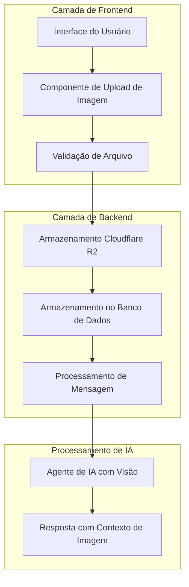

# Documento de Design

## Visão Geral

Esta funcionalidade adiciona capacidades multimodais ao sistema de prompt existente, permitindo que os usuários façam upload e incluam imagens junto com seus prompts de texto. O sistema integrará o Cloudflare R2 para armazenamento de imagens seguro e escalável e estenderá a arquitetura de mensagens atual para suportar anexos de imagem. O agente de IA receberá dados de texto e imagem para fornecer análise visual e assistência abrangentes.

## Arquitetura

### Arquitetura de Alto Nível



### Integração da Pilha de Tecnologia

-   **Frontend**: Componentes React com arrastar e soltar usando APIs nativas do HTML5
-   **Backend**: Procedimentos tRPC para upload de imagens e manipulação de mensagens
-   **Armazenamento**: Cloudflare R2 para armazenamento de imagens com URLs assinadas
-   **Banco de Dados**: PostgreSQL com Prisma ORM para armazenamento de metadados
-   **Integração de IA**: Funções Inngest estendidas para lidar com prompts multimodais

## Componentes e Interfaces

### 1. Componentes de Frontend

#### Componente ImageUploadZone

```typescript
interface ImageUploadZoneProps {
  onImageUpload: (images: UploadedImage[]) => void;
  maxImages?: number;
  maxFileSize?: number;
  acceptedFormats?: string[];
  disabled?: boolean;
}

interface UploadedImage {
  id: string;
  file: File;
  preview: string;
  uploadStatus: 'pending' | 'uploading' | 'success' | 'error';
  url?: string;
  error?: string;
}
```

#### Componente ImagePreview

```typescript
interface ImagePreviewProps {
  images: UploadedImage[];
  onRemove: (imageId: string) => void;
  onReorder: (fromIndex: number, toIndex: number) => void;
  readonly?: boolean;
}
```

#### Componente MessageForm Aprimorado

-   Estende o MessageForm existente para incluir a funcionalidade de upload de imagem
-   Mantém o comportamento de entrada de texto atual enquanto adiciona suporte a imagens
-   Integra-se com a validação e o envio de formulários existentes

### 2. Interfaces da API de Backend

#### Procedimentos tRPC de Upload de Imagem

```typescript
// Novo roteador: src/modules/images/server/procedures.ts
export const imagesRouter = createTRPCRouter({
  upload: protectedProcedure
    .input(
      z.object({
        fileName: z.string(),
        fileType: z.string(),
        fileSize: z.number(),
      }),
    )
    .mutation(async ({ input, ctx }) => {
      // Retorna a URL de upload assinada e os metadados da imagem
    }),

  getSignedUrl: protectedProcedure
    .input(
      z.object({
        imageId: z.string(),
      }),
    )
    .query(async ({ input, ctx }) => {
      // Retorna a URL de download assinada para acesso à imagem
    }),
});
```

#### Procedimentos de Mensagens Aprimorados

```typescript
// Esquema de entrada estendido para criação de mensagem
const createMessageSchema = z.object({
  value: z.string().min(1).max(10000),
  projectId: z.string().min(1),
  images: z
    .array(
      z.object({
        id: z.string(),
        url: z.string(),
        fileName: z.string(),
        fileType: z.string(),
        fileSize: z.number(),
      }),
    )
    .optional(),
});
```

### 3. Integração com o Cloudflare R2

#### Camada de Serviço R2

```typescript
// src/lib/r2.ts
export class R2Service {
  async generateUploadUrl(key: string, contentType: string): Promise<string>;
  async generateDownloadUrl(key: string, expiresIn?: number): Promise<string>;
  async deleteObject(key: string): Promise<void>;
  async getObjectMetadata(key: string): Promise<ObjectMetadata>;
}
```

#### Configuração

-   Nomenclatura do bucket: `{environment}-user-images` (ex: `prod-user-images`)
-   Estrutura da chave do objeto: `{userId}/{projectId}/{messageId}/{imageId}.{ext}`
-   Expiração da URL assinada: 1 hora para uploads, 24 horas para downloads
-   Configuração de CORS para uploads diretos do navegador

## Modelos de Dados

### Extensões do Esquema do Banco de Dados

#### Nova Tabela de Imagens

```sql
CREATE TABLE "Image" (
  "id" TEXT NOT NULL PRIMARY KEY,
  "messageId" TEXT NOT NULL,
  "fileName" TEXT NOT NULL,
  "fileType" TEXT NOT NULL,
  "fileSize" INTEGER NOT NULL,
  "r2Key" TEXT NOT NULL,
  "r2Url" TEXT,
  "createdAt" TIMESTAMP(3) NOT NULL DEFAULT CURRENT_TIMESTAMP,
  "updatedAt" TIMESTAMP(3) NOT NULL,

  CONSTRAINT "Image_messageId_fkey" FOREIGN KEY ("messageId")
    REFERENCES "Message"("id") ON DELETE CASCADE ON UPDATE CASCADE
);

CREATE INDEX "Image_messageId_idx" ON "Image"("messageId");
```

#### Adição ao Esquema Prisma

```prisma
model Image {
  id        String   @id @default(uuid())
  messageId String
  message   Message  @relation(fields: [messageId], references: [id], onDelete: Cascade)

  fileName  String
  fileType  String
  fileSize  Int
  r2Key     String   @unique
  r2Url     String?

  createdAt DateTime @default(now())
  updatedAt DateTime @updatedAt

  @@index([messageId])
}

// Modelo de Mensagem estendido
model Message {
  // ... campos existentes
  images    Image[]
}
```

### Regras de Validação de Arquivo

#### Formatos Suportados

-   **Tipos de Imagem**: PNG, JPEG, JPG, GIF, WebP
-   **Tipos MIME**: `image/png`, `image/jpeg`, `image/gif`, `image/webp`
-   **Extensões de Arquivo**: `.png`, `.jpg`, `.jpeg`, `.gif`, `.webp`

#### Limites de Tamanho

-   **Tamanho Máximo do Arquivo**: 10MB por imagem
-   **Máximo de Imagens**: 5 imagens por mensagem
-   **Limite de Tamanho Total**: 50MB por mensagem

#### Validação de Segurança

-   Verificação do tipo MIME em relação aos cabeçalhos do arquivo
-   Validação da assinatura do arquivo
-   Verificação de malware (análise básica de cabeçalho)
-   Validação do cabeçalho Content-Type

## Tratamento de Erros

### Cenários de Erro de Upload

#### Erros do Lado do Cliente

```typescript
enum UploadErrorType {
  FILE_TOO_LARGE = 'FILE_TOO_LARGE',
  INVALID_FORMAT = 'INVALID_FORMAT',
  TOO_MANY_FILES = 'TOO_MANY_FILES',
  NETWORK_ERROR = 'NETWORK_ERROR',
  UPLOAD_FAILED = 'UPLOAD_FAILED',
}

interface UploadError {
  type: UploadErrorType;
  message: string;
  fileName?: string;
}
```

#### Tratamento de Erros do Lado do Servidor

-   **Erros do Serviço R2**: Lógica de nova tentativa com recuo exponencial
-   **Erros do Banco de Dados**: Reversão da transação para falha no armazenamento de metadados de imagem
-   **Erros de Validação**: Mensagens de erro claras com falhas de validação específicas
-   **Limitação de Taxa**: Integração com o sistema de uso/crédito existente

### Estratégias de Fallback

-   **R2 Indisponível**: Degradação graciosa para o modo somente texto com notificação ao usuário
-   **Tempo Limite de Upload**: Nova tentativa automática com indicação de progresso
-   **Falha de Upload Parcial**: Permitir o envio de mensagens com imagens carregadas com sucesso

## Integração de IA

### Processamento de Prompt Multimodal

#### Função Inngest Aprimorada

```typescript
// src/inngest/claude-functions.ts - Aprimorado para imagens
export const codeAgentRun = inngest.createFunction(
  { id: 'code-agent-run' },
  { event: 'code-agent/run' },
  async ({ event, step }) => {
    const { value, projectId, images } = event.data;

    // Processar imagens para o contexto da IA
    const imageContexts = await step.run('process-images', async () => {
      return await processImagesForAI(images);
    });

    // Prompt aprimorado com contexto de imagem
    const enhancedPrompt = await step.run('create-multimodal-prompt', async () => {
      return createMultimodalPrompt(value, imageContexts);
    });

    // Enviar para a IA com capacidades de visão
    // ... lógica de processamento de IA existente
  },
);
```

#### Processamento de Contexto de Imagem

-   **Análise de Imagem**: Extrair informações visuais relevantes para o contexto da IA
-   **Geração de URL**: Criar URLs acessíveis para o consumo do modelo de IA
-   **Enriquecimento de Metadados**: Incluir dimensões da imagem, formato e descrição
-   **Otimização de Contexto**: Otimizar os dados da imagem para os limites de entrada do modelo de IA

### Integração do Modelo de IA

-   **Modelo de Visão**: Utilizar as capacidades do Claude 3 ou GPT-4 Vision
-   **Engenharia de Prompt**: Prompts estruturados que fazem referência a imagens específicas
-   **Formato de Resposta**: Respostas da IA que podem fazer referência e descrever o conteúdo da imagem
-   **Gerenciamento de Contexto**: Manter o contexto da imagem durante toda a conversa

## Estratégia de Teste

### Teste Unitário

#### Componentes de Frontend

```typescript
// Testes do componente de upload de imagem
describe('ImageUploadZone', () => {
  test('aceita arquivos de imagem válidos');
  test('rejeita formatos de arquivo inválidos');
  test('impõe limites de tamanho de arquivo');
  test('lida com eventos de arrastar e soltar');
  test('exibe o progresso do upload');
});

// Testes do componente de visualização de imagem
describe('ImagePreview', () => {
  test('exibe imagens carregadas');
  test('permite a remoção de imagens');
  test('suporta a reordenação de imagens');
  test('mostra o status do upload');
});
```

#### Serviços de Backend

```typescript
// Testes do serviço R2
describe('R2Service', () => {
  test('gera URLs de upload válidas');
  test('lida com falhas de upload graciosamente');
  test('cria chaves de objeto adequadas');
  test('gerencia a expiração de URLs assinadas');
});

// Testes de validação de imagem
describe('ImageValidation', () => {
  test('valida os tipos de arquivo corretamente');
  test('impõe limites de tamanho');
  test('detecta arquivos maliciosos');
});
```

### Teste de Integração

#### Fluxos de Trabalho de Ponta a Ponta

-   **Fluxo de Upload Completo**: Seleção de arquivo → validação → upload → armazenamento → processamento de IA
-   **Recuperação de Erros**: Falhas de rede, uploads parciais, erros de validação
-   **Manipulação de Múltiplas Imagens**: Uploads de vários arquivos, reordenação, remoção
-   **Integração de IA**: Prompts de imagem + texto → processamento de IA → respostas contextuais

#### Teste de Desempenho

-   **Desempenho de Upload**: Uploads de arquivos grandes, uploads simultâneos múltiplos
-   **Desempenho de Armazenamento**: Operações de leitura/gravação do R2 sob carga
-   **Processamento de IA**: Tempos de processamento de prompts multimodais
-   **Desempenho do Banco de Dados**: Consultas e relações de metadados de imagem

### Teste de Segurança

#### Segurança de Arquivo

-   **Detecção de Arquivos Maliciosos**: Testar com vários tipos de arquivos maliciosos
-   **Falsificação de Tipo MIME**: Verificar a validação adequada do tipo de arquivo
-   **Bypass de Limite de Tamanho**: Testar a imposição da validação do tamanho do arquivo
-   **Travessia de Caminho**: Garantir a nomeação e o armazenamento seguros de arquivos

#### Controle de Acesso

-   **Autenticação**: Verificar se o usuário só pode acessar suas imagens
-   **Autorização**: Testar os controles de acesso à imagem no nível do projeto
-   **Segurança de URL Assinada**: Validar a expiração da URL e as restrições de acesso
-   **Acesso Entre Usuários**: Garantir que os usuários não possam acessar as imagens de outros

## Considerações de Desempenho

### Otimização de Frontend

-   **Compressão de Imagem**: Compressão no lado do cliente antes do upload
-   **Upload Progressivo**: Mostrar o progresso do upload e permitir o cancelamento
-   **Carregamento Lento**: Carregar visualizações de imagem sob demanda
-   **Cache**: Armazenar em cache as imagens carregadas para uma melhor experiência do usuário

### Otimização de Backend

-   **Upload Direto**: Usar URLs assinadas do R2 para uploads diretos do navegador para o R2
-   **Processamento Assíncrono**: Processamento de imagem em segundo plano e análise de IA
-   **Pool de Conexões**: Conexões de banco de dados eficientes para metadados de imagem
-   **Integração de CDN**: Aproveitar as capacidades de CDN do R2 para entrega de imagens

### Otimização de Armazenamento

-   **Otimização de Imagem**: Conversão e compressão automática de formato
-   **Trabalhos de Limpeza**: Limpeza agendada de imagens órfãs
-   **Monitoramento de Armazenamento**: Rastrear o uso e os custos de armazenamento
-   **Políticas de Ciclo de Vida**: Exclusão automática de imagens antigas

## Considerações de Segurança

### Proteção de Dados

-   **Criptografia**: Imagens criptografadas em repouso no R2
-   **Controle de Acesso**: Controles de acesso rigorosos baseados no usuário
-   **Registro de Auditoria**: Rastrear uploads e acesso a imagens
-   **Retenção de Dados**: Políticas de retenção de imagem configuráveis

### Privacidade

-   **Consentimento do Usuário**: Divulgação clara do processamento de imagens
-   **Minimização de Dados**: Armazenar apenas os metadados de imagem necessários
-   **Direito à Exclusão**: Capacidade do usuário de excluir imagens carregadas
-   **Dados Transfronteiriços**: Conformidade com os requisitos de residência de dados