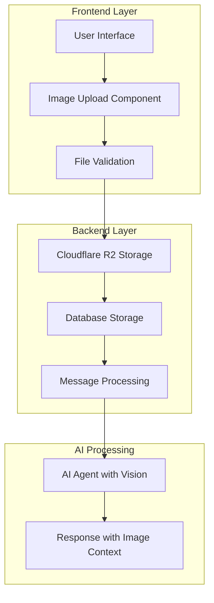

# Design Document

## Overview

This feature adds multimodal capabilities to the existing prompt system by enabling users to upload and include images alongside their text prompts. The system will integrate Cloudflare R2 for secure, scalable image storage and extend the current message architecture to support image attachments. The AI agent will receive both text and image data to provide comprehensive visual analysis and assistance.

## Architecture

### High-Level Architecture



### Technology Stack Integration

- **Frontend**: React components with drag-and-drop using native HTML5 APIs
- **Backend**: tRPC procedures for image upload and message handling
- **Storage**: Cloudflare R2 for image storage with signed URLs
- **Database**: PostgreSQL with Prisma ORM for metadata storage
- **AI Integration**: Extended Inngest functions to handle multimodal prompts

## Components and Interfaces

### 1. Frontend Components

#### ImageUploadZone Component

```typescript
interface ImageUploadZoneProps {
  onImageUpload: (images: UploadedImage[]) => void;
  maxImages?: number;
  maxFileSize?: number;
  acceptedFormats?: string[];
  disabled?: boolean;
}

interface UploadedImage {
  id: string;
  file: File;
  preview: string;
  uploadStatus: 'pending' | 'uploading' | 'success' | 'error';
  url?: string;
  error?: string;
}
```

#### ImagePreview Component

```typescript
interface ImagePreviewProps {
  images: UploadedImage[];
  onRemove: (imageId: string) => void;
  onReorder: (fromIndex: number, toIndex: number) => void;
  readonly?: boolean;
}
```

#### Enhanced MessageForm Component

- Extends existing MessageForm to include image upload functionality
- Maintains current text input behavior while adding image support
- Integrates with existing form validation and submission flow

### 2. Backend API Interfaces

#### Image Upload tRPC Procedures

```typescript
// New router: src/modules/images/server/procedures.ts
export const imagesRouter = createTRPCRouter({
  upload: protectedProcedure
    .input(
      z.object({
        fileName: z.string(),
        fileType: z.string(),
        fileSize: z.number(),
      }),
    )
    .mutation(async ({ input, ctx }) => {
      // Returns signed upload URL and image metadata
    }),

  getSignedUrl: protectedProcedure
    .input(
      z.object({
        imageId: z.string(),
      }),
    )
    .query(async ({ input, ctx }) => {
      // Returns signed download URL for image access
    }),
});
```

#### Enhanced Messages Procedures

```typescript
// Extended input schema for message creation
const createMessageSchema = z.object({
  value: z.string().min(1).max(10000),
  projectId: z.string().min(1),
  images: z
    .array(
      z.object({
        id: z.string(),
        url: z.string(),
        fileName: z.string(),
        fileType: z.string(),
        fileSize: z.number(),
      }),
    )
    .optional(),
});
```

### 3. Cloudflare R2 Integration

#### R2 Service Layer

```typescript
// src/lib/r2.ts
export class R2Service {
  async generateUploadUrl(key: string, contentType: string): Promise<string>;
  async generateDownloadUrl(key: string, expiresIn?: number): Promise<string>;
  async deleteObject(key: string): Promise<void>;
  async getObjectMetadata(key: string): Promise<ObjectMetadata>;
}
```

#### Configuration

- Bucket naming: `{environment}-user-images` (e.g., `prod-user-images`)
- Object key structure: `{userId}/{projectId}/{messageId}/{imageId}.{ext}`
- Signed URL expiration: 1 hour for uploads, 24 hours for downloads
- CORS configuration for direct browser uploads

## Data Models

### Database Schema Extensions

#### New Image Table

```sql
CREATE TABLE "Image" (
  "id" TEXT NOT NULL PRIMARY KEY,
  "messageId" TEXT NOT NULL,
  "fileName" TEXT NOT NULL,
  "fileType" TEXT NOT NULL,
  "fileSize" INTEGER NOT NULL,
  "r2Key" TEXT NOT NULL,
  "r2Url" TEXT,
  "createdAt" TIMESTAMP(3) NOT NULL DEFAULT CURRENT_TIMESTAMP,
  "updatedAt" TIMESTAMP(3) NOT NULL,

  CONSTRAINT "Image_messageId_fkey" FOREIGN KEY ("messageId")
    REFERENCES "Message"("id") ON DELETE CASCADE ON UPDATE CASCADE
);

CREATE INDEX "Image_messageId_idx" ON "Image"("messageId");
```

#### Prisma Schema Addition

```prisma
model Image {
  id        String   @id @default(uuid())
  messageId String
  message   Message  @relation(fields: [messageId], references: [id], onDelete: Cascade)

  fileName  String
  fileType  String
  fileSize  Int
  r2Key     String   @unique
  r2Url     String?

  createdAt DateTime @default(now())
  updatedAt DateTime @updatedAt

  @@index([messageId])
}

// Extended Message model
model Message {
  // ... existing fields
  images    Image[]
}
```

### File Validation Rules

#### Supported Formats

- **Image Types**: PNG, JPEG, JPG, GIF, WebP
- **MIME Types**: `image/png`, `image/jpeg`, `image/gif`, `image/webp`
- **File Extensions**: `.png`, `.jpg`, `.jpeg`, `.gif`, `.webp`

#### Size Limits

- **Maximum File Size**: 10MB per image
- **Maximum Images**: 5 images per message
- **Total Size Limit**: 50MB per message

#### Security Validation

- MIME type verification against file headers
- File signature validation
- Malware scanning (basic header analysis)
- Content-Type header validation

## Error Handling

### Upload Error Scenarios

#### Client-Side Errors

```typescript
enum UploadErrorType {
  FILE_TOO_LARGE = 'FILE_TOO_LARGE',
  INVALID_FORMAT = 'INVALID_FORMAT',
  TOO_MANY_FILES = 'TOO_MANY_FILES',
  NETWORK_ERROR = 'NETWORK_ERROR',
  UPLOAD_FAILED = 'UPLOAD_FAILED',
}

interface UploadError {
  type: UploadErrorType;
  message: string;
  fileName?: string;
}
```

#### Server-Side Error Handling

- **R2 Service Errors**: Retry logic with exponential backoff
- **Database Errors**: Transaction rollback for failed image metadata storage
- **Validation Errors**: Clear error messages with specific validation failures
- **Rate Limiting**: Integration with existing usage/credit system

### Fallback Strategies

- **R2 Unavailable**: Graceful degradation to text-only mode with user notification
- **Upload Timeout**: Automatic retry with progress indication
- **Partial Upload Failure**: Allow message submission with successfully uploaded images

## AI Integration

### Multimodal Prompt Processing

#### Enhanced Inngest Function

```typescript
// src/inngest/claude-functions.ts - Enhanced for images
export const codeAgentRun = inngest.createFunction(
  { id: 'code-agent-run' },
  { event: 'code-agent/run' },
  async ({ event, step }) => {
    const { value, projectId, images } = event.data;

    // Process images for AI context
    const imageContexts = await step.run('process-images', async () => {
      return await processImagesForAI(images);
    });

    // Enhanced prompt with image context
    const enhancedPrompt = await step.run('create-multimodal-prompt', async () => {
      return createMultimodalPrompt(value, imageContexts);
    });

    // Send to AI with vision capabilities
    // ... existing AI processing logic
  },
);
```

#### Image Context Processing

- **Image Analysis**: Extract relevant visual information for AI context
- **URL Generation**: Create accessible URLs for AI model consumption
- **Metadata Enrichment**: Include image dimensions, format, and description
- **Context Optimization**: Optimize image data for AI model input limits

### AI Model Integration

- **Vision Model**: Utilize Claude 3 or GPT-4 Vision capabilities
- **Prompt Engineering**: Structured prompts that reference specific images
- **Response Format**: AI responses that can reference and describe image content
- **Context Management**: Maintain image context throughout conversation

## Testing Strategy

### Unit Testing

#### Frontend Components

```typescript
// Image upload component tests
describe('ImageUploadZone', () => {
  test('accepts valid image files');
  test('rejects invalid file formats');
  test('enforces file size limits');
  test('handles drag and drop events');
  test('displays upload progress');
});

// Image preview component tests
describe('ImagePreview', () => {
  test('displays uploaded images');
  test('allows image removal');
  test('supports image reordering');
  test('shows upload status');
});
```

#### Backend Services

```typescript
// R2 service tests
describe('R2Service', () => {
  test('generates valid upload URLs');
  test('handles upload failures gracefully');
  test('creates proper object keys');
  test('manages signed URL expiration');
});

// Image validation tests
describe('ImageValidation', () => {
  test('validates file types correctly');
  test('enforces size limits');
  test('detects malicious files');
});
```

### Integration Testing

#### End-to-End Workflows

- **Complete Upload Flow**: File selection → validation → upload → storage → AI processing
- **Error Recovery**: Network failures, partial uploads, validation errors
- **Multi-Image Handling**: Multiple file uploads, reordering, removal
- **AI Integration**: Image + text prompts → AI processing → contextual responses

#### Performance Testing

- **Upload Performance**: Large file uploads, multiple concurrent uploads
- **Storage Performance**: R2 read/write operations under load
- **AI Processing**: Multimodal prompt processing times
- **Database Performance**: Image metadata queries and relationships

### Security Testing

#### File Security

- **Malicious File Detection**: Test with various malicious file types
- **MIME Type Spoofing**: Verify proper file type validation
- **Size Limit Bypass**: Test file size validation enforcement
- **Path Traversal**: Ensure secure file naming and storage

#### Access Control

- **Authentication**: Verify user can only access their images
- **Authorization**: Test project-level image access controls
- **Signed URL Security**: Validate URL expiration and access restrictions
- **Cross-User Access**: Ensure users cannot access others' images

## Performance Considerations

### Frontend Optimization

- **Image Compression**: Client-side compression before upload
- **Progressive Upload**: Show upload progress and allow cancellation
- **Lazy Loading**: Load image previews on demand
- **Caching**: Cache uploaded images for better UX

### Backend Optimization

- **Direct Upload**: Use R2 signed URLs for direct browser-to-R2 uploads
- **Async Processing**: Background image processing and AI analysis
- **Connection Pooling**: Efficient database connections for image metadata
- **CDN Integration**: Leverage R2's CDN capabilities for image delivery

### Storage Optimization

- **Image Optimization**: Automatic format conversion and compression
- **Cleanup Jobs**: Scheduled cleanup of orphaned images
- **Storage Monitoring**: Track storage usage and costs
- **Lifecycle Policies**: Automatic deletion of old images

## Security Considerations

### Data Protection

- **Encryption**: Images encrypted at rest in R2
- **Access Control**: Strict user-based access controls
- **Audit Logging**: Track image uploads and access
- **Data Retention**: Configurable image retention policies

### Privacy

- **User Consent**: Clear disclosure of image processing
- **Data Minimization**: Only store necessary image metadata
- **Right to Deletion**: User ability to delete uploaded images
- **Cross-Border Data**: Compliance with data residency requirements
