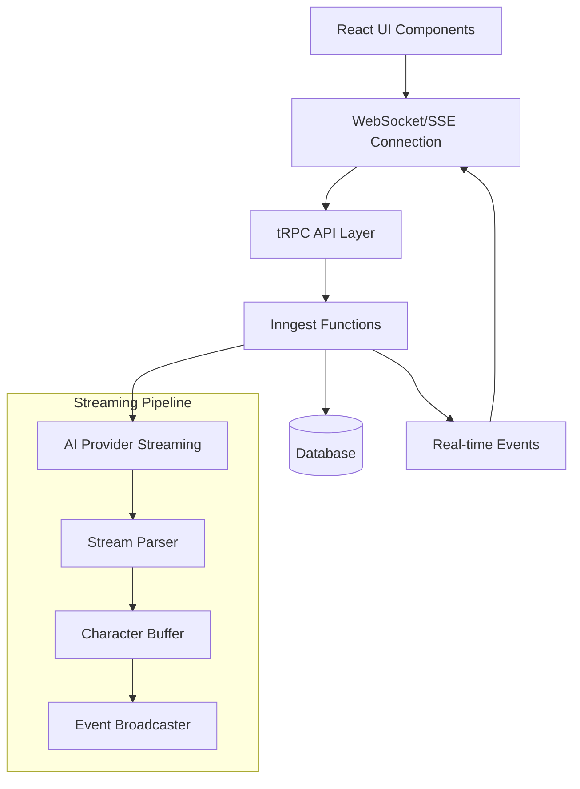

# Design Document

## Overview

Este documento descreve o design técnico para implementar um sistema de transmissão de código em tempo real que permite aos usuários visualizar cada caractere sendo gerado conforme o código é criado. O sistema será integrado à arquitetura existente baseada em Next.js, tRPC, Inngest e Prisma, aproveitando as funcionalidades de streaming já disponíveis nos provedores de IA.

## Architecture

### High-Level Architecture



### Current vs New Flow

**Current Flow:**

1. User sends message → Inngest function → AI generates complete response → Save to DB → Display result

**New Flow:**

1. User sends message → Inngest function starts
2. AI streaming begins → Character-by-character events → Real-time UI updates
3. Complete response → Save to DB → Final state update

## Components and Interfaces

### 1. Stream Management Service

```typescript
interface StreamManager {
  startStream(messageId: string, projectId: string): Promise<void>;
  stopStream(messageId: string): Promise<void>;
  pauseStream(messageId: string): Promise<void>;
  resumeStream(messageId: string): Promise<void>;
}

interface StreamEvent {
  type: 'character' | 'complete' | 'error' | 'interrupt';
  messageId: string;
  projectId: string;
  data: string;
  timestamp: number;
  metadata?: {
    position: number;
    language?: string;
    isCodeBlock?: boolean;
  };
}
```

### 2. AI Provider Abstraction

```typescript
interface StreamingProvider {
  name: string;
  supportsStreaming: boolean;
  createStream(prompt: string, options: StreamOptions): AsyncGenerator<string>;
  simulateStream?(response: string): AsyncGenerator<string>;
}

interface StreamOptions {
  model: string;
  temperature?: number;
  maxTokens?: number;
  onProgress?: (chunk: string) => void;
  onComplete?: (fullResponse: string) => void;
  onError?: (error: Error) => void;
}
```

### 3. Real-time UI Components

```typescript
interface StreamingMessageProps {
  messageId: string;
  initialContent?: string;
  isStreaming: boolean;
  onInterrupt?: () => void;
  onComplete?: (content: string) => void;
}

interface StreamingCodeBlockProps {
  content: string;
  language: string;
  isStreaming: boolean;
  showCursor?: boolean;
}
```

### 4. Configuration Management

```typescript
interface StreamingConfig {
  enabled: boolean;
  bufferSize: number;
  flushInterval: number;
  maxRetries: number;
  fallbackToTraditional: boolean;
  providers: {
    [key: string]: {
      enabled: boolean;
      streamingSupported: boolean;
      priority: number;
    };
  };
}
```

## Data Models

### Database Schema Extensions

```sql
-- Add streaming-related fields to existing Message table
ALTER TABLE Message ADD COLUMN streaming_status ENUM('pending', 'streaming', 'completed', 'interrupted', 'error') DEFAULT 'pending';
ALTER TABLE Message ADD COLUMN stream_metadata JSON;
ALTER TABLE Message ADD COLUMN partial_content TEXT;

-- New table for streaming events (optional, for debugging/analytics)
CREATE TABLE StreamingEvent (
  id VARCHAR(191) PRIMARY KEY,
  message_id VARCHAR(191) NOT NULL,
  event_type ENUM('start', 'character', 'complete', 'error', 'interrupt'),
  data TEXT,
  position INT,
  timestamp DATETIME(3) DEFAULT CURRENT_TIMESTAMP(3),
  metadata JSON,
  FOREIGN KEY (message_id) REFERENCES Message(id) ON DELETE CASCADE
);
```

### TypeScript Types

```typescript
type StreamingStatus = 'pending' | 'streaming' | 'completed' | 'interrupted' | 'error';

interface MessageWithStreaming extends Message {
  streamingStatus: StreamingStatus;
  streamMetadata?: {
    startTime: number;
    endTime?: number;
    characterCount: number;
    interruptedAt?: number;
  };
  partialContent?: string;
}

interface StreamingState {
  messageId: string;
  content: string;
  isStreaming: boolean;
  position: number;
  language?: string;
  error?: string;
}
```

## Error Handling

### Error Types and Recovery

1. **Connection Errors**
   - WebSocket disconnection → Auto-reconnect with exponential backoff
   - Network timeout → Retry with fallback to traditional mode

2. **AI Provider Errors**
   - Streaming not supported → Simulate streaming with chunked response
   - Rate limiting → Queue requests and retry
   - API errors → Fallback to alternative provider

3. **Client-Side Errors**
   - UI rendering issues → Graceful degradation to static content
   - Memory issues → Implement content buffering and cleanup

### Error Recovery Strategy

```typescript
interface ErrorRecoveryConfig {
  maxRetries: number;
  retryDelay: number;
  fallbackStrategies: Array<'simulate' | 'traditional' | 'alternative_provider'>;
  gracefulDegradation: boolean;
}
```

## Testing Strategy

### Unit Tests

1. **Stream Parser Tests**
   - Character-by-character parsing accuracy
   - Code block detection and syntax highlighting
   - Buffer management and memory usage

2. **Provider Abstraction Tests**
   - Mock streaming responses
   - Fallback mechanism validation
   - Error handling scenarios

3. **Real-time Event Tests**
   - Event emission and subscription
   - Message ordering and delivery
   - Connection state management

### Integration Tests

1. **End-to-End Streaming Flow**
   - Complete user journey from prompt to streamed response
   - Multi-provider fallback scenarios
   - Interruption and resumption flows

2. **Performance Tests**
   - High-frequency character streaming
   - Memory usage under continuous streaming
   - Concurrent user streaming sessions

3. **Error Scenario Tests**
   - Network disconnection during streaming
   - AI provider failures and recovery
   - Client-side error handling

### Load Testing

1. **Concurrent Streaming Sessions**
   - Multiple users streaming simultaneously
   - Resource usage and scalability limits
   - WebSocket connection management

2. **High-Volume Character Streaming**
   - Large code files being streamed
   - Buffer overflow scenarios
   - Performance degradation thresholds

## Implementation Phases

### Phase 1: Core Streaming Infrastructure

- Implement StreamManager service
- Create AI provider abstraction layer
- Set up real-time event system
- Basic UI components for streaming display

### Phase 2: Enhanced User Experience

- Add interruption and pause/resume functionality
- Implement syntax highlighting during streaming
- Create user preference settings
- Add streaming status indicators

### Phase 3: Advanced Features

- Multi-provider fallback system
- Performance optimizations
- Analytics and monitoring
- Advanced error recovery

### Phase 4: Polish and Optimization

- UI/UX refinements
- Performance tuning
- Comprehensive testing
- Documentation and deployment

## Security Considerations

1. **Rate Limiting**
   - Implement per-user streaming limits
   - Prevent abuse of streaming endpoints
   - Monitor resource usage patterns

2. **Data Validation**
   - Sanitize streamed content before display
   - Validate streaming events and metadata
   - Prevent injection attacks through streamed content

3. **Authentication**
   - Secure WebSocket connections
   - Validate user permissions for streaming
   - Token-based authentication for real-time events

## Performance Considerations

1. **Memory Management**
   - Implement content buffering strategies
   - Clean up completed streaming sessions
   - Monitor memory usage patterns

2. **Network Optimization**
   - Compress streaming events
   - Batch character updates when appropriate
   - Implement efficient reconnection logic

3. **UI Performance**
   - Debounce rapid character updates
   - Use virtual scrolling for long content
   - Optimize syntax highlighting performance

## Monitoring and Analytics

1. **Streaming Metrics**
   - Characters per second rates
   - Streaming session durations
   - Interruption and error rates

2. **User Experience Metrics**
   - User preference adoption rates
   - Streaming vs traditional mode usage
   - User satisfaction indicators

3. **System Performance Metrics**
   - Resource usage during streaming
   - WebSocket connection stability
   - AI provider response times
