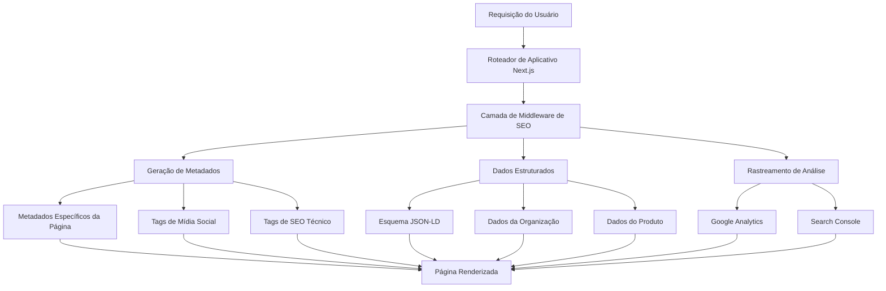

# Documento de Design de Otimização de SEO

## Visão Geral

Este documento de design descreve a estratégia abrangente de otimização de SEO para a aplicação Crazy Code. A implementação transformará a configuração básica atual do Next.js em uma plataforma totalmente otimizada para SEO que classifica bem nos motores de busca, fornece pré-visualizações ricas em mídias sociais e oferece uma excelente experiência ao usuário em todos os dispositivos.

O design segue as melhores práticas modernas de SEO, implementa marcação de dados estruturados, otimiza para Core Web Vitals e fornece uma base para melhorias contínuas de SEO. A solução é construída usando os recursos do Next.js 14+ e segue uma arquitetura modular e de fácil manutenção.

## Arquitetura

### Arquitetura de Alto Nível



### Arquitetura de Componentes

O sistema de SEO é organizado em várias camadas principais:

1.  **Camada de Configuração**: Configurações e constantes baseadas no ambiente
2.  **Camada de Utilitários**: Funções e auxiliares de SEO reutilizáveis
3.  **Camada de Componentes**: Componentes React para dados estruturados e análise
4.  **Camada de Página**: Metadados e implementações de SEO específicas da página
5.  **Camada de Ativos Estáticos**: Arquivos e imagens estáticos relacionados a SEO

## Componentes e Interfaces

### 1. Sistema de Configuração de SEO

**Arquivo**: `src/lib/seo-config.ts`

```typescript
interface SEOConfig {
  site: {
    name: string;
    description: string;
    url: string;
    logo: string;
    favicon: string;
  };
  social: {
    twitter: string;
    facebook?: string;
    linkedin?: string;
  };
  analytics: {
    googleAnalyticsId?: string;
    googleTagManagerId?: string;
  };
  verification: {
    google?: string;
    yandex?: string;
    yahoo?: string;
  };
}
```

### 2. Utilitários de Geração de Metadados

**Arquivo**: `src/lib/seo-utils.ts`

```typescript
interface PageSEO {
  title: string;
  description: string;
  keywords?: string[];
  canonical?: string;
  openGraph?: OpenGraphData;
  twitter?: TwitterCardData;
  structuredData?: StructuredDataType[];
}

interface OpenGraphData {
  title: string;
  description: string;
  image: string;
  imageAlt: string;
  type: 'website' | 'article' | 'product';
  url: string;
}

interface TwitterCardData {
  card: 'summary' | 'summary_large_image';
  title: string;
  description: string;
  image: string;
  creator?: string;
}
```

### 3. Componentes de Dados Estruturados

**Arquivo**: `src/components/seo/structured-data.tsx`

```typescript
interface StructuredDataProps {
  data: StructuredDataType;
}

type StructuredDataType =
  | OrganizationSchema
  | WebsiteSchema
  | SoftwareApplicationSchema
  | ProductSchema;
```

### 4. Integração de Análise

**Arquivo**: `src/components/analytics/google-analytics.tsx`

```typescript
interface AnalyticsProps {
  googleAnalyticsId: string;
  googleTagManagerId?: string;
}
```

### 5. Implementações de SEO Específicas da Página

Cada página terá sua própria configuração de SEO:

-   **Página Inicial**: SEO focado na marca com esquema de aplicação de software
-   **Preços**: SEO focado no produto com esquema de preços
-   **Projetos**: SEO dinâmico com base no conteúdo do projeto
-   **Autenticação**: SEO mínimo para páginas de autenticação

## Modelos de Dados

### 1. Modelo de Metadados de SEO

```typescript
interface SEOMetadata {
  title: string;
  description: string;
  keywords: string[];
  canonical: string;
  robots: string;
  openGraph: {
    title: string;
    description: string;
    image: string;
    imageAlt: string;
    type: string;
    url: string;
    siteName: string;
  };
  twitter: {
    card: string;
    title: string;
    description: string;
    image: string;
    creator: string;
  };
}
```

### 2. Modelos de Dados Estruturados

```typescript
interface OrganizationSchema {
  '@context': 'https://schema.org';
  '@type': 'Organization';
  name: string;
  url: string;
  logo: string;
  description: string;
  sameAs: string[];
}

interface SoftwareApplicationSchema {
  '@context': 'https://schema.org';
  '@type': 'SoftwareApplication';
  name: string;
  description: string;
  url: string;
  applicationCategory: string;
  operatingSystem: string;
  offers: OfferSchema[];
}

interface ProductSchema {
  '@context': 'https://schema.org';
  '@type': 'Product';
  name: string;
  description: string;
  offers: OfferSchema[];
  brand: BrandSchema;
}
```

### 3. Modelo de Dados do Sitemap

```typescript
interface SitemapEntry {
  url: string;
  lastModified: Date;
  changeFrequency: 'always' | 'hourly' | 'daily' | 'weekly' | 'monthly' | 'yearly' | 'never';
  priority: number;
}
```

## Tratamento de Erros

### 1. Erros de Geração de Metadados

-   **Metadados de Fallback**: Se a geração de metadados dinâmicos falhar, use valores de fallback padrão
-   **Validação de Imagem**: Verifique se as imagens do Open Graph existem antes de incluí-las nos metadados
-   **Validação de URL**: Garanta que todas as URLs estejam formatadas corretamente e acessíveis

### 2. Erros de Dados Estruturados

-   **Validação de Esquema**: Valide os dados estruturados em relação às especificações do Schema.org
-   **Degradação Graciosa**: Se os dados estruturados falharem, a página ainda deve ser renderizada normalmente
-   **Registro de Erros**: Registre erros de dados estruturados para depuração

### 3. Erros de Análise

-   **Gerenciamento de Consentimento**: Lide com o carregamento de análises com base no consentimento do usuário
-   **Carregamento de Script**: Lide graciosamente com falhas no carregamento de scripts de análise
-   **Conformidade com a Privacidade**: Garanta a conformidade com GDPR/CCPA para análises

## Estratégia de Teste

### 1. Teste de SEO

**Ferramentas e Validação**:

-   Teste de Resultados Ricos do Google para validação de dados estruturados
-   Depurador de Compartilhamento do Facebook para teste de Open Graph
-   Validador de Cartão do Twitter para metadados do Twitter
-   Google PageSpeed Insights para validação de desempenho

**Testes Automatizados**:

```typescript
describe('Implementação de SEO', () => {
  test('gera os metadados corretos para a página inicial', () => {
    // Testar a geração de metadados
  });

  test('inclui dados estruturados válidos', () => {
    // Testar a saída JSON-LD
  });

  test('fornece as tags Open Graph adequadas', () => {
    // Testar os metadados de mídia social
  });
});
```

### 2. Teste de Desempenho

-   **Core Web Vitals**: Monitore as métricas LCP, FID e CLS
-   **Auditorias do Lighthouse**: Testes automatizados regulares do Lighthouse
-   **Monitoramento de Usuário Real**: Rastreie as métricas de desempenho do usuário real

### 3. Teste de Conteúdo

-   **Completude dos Metadados**: Garanta que todas as páginas tenham os metadados necessários
-   **Otimização de Imagem**: Verifique se todas as imagens de SEO estão devidamente otimizadas
-   **Validação de Link**: Verifique os links internos e externos

## Fases de Implementação

### Fase 1: Configuração da Fundação

-   Sistema de configuração de SEO
-   Utilitários básicos de metadados
-   Configuração de variáveis de ambiente
-   Arquivos estáticos de SEO (robots.txt, manifest.json)

### Fase 2: Implementação de Metadados

-   Otimização de metadados da página inicial
-   Metadados da página de preços
-   Metadados dinâmicos para páginas de projeto
-   Integração com mídias sociais

### Fase 3: Dados Estruturados

-   Implementação do esquema da organização
-   Esquema de aplicação de software
-   Esquema de produto para preços
-   Esquema de site com ação de pesquisa

### Fase 4: SEO Técnico

-   Geração de sitemap
-   Otimizações de desempenho
-   Integração de análise
-   Configuração do Search Console

### Fase 5: Recursos Avançados

-   Geração dinâmica de imagens do Open Graph
-   Dados estruturados avançados
-   Monitoramento e relatórios de SEO
-   Ferramentas de otimização de conteúdo

## Considerações de Desempenho

### 1. Otimização do Tamanho do Pacote

-   Carregue lentamente os scripts de análise
-   Minimize o tamanho do pacote de utilitários de SEO
-   Use importações dinâmicas para componentes de SEO não críticos

### 2. Desempenho em Tempo de Execução

-   Armazene em cache os resultados da geração de metadados
-   Otimize o carregamento de imagens para imagens de SEO
-   Minimize as mudanças de layout dos elementos de SEO

### 3. Otimização do Tempo de Construção

-   Geração estática de sitemap
-   Pré-calcule metadados comuns
-   Otimize o processamento de ativos de SEO

## Considerações de Segurança

### 1. Política de Segurança de Conteúdo

-   Permita domínios de análise no CSP
-   Proteja a injeção de dados estruturados
-   Valide o conteúdo gerado pelo usuário nos metadados

### 2. Conformidade com a Privacidade

-   Implementação de análise em conformidade com o GDPR
-   Gerenciamento de consentimento do usuário
-   Minimização de dados no rastreamento

### 3. Prevenção de XSS

-   Sanitize o conteúdo dinâmico dos metadados
-   Proteja a geração de dados estruturados
-   Valide URLs externas nos metadados

## Monitoramento e Análise

### 1. Rastreamento de Métricas de SEO

-   Integração com o Search Console
-   Monitoramento da posição no ranking
-   Análise da taxa de cliques
-   Rastreamento de impressões

### 2. Monitoramento de Desempenho

-   Rastreamento dos Core Web Vitals
-   Monitoramento do tempo de carregamento da página
-   Métricas de desempenho móvel
-   Monitoramento da taxa de erros

### 3. Análise de Conteúdo

-   Rastreamento do desempenho de palavras-chave
-   Análise de lacunas de conteúdo
-   Integração de análise de concorrentes
-   Teste A/B para elementos de SEO

## Melhorias Futuras

### 1. Recursos Avançados de SEO

-   Geração dinâmica de imagens do Open Graph
-   Suporte a SEO multilíngue
-   Marcação de esquema avançada
-   Otimização de SEO local

### 2. Gerenciamento de Conteúdo

-   Editor de conteúdo de SEO
-   Sugestões automatizadas de SEO
-   Análise de desempenho de conteúdo
-   Automação de auditoria de SEO

### 3. Oportunidades de Integração

-   Integração de CMS para SEO de conteúdo
-   Recursos de SEO para comércio eletrônico
-   SEO para blog/documentação
-   SEO para documentação de API