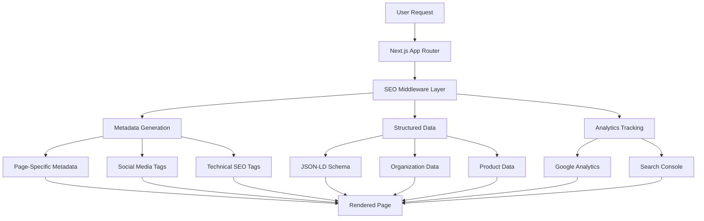

# SEO Optimization Design Document

## Overview

This design document outlines the comprehensive SEO optimization strategy for the Crazy Code application. The implementation will transform the current basic Next.js setup into a fully SEO-optimized platform that ranks well in search engines, provides rich social media previews, and delivers excellent user experience across all devices.

The design follows modern SEO best practices, implements structured data markup, optimizes for Core Web Vitals, and provides a foundation for ongoing SEO improvements. The solution is built using Next.js 14+ features and follows a modular, maintainable architecture.

## Architecture

### High-Level Architecture



### Component Architecture

The SEO system is organized into several key layers:

1. **Configuration Layer**: Environment-based settings and constants
2. **Utility Layer**: Reusable SEO functions and helpers
3. **Component Layer**: React components for structured data and analytics
4. **Page Layer**: Page-specific metadata and SEO implementations
5. **Static Assets Layer**: SEO-related static files and images

## Components and Interfaces

### 1. SEO Configuration System

**File**: `src/lib/seo-config.ts`

```typescript
interface SEOConfig {
  site: {
    name: string;
    description: string;
    url: string;
    logo: string;
    favicon: string;
  };
  social: {
    twitter: string;
    facebook?: string;
    linkedin?: string;
  };
  analytics: {
    googleAnalyticsId?: string;
    googleTagManagerId?: string;
  };
  verification: {
    google?: string;
    yandex?: string;
    yahoo?: string;
  };
}
```

### 2. Metadata Generation Utilities

**File**: `src/lib/seo-utils.ts`

```typescript
interface PageSEO {
  title: string;
  description: string;
  keywords?: string[];
  canonical?: string;
  openGraph?: OpenGraphData;
  twitter?: TwitterCardData;
  structuredData?: StructuredDataType[];
}

interface OpenGraphData {
  title: string;
  description: string;
  image: string;
  imageAlt: string;
  type: 'website' | 'article' | 'product';
  url: string;
}

interface TwitterCardData {
  card: 'summary' | 'summary_large_image';
  title: string;
  description: string;
  image: string;
  creator?: string;
}
```

### 3. Structured Data Components

**File**: `src/components/seo/structured-data.tsx`

```typescript
interface StructuredDataProps {
  data: StructuredDataType;
}

type StructuredDataType =
  | OrganizationSchema
  | WebsiteSchema
  | SoftwareApplicationSchema
  | ProductSchema;
```

### 4. Analytics Integration

**File**: `src/components/analytics/google-analytics.tsx`

```typescript
interface AnalyticsProps {
  googleAnalyticsId: string;
  googleTagManagerId?: string;
}
```

### 5. Page-Specific SEO Implementations

Each page will have its own SEO configuration:

- **Homepage**: Brand-focused SEO with software application schema
- **Pricing**: Product-focused SEO with pricing schema
- **Projects**: Dynamic SEO based on project content
- **Authentication**: Minimal SEO for auth pages

## Data Models

### 1. SEO Metadata Model

```typescript
interface SEOMetadata {
  title: string;
  description: string;
  keywords: string[];
  canonical: string;
  robots: string;
  openGraph: {
    title: string;
    description: string;
    image: string;
    imageAlt: string;
    type: string;
    url: string;
    siteName: string;
  };
  twitter: {
    card: string;
    title: string;
    description: string;
    image: string;
    creator: string;
  };
}
```

### 2. Structured Data Models

```typescript
interface OrganizationSchema {
  '@context': 'https://schema.org';
  '@type': 'Organization';
  name: string;
  url: string;
  logo: string;
  description: string;
  sameAs: string[];
}

interface SoftwareApplicationSchema {
  '@context': 'https://schema.org';
  '@type': 'SoftwareApplication';
  name: string;
  description: string;
  url: string;
  applicationCategory: string;
  operatingSystem: string;
  offers: OfferSchema[];
}

interface ProductSchema {
  '@context': 'https://schema.org';
  '@type': 'Product';
  name: string;
  description: string;
  offers: OfferSchema[];
  brand: BrandSchema;
}
```

### 3. Sitemap Data Model

```typescript
interface SitemapEntry {
  url: string;
  lastModified: Date;
  changeFrequency: 'always' | 'hourly' | 'daily' | 'weekly' | 'monthly' | 'yearly' | 'never';
  priority: number;
}
```

## Error Handling

### 1. Metadata Generation Errors

- **Fallback Metadata**: If dynamic metadata generation fails, use default fallback values
- **Image Validation**: Verify Open Graph images exist before including in metadata
- **URL Validation**: Ensure all URLs are properly formatted and accessible

### 2. Structured Data Errors

- **Schema Validation**: Validate structured data against Schema.org specifications
- **Graceful Degradation**: If structured data fails, page should still render normally
- **Error Logging**: Log structured data errors for debugging

### 3. Analytics Errors

- **Consent Management**: Handle analytics loading based on user consent
- **Script Loading**: Gracefully handle analytics script loading failures
- **Privacy Compliance**: Ensure GDPR/CCPA compliance for analytics

## Testing Strategy

### 1. SEO Testing

**Tools and Validation**:

- Google Rich Results Test for structured data validation
- Facebook Sharing Debugger for Open Graph testing
- Twitter Card Validator for Twitter metadata
- Google PageSpeed Insights for performance validation

**Automated Tests**:

```typescript
describe('SEO Implementation', () => {
  test('generates correct metadata for homepage', () => {
    // Test metadata generation
  });

  test('includes valid structured data', () => {
    // Test JSON-LD output
  });

  test('provides proper Open Graph tags', () => {
    // Test social media metadata
  });
});
```

### 2. Performance Testing

- **Core Web Vitals**: Monitor LCP, FID, and CLS metrics
- **Lighthouse Audits**: Regular automated Lighthouse testing
- **Real User Monitoring**: Track actual user performance metrics

### 3. Content Testing

- **Metadata Completeness**: Ensure all pages have required metadata
- **Image Optimization**: Verify all SEO images are properly optimized
- **Link Validation**: Check internal and external links

## Implementation Phases

### Phase 1: Foundation Setup

- SEO configuration system
- Basic metadata utilities
- Environment variable setup
- Static SEO files (robots.txt, manifest.json)

### Phase 2: Metadata Implementation

- Homepage metadata optimization
- Pricing page metadata
- Dynamic metadata for project pages
- Social media integration

### Phase 3: Structured Data

- Organization schema implementation
- Software application schema
- Product schema for pricing
- Website schema with search action

### Phase 4: Technical SEO

- Sitemap generation
- Performance optimizations
- Analytics integration
- Search console setup

### Phase 5: Advanced Features

- Dynamic Open Graph image generation
- Advanced structured data
- SEO monitoring and reporting
- Content optimization tools

## Performance Considerations

### 1. Bundle Size Optimization

- Lazy load analytics scripts
- Minimize SEO utility bundle size
- Use dynamic imports for non-critical SEO components

### 2. Runtime Performance

- Cache metadata generation results
- Optimize image loading for SEO images
- Minimize layout shifts from SEO elements

### 3. Build Time Optimization

- Static generation of sitemap
- Pre-compute common metadata
- Optimize SEO asset processing

## Security Considerations

### 1. Content Security Policy

- Allow analytics domains in CSP
- Secure structured data injection
- Validate user-generated content in metadata

### 2. Privacy Compliance

- GDPR-compliant analytics implementation
- User consent management
- Data minimization in tracking

### 3. XSS Prevention

- Sanitize dynamic metadata content
- Secure structured data generation
- Validate external URLs in metadata

## Monitoring and Analytics

### 1. SEO Metrics Tracking

- Search console integration
- Ranking position monitoring
- Click-through rate analysis
- Impression tracking

### 2. Performance Monitoring

- Core Web Vitals tracking
- Page load time monitoring
- Mobile performance metrics
- Error rate monitoring

### 3. Content Analysis

- Keyword performance tracking
- Content gap analysis
- Competitor analysis integration
- A/B testing for SEO elements

## Future Enhancements

### 1. Advanced SEO Features

- Dynamic Open Graph image generation
- Multi-language SEO support
- Advanced schema markup
- Local SEO optimization

### 2. Content Management

- SEO content editor
- Automated SEO suggestions
- Content performance analytics
- SEO audit automation

### 3. Integration Opportunities

- CMS integration for content SEO
- E-commerce SEO features
- Blog/documentation SEO
- API documentation SEO
