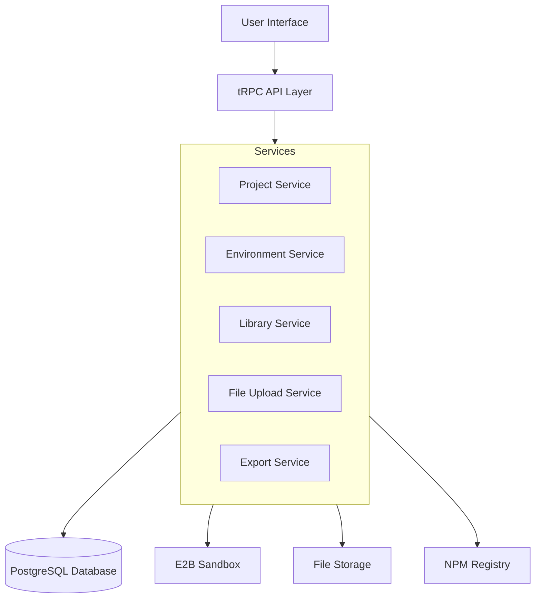

# Design Document

## Overview

The User Project Control system extends the existing project management capabilities to provide users with comprehensive control over their generated projects. The system will integrate with the current Next.js/tRPC architecture, leveraging E2B sandboxes for project execution and adding new functionality for environment management, library installation, file uploads, and project export.

The design builds upon the existing Fragment-based project structure where projects contain messages and fragments store the actual project files as JSON data. We'll extend this model to support additional project metadata, environment variables, and uploaded assets.

## Architecture

### High-Level Architecture



### Data Flow

1. **Environment Management**: User configures environment variables → API validates and stores → Sandbox restarts with new environment
2. **Library Management**: User searches/installs libraries → API queries NPM → Updates package.json in sandbox → Rebuilds project
3. **File Upload**: User uploads files → API validates and stores → Files added to project structure → Available in sandbox
4. **Project Export**: User requests download → API generates ZIP from sandbox files → Provides download link

## Components and Interfaces

### Database Schema Extensions

```typescript
// Extend existing Project model
model Project {
  id        String   @id @default(uuid())
  name      String
  description String?
  userId    String
  visibility ProjectVisibility @default(PRIVATE)
  settings  Json? // Project-specific settings
  createdAt DateTime @default(now())
  updatedAt DateTime @updatedAt

  messages Message[]
  environments ProjectEnvironment[]
  uploadedFiles ProjectFile[]
}

enum ProjectVisibility {
  PRIVATE
  PUBLIC
}

model ProjectEnvironment {
  id        String   @id @default(uuid())
  projectId String
  project   Project  @relation(fields: [projectId], references: [id], onDelete: Cascade)
  key       String
  value     String
  isSecret  Boolean  @default(false)
  createdAt DateTime @default(now())
  updatedAt DateTime @updatedAt

  @@unique([projectId, key])
}

model ProjectFile {
  id        String   @id @default(uuid())
  projectId String
  project   Project  @relation(fields: [projectId], references: [id], onDelete: Cascade)
  filename  String
  originalName String
  mimeType  String
  size      Int
  path      String   // Relative path within project
  url       String   // Storage URL
  createdAt DateTime @default(now())

  @@unique([projectId, path])
}

model ProjectLibrary {
  id        String   @id @default(uuid())
  projectId String
  name      String   // Package name
  version   String
  isDev     Boolean  @default(false)
  createdAt DateTime @default(now())
  updatedAt DateTime @updatedAt

  @@unique([projectId, name])
}
```

### Service Layer

#### Environment Service

```typescript
interface EnvironmentService {
  getEnvironmentVariables(projectId: string): Promise<EnvironmentVariable[]>;
  setEnvironmentVariable(
    projectId: string,
    key: string,
    value: string,
    isSecret: boolean,
  ): Promise<void>;
  deleteEnvironmentVariable(projectId: string, key: string): Promise<void>;
  applyEnvironmentToSandbox(projectId: string, sandboxId: string): Promise<void>;
}
```

#### Library Service

```typescript
interface LibraryService {
  searchPackages(query: string): Promise<PackageSearchResult[]>;
  getInstalledPackages(projectId: string): Promise<InstalledPackage[]>;
  installPackage(
    projectId: string,
    packageName: string,
    version?: string,
    isDev?: boolean,
  ): Promise<void>;
  uninstallPackage(projectId: string, packageName: string): Promise<void>;
  updatePackage(projectId: string, packageName: string, version: string): Promise<void>;
}
```

#### File Upload Service

```typescript
interface FileUploadService {
  uploadFile(projectId: string, file: File, path: string): Promise<ProjectFile>;
  deleteFile(projectId: string, fileId: string): Promise<void>;
  getProjectFiles(projectId: string): Promise<ProjectFile[]>;
  getFileUrl(fileId: string): Promise<string>;
}
```

#### Export Service

```typescript
interface ExportService {
  generateProjectZip(projectId: string): Promise<string>; // Returns download URL
  getExportStatus(exportId: string): Promise<ExportStatus>;
}
```

### API Layer (tRPC Procedures)

```typescript
// Environment procedures
export const environmentRouter = router({
  getAll: protectedProcedure
    .input(z.object({ projectId: z.string() }))
    .query(({ input, ctx }) => environmentService.getEnvironmentVariables(input.projectId)),

  set: protectedProcedure
    .input(
      z.object({
        projectId: z.string(),
        key: z.string(),
        value: z.string(),
        isSecret: z.boolean().default(false),
      }),
    )
    .mutation(({ input, ctx }) =>
      environmentService.setEnvironmentVariable(
        input.projectId,
        input.key,
        input.value,
        input.isSecret,
      ),
    ),

  delete: protectedProcedure
    .input(z.object({ projectId: z.string(), key: z.string() }))
    .mutation(({ input, ctx }) =>
      environmentService.deleteEnvironmentVariable(input.projectId, input.key),
    ),
});

// Library procedures
export const libraryRouter = router({
  search: protectedProcedure
    .input(z.object({ query: z.string() }))
    .query(({ input }) => libraryService.searchPackages(input.query)),

  getInstalled: protectedProcedure
    .input(z.object({ projectId: z.string() }))
    .query(({ input }) => libraryService.getInstalledPackages(input.projectId)),

  install: protectedProcedure
    .input(
      z.object({
        projectId: z.string(),
        packageName: z.string(),
        version: z.string().optional(),
        isDev: z.boolean().default(false),
      }),
    )
    .mutation(({ input }) =>
      libraryService.installPackage(input.projectId, input.packageName, input.version, input.isDev),
    ),
});

// File upload procedures
export const fileRouter = router({
  upload: protectedProcedure
    .input(
      z.object({
        projectId: z.string(),
        file: z.any(), // File upload handling
        path: z.string(),
      }),
    )
    .mutation(({ input }) => fileUploadService.uploadFile(input.projectId, input.file, input.path)),

  getAll: protectedProcedure
    .input(z.object({ projectId: z.string() }))
    .query(({ input }) => fileUploadService.getProjectFiles(input.projectId)),
});

// Export procedures
export const exportRouter = router({
  generateZip: protectedProcedure
    .input(z.object({ projectId: z.string() }))
    .mutation(({ input }) => exportService.generateProjectZip(input.projectId)),
});
```

### UI Components

#### Environment Manager Component

```typescript
interface EnvironmentManagerProps {
  projectId: string;
}

// Features:
// - List all environment variables
// - Add/edit/delete variables
// - Toggle secret visibility
// - Validation for variable names
// - Apply changes to sandbox
```

#### Library Manager Component

```typescript
interface LibraryManagerProps {
  projectId: string;
}

// Features:
// - Search NPM packages
// - Display installed packages with versions
// - Install/uninstall packages
// - Show dev vs production dependencies
// - Update available indicators
```

#### File Upload Component

```typescript
interface FileUploadProps {
  projectId: string;
  allowedTypes?: string[];
  maxSize?: number;
}

// Features:
// - Drag and drop interface
// - File type validation
// - Progress indicators
// - Preview for images
// - File organization
```

#### Project Export Component

```typescript
interface ProjectExportProps {
  projectId: string;
}

// Features:
// - Generate ZIP download
// - Progress tracking
// - Download history
// - Export options (include node_modules, etc.)
```

## Data Models

### Environment Variable Model

```typescript
interface EnvironmentVariable {
  id: string;
  key: string;
  value: string;
  isSecret: boolean;
  createdAt: Date;
  updatedAt: Date;
}
```

### Package Search Result Model

```typescript
interface PackageSearchResult {
  name: string;
  version: string;
  description: string;
  author: string;
  downloads: number;
  repository?: string;
  homepage?: string;
}
```

### Project File Model

```typescript
interface ProjectFile {
  id: string;
  filename: string;
  originalName: string;
  mimeType: string;
  size: number;
  path: string;
  url: string;
  createdAt: Date;
}
```

### Export Status Model

```typescript
interface ExportStatus {
  id: string;
  status: 'pending' | 'processing' | 'completed' | 'failed';
  downloadUrl?: string;
  error?: string;
  createdAt: Date;
  completedAt?: Date;
}
```

## Error Handling

### Environment Management Errors

- Invalid environment variable names
- Duplicate keys
- Sandbox restart failures
- Value validation errors

### Library Management Errors

- Package not found
- Version conflicts
- Installation failures
- Network timeouts
- Dependency resolution errors

### File Upload Errors

- File size exceeded
- Invalid file types
- Storage failures
- Path conflicts
- Quota exceeded

### Export Errors

- Sandbox access failures
- ZIP generation errors
- Storage limitations
- Large project timeouts

### Error Response Format

```typescript
interface ApiError {
  code: string;
  message: string;
  details?: Record<string, any>;
  timestamp: Date;
}
```

## Testing Strategy

### Unit Tests

- Service layer methods
- Validation functions
- Utility functions
- Error handling

### Integration Tests

- tRPC procedure calls
- Database operations
- Sandbox interactions
- File storage operations

### End-to-End Tests

- Complete user workflows
- Environment variable management
- Library installation process
- File upload and download
- Project export functionality

### Performance Tests

- Large file uploads
- Multiple library installations
- ZIP generation for large projects
- Concurrent user operations

### Security Tests

- Environment variable access control
- File upload validation
- Path traversal prevention
- User authorization checks
