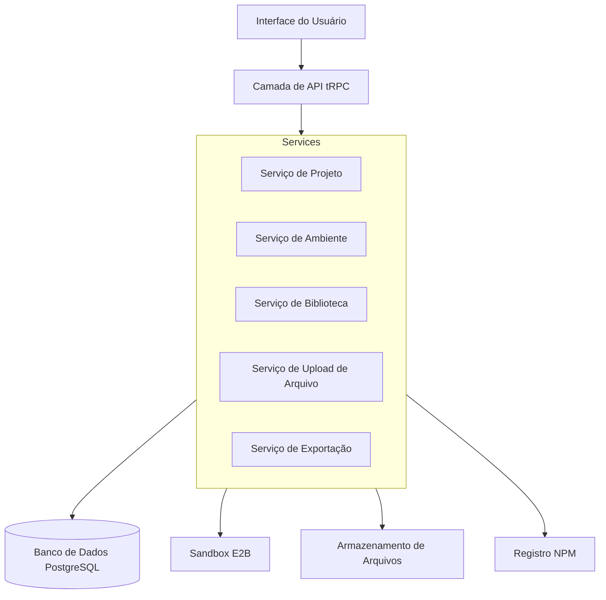

# Documento de Design

## Visão Geral

O sistema de Controle de Projeto do Usuário estende as capacidades de gerenciamento de projetos existentes para fornecer aos usuários controle abrangente sobre seus projetos gerados. O sistema se integrará com a arquitetura atual Next.js/tRPC, aproveitando as sandboxes E2B para execução de projetos e adicionando novas funcionalidades para gerenciamento de ambiente, instalação de bibliotecas, uploads de arquivos e exportação de projetos.

O design se baseia na estrutura de projeto existente baseada em Fragmentos, onde os projetos contêm mensagens e os fragmentos armazenam os arquivos reais do projeto como dados JSON. Estenderemos este modelo para suportar metadados de projeto adicionais, variáveis de ambiente e ativos carregados.

## Arquitetura

### Arquitetura de Alto Nível



### Fluxo de Dados

1.  **Gerenciamento de Ambiente**: O usuário configura variáveis de ambiente → A API valida e armazena → A sandbox reinicia com o novo ambiente
2.  **Gerenciamento de Biblioteca**: O usuário pesquisa/instala bibliotecas → A API consulta o NPM → Atualiza o `package.json` na sandbox → Reconstrói o projeto
3.  **Upload de Arquivo**: O usuário carrega arquivos → A API valida e armazena → Os arquivos são adicionados à estrutura do projeto → Disponíveis na sandbox
4.  **Exportação de Projeto**: O usuário solicita o download → A API gera um ZIP a partir dos arquivos da sandbox → Fornece o link para download

## Componentes e Interfaces

### Extensões do Esquema do Banco de Dados

```typescript
// Estender o modelo de Projeto existente
model Project {
  id        String   @id @default(uuid())
  name      String
  description String?
  userId    String
  visibility ProjectVisibility @default(PRIVATE)
  settings  Json? // Configurações específicas do projeto
  createdAt DateTime @default(now())
  updatedAt DateTime @updatedAt

  messages Message[]
  environments ProjectEnvironment[]
  uploadedFiles ProjectFile[]
}

enum ProjectVisibility {
  PRIVATE
  PUBLIC
}

model ProjectEnvironment {
  id        String   @id @default(uuid())
  projectId String
  project   Project  @relation(fields: [projectId], references: [id], onDelete: Cascade)
  key       String
  value     String
  isSecret  Boolean  @default(false)
  createdAt DateTime @default(now())
  updatedAt DateTime @updatedAt

  @@unique([projectId, key])
}

model ProjectFile {
  id        String   @id @default(uuid())
  projectId String
  project   Project  @relation(fields: [projectId], references: [id], onDelete: Cascade)
  filename  String
  originalName String
  mimeType  String
  size      Int
  path      String   // Caminho relativo dentro do projeto
  url       String   // URL de armazenamento
  createdAt DateTime @default(now())

  @@unique([projectId, path])
}

model ProjectLibrary {
  id        String   @id @default(uuid())
  projectId String
  name      String   // Nome do pacote
  version   String
  isDev     Boolean  @default(false)
  createdAt DateTime @default(now())
  updatedAt DateTime @updatedAt

  @@unique([projectId, name])
}
```

### Camada de Serviço

#### Serviço de Ambiente

```typescript
interface EnvironmentService {
  getEnvironmentVariables(projectId: string): Promise<EnvironmentVariable[]>;
  setEnvironmentVariable(
    projectId: string,
    key: string,
    value: string,
    isSecret: boolean,
  ): Promise<void>;
  deleteEnvironmentVariable(projectId: string, key: string): Promise<void>;
  applyEnvironmentToSandbox(projectId: string, sandboxId: string): Promise<void>;
}
```

#### Serviço de Biblioteca

```typescript
interface LibraryService {
  searchPackages(query: string): Promise<PackageSearchResult[]>;
  getInstalledPackages(projectId: string): Promise<InstalledPackage[]>;
  installPackage(
    projectId: string,
    packageName: string,
    version?: string,
    isDev?: boolean,
  ): Promise<void>;
  uninstallPackage(projectId: string, packageName: string): Promise<void>;
  updatePackage(projectId: string, packageName: string, version: string): Promise<void>;
}
```

#### Serviço de Upload de Arquivo

```typescript
interface FileUploadService {
  uploadFile(projectId: string, file: File, path: string): Promise<ProjectFile>;
  deleteFile(projectId: string, fileId: string): Promise<void>;
  getProjectFiles(projectId: string): Promise<ProjectFile[]>;
  getFileUrl(fileId: string): Promise<string>;
}
```

#### Serviço de Exportação

```typescript
interface ExportService {
  generateProjectZip(projectId: string): Promise<string>; // Retorna a URL de download
  getExportStatus(exportId: string): Promise<ExportStatus>;
}
```

### Camada de API (Procedimentos tRPC)

```typescript
// Procedimentos de ambiente
export const environmentRouter = router({
  getAll: protectedProcedure
    .input(z.object({ projectId: z.string() }))
    .query(({ input, ctx }) => environmentService.getEnvironmentVariables(input.projectId)),

  set: protectedProcedure
    .input(
      z.object({
        projectId: z.string(),
        key: z.string(),
        value: z.string(),
        isSecret: z.boolean().default(false),
      }),
    )
    .mutation(({ input, ctx }) =>
      environmentService.setEnvironmentVariable(
        input.projectId,
        input.key,
        input.value,
        input.isSecret,
      ),
    ),

  delete: protectedProcedure
    .input(z.object({ projectId: z.string(), key: z.string() }))
    .mutation(({ input, ctx }) =>
      environmentService.deleteEnvironmentVariable(input.projectId, input.key),
    ),
});

// Procedimentos de biblioteca
export const libraryRouter = router({
  search: protectedProcedure
    .input(z.object({ query: z.string() }))
    .query(({ input }) => libraryService.searchPackages(input.query)),

  getInstalled: protectedProcedure
    .input(z.object({ projectId: z.string() }))
    .query(({ input }) => libraryService.getInstalledPackages(input.projectId)),

  install: protectedProcedure
    .input(
      z.object({
        projectId: z.string(),
        packageName: z.string(),
        version: z.string().optional(),
        isDev: z.boolean().default(false),
      }),
    )
    .mutation(({ input }) =>
      libraryService.installPackage(input.projectId, input.packageName, input.version, input.isDev),
    ),
});

// Procedimentos de upload de arquivo
export const fileRouter = router({
  upload: protectedProcedure
    .input(
      z.object({
        projectId: z.string(),
        file: z.any(), // Manipulação de upload de arquivo
        path: z.string(),
      }),
    )
    .mutation(({ input }) => fileUploadService.uploadFile(input.projectId, input.file, input.path)),

  getAll: protectedProcedure
    .input(z.object({ projectId: z.string() }))
    .query(({ input }) => fileUploadService.getProjectFiles(input.projectId)),
});

// Procedimentos de exportação
export const exportRouter = router({
  generateZip: protectedProcedure
    .input(z.object({ projectId: z.string() }))
    .mutation(({ input }) => exportService.generateProjectZip(input.projectId)),
});
```

### Componentes da UI

#### Componente Gerenciador de Ambiente

```typescript
interface EnvironmentManagerProps {
  projectId: string;
}

// Recursos:
// - Listar todas as variáveis de ambiente
// - Adicionar/editar/excluir variáveis
// - Alternar a visibilidade de segredos
// - Validação para nomes de variáveis
// - Aplicar alterações na sandbox
```

#### Componente Gerenciador de Biblioteca

```typescript
interface LibraryManagerProps {
  projectId: string;
}

// Recursos:
// - Pesquisar pacotes NPM
// - Exibir pacotes instalados com versões
// - Instalar/desinstalar pacotes
// - Mostrar dependências de desenvolvimento vs produção
// - Indicadores de atualização disponíveis
```

#### Componente de Upload de Arquivo

```typescript
interface FileUploadProps {
  projectId: string;
  allowedTypes?: string[];
  maxSize?: number;
}

// Recursos:
// - Interface de arrastar e soltar
// - Validação de tipo de arquivo
// - Indicadores de progresso
// - Visualização para imagens
// - Organização de arquivos
```

#### Componente de Exportação de Projeto

```typescript
interface ProjectExportProps {
  projectId: string;
}

// Recursos:
// - Gerar download de ZIP
// - Rastreamento de progresso
// - Histórico de downloads
// - Opções de exportação (incluir node_modules, etc.)
```

## Modelos de Dados

### Modelo de Variável de Ambiente

```typescript
interface EnvironmentVariable {
  id: string;
  key: string;
  value: string;
  isSecret: boolean;
  createdAt: Date;
  updatedAt: Date;
}
```

### Modelo de Resultado de Pesquisa de Pacote

```typescript
interface PackageSearchResult {
  name: string;
  version: string;
  description: string;
  author: string;
  downloads: number;
  repository?: string;
  homepage?: string;
}
```

### Modelo de Arquivo de Projeto

```typescript
interface ProjectFile {
  id: string;
  filename: string;
  originalName: string;
  mimeType: string;
  size: number;
  path: string;
  url: string;
  createdAt: Date;
}
```

### Modelo de Status de Exportação

```typescript
interface ExportStatus {
  id: string;
  status: 'pending' | 'processing' | 'completed' | 'failed';
  downloadUrl?: string;
  error?: string;
  createdAt: Date;
  completedAt?: Date;
}
```

## Tratamento de Erros

### Erros de Gerenciamento de Ambiente

-   Nomes de variáveis de ambiente inválidos
-   Chaves duplicadas
-   Falhas na reinicialização da sandbox
-   Erros de validação de valor

### Erros de Gerenciamento de Biblioteca

-   Pacote não encontrado
-   Conflitos de versão
-   Falhas na instalação
-   Tempos limite de rede
-   Erros de resolução de dependência

### Erros de Upload de Arquivo

-   Tamanho do arquivo excedido
-   Tipos de arquivo inválidos
-   Falhas de armazenamento
-   Conflitos de caminho
-   Cota excedida

### Erros de Exportação

-   Falhas de acesso à sandbox
-   Erros na geração de ZIP
-   Limitações de armazenamento
-   Tempos limite de projetos grandes

### Formato de Resposta de Erro

```typescript
interface ApiError {
  code: string;
  message: string;
  details?: Record<string, any>;
  timestamp: Date;
}
```

## Estratégia de Teste

### Testes Unitários

-   Métodos da camada de serviço
-   Funções de validação
-   Funções de utilitário
-   Tratamento de erros

### Testes de Integração

-   Chamadas de procedimento tRPC
-   Operações de banco de dados
-   Interações com a sandbox
-   Operações de armazenamento de arquivos

### Testes de Ponta a Ponta

-   Fluxos de trabalho completos do usuário
-   Gerenciamento de variáveis de ambiente
-   Processo de instalação de biblioteca
-   Funcionalidade de upload e download de arquivos
-   Funcionalidade de exportação de projeto

### Testes de Desempenho

-   Uploads de arquivos grandes
-   Instalações de múltiplas bibliotecas
-   Geração de ZIP para projetos grandes
-   Operações de usuários concorrentes

### Testes de Segurança

-   Controle de acesso a variáveis de ambiente
-   Validação de upload de arquivo
-   Prevenção de travessia de caminho
-   Verificações de autorização do usuário