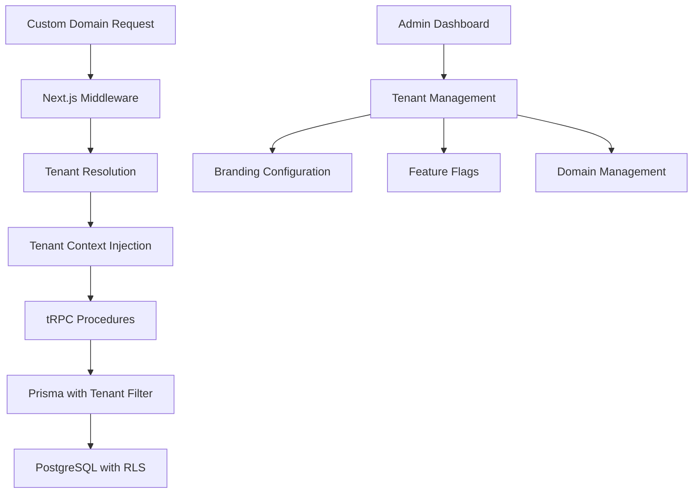

# Design Document - Whitelabel System

## Overview

The whitelabel system will transform the current single-tenant application into a multi-tenant SaaS platform. The design leverages a shared database with tenant isolation through row-level security, custom domain routing, and dynamic branding configuration. The system maintains the existing Next.js + tRPC + Prisma architecture while adding tenant context throughout the application stack.

## Architecture

### Multi-Tenancy Strategy

**Database-Level Isolation**: Implement row-level security using a `tenantId` field across all data models. This approach provides strong isolation while maintaining a single database instance for operational simplicity.

**Application-Level Context**: Inject tenant context at the middleware layer, ensuring all database operations are automatically scoped to the correct tenant.

**Domain-Based Routing**: Use Next.js middleware to detect custom domains and route requests to the appropriate tenant context.

### High-Level Architecture Flow



## Components and Interfaces

### 1. Tenant Management System

**Tenant Model**

```typescript
interface Tenant {
  id: string;
  slug: string; // URL-friendly identifier
  name: string;
  domain?: string; // Custom domain
  subdomain: string; // Default subdomain
  status: 'active' | 'inactive' | 'suspended';
  branding: TenantBranding;
  features: TenantFeatures;
  ssoConfig?: SSOConfiguration;
  createdAt: Date;
  updatedAt: Date;
}
```

**Tenant Context Provider**

- Middleware component that resolves tenant from domain/subdomain
- Injects tenant context into all downstream requests
- Handles tenant-specific routing and error handling

### 2. Branding System

**Dynamic Theme Engine**

```typescript
interface TenantBranding {
  logo: string; // URL to logo asset
  favicon: string;
  primaryColor: string;
  secondaryColor: string;
  customCSS?: string;
  customFonts?: string[];
  companyName: string;
  supportEmail: string;
}
```

**Asset Management**

- File upload system for logos and assets
- CDN integration for global asset delivery
- Automatic image optimization and resizing

### 3. Domain Management

**Domain Resolution Service**

- DNS verification system
- Automatic SSL certificate provisioning via Let's Encrypt
- Domain validation and health monitoring

**Routing Strategy**

- Primary domain: `app.yourplatform.com`
- Tenant subdomains: `{tenant-slug}.yourplatform.com`
- Custom domains: `app.clientdomain.com`

### 4. Authentication & Authorization

**Multi-Tenant Clerk Integration**

```typescript
interface TenantAuthConfig {
  tenantId: string;
  allowedDomains: string[];
  ssoEnabled: boolean;
  ssoProvider?: 'saml' | 'oauth2';
  ssoConfig?: Record<string, any>;
  userInviteOnly: boolean;
}
```

**Permission System**

- Tenant-scoped roles and permissions
- Cross-tenant access prevention
- Admin vs tenant-admin role separation

### 5. Feature Flag System

**Tenant Feature Configuration**

```typescript
interface TenantFeatures {
  codeEditor: boolean;
  aiAssistant: boolean;
  customBranding: boolean;
  ssoIntegration: boolean;
  apiAccess: boolean;
  maxProjects: number;
  maxUsers: number;
  storageLimit: number; // in MB
}
```

## Data Models

### Updated Prisma Schema

```prisma
model Tenant {
  id          String   @id @default(uuid())
  slug        String   @unique
  name        String
  domain      String?  @unique
  subdomain   String   @unique
  status      TenantStatus @default(ACTIVE)
  branding    Json     // TenantBranding object
  features    Json     // TenantFeatures object
  ssoConfig   Json?    // SSO configuration
  createdAt   DateTime @default(now())
  updatedAt   DateTime @updatedAt

  // Relations
  projects    Project[]
  users       TenantUser[]
  customers   Customer[]

  @@map("tenants")
}

model TenantUser {
  id        String @id @default(uuid())
  tenantId  String
  userId    String // Clerk user ID
  role      TenantRole @default(USER)
  status    UserStatus @default(ACTIVE)
  invitedBy String?
  invitedAt DateTime?
  joinedAt  DateTime?

  tenant    Tenant @relation(fields: [tenantId], references: [id], onDelete: Cascade)

  @@unique([tenantId, userId])
  @@map("tenant_users")
}

// Updated existing models
model Project {
  id        String   @id @default(uuid())
  tenantId  String   // Add tenant isolation
  name      String
  userId    String
  createdAt DateTime @default(now())
  updatedAt DateTime @updatedAt

  tenant    Tenant    @relation(fields: [tenantId], references: [id], onDelete: Cascade)
  messages  Message[]

  @@index([tenantId])
}

model Customer {
  id         String   @id @default(uuid())
  tenantId   String   // Add tenant isolation
  userId     String
  polarId    String   @unique
  email      String
  name       String?
  createdAt  DateTime @default(now())
  updatedAt  DateTime @updatedAt

  tenant        Tenant         @relation(fields: [tenantId], references: [id], onDelete: Cascade)
  subscriptions Subscription[]

  @@index([tenantId])
}

enum TenantStatus {
  ACTIVE
  INACTIVE
  SUSPENDED
}

enum TenantRole {
  ADMIN
  USER
}

enum UserStatus {
  ACTIVE
  INACTIVE
  PENDING
}
```

### Row-Level Security Implementation

```sql
-- Enable RLS on tenant-isolated tables
ALTER TABLE projects ENABLE ROW LEVEL SECURITY;
ALTER TABLE messages ENABLE ROW LEVEL SECURITY;
ALTER TABLE fragments ENABLE ROW LEVEL SECURITY;
ALTER TABLE customers ENABLE ROW LEVEL SECURITY;
ALTER TABLE subscriptions ENABLE ROW LEVEL SECURITY;

-- Create policies for tenant isolation
CREATE POLICY tenant_isolation_projects ON projects
  USING (tenant_id = current_setting('app.current_tenant_id'));

CREATE POLICY tenant_isolation_messages ON messages
  USING (project_id IN (
    SELECT id FROM projects WHERE tenant_id = current_setting('app.current_tenant_id')
  ));
```

## Error Handling

### Tenant-Specific Error Handling

**Domain Resolution Errors**

- Invalid domain → Redirect to main platform
- Suspended tenant → Show maintenance page with tenant branding
- Non-existent tenant → 404 with platform branding

**Cross-Tenant Access Attempts**

- Log security events
- Return 403 Forbidden
- Alert tenant administrators

**Branding Asset Failures**

- Fallback to default platform branding
- Graceful degradation for missing assets
- Asset validation and sanitization

### Error Response Format

```typescript
interface TenantError {
  code: string;
  message: string;
  tenantId?: string;
  context?: Record<string, any>;
  timestamp: Date;
}
```

## Testing Strategy

### Unit Testing

- Tenant context injection middleware
- Domain resolution logic
- Branding configuration validation
- Feature flag enforcement

### Integration Testing

- Multi-tenant database operations
- Cross-tenant isolation verification
- Custom domain routing
- SSO integration flows

### End-to-End Testing

- Complete tenant onboarding flow
- Custom domain setup and verification
- Branding customization workflow
- User invitation and access control

### Performance Testing

- Database query performance with tenant filtering
- Asset loading performance across tenants
- Concurrent tenant request handling
- Memory usage with multiple tenant contexts

### Security Testing

- Tenant isolation verification
- Cross-tenant data access prevention
- Domain spoofing protection
- SQL injection with tenant context

## Implementation Considerations

### Migration Strategy

1. **Phase 1**: Add tenant models and basic isolation
2. **Phase 2**: Implement domain routing and branding
3. **Phase 3**: Add advanced features (SSO, feature flags)
4. **Phase 4**: Admin dashboard and tenant management

### Performance Optimizations

- Database connection pooling per tenant
- Redis caching for tenant configurations
- CDN for tenant-specific assets
- Lazy loading of tenant features

### Monitoring and Observability

- Tenant-specific metrics and logging
- Performance monitoring per tenant
- Usage analytics and billing integration
- Health checks for custom domains

### Security Considerations

- Input validation for all tenant configurations
- Asset upload restrictions and scanning
- Rate limiting per tenant
- Audit logging for tenant operations
