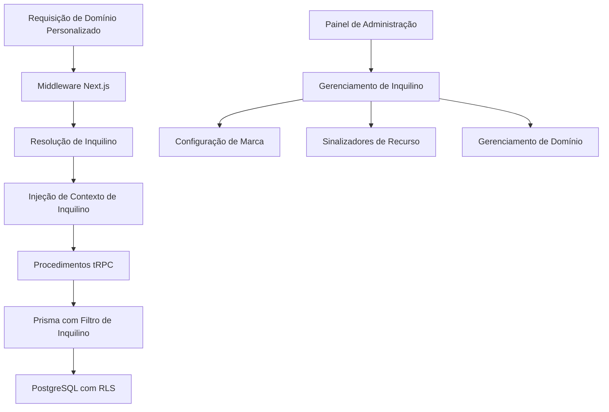

# Documento de Design - Sistema Whitelabel

## Visão Geral

O sistema whitelabel transformará a aplicação atual de um único inquilino em uma plataforma SaaS multi-inquilino. O design aproveita um banco de dados compartilhado com isolamento de inquilino por meio de segurança em nível de linha, roteamento de domínio personalizado e configuração de marca dinâmica. O sistema mantém a arquitetura existente Next.js + tRPC + Prisma enquanto adiciona o contexto do inquilino em toda a pilha de aplicativos.

## Arquitetura

### Estratégia Multi-Inquilino

**Isolamento em Nível de Banco de Dados**: Implementar segurança em nível de linha usando um campo `tenantId` em todos os modelos de dados. Essa abordagem fornece um forte isolamento, mantendo uma única instância de banco de dados para simplicidade operacional.

**Contexto em Nível de Aplicação**: Injetar o contexto do inquilino na camada de middleware, garantindo que todas as operações de banco de dados sejam automaticamente escopadas para o inquilino correto.

**Roteamento Baseado em Domínio**: Usar o middleware do Next.js para detectar domínios personalizados e rotear as solicitações para o contexto do inquilino apropriado.

### Fluxo de Arquitetura de Alto Nível



## Componentes e Interfaces

### 1. Sistema de Gerenciamento de Inquilino

**Modelo de Inquilino**

```typescript
interface Tenant {
  id: string;
  slug: string; // Identificador amigável para URL
  name: string;
  domain?: string; // Domínio personalizado
  subdomain: string; // Subdomínio padrão
  status: 'active' | 'inactive' | 'suspended';
  branding: TenantBranding;
  features: TenantFeatures;
  ssoConfig?: SSOConfiguration;
  createdAt: Date;
  updatedAt: Date;
}
```

**Provedor de Contexto de Inquilino**

-   Componente de middleware que resolve o inquilino a partir do domínio/subdomínio
-   Injeta o contexto do inquilino em todas as solicitações downstream
-   Lida com roteamento e tratamento de erros específicos do inquilino

### 2. Sistema de Marca

**Motor de Tema Dinâmico**

```typescript
interface TenantBranding {
  logo: string; // URL para o ativo do logotipo
  favicon: string;
  primaryColor: string;
  secondaryColor: string;
  customCSS?: string;
  customFonts?: string[];
  companyName: string;
  supportEmail: string;
}
```

**Gerenciamento de Ativos**

-   Sistema de upload de arquivos para logotipos e ativos
-   Integração com CDN para entrega global de ativos
-   Otimização e redimensionamento automático de imagens

### 3. Gerenciamento de Domínio

**Serviço de Resolução de Domínio**

-   Sistema de verificação de DNS
-   Provisionamento automático de certificados SSL via Let's Encrypt
-   Validação e monitoramento da saúde do domínio

**Estratégia de Roteamento**

-   Domínio principal: `app.suaplataforma.com`
-   Subdomínios de inquilino: `{slug-do-inquilino}.suaplataforma.com`
-   Domínios personalizados: `app.dominiocliente.com`

### 4. Autenticação e Autorização

**Integração Multi-Inquilino com Clerk**

```typescript
interface TenantAuthConfig {
  tenantId: string;
  allowedDomains: string[];
  ssoEnabled: boolean;
  ssoProvider?: 'saml' | 'oauth2';
  ssoConfig?: Record<string, any>;
  userInviteOnly: boolean;
}
```

**Sistema de Permissão**

-   Funções e permissões com escopo de inquilino
-   Prevenção de acesso entre inquilinos
-   Separação de funções de administrador vs. administrador de inquilino

### 5. Sistema de Sinalizadores de Recurso

**Configuração de Recurso do Inquilino**

```typescript
interface TenantFeatures {
  codeEditor: boolean;
  aiAssistant: boolean;
  customBranding: boolean;
  ssoIntegration: boolean;
  apiAccess: boolean;
  maxProjects: number;
  maxUsers: number;
  storageLimit: number; // em MB
}
```

## Modelos de Dados

### Esquema Prisma Atualizado

```prisma
model Tenant {
  id          String   @id @default(uuid())
  slug        String   @unique
  name        String
  domain      String?  @unique
  subdomain   String   @unique
  status      TenantStatus @default(ACTIVE)
  branding    Json     // Objeto TenantBranding
  features    Json     // Objeto TenantFeatures
  ssoConfig   Json?    // Configuração de SSO
  createdAt   DateTime @default(now())
  updatedAt   DateTime @updatedAt

  // Relações
  projects    Project[]
  users       TenantUser[]
  customers   Customer[]

  @@map("tenants")
}

model TenantUser {
  id        String @id @default(uuid())
  tenantId  String
  userId    String // ID de usuário do Clerk
  role      TenantRole @default(USER)
  status    UserStatus @default(ACTIVE)
  invitedBy String?
  invitedAt DateTime?
  joinedAt  DateTime?

  tenant    Tenant @relation(fields: [tenantId], references: [id], onDelete: Cascade)

  @@unique([tenantId, userId])
  @@map("tenant_users")
}

// Modelos existentes atualizados
model Project {
  id        String   @id @default(uuid())
  tenantId  String   // Adicionar isolamento de inquilino
  name      String
  userId    String
  createdAt DateTime @default(now())
  updatedAt DateTime @updatedAt

  tenant    Tenant    @relation(fields: [tenantId], references: [id], onDelete: Cascade)
  messages  Message[]

  @@index([tenantId])
}

model Customer {
  id         String   @id @default(uuid())
  tenantId   String   // Adicionar isolamento de inquilino
  userId     String
  stripeId    String   @unique
  email      String
  name       String?
  createdAt  DateTime @default(now())
  updatedAt  DateTime @updatedAt

  tenant        Tenant         @relation(fields: [tenantId], references: [id], onDelete: Cascade)
  subscriptions Subscription[]

  @@index([tenantId])
}

enum TenantStatus {
  ACTIVE
  INACTIVE
  SUSPENDED
}

enum TenantRole {
  ADMIN
  USER
}

enum UserStatus {
  ACTIVE
  INACTIVE
  PENDING
}
```

### Implementação de Segurança em Nível de Linha

```sql
-- Habilitar RLS nas tabelas isoladas por inquilino
ALTER TABLE projects ENABLE ROW LEVEL SECURITY;
ALTER TABLE messages ENABLE ROW LEVEL SECURITY;
ALTER TABLE fragments ENABLE ROW LEVEL SECURITY;
ALTER TABLE customers ENABLE ROW LEVEL SECURITY;
ALTER TABLE subscriptions ENABLE ROW LEVEL SECURITY;

-- Criar políticas para isolamento de inquilino
CREATE POLICY tenant_isolation_projects ON projects
  USING (tenant_id = current_setting('app.current_tenant_id'));

CREATE POLICY tenant_isolation_messages ON messages
  USING (project_id IN (
    SELECT id FROM projects WHERE tenant_id = current_setting('app.current_tenant_id')
  ));
```

## Tratamento de Erros

### Tratamento de Erros Específico do Inquilino

**Erros de Resolução de Domínio**

-   Domínio inválido → Redirecionar para a plataforma principal
-   Inquilino suspenso → Mostrar página de manutenção com a marca do inquilino
-   Inquilino inexistente → 404 com a marca da plataforma

**Tentativas de Acesso Entre Inquilinos**

-   Registrar eventos de segurança
-   Retornar 403 Proibido
-   Alertar os administradores do inquilino

**Falhas de Ativos de Marca**

-   Fallback para a marca padrão da plataforma
-   Degradação graciosa para ativos ausentes
-   Validação e sanitização de ativos

### Formato de Resposta de Erro

```typescript
interface TenantError {
  code: string;
  message: string;
  tenantId?: string;
  context?: Record<string, any>;
  timestamp: Date;
}
```

## Estratégia de Teste

### Teste Unitário

-   Middleware de injeção de contexto de inquilino
-   Lógica de resolução de domínio
-   Validação de configuração de marca
-   Aplicação de sinalizadores de recurso

### Teste de Integração

-   Operações de banco de dados multi-inquilino
-   Verificação de isolamento entre inquilinos
-   Roteamento de domínio personalizado
-   Fluxos de integração de SSO

### Teste de Ponta a Ponta

-   Fluxo completo de integração de inquilino
-   Configuração e verificação de domínio personalizado
-   Fluxo de trabalho de personalização de marca
-   Convite de usuário e controle de acesso

### Teste de Desempenho

-   Desempenho de consulta de banco de dados com filtragem de inquilino
-   Desempenho de carregamento de ativos entre inquilinos
-   Manipulação de solicitações de inquilinos concorrentes
-   Uso de memória com múltiplos contextos de inquilino

### Teste de Segurança

-   Verificação de isolamento de inquilino
-   Prevenção de acesso a dados entre inquilinos
-   Proteção contra falsificação de domínio
-   Injeção de SQL com contexto de inquilino

## Considerações de Implementação

### Estratégia de Migração

1.  **Fase 1**: Adicionar modelos de inquilino e isolamento básico
2.  **Fase 2**: Implementar roteamento de domínio e marca
3.  **Fase 3**: Adicionar recursos avançados (SSO, sinalizadores de recurso)
4.  **Fase 4**: Painel de administração e gerenciamento de inquilino

### Otimizações de Desempenho

-   Pool de conexões de banco de dados por inquilino
-   Cache Redis para configurações de inquilino
-   CDN para ativos específicos do inquilino
-   Carregamento lento de recursos de inquilino

### Monitoramento e Observabilidade

-   Métricas e registro específicos do inquilino
-   Monitoramento de desempenho por inquilino
-   Análise de uso e integração de faturamento
-   Verificações de saúde para domínios personalizados

### Considerações de Segurança

-   Validação de entrada para todas as configurações de inquilino
-   Restrições e verificação de upload de ativos
-   Limitação de taxa por inquilino
-   Registro de auditoria para operações de inquilino